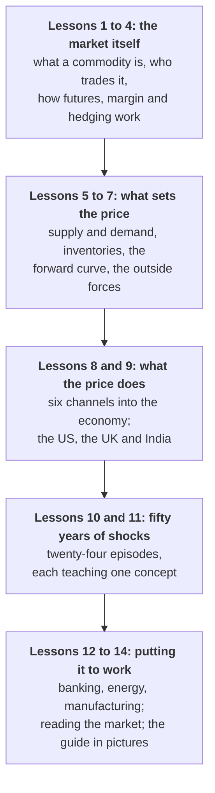

# Commodity Markets from First Principles

*How the world prices the physical things it runs on: who trades them, what moves their prices, and how to read what those prices are telling you.*

---

## Why this guide exists

Everything you own began as a commodity. The phone in your pocket contains copper, tin, gold and a little lithium. The bread on your table started as wheat, grown with fertiliser made from natural gas and baked in an oven that burned more of it. The bus that took you to work ran on diesel refined from crude oil that may have crossed two oceans to reach the refinery.

Commodities are the first link in every supply chain, and their prices travel down every one of them. The world burns more than **100 million barrels of oil a day**, and most of it is priced off a handful of benchmarks assessed in London, New York, Dubai and Singapore. When tankers stop passing through a strait about 33 kilometres wide at its narrowest, American drivers pay a dollar more for a gallon of petrol within a month, airlines raise their fares, and cylinders of cooking gas become hard to find in Indian cities. In the spring of 2026, all three happened.

Most explanations of this market fail in one of two ways. Some are tours of jargon: you learn what "backwardation" means without ever learning why it happens or what it is worth knowing. Others are market reports that assume you already understand the machinery. This guide builds the machinery one piece at a time, shows the arithmetic where the arithmetic is the point, and then tests every idea against an episode where it decided the outcome.

> **Three ideas unlock almost everything.**
>
> 1. **A commodity is interchangeable, so price is nearly the only thing that differs.** A tonne of copper of a given grade is worth the same whichever mine produced it, which is why strangers on different continents can trade it on standard contracts, and why one benchmark price can steer billions of dollars of physical deals.
> 2. **In the short run, supply and demand barely respond to price, so small imbalances cause large price swings.** A new mine takes a decade, crops grow once a season, and people keep heating homes when prices jump. Inventories are the shock absorber: when stocks are ample prices stay calm, and when stocks run thin prices can spike violently.
> 3. **Commodity markets exist largely to move price risk from people who do not want it to people willing to carry it for a reward.** A farmer can fix a selling price months before harvest and an airline can fix its fuel bill a year ahead. And the gap between today's price and the price for later delivery tells you whether the world is short of something or swimming in it.

### What you will be able to do at the end

- Explain what makes something a commodity, and why a single benchmark can price a whole industry's physical trade.
- Name the players in the market, what each of them wants, and which side of a futures contract each naturally takes.
- Follow a futures trade from order to clearing house, margin call and delivery, and work out exactly what a hedge locks in.
- Read a forward curve: tell contango from backwardation, and explain why an oil fund can lose money while the oil price goes nowhere.
- Trace a price shock through inflation, interest rates, currencies, government budgets, company profits and household bills.
- Describe how commodities are traded and regulated in the United States, the United Kingdom and India.
- Decode a commodity headline, and run a new one through six diagnostic questions.

### Who it is for

Anyone who reads the business pages and wants the commodity parts to stop being noise, and anyone who works near this market (in a bank, an energy company, a manufacturer, or the technology teams that serve them) and wants to understand what their colleagues are talking about. No prior finance is assumed. There is no code, and the only arithmetic is arithmetic you can check on a calculator.

---

## How the guide is built

**Three markets throughout.** Rather than describe an abstract market, the guide follows the **United States, the United Kingdom and India** side by side. The US has the world's deepest futures markets and is its largest oil and gas producer. The UK produces relatively little but hosts the world's meeting places for metals, Brent crude and physical gold. India is a giant consumer and importer whose market is shaped by government policy to a degree the other two would find startling. The same mechanism, seen three ways, is what makes it general.

**Every concept gets an episode.** Short-run inelasticity is abstract until the price of oil roughly quadruples in a few months. Storage costs are abstract until a barrel of oil is worth minus $37.63. Lessons 10 and 11 tell twenty-four such stories, from the 1973 embargo to the Strait of Hormuz crisis of 2026, and each one isolates a different piece of the machinery.

**Read it in order.** Each lesson leans on the ones before it.

Each lesson ends with a few **Check yourself** questions. The answers are hidden until you open them, and most involve a number you can work out before you look.

---

## The lessons

### 1. [What Makes Something a Commodity](lesson-01-what-makes-a-commodity.md)

Why a gold bar is a commodity and a painting is not. Standardisation and the Good Delivery bar, why the same barrel of oil has different prices in different places, the four families of commodities and their benchmarks, and why governments treat energy, food and minerals as matters of national security.

### 2. [Who Trades, and Why](lesson-02-who-trades-and-why.md)

The six kinds of participant: producers, consumers, merchants, financial players, the infrastructure that makes trading safe, and the governments that write the rules and sometimes play the game. What each wants, which side of the market each naturally takes, and why the price is simply where their needs meet.

### 3. [Physical Barrels, Paper Contracts](lesson-03-physical-barrels-paper-contracts.md)

The two layers of the market. How physical deals are priced as a benchmark plus a differential, how forwards became futures, and the four features that make futures work: clearing, margin, leverage and liquidity. Then settlement, the convergence of paper and physical at expiry, options and swaps, with a margin account you can follow day by day.

### 4. [Hedging, Speculation and Arbitrage](lesson-04-hedging-speculation-and-arbitrage.md)

A wheat farmer's hedge worked through to the last dollar, and the two wrinkles that make real hedges imperfect: basis risk, and the margin calls that can bankrupt a firm whose hedges are perfectly sound. Why speculators are necessary, when they become dangerous, and how arbitrage keeps prices in London, New York and Mumbai tied together.

### 5. [Supply, Demand and the Shock Absorber](lesson-05-supply-demand-and-the-shock-absorber.md)

Why a 3% shortfall can lift a price by 30%, why "the cure for high prices is high prices", how the most expensive producer still needed sets the long-run price, and why inventories decide whether a disruption is a shrug or a crisis.

### 6. [The Forward Curve](lesson-06-the-forward-curve.md)

The single most informative shape in commodity markets. Contango and backwardation, the cost of carry and the arbitrage that limits it, the convenience yield, and roll yield: the reason a fund can lose a fifth of its value while the price it tracks stands still. Ends with the spreads professionals watch instead of the headline price.

### 7. [The Outside Forces](lesson-07-the-outside-forces.md)

Benchmarks and the agencies that assess them, the dollar and the rupee, interest rates and gold's broken relationship with real yields, investor positioning, cycles and supercycles, weather and the seasons, chokepoints, sanctions and export bans, and the ways an investor can gain exposure.

### 8. [What Commodity Prices Move](lesson-08-what-commodity-prices-move.md)

The six channels through which a commodity price reaches the rest of the economy: inflation, interest rates, currencies and trade, government budgets, company profits, and household and political life. Includes how an energy shock becomes a food shock, and what the 2026 crisis did to each channel.

### 9. [The US, the UK and India](lesson-09-the-us-the-uk-and-india.md)

Three very different markets in detail: who regulates them, where they trade, which benchmarks they set, the rules that matter, and how ordinary investors take part. The US sets prices through depth, London through its hubs, and India mostly takes global prices and filters them through its currency, taxes and policy.

### 10. [Shocks That Wrote the Rules, 1973 to 2016](lesson-10-shocks-that-wrote-the-rules.md)

Thirteen episodes, each a case study in a concept: the oil shocks, the Hunt brothers' silver corner, the London tin crisis, Sumitomo's copper scandal, Enron, the China supercycle and $147 oil, the 2008 food crisis, Dodd-Frank, the aluminium warehouse queues, India's guar bubble and the NSEL scandal, the gold fix, and the shale price war that created OPEC+.

### 11. [The New Fault Lines, 2018 to 2026](lesson-11-the-new-fault-lines.md)

Eleven more: yuan crude, negative oil, Europe's gas crisis, Russia's invasion of Ukraine, the nickel squeeze, lithium's boom and bust, the cocoa shock, the historic run in gold and silver, the tariffs that split metal markets, China's rare earth controls, and the 2026 Iran war and the closure of the Strait of Hormuz.

### 12. [Commodities at Work](lesson-12-commodities-at-work.md)

Why commodities matter in banking, financial services and insurance, in energy, and in manufacturing: trade finance and its frauds, risk and regulation, power markets, input-cost hedging, carbon border taxes, and where technology and AI create value.

### 13. [Reading the Market Yourself](lesson-13-reading-the-market-yourself.md)

The practical closer. Ten mental models, a decoder for commodity headlines, six questions that unlock almost any commodity story, the data releases that move markets and a weekly routine for following them, and a reading list.

### 14. [The Whole Market in Pictures](lesson-14-visual-recap.md)

The guide restated as a sequence of figures, each captioned with what to notice and linked back to the lesson that taught it. Useful as revision, and as something to flick through before you next read a commodities headline.

### [Glossary](glossary.md)

Every term the guide uses, defined in a sentence and linked to the lesson that explains it.

---

## A note on the numbers

Every worked example in this guide has been checked, and the arithmetic is shown so that you can check it too. Data charts are drawn from public sources (the World Bank's monthly commodity price data, the US Energy Information Administration and the Federal Reserve Bank of St Louis), and each carries its source. Lessons that rely on recent figures end with links to where those figures came from.

One thing is worth flagging plainly. Market data quoted as current reflects **early October 2026**, when the oil market was in the middle of what is widely described as the largest disruption to oil supply on record. Prices move daily, so treat those figures as a snapshot of a particular month rather than a live quote. The mechanisms they illustrate do not change when the numbers do, which is why the guide teaches the mechanism first and the number second.
