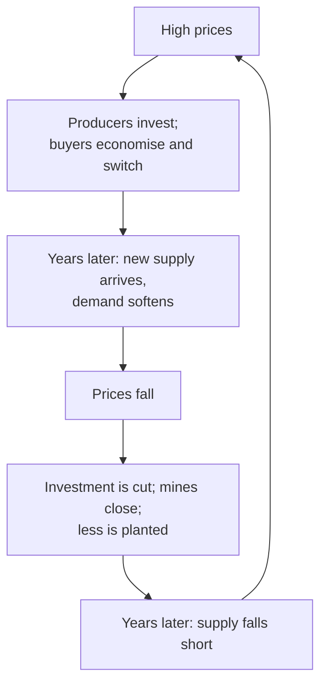

# Lesson 5: Supply, Demand and the Shock Absorber

*Why a small shortfall can cause a huge price move, why "the cure for high prices is high prices", how the most expensive producer sets the long-run price, and why inventories decide whether a disruption is a shrug or a crisis.*

---

## A fifth of the world's oil, stranded

About a fifth of the world's oil supply normally passes through the Strait of Hormuz. In March 2026, after the United States and Israel began striking Iran, tanker traffic through the strait all but stopped. The monthly average price of Brent crude went from $71 a barrel in February to $104 in March and $120 in April.

What did not change much, at first, was how much oil people used. Lorries still delivered food, aircraft still flew, factories still ran. People complained about the price and paid it. That stubbornness, the refusal of demand to fall quickly when prices rise, is the key to why commodity prices are so violent. This lesson builds the four ideas that explain it: elasticity, the cure for high prices, marginal cost, and inventories.

---

## 1. Supply, demand and stubbornness in the short run

Economists use the word **elasticity** for how strongly buyers and sellers respond to a change in price. If a 10% price rise makes people buy 5% less, demand has an elasticity of 0.5. If it makes them buy only 1% less, the elasticity is 0.1, and demand is called **inelastic**.

In the short run, most commodities are highly inelastic on both sides:

- **Demand barely moves.** Drivers still commute, power stations still need fuel, and bakers still need flour. Switching takes time and money: a new car, a new boiler, a new supplier.
- **Supply barely moves either.** Producers cannot conjure new wells, mines or harvests quickly. A new copper mine typically takes a decade or more from discovery to production, and a wheat farmer gets one crop a season.

Put the two together and a small shortfall needs a large price rise to balance the market, because the only way to close the gap is to price enough buyers out. There is a rule of thumb for how large:

> **percentage price rise needed ≈ percentage shortfall ÷ elasticity of demand**

If supply falls by 3% and the short-run elasticity of demand is 0.1, the price has to rise by about 3% ÷ 0.1 = **30%**. Estimates for oil vary widely, but almost all put the short-run elasticity well below 0.5, which is why oil supply disruptions produce such outsized price moves.

<svg viewBox="0 0 680 360" width="100%" role="img" aria-label="Two supply and demand charts. Short run: supply cannot respond, so a 3% supply shortfall moves the vertical supply line from 100 to 97 units, and with very steep demand the price rises from $100 to $130. Long run: supply and demand both respond, so the same shortfall moves the price only from $100 to $103." fill="none" xmlns="http://www.w3.org/2000/svg">
<text x="20" y="28" font-size="14" fill="currentColor" font-weight="600">The same 3% shortfall, short run and long run</text>
<text x="20" y="45.5" font-size="11.5" fill="currentColor" opacity="0.72">Price needed to balance the market after supply falls by 3 units out of 100. Illustrative.</text>
<text x="80" y="78" font-size="12.5" fill="currentColor" font-weight="600">Short run: almost no response</text>
<line x1="80" y1="300" x2="330" y2="300" stroke="currentColor" stroke-width="1" stroke-opacity="0.12"/>
<text x="74" y="304" font-size="10.5" fill="currentColor" text-anchor="end" opacity="0.72">$90</text>
<line x1="80" y1="258" x2="330" y2="258" stroke="currentColor" stroke-width="1" stroke-opacity="0.12"/>
<text x="74" y="262" font-size="10.5" fill="currentColor" text-anchor="end" opacity="0.72">$100</text>
<line x1="80" y1="216" x2="330" y2="216" stroke="currentColor" stroke-width="1" stroke-opacity="0.12"/>
<text x="74" y="220" font-size="10.5" fill="currentColor" text-anchor="end" opacity="0.72">$110</text>
<line x1="80" y1="174" x2="330" y2="174" stroke="currentColor" stroke-width="1" stroke-opacity="0.12"/>
<text x="74" y="178" font-size="10.5" fill="currentColor" text-anchor="end" opacity="0.72">$120</text>
<line x1="80" y1="132" x2="330" y2="132" stroke="currentColor" stroke-width="1" stroke-opacity="0.12"/>
<text x="74" y="136" font-size="10.5" fill="currentColor" text-anchor="end" opacity="0.72">$130</text>
<line x1="80" y1="90" x2="330" y2="90" stroke="currentColor" stroke-width="1" stroke-opacity="0.12"/>
<text x="74" y="94" font-size="10.5" fill="currentColor" text-anchor="end" opacity="0.72">$140</text>
<text x="105" y="318" font-size="10.5" fill="currentColor" text-anchor="middle" opacity="0.72">95</text>
<text x="230" y="318" font-size="10.5" fill="currentColor" text-anchor="middle" opacity="0.72">100</text>
<text x="330" y="318" font-size="10.5" fill="currentColor" text-anchor="end" opacity="0.65">quantity</text>
<polyline points="130,90 255,300" class="vs1" stroke="#2a78d6" stroke-width="2.2" stroke-linejoin="round" stroke-linecap="round" fill="none"/>
<line x1="230" y1="300" x2="230" y2="90" class="vs2" stroke="#eb6834" stroke-width="2.2" stroke-opacity="0.45"/>
<line x1="155" y1="300" x2="155" y2="90" class="vs2" stroke="#eb6834" stroke-width="2.2"/>
<circle cx="230" cy="258" r="4.5" class="vf1 vring" fill="#2a78d6" stroke="#ffffff" stroke-width="2"/>
<circle cx="155" cy="132" r="4.5" class="vf1 vring" fill="#2a78d6" stroke="#ffffff" stroke-width="2"/>
<text x="238" y="262" font-size="11.5" fill="currentColor" font-weight="600">$100</text>
<text x="147" y="136" font-size="11.5" fill="currentColor" text-anchor="end" font-weight="600">$130</text>
<text x="126" y="100" font-size="10.5" fill="currentColor" text-anchor="end" opacity="0.75">demand</text>
<text x="236" y="98.4" font-size="10.5" fill="currentColor" opacity="0.6">supply before</text>
<text x="149" y="190.8" font-size="10.5" fill="currentColor" text-anchor="end" opacity="0.85">after</text>
<text x="410" y="78" font-size="12.5" fill="currentColor" font-weight="600">Long run: buyers and sellers adjust</text>
<line x1="410" y1="300" x2="660" y2="300" stroke="currentColor" stroke-width="1" stroke-opacity="0.12"/>
<text x="404" y="304" font-size="10.5" fill="currentColor" text-anchor="end" opacity="0.72">$90</text>
<line x1="410" y1="258" x2="660" y2="258" stroke="currentColor" stroke-width="1" stroke-opacity="0.12"/>
<text x="404" y="262" font-size="10.5" fill="currentColor" text-anchor="end" opacity="0.72">$100</text>
<line x1="410" y1="216" x2="660" y2="216" stroke="currentColor" stroke-width="1" stroke-opacity="0.12"/>
<text x="404" y="220" font-size="10.5" fill="currentColor" text-anchor="end" opacity="0.72">$110</text>
<line x1="410" y1="174" x2="660" y2="174" stroke="currentColor" stroke-width="1" stroke-opacity="0.12"/>
<text x="404" y="178" font-size="10.5" fill="currentColor" text-anchor="end" opacity="0.72">$120</text>
<line x1="410" y1="132" x2="660" y2="132" stroke="currentColor" stroke-width="1" stroke-opacity="0.12"/>
<text x="404" y="136" font-size="10.5" fill="currentColor" text-anchor="end" opacity="0.72">$130</text>
<line x1="410" y1="90" x2="660" y2="90" stroke="currentColor" stroke-width="1" stroke-opacity="0.12"/>
<text x="404" y="94" font-size="10.5" fill="currentColor" text-anchor="end" opacity="0.72">$140</text>
<text x="435" y="318" font-size="10.5" fill="currentColor" text-anchor="middle" opacity="0.72">95</text>
<text x="560" y="318" font-size="10.5" fill="currentColor" text-anchor="middle" opacity="0.72">100</text>
<text x="660" y="318" font-size="10.5" fill="currentColor" text-anchor="end" opacity="0.65">quantity</text>
<polyline points="410,207.6 660,291.6" class="vs1" stroke="#2a78d6" stroke-width="2.2" stroke-linejoin="round" stroke-linecap="round" fill="none"/>
<polyline points="435,300 660,224.4" class="vs2" stroke="#eb6834" stroke-width="2.2" stroke-linejoin="round" stroke-linecap="round" fill="none" stroke-opacity="0.45"/>
<polyline points="410,283.2 660,199.2" class="vs2" stroke="#eb6834" stroke-width="2.2" stroke-linejoin="round" stroke-linecap="round" fill="none"/>
<circle cx="560" cy="258" r="4.5" class="vf1 vring" fill="#2a78d6" stroke="#ffffff" stroke-width="2"/>
<circle cx="522.5" cy="245.4" r="4.5" class="vf1 vring" fill="#2a78d6" stroke="#ffffff" stroke-width="2"/>
<text x="566" y="280" font-size="11.5" fill="currentColor" font-weight="600">$100</text>
<text x="522.5" y="233.4" font-size="11.5" fill="currentColor" text-anchor="middle" font-weight="600">$103</text>
<text x="415" y="199.6" font-size="10.5" fill="currentColor" opacity="0.75">demand</text>
<text x="660" y="240.4" font-size="10.5" fill="currentColor" text-anchor="end" opacity="0.6">supply before</text>
<text x="660" y="191.2" font-size="10.5" fill="currentColor" text-anchor="end" opacity="0.85">after</text>
<text x="20" y="350" font-size="10.5" fill="currentColor" opacity="0.6">Short run: demand elasticity 0.1, fixed supply. Long run: elasticities of 0.5 on both sides.</text>
</svg>

The right-hand panel is the same shortfall a few years later. By then, buyers have had time to switch, insulate and economise, and producers have had time to drill. With both sides responding, the same 3% gap closes with a price rise of about 3%. The difference between the two panels is the whole story of commodity cycles.

---

## 2. The cure for high prices is high prices

Traders have a saying: **the cure for high prices is high prices**. Expensive oil encourages drilling, more efficient engines and electric cars. Expensive grain encourages farmers around the world to plant more. Expensive copper encourages engineers to use aluminium instead, and mining companies to reopen old mines. Eventually supply rises and demand falls, and the price comes back down.

The reverse is just as true. Low prices close mines, idle rigs and discourage planting, which sows the shortage that brings the next spike. Because every response takes time, commodity prices move in cycles rather than straight lines.

The length of each turn depends on how quickly supply can respond. A crop responds in a season, US shale oil in months (Lesson 10 explains why that changed the oil market), and a new copper mine in a decade. Lesson 7 follows the longest version of the cycle: the supercycle.

> Be wary of anyone who extrapolates today's price into the future. A spike sets in motion the forces that end it; a slump plants the seeds of the next shortage.

---

## 3. Prices gravitate towards the marginal cost of supply

In the long run, what sets the level that prices cycle around? Picture every producer in the world lined up from cheapest to most expensive, each with a bar showing how much it can produce. Demand is met by switching on producers from the cheap end until there is enough. The price has to be high enough to keep the **last producer still needed** in business, because if it were lower, that producer would shut and the market would be short again.

<svg viewBox="0 0 680 350" width="100%" role="img" aria-label="Illustrative cost curve. Seven producers are lined up from cheapest to most expensive, each bar as wide as its output. Demand of 86 units is met only once the sixth producer, with costs of $78, is running, so the price settles near $78 and the $96 producer stays shut. If demand falls to 74 units, the marginal producer becomes the one with costs of $63 and the price falls towards $63." fill="none" xmlns="http://www.w3.org/2000/svg">
<text x="20" y="28" font-size="14" fill="currentColor" font-weight="600">The most expensive producer still needed sets the price</text>
<text x="20" y="45.5" font-size="11.5" fill="currentColor" opacity="0.72">Producers ranked by cost per unit; bar width is output. Illustrative.</text>
<line x1="80" y1="300" x2="620" y2="300" stroke="currentColor" stroke-width="1" stroke-opacity="0.45"/>
<text x="72" y="304" font-size="11" fill="currentColor" text-anchor="end" opacity="0.72" style="font-variant-numeric:tabular-nums">$0</text>
<line x1="80" y1="247.7" x2="620" y2="247.7" stroke="currentColor" stroke-width="1" stroke-opacity="0.12"/>
<text x="72" y="251.7" font-size="11" fill="currentColor" text-anchor="end" opacity="0.72" style="font-variant-numeric:tabular-nums">$25</text>
<line x1="80" y1="195.5" x2="620" y2="195.5" stroke="currentColor" stroke-width="1" stroke-opacity="0.12"/>
<text x="72" y="199.4" font-size="11" fill="currentColor" text-anchor="end" opacity="0.72" style="font-variant-numeric:tabular-nums">$50</text>
<line x1="80" y1="143.2" x2="620" y2="143.2" stroke="currentColor" stroke-width="1" stroke-opacity="0.12"/>
<text x="72" y="147.1" font-size="11" fill="currentColor" text-anchor="end" opacity="0.72" style="font-variant-numeric:tabular-nums">$75</text>
<line x1="80" y1="90.9" x2="620" y2="90.9" stroke="currentColor" stroke-width="1" stroke-opacity="0.12"/>
<text x="72" y="94.9" font-size="11" fill="currentColor" text-anchor="end" opacity="0.72" style="font-variant-numeric:tabular-nums">$100</text>
<path d="M81,300 L81,261.2 Q81,258.2 84,258.2 L171.5,258.2 Q174.5,258.2 174.5,261.2 L174.5,300 Z" class="vf1" fill="#2a78d6" fill-opacity="1"><title>Producer with costs of $20: 18 units</title></path>
<path d="M176.5,300 L176.5,236.1 Q176.5,233.1 179.5,233.1 L245.8,233.1 Q248.8,233.1 248.8,236.1 L248.8,300 Z" class="vf1" fill="#2a78d6" fill-opacity="1"><title>Producer with costs of $32: 14 units</title></path>
<path d="M250.8,300 L250.8,217.3 Q250.8,214.3 253.8,214.3 L351.9,214.3 Q354.9,214.3 354.9,217.3 L354.9,300 Z" class="vf1" fill="#2a78d6" fill-opacity="1"><title>Producer with costs of $41: 20 units</title></path>
<path d="M356.9,300 L356.9,194.3 Q356.9,191.3 359.9,191.3 L436.8,191.3 Q439.8,191.3 439.8,194.3 L439.8,300 Z" class="vf1" fill="#2a78d6" fill-opacity="1"><title>Producer with costs of $52: 16 units</title></path>
<path d="M441.8,300 L441.8,171.3 Q441.8,168.3 444.8,168.3 L500.5,168.3 Q503.5,168.3 503.5,171.3 L503.5,300 Z" class="vf1" fill="#2a78d6" fill-opacity="1"><title>Producer with costs of $63: 12 units</title></path>
<path d="M505.5,300 L505.5,139.9 Q505.5,136.9 508.5,136.9 L553.6,136.9 Q556.6,136.9 556.6,139.9 L556.6,300 Z" class="vf1" fill="#2a78d6" fill-opacity="1"><title>Producer with costs of $78: 10 units</title></path>
<path d="M558.6,300 L558.6,102.3 Q558.6,99.3 561.6,99.3 L596,99.3 Q599,99.3 599,102.3 L599,300 Z" class="vf5" fill="#e87ba4" fill-opacity="0.45"><title>Producer with costs of $96: 8 units</title></path>
<text x="598" y="91.3" font-size="10.5" fill="currentColor" text-anchor="end" opacity="0.75">shut</text>
<line x1="536.3" y1="60" x2="536.3" y2="300" stroke="currentColor" stroke-width="1.8" stroke-opacity="0.85"/>
<text x="540.3" y="64" font-size="11" fill="currentColor" font-weight="600">demand: 86</text>
<line x1="472.7" y1="82" x2="472.7" y2="300" stroke="currentColor" stroke-width="1.5" stroke-opacity="0.6" stroke-dasharray="5 4"/>
<text x="468.7" y="86" font-size="11" fill="currentColor" text-anchor="end" opacity="0.8">if demand falls to 74</text>
<line x1="80" y1="136.9" x2="536.3" y2="136.9" class="vs8" stroke="#e34948" stroke-width="1.5"/>
<text x="84" y="130.9" font-size="11" fill="currentColor" font-weight="600">price about $78</text>
<line x1="80" y1="168.3" x2="472.7" y2="168.3" class="vs8" stroke="#e34948" stroke-width="1.2" stroke-dasharray="5 4"/>
<text x="84" y="182.3" font-size="11" fill="currentColor" opacity="0.85">falls towards $63</text>
<text x="345" y="322" font-size="11" fill="currentColor" text-anchor="middle" opacity="0.7">Cumulative output (units)</text>
<text x="20" y="342" font-size="10.5" fill="currentColor" opacity="0.6">Producers below the price line earn a margin; any producer above it loses money on every unit.</text>
</svg>

That last producer's cost is called the **marginal cost of supply**, and it explains three things:

- **Low-cost producers earn large margins** when demand is high, because they receive the same price as the expensive producer at the margin. This is why the owners of the cheapest oilfields and mines are so profitable through an upswing.
- **When prices stay below marginal cost for long, high-cost producers shut down** and supply shrinks until the price recovers. The cost curve acts as a slow-moving floor.
- **A shift in demand moves the price along the curve.** If demand falls from 86 to 74 units, the producer with costs of $78 is no longer needed, and the price drifts down towards the $63 cost of the new marginal producer.

---

## 4. Inventories: the shock absorber

So far supply and demand have had to balance instantly. In reality there is a buffer between them: **stocks**. Oil sits in tanks, metal in warehouses, grain in silos. When a disruption hits, the market can draw on stocks instead of rationing by price.

The size of that buffer changes everything. When inventories are comfortable, a disruption can be met from storage and prices barely react. When inventories are thin, the same disruption can send prices soaring, because there is no cushion left.

<svg viewBox="0 0 680 350" width="100%" role="img" aria-label="Stylised chart of price against inventories. When stocks are ample, around 45 to 55 days of demand, a drawdown of five days barely moves the price. When stocks are thin, around 15 to 20 days, the same five-day drawdown sends the price up sharply, because there is no cushion left." fill="none" xmlns="http://www.w3.org/2000/svg">
<text x="20" y="28" font-size="14" fill="currentColor" font-weight="600">Inventories are the shock absorber</text>
<text x="20" y="45.5" font-size="11.5" fill="currentColor" opacity="0.72">Price against stocks on hand. Stylised: the shape, not the numbers, is the point.</text>
<line x1="110.4" y1="70" x2="110.4" y2="290" stroke="currentColor" stroke-width="1" stroke-opacity="0.12"/>
<text x="110.4" y="308" font-size="10.5" fill="currentColor" text-anchor="middle" opacity="0.72">10</text>
<line x1="212.3" y1="70" x2="212.3" y2="290" stroke="currentColor" stroke-width="1" stroke-opacity="0.12"/>
<text x="212.3" y="308" font-size="10.5" fill="currentColor" text-anchor="middle" opacity="0.72">20</text>
<line x1="314.2" y1="70" x2="314.2" y2="290" stroke="currentColor" stroke-width="1" stroke-opacity="0.12"/>
<text x="314.2" y="308" font-size="10.5" fill="currentColor" text-anchor="middle" opacity="0.72">30</text>
<line x1="416.2" y1="70" x2="416.2" y2="290" stroke="currentColor" stroke-width="1" stroke-opacity="0.12"/>
<text x="416.2" y="308" font-size="10.5" fill="currentColor" text-anchor="middle" opacity="0.72">40</text>
<line x1="518.1" y1="70" x2="518.1" y2="290" stroke="currentColor" stroke-width="1" stroke-opacity="0.12"/>
<text x="518.1" y="308" font-size="10.5" fill="currentColor" text-anchor="middle" opacity="0.72">50</text>
<line x1="620" y1="70" x2="620" y2="290" stroke="currentColor" stroke-width="1" stroke-opacity="0.12"/>
<text x="620" y="308" font-size="10.5" fill="currentColor" text-anchor="middle" opacity="0.72">60</text>
<text x="355" y="322" font-size="11" fill="currentColor" text-anchor="middle" opacity="0.7">Inventories, in days of demand</text>
<line x1="90" y1="290" x2="620" y2="290" stroke="currentColor" stroke-width="1" stroke-opacity="0.45"/>
<text x="78" y="80" font-size="11" fill="currentColor" text-anchor="end" opacity="0.7">price</text>
<polyline points="100.2,121.8 102.7,129.2 105.3,135.9 107.8,142 110.4,147.6 112.9,152.8 115.5,157.6 118,162 120.6,166.1 123.1,170 125.7,173.5 128.2,176.9 130.8,180 133.3,182.9 135.9,185.7 138.4,188.3 141,190.8 143.5,193.1 146.1,195.3 148.6,197.4 151.2,199.4 153.7,201.3 156.2,203.1 158.8,204.8 161.3,206.5 163.9,208 166.4,209.5 169,211 171.5,212.4 174.1,213.7 176.6,214.9 179.2,216.2 181.7,217.3 184.3,218.5 186.8,219.5 189.4,220.6 191.9,221.6 194.5,222.6 197,223.5 199.6,224.4 202.1,225.3 204.7,226.1 207.2,227 209.8,227.8 212.3,228.5 214.9,229.3 217.4,230 220,230.7 222.5,231.4 225,232 227.6,232.7 230.1,233.3 232.7,233.9 235.2,234.5 237.8,235.1 240.3,235.6 242.9,236.2 245.4,236.7 248,237.2 250.5,237.7 253.1,238.2 255.6,238.7 258.2,239.2 260.7,239.6 263.3,240.1 265.8,240.5 268.4,240.9 270.9,241.4 273.5,241.8 276,242.2 278.6,242.5 281.1,242.9 283.7,243.3 286.2,243.7 288.8,244 291.3,244.4 293.8,244.7 296.4,245 298.9,245.4 301.5,245.7 304,246 306.6,246.3 309.1,246.6 311.7,246.9 314.2,247.2 316.8,247.5 319.3,247.8 321.9,248 324.4,248.3 327,248.6 329.5,248.8 332.1,249.1 334.6,249.3 337.2,249.6 339.7,249.8 342.3,250.1 344.8,250.3 347.4,250.5 349.9,250.7 352.5,251 355,251.2 357.5,251.4 360.1,251.6 362.6,251.8 365.2,252 367.7,252.2 370.3,252.4 372.8,252.6 375.4,252.8 377.9,253 380.5,253.2 383,253.3 385.6,253.5 388.1,253.7 390.7,253.9 393.2,254.1 395.8,254.2 398.3,254.4 400.9,254.6 403.4,254.7 406,254.9 408.5,255 411.1,255.2 413.6,255.3 416.2,255.5 418.7,255.6 421.2,255.8 423.8,255.9 426.3,256.1 428.9,256.2 431.4,256.4 434,256.5 436.5,256.6 439.1,256.8 441.6,256.9 444.2,257 446.7,257.1 449.3,257.3 451.8,257.4 454.4,257.5 456.9,257.6 459.5,257.8 462,257.9 464.6,258 467.1,258.1 469.7,258.2 472.2,258.3 474.8,258.5 477.3,258.6 479.9,258.7 482.4,258.8 485,258.9 487.5,259 490,259.1 492.6,259.2 495.1,259.3 497.7,259.4 500.2,259.5 502.8,259.6 505.3,259.7 507.9,259.8 510.4,259.9 513,260 515.5,260.1 518.1,260.2 520.6,260.3 523.2,260.4 525.7,260.4 528.3,260.5 530.8,260.6 533.4,260.7 535.9,260.8 538.5,260.9 541,261 543.6,261 546.1,261.1 548.7,261.2 551.2,261.3 553.8,261.4 556.3,261.5 558.8,261.5 561.4,261.6 563.9,261.7 566.5,261.8 569,261.8 571.6,261.9 574.1,262 576.7,262.1 579.2,262.1 581.8,262.2 584.3,262.3 586.9,262.3 589.4,262.4 592,262.5 594.5,262.5 597.1,262.6 599.6,262.7 602.2,262.7 604.7,262.8 607.3,262.9 609.8,262.9 612.4,263 614.9,263.1 617.5,263.1 620,263.2" class="vs1" stroke="#2a78d6" stroke-width="2.4" stroke-linejoin="round" stroke-linecap="round" fill="none"/>
<circle cx="518.1" cy="260.2" r="4.5" class="vf1 vring" fill="#2a78d6" stroke="#ffffff" stroke-width="2"/>
<circle cx="467.1" cy="258.1" r="4.5" class="vf8 vring" fill="#e34948" stroke="#ffffff" stroke-width="2"/>
<line x1="512.1" y1="244.2" x2="473.1" y2="244.2" stroke="currentColor" stroke-width="1.4" stroke-opacity="0.65"/>
<polygon points="473.1,244.2 478.6,241.7 478.6,246.6" fill="currentColor" fill-opacity="0.65"/>
<text x="457.1" y="210.2" font-size="11.5" fill="currentColor" font-weight="600">ample stocks: small move</text>
<text x="457.1" y="225.2" font-size="11" fill="currentColor" opacity="0.8">price up 3%</text>
<circle cx="212.3" cy="228.5" r="4.5" class="vf1 vring" fill="#2a78d6" stroke="#ffffff" stroke-width="2"/>
<circle cx="161.3" cy="206.5" r="4.5" class="vf8 vring" fill="#e34948" stroke="#ffffff" stroke-width="2"/>
<line x1="206.3" y1="244.5" x2="167.3" y2="244.5" stroke="currentColor" stroke-width="1.4" stroke-opacity="0.65"/>
<polygon points="167.3,244.5 172.8,242.1 172.8,247" fill="currentColor" fill-opacity="0.65"/>
<line x1="161.3" y1="206.5" x2="161.3" y2="244.5" stroke="currentColor" stroke-width="1" stroke-opacity="0.35" stroke-dasharray="2 3"/>
<text x="175.3" y="182.5" font-size="11.5" fill="currentColor" font-weight="600">thin stocks: big move</text>
<text x="175.3" y="197.5" font-size="11" fill="currentColor" opacity="0.8">price up 19%</text>
<text x="20" y="342" font-size="10.5" fill="currentColor" opacity="0.6">Each arrow is the same five-day drawdown in stocks.</text>
</svg>

This is why professionals watch inventory data obsessively:

- **Oil:** the US Energy Information Administration publishes US crude and fuel stocks every Wednesday, and traders react within seconds.
- **Metals:** the London Metal Exchange publishes stocks held in its approved warehouses daily. A jump in **cancelled warrants**, metal that owners have asked to withdraw, often signals tightness before the price reacts.
- **Grains:** the US Department of Agriculture's monthly report estimates the **stocks-to-use ratio**: stocks at the end of the season divided by a year's consumption. A low ratio means a bad harvest anywhere will bite.

Governments hold a shock absorber of their own. Strategic reserves exist to be emptied in emergencies, and 2026 showed what that looks like: in March, members of the International Energy Agency agreed to release 400 million barrels, the largest release in the agency's history, and by August the US Strategic Petroleum Reserve had fallen below 300 million barrels for the first time since 1983. Emergency stocks soften a shock while they last. They cannot replace a strait.

> The same headline can mean very different things depending on stocks. Before deciding how much a disruption matters, ask how much is in storage, and how fast it can be reached.

---

## Check yourself

**1. A frost destroys 2% of a crop. If the short-run elasticity of demand is 0.05, roughly how much must the price rise?**

Show the answer

About 2% ÷ 0.05 = **40%**. The more inelastic the demand, the bigger the price move needed to persuade enough buyers to go without.

**2. In the cost-curve figure, demand rises from 86 to 94 units. What happens to the price, and to the producer marked "shut"?**

Show the answer

The first six producers can supply 90 units between them, so meeting 94 units needs the seventh, whose costs are $96. The price has to rise towards **$96** to bring it into production, and the producer that was shut restarts. Every cheaper producer now earns a larger margin.

**3. At the end of a season, world stocks of a grain are 260 million tonnes and annual use is 800 million tonnes. What is the stocks-to-use ratio, and roughly how many days of consumption is that?**

Show the answer

260 ÷ 800 = **32.5%**, and 0.325 × 365 ≈ **119 days** of consumption. If a poor harvest cut stocks to 15% (about 55 days), the same weather scare would move the price far more, because the cushion would be half as thick.

---

## What to carry into Lesson 6

- In the short run, supply and demand are **inelastic**, so the price rise needed is roughly the shortfall divided by the elasticity: a 3% gap can need a 30% price move.
- **The cure for high prices is high prices:** spikes summon supply and destroy demand, slumps do the reverse, so prices move in cycles.
- In the long run, prices gravitate towards the **marginal cost** of the most expensive producer still needed.
- **Inventories** are the shock absorber. Ample stocks make disruptions shrug-worthy; thin stocks make them violent.

Inventories have one more thing to tell you. The price of a commodity for delivery today and for delivery next year are usually different, and the gap between them reveals exactly how tight stocks are. That gap, the forward curve, is next.

---

## Sources

- [World Bank Commodity Price Data (the Pink Sheet): monthly prices](https://www.worldbank.org/en/research/commodity-markets)
- [EIA: World Oil Transit Chokepoints (flows through the Strait of Hormuz)](https://www.eia.gov/international/content/analysis/special_topics/World_Oil_Transit_Chokepoints/)
- [IEA: member countries agree the largest ever oil stock release, 11 March 2026](https://www.iea.org/news/iea-member-countries-to-carry-out-largest-ever-oil-stock-release-amid-market-disruptions-from-middle-east-conflict)
- [CNBC: US Strategic Petroleum Reserve falls below 300 million barrels, 10 August 2026](https://www.cnbc.com/2026/08/10/oil-in-strategic-petroleum-reserve-falls-below-300-million-barrels-lowest-since-1983.html)
