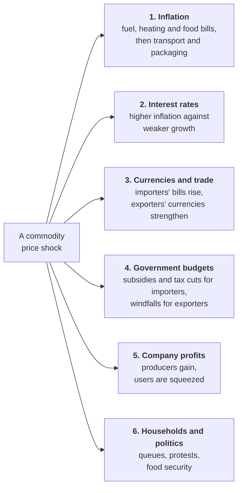
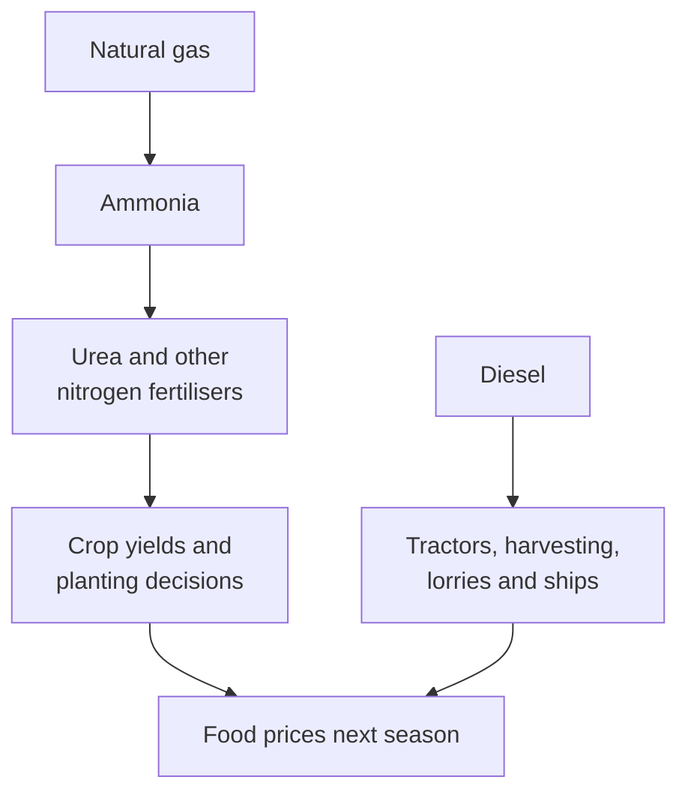

# Lesson 8: What Commodity Prices Move

*The six channels through which a commodity price reaches the rest of the economy, how an energy shock becomes a food shock, and what the 2026 crisis did to each channel.*

---

## A price that travels

At the end of February 2026, a gallon of regular petrol in the United States cost an average of $2.98. By 2 April it cost $4.08, the highest since 2022. Within weeks, airlines were raising fares and cutting flights, the world price of fertiliser was up by half, and Indian families were queuing for cylinders of cooking gas. In early May, Spirit Airlines, one of America's largest budget carriers, shut down altogether.

Commodity prices do not stay inside commodity markets. They travel through the economy along six channels, and the 2026 oil and gas shock, triggered by the war involving Iran and the near-closure of the Strait of Hormuz, has been a live demonstration of every one of them. (Lesson 11 tells that story in full.)

---

## 1. Inflation

Commodities feed inflation **directly**, through the prices of petrol, diesel, home energy and food, and **indirectly**, through everything made or moved with them: transport, fertiliser, packaging, plastics, and electricity generated from gas. The indirect effects arrive months later and are often larger than the first jolt, because a fuel price rise eventually reaches the price of almost everything on a lorry.

How much a country feels this depends on its consumer basket: the weights statisticians give each kind of spending when they calculate inflation.

<svg viewBox="0 0 680 300" width="100%" role="img" aria-label="Bar chart of the share of food in consumer price baskets. India's old basket gave food and beverages 45.9%; the new basket introduced in 2026 gives 36.8%. The United States gives food 13.7% and the United Kingdom gives food and non-alcoholic beverages 11.0%. So a rise in food prices moves Indian inflation about three times as much." fill="none" xmlns="http://www.w3.org/2000/svg">
<text x="20" y="28" font-size="14" fill="currentColor" font-weight="600">How much of the inflation basket is food</text>
<text x="20" y="45.5" font-size="11.5" fill="currentColor" opacity="0.72">Weight of food in each country's consumer price index, per cent</text>
<line x1="210" y1="64" x2="210" y2="236" stroke="currentColor" stroke-width="1" stroke-opacity="0.45"/>
<text x="210" y="252" font-size="10.5" fill="currentColor" text-anchor="middle" opacity="0.72">0%</text>
<line x1="292" y1="64" x2="292" y2="236" stroke="currentColor" stroke-width="1" stroke-opacity="0.12"/>
<text x="292" y="252" font-size="10.5" fill="currentColor" text-anchor="middle" opacity="0.72">10%</text>
<line x1="374" y1="64" x2="374" y2="236" stroke="currentColor" stroke-width="1" stroke-opacity="0.12"/>
<text x="374" y="252" font-size="10.5" fill="currentColor" text-anchor="middle" opacity="0.72">20%</text>
<line x1="456" y1="64" x2="456" y2="236" stroke="currentColor" stroke-width="1" stroke-opacity="0.12"/>
<text x="456" y="252" font-size="10.5" fill="currentColor" text-anchor="middle" opacity="0.72">30%</text>
<line x1="538" y1="64" x2="538" y2="236" stroke="currentColor" stroke-width="1" stroke-opacity="0.12"/>
<text x="538" y="252" font-size="10.5" fill="currentColor" text-anchor="middle" opacity="0.72">40%</text>
<line x1="620" y1="64" x2="620" y2="236" stroke="currentColor" stroke-width="1" stroke-opacity="0.12"/>
<text x="620" y="252" font-size="10.5" fill="currentColor" text-anchor="middle" opacity="0.72">50%</text>
<text x="200" y="84" font-size="12" fill="currentColor" text-anchor="end" font-weight="600">India, old basket</text>
<text x="200" y="99" font-size="10.5" fill="currentColor" text-anchor="end" opacity="0.7">2012 base</text>
<path d="M210,74 L583.1,74 Q586.1,74 586.1,77 L586.1,93 Q586.1,96 583.1,96 L210,96 Z" class="vf3" fill="#1baf7a" fill-opacity="0.4"><title>India, old basket (2012 base): 45.86%</title></path>
<text x="594.1" y="90" font-size="12" fill="currentColor" font-weight="600" style="font-variant-numeric:tabular-nums">45.9%</text>
<text x="200" y="126" font-size="12" fill="currentColor" text-anchor="end" font-weight="600">India, new basket</text>
<text x="200" y="141" font-size="10.5" fill="currentColor" text-anchor="end" opacity="0.7">2024 base, from 2026</text>
<path d="M210,116 L508.4,116 Q511.4,116 511.4,119 L511.4,135 Q511.4,138 508.4,138 L210,138 Z" class="vf3" fill="#1baf7a" fill-opacity="1"><title>India, new basket (2024 base, from 2026): 36.75%</title></path>
<text x="519.4" y="132" font-size="12" fill="currentColor" font-weight="600" style="font-variant-numeric:tabular-nums">36.8%</text>
<text x="200" y="168" font-size="12" fill="currentColor" text-anchor="end" font-weight="600">United States</text>
<text x="200" y="183" font-size="10.5" fill="currentColor" text-anchor="end" opacity="0.7">December 2025</text>
<path d="M210,158 L319.3,158 Q322.3,158 322.3,161 L322.3,177 Q322.3,180 319.3,180 L210,180 Z" class="vf3" fill="#1baf7a" fill-opacity="1"><title>United States (December 2025): 13.7%</title></path>
<text x="330.3" y="174" font-size="12" fill="currentColor" font-weight="600" style="font-variant-numeric:tabular-nums">13.7%</text>
<text x="200" y="210" font-size="12" fill="currentColor" text-anchor="end" font-weight="600">United Kingdom</text>
<text x="200" y="225" font-size="10.5" fill="currentColor" text-anchor="end" opacity="0.7">2026 weights</text>
<path d="M210,200 L296.9,200 Q299.9,200 299.9,203 L299.9,219 Q299.9,222 296.9,222 L210,222 Z" class="vf3" fill="#1baf7a" fill-opacity="1"><title>United Kingdom (2026 weights): 10.96%</title></path>
<text x="307.9" y="216" font-size="12" fill="currentColor" font-weight="600" style="font-variant-numeric:tabular-nums">11.0%</text>
<text x="20" y="276" font-size="10.5" fill="currentColor" opacity="0.6">India: food and beverages (MoSPI). US: food at home and away (BLS). UK: food and non-alcoholic</text>
<text x="20" y="292" font-size="10.5" fill="currentColor" opacity="0.6">beverages, excluding restaurants (ONS). Definitions differ slightly; the gap is real.</text>
</svg>

India's new consumer price index, rebased to 2024 and launched in February 2026, cut the weight of food and beverages from 45.86% to 36.75%, because Indian households now spend a smaller share of their budgets on food than they did a decade ago. That is still roughly three times the share in the US or UK baskets, which is why a weak monsoon moves Indian inflation far more than a poor harvest moves British inflation. Put a number on it: if food prices rise 10% and nothing else changes, Indian inflation rises by about 3.7 percentage points (10% × 36.75%), and British inflation by about 1.1.

In 2022, energy and food pushed UK inflation to 11.1% and US inflation to 9.1%, the highest in about four decades. In 2026 the same mechanism is at work. Ofgem raised its cap on household energy bills by about 4% to £1,723 a year for a typical home from 1 October 2026, citing higher wholesale gas prices caused by the Middle East conflict, and the UK government removed VAT from domestic electricity bills until March 2027 to soften the blow.

---

## 2. Interest rates

Central banks separate **first-round effects** (the jump in the price of fuel or food itself) from **second-round effects** (wages and other prices chasing it upwards). They will often "look through" a one-off supply shock, because raising interest rates cannot produce more oil. But if people start to expect permanently higher inflation, and wage settlements and price-setting begin to reflect it, central banks raise rates to stop the shock becoming a spiral.

A commodity supply shock creates a painful dilemma, because it pushes inflation up while dragging growth down, the combination known as **stagflation**. Raise rates and you deepen the slowdown; hold them and you risk inflation taking root.

In 2022 the Federal Reserve, the Bank of England and the Reserve Bank of India all raised rates sharply. In 2026 the responses diverged as the shock dragged on. The Bank of England held its rate at 3.75% in March and April while it judged how long the disruption would last. The European Central Bank raised its rates in June, its first increase since 2023, and again in September. The Federal Reserve raised its target range to 3.75% to 4.00% in September, its first increase since 2023. (The [bond guide](?slug=global-bond-markets&lesson=lesson-05-three-markets-up-close) follows the same shock through government bond yields in September 2026.)

---

## 3. Currencies and trade balances

For an importer, expensive commodities widen the trade deficit and weaken the currency, which makes imports dearer still. India imported 88.7% of the crude oil it used in 2025-26. In April to June 2026, its crude import bill hit a record $49.66 billion, up 61% on a year earlier, even though it bought about 4% less oil: the whole increase, and more, came from price. Oil and gold are consistently among India's largest import items (gold imports reached a record $71.98 billion in 2025-26), so both matter for the rupee.

For exporters the effect runs the other way. The Australian and Canadian dollars, the Norwegian krone and the Brazilian real are often called **commodity currencies**, because they tend to strengthen when their main exports become more valuable. Economists capture this with the **terms of trade**: the price of what a country sells relative to the price of what it buys. A commodity boom improves an exporter's terms of trade and worsens an importer's.

---

## 4. Government budgets

Importing governments often cut fuel taxes or pay subsidies to protect consumers, which costs them revenue. On 27 March 2026, India cut excise duty on petrol from ₹13 to ₹3 a litre and on diesel to zero, a cut of ₹10 a litre on each. Pump prices did not fall: the cut instead absorbed losses that the state-owned fuel retailers were making by selling below cost. At the same time India imposed export duties on diesel and jet fuel to keep supplies at home.

Exporting governments, from Saudi Arabia to Norway, see their revenues rise and fall with prices. Consumer countries sometimes tax producers' windfalls directly, as the UK did with its Energy Profits Levy on North Sea oil and gas in 2022.

---

## 5. Company profits and stock markets

Price spikes transfer profit from consumers to producers.

<svg viewBox="0 0 680 300" width="100%" role="img" aria-label="Two columns listing who wins and who loses when commodity prices spike. Winners: oil, gas and mining companies; trading houses; exporting governments such as Saudi Arabia and Norway; and the currencies of commodity exporters such as the Australian and Canadian dollars and the Norwegian krone. Losers: airlines, chemical makers and food processors; importing governments that subsidise fuel; the currencies of importers such as the Indian rupee; and households, especially poorer ones." fill="none" xmlns="http://www.w3.org/2000/svg">
<text x="20" y="28" font-size="14" fill="currentColor" font-weight="600">A price spike moves money from consumers to producers</text>
<rect x="20" y="52" width="310" height="226" rx="8" stroke="currentColor" stroke-width="1.2" stroke-opacity="0.3" class="vf3" fill="#1baf7a" fill-opacity="0.07"/>
<circle cx="40" cy="76" r="5" class="vf3" fill="#1baf7a"/>
<text x="52" y="81" font-size="13.5" fill="currentColor" font-weight="600">Gain from a spike</text>
<text x="38" y="112" font-size="12" fill="currentColor" opacity="0.6">•</text>
<text x="52" y="112" font-size="12" fill="currentColor" opacity="0.88">Oil, gas and mining companies</text>
<text x="38" y="142" font-size="12" fill="currentColor" opacity="0.6">•</text>
<text x="52" y="142" font-size="12" fill="currentColor" opacity="0.88">Commodity trading houses</text>
<text x="38" y="172" font-size="12" fill="currentColor" opacity="0.6">•</text>
<text x="52" y="172" font-size="12" fill="currentColor" opacity="0.88">Exporting governments: Saudi Arabia, Norway</text>
<text x="38" y="202" font-size="12" fill="currentColor" opacity="0.6">•</text>
<text x="52" y="202" font-size="12" fill="currentColor" opacity="0.88">Commodity currencies: Australian and Canadian</text>
<text x="52" y="220" font-size="12" fill="currentColor" opacity="0.88">dollars, Norwegian krone, Brazilian real</text>
<rect x="350" y="52" width="310" height="226" rx="8" stroke="currentColor" stroke-width="1.2" stroke-opacity="0.3" class="vf8" fill="#e34948" fill-opacity="0.07"/>
<circle cx="370" cy="76" r="5" class="vf8" fill="#e34948"/>
<text x="382" y="81" font-size="13.5" fill="currentColor" font-weight="600">Lose from a spike</text>
<text x="368" y="112" font-size="12" fill="currentColor" opacity="0.6">•</text>
<text x="382" y="112" font-size="12" fill="currentColor" opacity="0.88">Airlines, chemical makers, food processors</text>
<text x="368" y="142" font-size="12" fill="currentColor" opacity="0.6">•</text>
<text x="382" y="142" font-size="12" fill="currentColor" opacity="0.88">Importing governments that cut fuel taxes</text>
<text x="368" y="172" font-size="12" fill="currentColor" opacity="0.6">•</text>
<text x="382" y="172" font-size="12" fill="currentColor" opacity="0.88">Importers' currencies, such as the rupee</text>
<text x="368" y="202" font-size="12" fill="currentColor" opacity="0.6">•</text>
<text x="382" y="202" font-size="12" fill="currentColor" opacity="0.88">Households, poorer ones most of all</text>
<text x="368" y="232" font-size="12" fill="currentColor" opacity="0.6">•</text>
<text x="382" y="232" font-size="12" fill="currentColor" opacity="0.88">Central banks facing stagflation</text>
</svg>

Oil majors, miners and trading houses earned record profits in 2022, while airlines, chemical makers and food processors were squeezed unless they could pass costs on. In 2026 the squeeze has been sharpest in aviation, where jet fuel rose even faster than crude. Spirit Airlines ceased operations on 2 May 2026, citing fuel costs, and Lufthansa said in September that its extra fuel bill for the year would exceed €1.5 billion.

This shapes stock markets too. The UK's FTSE 100 is heavy with oil and mining companies such as Shell, BP, Rio Tinto and Glencore, so it often behaves like a commodity investment. India's Nifty is dominated by banks, IT services and consumer companies, many of which are commodity *users*: paint makers watch crude derivatives, tyre makers watch rubber and crude, and food companies watch palm oil and wheat.

---

## 6. Households, politics and food security

Energy and food are the most visible prices in daily life, so they shape public mood and elections, from Britain's cost-of-living crisis of 2022 to the perennial politics of onion prices in India. In 2026, many countries saw fuel queues, rationing and protests. In India, about 60% of cooking gas (LPG) is imported, almost all of it through the Strait of Hormuz, and shortages caused long waits for cylinders.

Energy shocks also become **food shocks**, with a lag of a season or two.

Nitrogen fertiliser is made from natural gas, and by most estimates between a third and two fifths of the world's urea exports normally pass through the Strait of Hormuz. When the strait closed, the world price of urea went from $472 a tonne in February 2026 to $857 in April. Farmers who pay more for fertiliser use less of it or plant less, so expensive gas today means expensive grain next season. The UN Food and Agriculture Organization's food price index hit its all-time high in March 2022 for the same reason.

---

## The long-run consequence: security and diversification

Every major shock changes behaviour for decades. The 1970s oil crises created strategic reserves and fuel-efficiency standards. The 2022 crisis pushed Europe off Russian pipeline gas. The 2026 crisis is accelerating diversification away from Gulf supply routes. Renewables and electric vehicles are increasingly seen as **energy security**, not just climate policy, but they create new dependencies on copper, lithium and rare earths, many of them processed mainly in China (Lesson 11).

> Commodity shocks travel. A price that starts in a tanker market ends up in a central bank's decision, a government's budget, a company's results and a family's shopping, and it reshapes policy long after the price itself has fallen.

---

## Check yourself

**1. Food prices rise 8% and nothing else changes. Using the weights in the figure, by roughly how much does inflation rise in India, the US and the UK?**

Show the answer

India: 8% × 36.75% ≈ **2.9 percentage points**. US: 8% × 13.7% ≈ **1.1**. UK: 8% × 11.0% ≈ **0.9**. Same price shock, three very different inflation numbers.

**2. Oil jumps and headline inflation rises from 2% to 4%. The central bank holds rates. Six months later, wage settlements are running at 6% and companies say they plan to raise prices again. What has changed, and what is the central bank likely to do?**

Show the answer

The shock has moved from **first-round** effects, which central banks can look through, to **second-round** effects: wages and prices are chasing the original jump, and expectations of inflation are rising. That is the point at which central banks raise rates, even though growth is weak.

**3. India's crude import bill rose 61% while the quantity imported fell from 62.6 to 59.8 million tonnes. Roughly how much more did India pay per tonne?**

Show the answer

The bill rose by a factor of 1.61 and the quantity by a factor of 59.8 ÷ 62.6 ≈ 0.955. Price per tonne therefore rose by 1.61 ÷ 0.955 ≈ 1.69, about **69% more** in dollars.

---

## What to carry into Lesson 9

- Commodity prices reach the economy through **six channels**: inflation, interest rates, currencies and trade, government budgets, company profits, and households and politics.
- How much inflation a shock causes depends on the **basket**: food is about 37% of India's and about 11% to 14% of the UK's and US's.
- Supply shocks create **stagflation** dilemmas; central banks look through first-round effects and act on second-round ones.
- Price spikes **move money from consumers to producers**, from importers to exporters.
- **Energy shocks become food shocks** through fertiliser and diesel, a season or two later.

Lesson 9 looks at the three markets this guide follows, and why each one experiences the same shock so differently.

---

## Sources

- [AAA: national average petrol price jumps a dollar in one month (March 2026)](https://gasprices.aaa.com/national-gas-average-jumps-one-dollar-in-one-month/)
- [Business Standard: weight of food and beverages to be cut in the new CPI series](https://www.business-standard.com/economy/news/economy-inflation-weight-food-beverages-cut-new-cpi-series-2024-base-126012901838_1.html)
- [BLS: relative importance of CPI components, December 2025](https://www.bls.gov/cpi/tables/relative-importance/2025.htm)
- [ONS: CPI weights, food and non-alcoholic beverages](https://www.ons.gov.uk/economy/inflationandpriceindices/timeseries/chzr/mm23)
- [EDF: energy price cap to rise by 4% from October 2026](https://www.edfenergy.com/energywise/energy-price-cap-october-2026)
- [Bank of England: Bank Rate maintained at 3.75%, April 2026](https://www.bankofengland.co.uk/monetary-policy-summary-and-minutes/2026/april-2026)
- [CNBC: the Fed raises rates to 3.75% to 4%, 16 September 2026](https://www.cnbc.com/2026/09/16/fed-rate-decision-september-2026.html)
- [KNN India: crude import bill hits a record $49.66 billion, citing PPAC](https://knnindia.co.in/news/newsdetails/sectors/exportimports/indias-crude-oil-import-bill-surges-61-to-record-usd-4966-billion-in-q1-fy27)
- [Press Information Bureau: excise duty on petrol and diesel cut, 27 March 2026](https://www.pib.gov.in/PressReleasePage.aspx?PRID=2245970&reg=48&lang=2)
- [NBC News: Spirit Airlines shuts down, crushed by the price of jet fuel](https://www.nbcnews.com/business/consumer/spirit-airlines-shuts-down-rcna343155)
- [RTÉ: Lufthansa says its jet fuel hit will top €1.5 billion](https://www.rte.ie/news/business/2026/0930/1593446-lufthansa-fuel-bill/)
