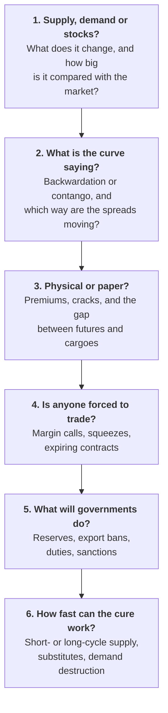

# Lesson 13: Reading the Market Yourself

*Ten mental models, a decoder for commodity headlines, six questions that unlock almost any commodity story, the data that moves markets with a routine for following it, and a reading list.*

---

## From knowing to reading

You now have the machinery: what a commodity is, who trades it, how futures and hedges work, what moves prices, what prices move, how three very different markets operate, and twenty-four episodes in which it all came under strain. This lesson turns that machinery into habits. The history in Lessons 10 and 11 boils down to a handful of habits of mind that professionals apply almost automatically, and most expensive beginner mistakes come from ignoring one of them.

---

## Ten mental models

1. **Think in balances, not headlines.** For any news, ask what it does to supply, demand and stocks, and how big that is relative to the whole market. A refinery fire matters; a minister's comment usually does not. (Lesson 5)
2. **Prices are set at the margin.** The last barrel or tonne the world needs sets the price for every unit, which is why a small shortage can lift the price of the entire market. (Lesson 5)
3. **Watch the curve and the spreads, not only the price.** Backwardation signals tightness now, contango signals plenty, and spreads such as diesel cracks or the physical premium show where the stress actually sits. (Lesson 6)
4. **The cure for high prices is high prices.** Spikes summon supply and destroy demand, and slumps do the reverse, so be wary of anyone extrapolating today's price into the future. Cocoa's rise and fall from 2023 to 2026 is the textbook case. (Lessons 5 and 11)
5. **Futures prices are not forecasts.** They are today's price for future delivery, shaped by storage, financing and risk appetite, and they change as soon as the facts change. (Lesson 6)
6. **Physical beats paper in a crisis.** In squeezes and shortages, what matters is who has the actual commodity, where it is and whether it meets the specification, as negative oil in 2020, nickel in 2022, gold in 2025 and Dated Brent in 2026 all showed. (Lesson 11)
7. **Liquidity kills more traders than being wrong.** Leverage and margin calls force people to sell at the worst moment, even when their view is ultimately right. Always ask how much cash a position could demand under stress. (Lessons 3 and 4)
8. **Governments are market participants.** They ban exports, release reserves, change duties, impose sanctions and even suspend markets, and in India in particular policy can move prices more than weather. (Lessons 7 and 9)
9. **Relationships are tendencies, not laws.** The dollar, interest rates, gold and oil usually move in recognisable ways until a bigger force takes over, as gold's break from real interest rates after 2022 proved. (Lesson 7)
10. **Know exactly what you are trading.** Grade, location, lot size, expiry and settlement method decide your outcome. Many retail disasters, from negative oil to "assured return" schemes like NSEL, began with people not reading the contract. (Lessons 3, 9 and 10)

---

## Decoding commodity headlines

Commodity journalism uses a compressed vocabulary that assumes you already know the mechanism. You now do.

| The headline says | It means |
| --- | --- |
| **"Brent flipped into backwardation"** | Oil for prompt delivery now costs more than oil for later delivery: stocks are getting tight |
| **"The curve is in super contango"** | Later delivery costs far more than prompt delivery: there is a glut and storage is filling up |
| **"Cracks blew out"** | Refining margins jumped: fuels are scarcer than the crude they are made from |
| **"Dated Brent traded at a big premium to futures"** | Real, prompt barrels are scarcer than paper ones |
| **"OPEC+ added barrels"** | The cartel raised its output targets; check how much of the increase is real and how much spare capacity is left |
| **"Funds are record long"** | Speculators hold a crowded bet on rising prices; if the news turns, the exit can be violent |
| **"Cancelled warrants jumped"** | Owners are queuing to take metal out of LME warehouses: physical tightness |
| **"The EFP widened"** | Futures and physical prices have diverged, often because metal cannot move freely |
| **"The exchange raised margins"** | Traders must post more collateral; forced selling is possible |
| **"Demand destruction"** | High prices are making buyers use less: the cure for high prices at work |
| **"The monsoon is deficient"** | India's rainfall is below normal: watch food inflation, rural demand and even gold |
| **"Export ban"** | A government is keeping supply at home, which tightens the world market for everyone else |

---

## Six questions for any commodity story

These six, drawn from the episodes in Lessons 10 and 11, will decode the overwhelming majority of commodity news. Run them in order.

### 1. What does it do to supply, demand or stocks, and how big is it?

Size is everything, and size relative to stocks most of all. Losing 1% of supply when stocks are ample is a shrug; losing it when stocks are thin is a crisis (Lesson 5).

### 2. What is the curve saying?

The forward curve is the market's own verdict on the news. If a supposedly bullish story leaves the curve in contango, the market does not believe it. If prompt prices jump while far-dated prices barely move, the market sees a short-term squeeze, not a lasting change (Lesson 6).

### 3. Is the stress physical or paper?

Compare the futures price with physical premiums, crack spreads and cargo assessments. When the physical market is tighter than the paper one, the shortage is real and immediate; when only the paper market moves, it may be positioning (Lessons 6 and 11).

### 4. Is anyone being forced to buy or sell?

This is the question that separates a repricing from a crisis. Margin calls, squeezes and expiring contracts turn price moves into spirals, because the person trading is not choosing to (Lessons 4, 10 and 11).

### 5. What will governments do?

Strategic reserves, export bans, duty changes and sanctions can move prices more than supply and demand, especially in food, fuel and critical minerals. Ask who has the power to intervene and what they want (Lessons 7 and 9).

### 6. How fast can the cure work?

Short-cycle supply such as shale responds in months, mines and oilfields in years, crops in a season. Substitution and demand destruction work at their own pace. The speed of the cure tells you how long a price spike can last (Lesson 5).

### Try it on a live one

Run this week's story through the six: *in early October 2026, diesel is acutely short. Russia has extended its ban on diesel exports to the end of the month, Chinese refiners have suspended most fuel exports for October, and Brent is around $100 a barrel with the Strait of Hormuz still disrupted.*

1. **Balances:** two of the world's largest fuel exporters are holding supply back, on top of the Gulf disruption, at a time when emergency stocks have already been drawn down.
2. **The curve:** steep backwardation; prompt supply is scarce. The World Bank's monthly average for physical Brent in September was $116.80, well above where futures traded.
3. **Physical or paper:** physical. Refined products are tighter than crude, which is why diesel and jet fuel have risen faster than oil.
4. **Forced sellers:** none obvious yet; watch for exchanges raising margins if prices jump again.
5. **Governments:** they are the story. Russia's ban, China's export pause, and talk in Washington of restricting US diesel exports, which helped widen the gap between Brent and WTI to its widest since May.
6. **The cure:** partial and slow. China could resume exports after its national holiday ends on 7 October if domestic stocks allow; refineries elsewhere are running hard; and demand destruction in freight takes months.

---

## The data that moves markets

<svg viewBox="0 0 680 310" width="100%" role="img" aria-label="Weekly calendar of the regular data that moves commodity markets. Tuesday evening: the American Petroleum Institute's industry estimate of US oil stocks. Wednesday: the US Energy Information Administration's weekly petroleum status report. Thursday: the EIA's natural gas storage report. Friday: the CFTC's Commitments of Traders report on positioning and the Baker Hughes rig count. Monthly: the USDA's WASDE crop report, the IEA and OPEC oil market reports, the EIA's Short-Term Energy Outlook, the FAO Food Price Index, the World Bank Pink Sheet and India's PPAC oil data." fill="none" xmlns="http://www.w3.org/2000/svg">
<text x="20" y="28" font-size="14" fill="currentColor" font-weight="600">The week in commodity data</text>
<text x="20" y="45.5" font-size="11.5" fill="currentColor" opacity="0.72">Regular releases worth knowing. US releases follow US Eastern time.</text>
<rect x="20" y="56" width="157" height="24" rx="4" class="vf1" fill="#2a78d6" fill-opacity="0.08"/>
<text x="98.5" y="72" font-size="11.5" fill="currentColor" text-anchor="middle" font-weight="600">Tuesday</text>
<rect x="20" y="84" width="157" height="148" rx="4" stroke="currentColor" stroke-width="1.2" stroke-opacity="0.2" fill="none"/>
<rect x="26" y="92" width="145" height="64" rx="5" class="vf2" fill="#eb6834" fill-opacity="0.12"/>
<text x="34" y="108" font-size="10.5" fill="currentColor" font-weight="600">API oil stocks</text>
<text x="34" y="121" font-size="10" fill="currentColor" opacity="0.75">industry estimate,</text>
<text x="34" y="133.5" font-size="10" fill="currentColor" opacity="0.75">released in the evening</text>
<rect x="181" y="56" width="157" height="24" rx="4" class="vf1" fill="#2a78d6" fill-opacity="0.08"/>
<text x="259.5" y="72" font-size="11.5" fill="currentColor" text-anchor="middle" font-weight="600">Wednesday</text>
<rect x="181" y="84" width="157" height="148" rx="4" stroke="currentColor" stroke-width="1.2" stroke-opacity="0.2" fill="none"/>
<rect x="187" y="92" width="145" height="64" rx="5" class="vf2" fill="#eb6834" fill-opacity="0.12"/>
<text x="195" y="108" font-size="10.5" fill="currentColor" font-weight="600">EIA weekly</text>
<text x="195" y="121" font-size="10.5" fill="currentColor" font-weight="600">petroleum report</text>
<text x="195" y="134" font-size="10" fill="currentColor" opacity="0.75">US crude and fuel stocks,</text>
<text x="195" y="146.5" font-size="10" fill="currentColor" opacity="0.75">refinery runs, exports</text>
<rect x="342" y="56" width="157" height="24" rx="4" class="vf1" fill="#2a78d6" fill-opacity="0.08"/>
<text x="420.5" y="72" font-size="11.5" fill="currentColor" text-anchor="middle" font-weight="600">Thursday</text>
<rect x="342" y="84" width="157" height="148" rx="4" stroke="currentColor" stroke-width="1.2" stroke-opacity="0.2" fill="none"/>
<rect x="348" y="92" width="145" height="64" rx="5" class="vf2" fill="#eb6834" fill-opacity="0.12"/>
<text x="356" y="108" font-size="10.5" fill="currentColor" font-weight="600">EIA gas storage</text>
<text x="356" y="121" font-size="10" fill="currentColor" opacity="0.75">US natural gas</text>
<text x="356" y="133.5" font-size="10" fill="currentColor" opacity="0.75">in storage</text>
<rect x="503" y="56" width="157" height="24" rx="4" class="vf1" fill="#2a78d6" fill-opacity="0.08"/>
<text x="581.5" y="72" font-size="11.5" fill="currentColor" text-anchor="middle" font-weight="600">Friday</text>
<rect x="503" y="84" width="157" height="148" rx="4" stroke="currentColor" stroke-width="1.2" stroke-opacity="0.2" fill="none"/>
<rect x="509" y="92" width="145" height="64" rx="5" class="vf1" fill="#2a78d6" fill-opacity="0.12"/>
<text x="517" y="108" font-size="10.5" fill="currentColor" font-weight="600">CFTC Commitments</text>
<text x="517" y="121" font-size="10.5" fill="currentColor" font-weight="600">of Traders</text>
<text x="517" y="134" font-size="10" fill="currentColor" opacity="0.75">positions as of</text>
<text x="517" y="146.5" font-size="10" fill="currentColor" opacity="0.75">the Tuesday before</text>
<rect x="509" y="162" width="145" height="64" rx="5" class="vf2" fill="#eb6834" fill-opacity="0.12"/>
<text x="517" y="178" font-size="10.5" fill="currentColor" font-weight="600">Baker Hughes</text>
<text x="517" y="191" font-size="10.5" fill="currentColor" font-weight="600">rig count</text>
<text x="517" y="204" font-size="10" fill="currentColor" opacity="0.75">is US drilling</text>
<text x="517" y="216.5" font-size="10" fill="currentColor" opacity="0.75">rising or falling?</text>
<text x="20" y="252" font-size="11.5" fill="currentColor" font-weight="600">Every month</text>
<text x="20" y="272" font-size="11" fill="currentColor" opacity="0.85">• USDA WASDE crop balances</text>
<text x="240" y="272" font-size="11" fill="currentColor" opacity="0.85">• IEA and OPEC oil market reports</text>
<text x="460" y="272" font-size="11" fill="currentColor" opacity="0.85">• EIA Short-Term Energy Outlook</text>
<text x="20" y="290" font-size="11" fill="currentColor" opacity="0.85">• FAO Food Price Index</text>
<text x="240" y="290" font-size="11" fill="currentColor" opacity="0.85">• World Bank Pink Sheet prices</text>
<text x="460" y="290" font-size="11" fill="currentColor" opacity="0.85">• India: PPAC oil data, trade data</text>
</svg>

| Cadence | Release | What it tells you |
| --- | --- | --- |
| **Weekly (Wednesday)** | EIA Weekly Petroleum Status Report | US crude and fuel stocks, refinery runs, exports |
| **Weekly (Friday)** | CFTC Commitments of Traders; Baker Hughes rig count | How funds are positioned; whether US drilling is rising or falling |
| **Monthly** | IEA Oil Market Report; OPEC Monthly Oil Market Report; EIA Short-Term Energy Outlook | Global oil supply, demand and stock balances, and forecasts |
| **Monthly** | USDA WASDE; FAO Food Price Index; World Bank "Pink Sheet" | Grain balances, global food prices, monthly commodity price data |
| **Monthly (India)** | PPAC oil data; commerce ministry trade data; SEBI circulars | Import bills, gold and oil imports, rule changes |
| **Seasonal (India)** | India Meteorological Department monsoon forecasts and weekly rainfall | Kharif crop prospects, food inflation, rural demand |
| **Quarterly** | World Gold Council Gold Demand Trends; Ofgem price cap | Central bank and investor gold buying; UK household energy costs |
| **Twice a year** | World Bank Commodity Markets Outlook (April and October) | A clear, free overview of every major commodity |
| **Annual** | Energy Institute Statistical Review of World Energy; IEA World Energy Outlook | Long-run production, consumption and transition trends |

### A simple routine to build fluency

- **Daily, five minutes:** glance at Brent, gold, copper and the US dollar, read one commodity headline, and ask what it does to supply, demand or stocks.
- **Weekly, twenty minutes:** skim the EIA inventory summary and one long read from the FT, Bloomberg or BusinessLine, and check whether the oil curve is in backwardation or contango.
- **Monthly, one hour:** read the executive summary of the IEA or OPEC oil report and the WASDE highlights, and note what changed in each forecast and why.
- **Quarterly:** read the World Gold Council report and one chapter of the Commodity Markets Outlook, then come back to the ten mental models above and test them against the latest events.

---

## What to read, follow and track

Start with two books that make the subject come alive, follow one daily news source and one opinion writer, and build a light weekly habit around the free official data. Depth comes from repetition, not from reading everything.

### Books, in a sensible reading order

| Book | Why read it |
| --- | --- |
| **Ed Conway, *Material World* (2023)** | The most accessible introduction: how sand, salt, iron, copper, oil and lithium built the modern world |
| **Javier Blas and Jack Farchy, *The World for Sale* (2021)** | The inside story of the trading houses that move the world's resources, from Marc Rich to Vitol and Glencore |
| **Daniel Yergin, *The Prize* (1990)** | The Pulitzer-winning history of oil, essential background for every oil shock |
| **Daniel Yergin, *The New Map* (2020)** | How energy, geopolitics and climate policy reshaped power after the shale revolution |
| **Morgan Downey, *Oil 101* (2009)** | A practical, technical primer on how oil is produced, refined, priced and traded |
| **Craig Pirrong, *The Economics of Commodity Trading Firms* (2014)** | A free, clear academic explanation of why merchants exist and how they make money |
| **John Hull, *Options, Futures, and Other Derivatives*** | The standard textbook for the mathematics of futures and options |
| **Kate Kelly, *The Secret Club That Runs the World* (2014)** | A narrative portrait of commodity traders and hedge funds in the supercycle era |
| **Dan Morgan, *Merchants of Grain* (1979)** | The classic account of the grain giants and the politics of food |
| **Henry Sanderson, *Volt Rush* (2022)** | The battery-metals race and the critical-minerals geopolitics now playing out |
| **Siddharth Kara, *Cobalt Red* (2023)** | The human cost of mining for the energy transition |
| **NISM Series XVI workbook, *Commodity Derivatives*** | The practical guide to Indian exchange mechanics, used for the official certification |

### News and commentary

- **Global news:** the Financial Times, Bloomberg and Reuters all run dedicated commodities coverage; The Economist is good for the big picture.
- **One opinion writer:** Javier Blas's Bloomberg Opinion column on energy and commodities is sharp, sceptical and beginner-friendly.
- **Podcasts:** Bloomberg's *Odd Lots* regularly explains commodity crises with practitioners, and Columbia University's *Columbia Energy Exchange* covers energy policy in depth.
- **Newsletters:** *Commodity Context* by Rory Johnston is an excellent independent oil-market newsletter.
- **India:** The Hindu BusinessLine is especially strong on farm commodities, alongside Business Standard, Mint, the Economic Times and Moneycontrol.
- **UK:** Ofgem's price cap releases, LME and LBMA market data, and the Bank of England's Monetary Policy Report, which explains how commodity prices feed UK inflation.
- **Free courses:** CME Group's education portal, the LME and LBMA learning pages, and the US Energy Information Administration's "Energy Explained" series.

---

## One habit that matters more than any source

Before you read anyone's forecast, look at the market's own evidence: the forward curve, the inventories, and the gap between physical and paper prices. They are free, they update every day, and they have no story to sell. A forecaster who says oil is about to soar while the curve sits in contango and tanks are filling is arguing with the market, and the market usually has better information.

Then, when you do read the forecast, ask two questions: **what evidence would prove it wrong**, and **how quickly could the cure for the price it predicts arrive?**

---

## Check yourself

**1. A headline says "Copper hits record as LME cancelled warrants surge and the cash-to-three-month spread flips into backwardation." Decode it.**

Show the answer

Owners are queuing to withdraw metal from LME warehouses, so usable stocks are falling (cancelled warrants). Copper for immediate delivery now costs more than copper in three months (backwardation): prompt metal is scarce. Together they say the record price reflects a **physical** shortage, not just investor buying, which makes it more likely to persist until supply responds or demand gives way.

**2. A friend says oil will rise because a pipeline has been attacked. What two numbers should you check before agreeing?**

Show the answer

How much oil the pipeline carries **relative to the market and to available stocks** (question 1), and what the **forward curve** did when the news broke (question 2). If the volume is small, stocks are ample and the curve barely moved, the market is telling you the attack does not change the balance much.

**3. Why is "futures prices are not forecasts" an important habit for an investor in an oil fund?**

Show the answer

Because a curve in contango does not mean the market expects prices to rise; it usually means there is plenty of oil and storage must be paid for. An investor who reads the curve as a forecast may expect gains that never arrive, while the fund loses money on every roll (Lesson 6).

---

## What to carry into Lesson 14

- Ten **mental models**: balances, the margin, the curve, the cure, futures are not forecasts, physical beats paper, liquidity, governments, tendencies, and knowing your contract.
- A **headline decoder** for the vocabulary, and **six questions** that decode almost any commodity story.
- A **data calendar** and a light **routine**: five minutes a day, twenty a week, an hour a month.
- One habit above all: **check the curve, the stocks and the physical premium before you believe a forecast.**

Lesson 14 restates the whole guide as a sequence of figures, one per idea.

---

## Sources

- [The Moscow Times: Russia extends its diesel export ban until the end of October 2026](https://www.themoscowtimes.com/2026/09/30/government-extends-diesel-export-ban-until-end-of-october-a93823)
- [OilPrice: China halts October fuel exports as the global diesel crunch deepens](https://oilprice.com/Latest-Energy-News/World-News/China-Halts-October-Fuel-Exports-as-Global-Diesel-Crunch-Deepens.html)
- [EnergyNow: talk of a US diesel export ban deepens WTI's discount to Brent (September 2026)](https://energynow.com/2026/09/talk-of-us-export-ban-on-diesel-deepens-us-crude-futures-discount-to-global-benchmark-2/)
- [World Bank: Commodity Markets Outlook and monthly price data](https://www.worldbank.org/en/research/commodity-markets)
- [US EIA: Weekly Petroleum Status Report](https://www.eia.gov/petroleum/supply/weekly/)
