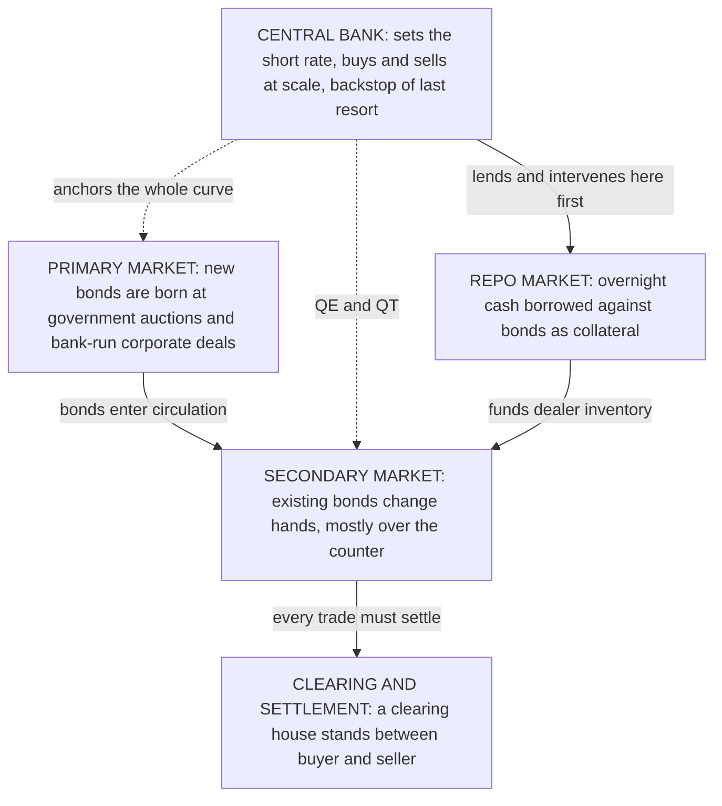

# Lesson 3: Instruments, Players, and Plumbing

*The bonds that actually exist, the people who trade them, and the machinery underneath that nobody notices until it breaks.*

---

## The main kinds of bonds

### Government bonds: the foundation

Government bonds are the base of the whole structure, and one feature explains why.

The United States, the United Kingdom and India all borrow mainly in currencies their own central banks create. A government that owes money in a currency it can issue cannot be *forced* into default the way a company can. It may choose not to pay, for political reasons, but it can never be unable to.

This is why these bonds serve as the **risk-free benchmark** in each currency — the reference point against which every other investment is measured. The label is slightly misleading. It means free of *default* risk, not free of all risk. Their real dangers are inflation, which erodes what the repayment buys, and currency weakness, which erodes what it is worth to a foreign holder.

The qualifier matters enormously. A government borrowing in a currency it does *not* control — a eurozone member, or an emerging market borrowing in dollars — has no such protection. Its bonds carry genuine credit risk and behave far more like a company's. Lesson 6 covers Greece, which is the definitive demonstration.

Below national governments sit **sub-sovereign** borrowers: US states and cities issuing municipal bonds, and Indian states issuing State Development Loans. They borrow in the same currency but without the power to create it, so they pay a spread over the national government.

### Corporate bonds and the ratings that price them

Companies issue bonds too, and they are graded by **credit rating agencies**. S&P, Moody's and Fitch are the global names; CRISIL, ICRA, CARE and India Ratings lead in India.

The rating scale has one boundary that matters more than all the others.

| Grade | S&P / Fitch | Moody's | Meaning |
| --- | --- | --- | --- |
| Highest quality | AAA | Aaa | Minimal credit risk |
| High quality | AA+ to AA− | Aa1 to Aa3 | Very strong capacity to pay |
| Upper medium | A+ to A− | A1 to A3 | Strong, but more exposed to conditions |
| **Lowest investment grade** | **BBB+ to BBB−** | **Baa1 to Baa3** | **Adequate — the floor for many institutions** |
| ⎯⎯ the investment grade boundary ⎯⎯ | | | |
| Speculative | BB+ to B− | Ba1 to B3 | "High yield," less politely *junk* |
| Substantial risk | CCC and below | Caa and below | Vulnerable; default a real prospect |
| In default | D | C | Not paying |

Bonds rated **BBB− or above** are *investment grade*. Anything lower is *high yield*. That single line is consequential far beyond its informational content, because a great many institutions are permitted to hold only investment-grade paper. A downgrade across the boundary forces selling regardless of whether the holders think the downgrade is justified — which is how a modest change of opinion turns into a large price move.

The rating largely sets the cost of borrowing. One mid-2026 snapshot of the Indian market showed the scale of the effect:

| Rating | Indicative yield, mid-2026 |
| --- | --- |
| AAA public sector companies | roughly 7.0% to 7.5% |
| AA new issues | around 8.5% to 9.3% |
| Single-A issues | about 10.4% to 12.25% |

Three rating notches roughly doubled the cost of money.

> A rating is an opinion about the likelihood of being repaid, not a guarantee and not a recommendation. Lesson 6 opens with 2008, when 83% of the mortgage securities Moody's rated AAA in 2006 were eventually downgraded.

### Variations you will meet

| Instrument | What makes it different |
| --- | --- |
| **Bills** | Short-term, under a year. Sold at a discount to face value instead of paying coupons; your return is the gap |
| **Floating-rate notes** | The coupon resets periodically against a reference rate, so the price barely moves with yields |
| **Inflation-linked bonds** | Coupon and principal both rise with a published inflation index |
| **Mortgage-backed securities** | Bundle thousands of home loans; holders receive the homeowners' payments |
| **Green bonds** | Ordinary bonds with proceeds earmarked for environmental projects |
| **Convertibles** | Can be converted into the issuer's shares, blending bond and equity behaviour |

Note the second row. Because a floating-rate note's coupon moves with the market, it has almost no duration — the mechanism from Lesson 1 barely applies to it. This is why floating-rate paper is popular when investors fear rising rates.

---

## The players

Bond markets have a stable cast, and each participant wants something different. Knowing who is being forced to do what is often the key to understanding a move.

| Role | Who | What they want |
| --- | --- | --- |
| **Borrowers** | Governments, usually through a specialist debt management office; companies; banks; local governments; international bodies such as the World Bank | The lowest possible cost, and reliable access to funding |
| **Long-term lenders** | Pension funds and insurers | Long bonds that match promises stretching decades ahead. They buy to *match liabilities*, not to speculate |
| **Banks** | Commercial banks | Safe, easily sold assets — and in many countries regulators require them to hold government bonds |
| **Funds** | Bond funds and ETFs | To track or beat a benchmark. Index funds must buy what the index holds, whatever they think of it |
| **Reserve managers** | Foreign central banks | Somewhere vast and liquid to park national reserves |
| **Hedge funds** | Leveraged traders | To profit from small price gaps, usually with borrowed money |
| **Dealers** | Large banks: *primary dealers* in the US and India, *gilt-edged market makers* in the UK | To make markets. They commit to bidding at government auctions and quoting prices, and earn the spread |
| **Referees** | Clearing houses, trading platforms, regulators, rating agencies | That the market keeps functioning and settles |
| **The central bank** | The Fed, the Bank of England, the RBI | Monetary policy — and financial stability when things break |

Two entries deserve emphasis.

**Pension funds and insurers are not ordinary investors.** They owe money decades into the future and they buy long bonds to match those obligations. This makes them structurally hungry for exactly the most volatile instruments in the market, and it shapes the character of whole national markets — the UK most of all.

**The central bank is the most powerful player by a wide margin.** It sets the short-term rate that anchors the entire curve, it can buy or sell in enormous volumes, and it is the emergency backstop when the market seizes up. No other participant has an unlimited balance sheet.

---

## How the machinery works

### The primary market: where bonds are born

New government bonds are sold mostly through **auctions**, held on a calendar published well in advance so buyers can prepare.

Bidders state the yields they are willing to accept. The government works up from the lowest-yield bids — the cheapest money for it — until its needs are filled. The result is therefore a market verdict delivered in public, and it is read closely. If the government has to accept a noticeably higher yield than the market expected just beforehand, the auction is said to have **tailed**, and it signals weak appetite for that country's debt.

Companies borrow differently. An investment bank sounds out large investors, builds an **order book** of indicated demand, and sets the price where the book clears.

### The secondary market: where they trade

Here is a fact that surprises people who know equities: **most bonds do not trade on an exchange**.

They trade **over the counter** — bilaterally, between dealers and their clients, increasingly through electronic platforms but still fundamentally a negotiated market rather than a central order book. The reason is variety. A company might have one class of ordinary shares but two dozen bonds outstanding, each with its own coupon and maturity. Fragmenting trading across that many instruments makes a continuous exchange impractical.

The consequence is a dramatic split in liquidity. Government bonds trade constantly and in vast size. Many corporate bonds change hands a handful of times a year. That difference is the source of **liquidity risk**, which gets its own treatment in Lesson 7 and a cautionary tale in Lesson 6.

India is a partial exception worth noting: most secondary trading in government securities happens on **NDS-OM**, the Reserve Bank of India's anonymous electronic platform, which is closer to an exchange model than the US or UK arrangements.

### The repo market: the bloodstream

Underneath everything sits the **repo market**, and it is the part most worth understanding because it is the part that breaks.

A repurchase agreement, or repo, is a short-term loan — often just overnight — secured against bonds. An institution needing cash sells bonds with an agreement to buy them back tomorrow at a slightly higher price. Economically it is a secured loan, with the bonds as collateral and the price difference as interest.

Repo does three essential jobs:

1. **It finances dealers.** A dealer holding bonds in inventory funds that inventory in the repo market. Without repo, dealers could not carry stock, and without dealer stock there is no liquidity.
2. **It transmits central bank policy.** The central bank's rate decisions reach the wider market largely through the overnight secured lending rate.
3. **It lets institutions raise cash without selling.** Which is exactly what makes it dangerous.

That last point is the crux. Repo lets an institution borrow against assets it already owns, which means it can hold far more bonds than its own money would allow. This is **leverage**, and leverage is what converts a price fall into forced selling. When bond prices drop, lenders demand more collateral; the borrower must find cash; the fastest way to find cash is to sell bonds; the selling pushes prices down further. Lesson 6 has two episodes that are precisely this loop.

Repo is also the first place a crisis shows up. When lenders stop accepting a class of bonds as collateral, the institutions financed by those bonds lose funding overnight. In 2008 this is what cut off Lehman Brothers. Central banks now watch repo obsessively and intervene there fast.

### Settlement

Once a trade is agreed, it must actually complete: bonds move one way, cash the other. Trades in government bonds typically settle within one business day. The clearing house standing in the middle guarantees the trade, so if one party fails the other is still made whole. It is unglamorous infrastructure whose entire purpose is to stop one failure becoming many.

---

## What to carry into Lesson 4

- Government bonds are the **risk-free benchmark** in their own currency; everything else pays a **spread** above them.
- The **investment grade boundary at BBB−** forces institutional selling when crossed, which amplifies downgrades.
- Different players want different things, and **forced** participants — index funds, regulated banks, liability-matching pension funds — often move markets for reasons unrelated to opinion.
- Bonds are born at **auction**, trade **over the counter**, and are financed in the **repo market**.
- **Repo enables leverage**, and leverage is what turns a price fall into a spiral.

Lessons 1 to 3 have built the machine. Lesson 4 asks why anyone outside it should care.
