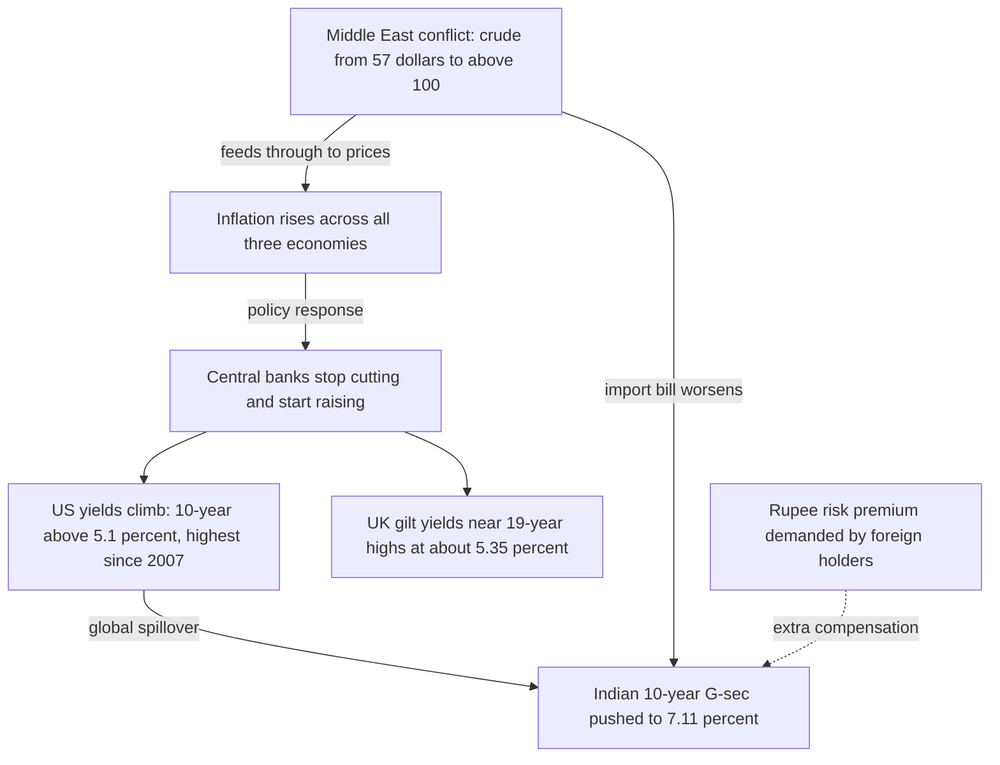

# Lesson 5: Three Markets Up Close — US, UK, India

*Treasuries, gilts and G-secs: who issues them, who buys them, and what gives each market its character. Then one month in which all three moved together.*

---

## Why compare three markets

The mechanism in Lessons 1 to 4 is universal. The *character* of a bond market is not. It is shaped by who issues the debt, who is structurally obliged to buy it, and which institution holds the power.

These three were chosen because they differ on every one of those dimensions. The US market is the world's benchmark safe asset. The UK market is shaped to an unusual degree by pension funds. India's is large, overwhelmingly domestic, and only recently opening to foreign money. Watching the same physics produce three different markets is what turns the theory into judgement.

---

## United States

The US Treasury market is the deepest in the world, and US government debt is the benchmark safe asset for the entire global financial system. Foreign central banks hold it in vast quantities because the dollar is the main reserve currency, which creates a base of demand no other government enjoys.

The scale is hard to overstate. The US accounted for about **38% of the world's bonds outstanding** in 2025, some **$61.2 trillion** — roughly twice the size of the next-largest market, the European Union.

### The instruments

| Instrument | Maturity | Note |
| --- | --- | --- |
| **Bills** | Under 1 year | Sold at a discount; no coupon |
| **Notes** | 2 to 10 years | The 10-year note is the global reference yield |
| **Bonds** | 20 and 30 years | The long end |
| **TIPS** | Various | Treasury Inflation-Protected Securities |
| **FRNs** | 2 years | Floating-rate notes |

The Treasury sells these through hundreds of auctions a year, with about two dozen **primary dealers** expected to bid at every one. The **Federal Reserve** sets the federal funds rate; the SEC and FINRA oversee trading firms.

The US also hosts the world's largest corporate bond market, a vast mortgage-backed securities market, and a municipal bond market whose interest is often free of federal income tax — a quirk that gives US states and cities an unusually cheap source of funding. Individuals can buy Treasuries through the government's TreasuryDirect website or a broker.

### A sign of the times

The US has lost its top rating from all three major agencies in stages: **S&P in 2011**, **Fitch in 2023**, and in **2025 Moody's** became the last to strip the US of its AAA, citing persistent deficits and rising interest costs.

It is worth holding two facts together here. The world's benchmark safe asset is no longer rated AAA by anyone — and demand for it has not collapsed. Lesson 6's second episode explains why that is less contradictory than it sounds.

---

## United Kingdom

Gilts take their name from the gilded edges of the original paper certificates, and the market's roots reach back to the late 17th century, making it one of the oldest continuously functioning government debt markets in the world.

They are issued by the **Debt Management Office** (DMO), an agency of HM Treasury, through regular auctions and — for very large long-dated deals — **syndications** run by a group of banks. **Gilt-edged market makers** act as the dealers.

### Two main types

- **Conventional gilts** pay a fixed coupon every six months.
- **Index-linked gilts** raise both coupons and principal with inflation. The UK was among the first major economies to issue them, in 1981, and it has an unusually large share of them outstanding.

That second point has a sharp consequence. Because so much UK debt is inflation-linked, a burst of inflation directly and immediately swells the government's interest bill. Most countries' debt costs rise only gradually as old bonds mature and are refinanced at new rates; the UK's rise straight away.

### The market's defining feature is its owners

Pension funds and insurers are enormous holders of gilts, because defined-benefit schemes need long-dated and inflation-linked assets to match the pensions they have promised. Overseas investors also hold a large share.

This buyer base explains two things at once: the UK's unusually long average debt maturity, and why the 2022 LDI crisis happened *there* rather than somewhere else. When your largest domestic buyers are structurally committed to the longest, most duration-heavy instruments in the market, you have concentrated the risk described in Lesson 1 into a single group of institutions.

The **Bank of England** sets Bank Rate through its Monetary Policy Committee, and has stood out internationally for *actively selling* gilts bought under QE rather than simply letting them mature. The FCA and PRA regulate the firms involved. London is also the global hub for **Eurobonds** — international bonds issued outside the borrower's home market, a name that has nothing to do with the euro.

---

## India

Indian government bonds are called **government securities**, or G-secs. The central government issues Treasury bills of 91, 182 and 364 days, and dated securities running out to 40 and even 50 years. Each state also issues its own **State Development Loans**.

### The distinctive feature: the RBI's triple role

The Reserve Bank of India does three jobs that are separated in most other countries:

1. **It manages the government's borrowing** and runs the auctions, on its E-Kuber platform.
2. **It sets monetary policy.**
3. **It regulates the market.**

Being simultaneously the issuer's agent, the rate-setter and the referee is a concentration of function that the US and UK deliberately avoid. It makes for efficient coordination and a less independent market.

Most secondary trading happens on **NDS-OM**, the RBI's anonymous electronic platform, and the **Clearing Corporation of India** (CCIL) guarantees and settles the trades.

### The buyers are overwhelmingly domestic

Commercial banks are the largest holders, partly because the **Statutory Liquidity Ratio** obliges them to keep a set share of deposits in liquid assets, mainly government securities. This is a regulatory requirement rather than a preference — a captive buyer base by law. Insurers such as LIC, along with provident and pension funds, buy the long bonds, and the RBI itself holds a large stock.

### Foreign ownership: small, but rising

The **Fully Accessible Route**, created in 2020, let foreigners buy designated bonds without limits. That opened the door to global bond indices — and index inclusion matters disproportionately, because funds tracking an index *must* buy what the index contains, regardless of their own view.

| Index | Status |
| --- | --- |
| JP Morgan emerging-market index | Inclusion began June 2024, phased in at one percentage point a month to a 10% weight |
| Bloomberg EM local-currency index | Followed from January 2025 |
| FTSE Russell EM government bond index | Also includes Indian bonds |
| **Bloomberg Global Aggregate** | **Still pending** — the biggest prize |

In June 2026 India removed capital gains and withholding taxes for foreign investors in government bonds, largely to win a place in Bloomberg's flagship Global Aggregate Index. At the end of July, Bloomberg postponed its decision again, saying the reforms first needed to show up in everyday market practice.

Individuals can buy G-secs directly through the **RBI Retail Direct** portal, launched in 2021. The corporate bond market is smaller, regulated by SEBI, dominated by highly rated public sector companies, banks and non-bank lenders, and much of it is placed privately with institutions rather than sold publicly.

---

## Side by side

| Feature | United States | United Kingdom | India |
| --- | --- | --- | --- |
| **Name** | Treasuries | Gilts | G-secs, state SDLs |
| **Issued by** | US Treasury | Debt Management Office | RBI, for the government |
| **Central bank** | Federal Reserve | Bank of England | Reserve Bank of India |
| **Dealers** | Primary dealers | Gilt-edged market makers | Primary dealers |
| **Trading** | OTC, electronic | OTC, electronic | RBI's NDS-OM |
| **Anchor buyers** | Foreign investors, funds, the Fed | Pension funds, insurers, overseas | Banks, insurers, provident funds |
| **Inflation-linked** | TIPS | Index-linked gilts (unusually large share) | Rarely issued |
| **Retail access** | TreasuryDirect, brokers | Investment platforms | RBI Retail Direct |

---

## The concepts in action: September 2026

This month is a live demonstration of nearly everything in this guide. Read it as a worked example rather than as news.

### The trigger: an energy shock

A prolonged conflict in the Middle East has driven up crude and refined fuel prices. US crude has risen from about **$57 a barrel in January to above $100**, after touching $113 in April.

Dearer energy feeds inflation, and inflation is the bond investor's enemy (Lesson 2). Every subsequent move in this story descends from that one fact.

### United States

Central banks are raising rates instead of cutting them. On **16 September the Federal Reserve lifted its target range by a quarter point to 3.75%–4.00%**, its first increase since 2023. The European Central Bank and Bank of Japan had already raised rates earlier in the year.

Yields have climbed and prices have fallen — the seesaw from Lesson 1, at national scale. The **US 10-year Treasury yield rose above 5.1%**, its highest since 2007.

The curve slopes upward. On the day of the Fed's decision the 2-year yielded 4.74%, the 10-year 5.01% and the 20-year 5.39%. Fed Chair Kevin Warsh has attributed part of the rise to strong growth and to fierce competition for borrowed money amid the AI investment boom — which is supply and demand for capital doing exactly what Lesson 2 described.

### United Kingdom

The Bank of England **held Bank Rate at 3.75%** in September, but three of its nine policymakers voted to raise it to 4%, with inflation up to 3.1% in August. The **10-year gilt yield is around 5.35%**, near the 19-year high reached earlier in the month, and markets see a solid chance of a rise in November.

The Bank also gave a textbook lesson in **quantitative tightening**, setting out a multi-year plan to run its QE gilt holdings down to zero through £20 billion of annual sales on top of maturing bonds. That is a central bank deliberately adding supply to a market — the reverse of the QE described in Lesson 2.

### India

India shows how connected the market is.

The RBI cut its repo rate by a total of 125 basis points during 2025, to **5.25%**, and has held it there since. But inflation has risen from 2.75% in January to **4.82% in August**, and markets now price a possible hike at the 5–7 October meeting.

The **10-year G-sec yield was 7.11% on 25 September**, about 0.6 points above a year earlier. Three forces pushed it there: the US Treasury sell-off, Brent crude near $105, and heavy government borrowing. Note that the first of those is entirely external. India's domestic policy rate had not changed at all.

### Reading the snapshot

| | United States | United Kingdom | India |
| --- | --- | --- | --- |
| **Policy rate** | 3.75%–4.00% (raised 16 Sep, first since 2023) | 3.75% (held; 3 of 9 voted to raise) | 5.25% (held since 2025 cuts) |
| **10-year yield** | above 5.1% — highest since 2007 | about 5.35% — near 19-year high | 7.11% on 25 September |
| **Curve** | Upward sloping: 2y 4.74%, 10y 5.01%, 20y 5.39% | Near highs across the curve | Elevated across the curve |
| **Policy stance** | Tightening | On hold, tightening bias | On hold, hike priced for October |
| **Main driver** | Growth plus AI capital demand | Inflation at 3.1%, active QT | US spillover, crude, heavy borrowing |

### Why India's yields sit so much higher

An Indian 10-year at 7.11% against a US 10-year at 5.1% is a gap of roughly two percentage points. It is not a free lunch, and the reasons are all concepts you now have:

- **Higher inflation** erodes more of the nominal yield, so the real return is closer than it looks (Lesson 2).
- **Faster nominal growth** supports a higher neutral policy rate.
- **A higher policy rate** anchors the whole curve higher (Lesson 2).
- **Currency risk.** For a foreign investor, the extra yield is compensation for the possibility that the rupee weakens. As Lesson 7 shows, a sterling investor earning 7% in rupees can still lose money in pounds.

---

## What to carry into Lesson 6

- The **US** market's depth and reserve-currency demand make it the global benchmark — and it has now lost AAA from all three agencies without losing that role.
- The **UK** market is defined by its buyers: pension funds needing long, inflation-linked assets, which concentrates duration risk in one group.
- **India's** market is domestic and partly captive by regulation, with the RBI playing three roles at once, and foreign participation rising through index inclusion.
- **September 2026** shows the whole machine running: an energy shock became inflation, became policy tightening, became higher yields — and crossed borders within days.

Lesson 6 runs the same equipment over eight episodes where something broke.
