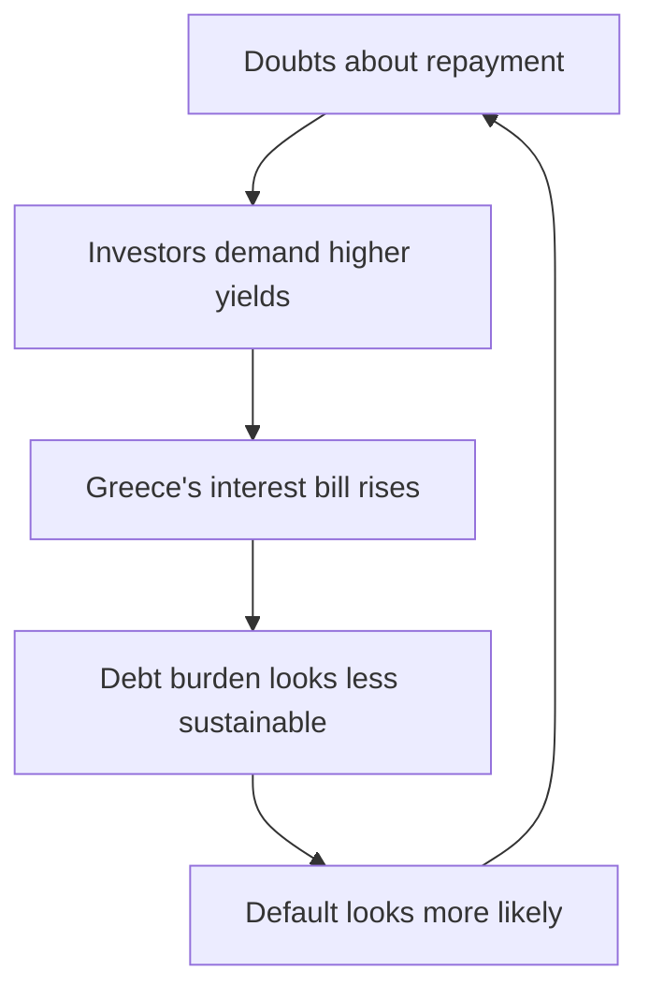
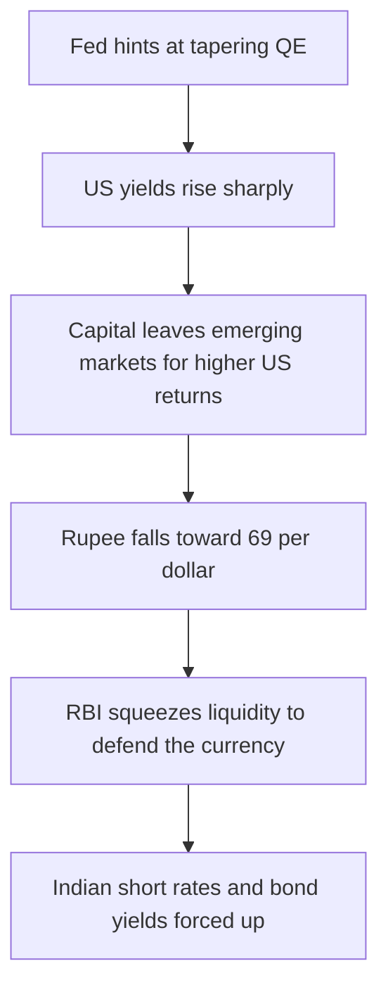
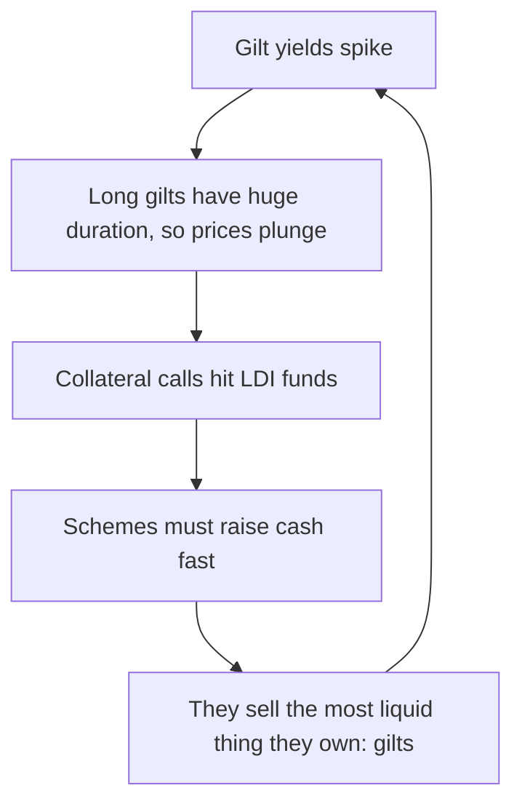

# Lesson 6: Eight Headlines, Eight Lessons

*Eight episodes from the past two decades. Each isolates a different part of the machinery, and together they cover almost every concept in this guide.*

---

## Why episodes rather than theory

Duration is an abstraction until you watch it destroy a bank. Liquidity risk is a definition until six funds shut their doors on their own investors. The eight stories below were chosen because each one is the cleanest available demonstration of a single mechanism.

| # | Episode | Concept it isolates | What actually broke |
| --- | --- | --- | --- |
| 1 | Lehman, September 2008 | Credit risk, ratings, repo | Faith that AAA meant safe |
| 2 | US downgrade, August 2011 | Borrowing in your own currency | The link between ratings and yields |
| 3 | Greece and Draghi, 2010–12 | Currency you do not control | The idea that all sovereigns are risk-free |
| 4 | Taper tantrum, 2013 | Expectations, global spillovers | The belief that nothing happens until policy changes |
| 5 | Austria's 100-year bond, 2020–23 | Duration and convexity | The idea that government bonds are low-risk |
| 6 | Franklin Templeton, April 2020 | Liquidity risk | Daily dealing on illiquid assets |
| 7 | UK mini-budget, September 2022 | Fiscal credibility, leverage | Pension funds' collateral, and a government |
| 8 | "Sell America," April 2025 | Safe-haven status, basis trade | The reflex that Treasuries always rally in a panic |

---

## 1. September 2008: Lehman collapses and "AAA" stops meaning safe

**Concepts:** credit risk and spreads, ratings, securitisation, flight to safety, repo

In the years before 2008, banks bundled millions of American mortgages into mortgage-backed securities, sliced them into layers, and sold them worldwide. Many of the underlying loans were **subprime**: lent to borrowers with weak credit. Rating agencies stamped the top layers AAA, the same grade as US government debt.

The logic seemed sound: individual mortgages might default, but not all at once across the whole country. When house prices fell nationally and borrowers defaulted together, that assumption failed and the bonds collapsed. The US Financial Crisis Inquiry Commission later found that **83% of the mortgage securities Moody's rated AAA in 2006 were eventually downgraded**.

On **15 September 2008**, Lehman Brothers filed for the largest bankruptcy in US history. It held large amounts of these assets and had funded itself with short-term borrowing.

The bond market then split cleanly in two.

**Anything carrying credit risk was dumped.** By December, spreads on US junk bonds had widened to around **20 percentage points**: weaker companies were being asked to pay roughly twenty points more than the government, if anyone would lend at all. A large money market fund holding Lehman's short-term debt "broke the buck," returning less than investors had put in, and sparked a run.

**Government bonds went the other way**, in a textbook flight to safety. Yields on 3-month Treasury bills briefly fell to around zero: investors accepted *no return at all* simply to keep their money somewhere safe. The 10-year yield dropped from about 4% to about 2% by year-end.

The damage then spread through the **repo market**. Lenders refused to accept mortgage bonds as collateral, which cut off the overnight funding that firms like Lehman depended on. The Fed cut rates to near zero and launched its first round of QE.

> **The lesson:** A rating is an opinion, not a guarantee, and complexity can hide risk. In a crisis, credit spreads explode while the safest government bonds rally. And the most dangerous structure in finance is funding long-term, hard-to-sell assets with short-term borrowed money.

---

## 2. August 2011: America loses its AAA rating, and Treasuries rally anyway

**Concepts:** borrowing in your own currency, flight to safety, the limits of ratings

After months of brinkmanship over the debt ceiling, the legal cap on federal borrowing, Congress struck a deal on **2 August 2011**, the very day the Treasury had warned it would run out of room. On **5 August**, S&P cut the US from AAA to AA+ for the first time ever, citing political dysfunction and the long-term debt outlook.

The obvious prediction was that yields would jump. The world's benchmark safe asset had just been declared less safe.

**The opposite happened.** When markets reopened, US shares fell almost 7% in a day, and frightened investors poured money into the very bonds that had just been downgraded. The 10-year Treasury yield fell **below 2%** within weeks, helped by the eurozone crisis spreading to Italy and Spain at the same time.

The explanation goes back to foundations. The US borrows in dollars, which its own central bank creates, so it cannot be *forced* into default the way a company can. The only real risk was a self-inflicted political refusal to pay, and that had just been resolved by the debt-ceiling deal three days earlier. Meanwhile, investors fleeing risk need somewhere vast and easy to trade, and nothing matches the Treasury market for that.

> **The lesson:** For a government borrowing in its own currency, a downgrade says more about politics than about the chance of being repaid. In a flight to safety, liquidity and size matter more than ratings.

---

## 3. 2010 to 2012: Greece restructures, and Draghi says "whatever it takes"

**Concepts:** borrowing in a currency you do not control, spreads between countries, self-fulfilling spirals, the central bank backstop

Greece is the counter-example that proves the point of episode 2.

In late 2009, a new Greek government revealed that the budget deficit was far larger than previously reported. Because Greece uses the euro, it **could not create money to pay its debts**. Its bonds therefore behaved like a company's rather than like Treasuries or gilts: default was a genuine possibility.

A spiral followed, and its structure is worth seeing plainly:

This is a **self-fulfilling spiral**: the market's fear makes the feared outcome more likely, which justifies more fear. Greek 10-year yields rose above **30%**. In March 2012, private bondholders were pushed into a debt swap that cut the face value of their bonds by more than half: the largest sovereign restructuring the world had seen.

The fear then spread to far larger economies. Italian and Spanish 10-year yields climbed above **7%**, a level widely regarded as unsustainable, and their spread over German yields became the eurozone's fever chart.

Then, on **26 July 2012**, European Central Bank President Mario Draghi told an audience in London that the ECB would do **"whatever it takes"** to preserve the euro. Weeks later it unveiled a programme to buy the bonds of countries under attack, provided they accepted reform conditions.

**The programme was never used.** The promise alone broke the spiral, because betting against a buyer with unlimited firepower is a losing trade. Spreads collapsed without the ECB purchasing a single bond.

> **The lesson:** Control of your own currency is what makes government bonds "risk-free." Without it, they carry credit risk and can fall into self-fulfilling spirals. And a credible central bank backstop can end a crisis without ever being used.

---

## 4. May to August 2013: The taper tantrum and the rupee's plunge

**Concepts:** expectations, QE, global spillovers, currency risk, the central bank's dilemma

On **22 May 2013**, Fed Chair Ben Bernanke told Congress the Fed might soon slow, or "taper", its QE bond purchases if the economy kept improving.

He did not raise rates. He did not sell a single bond. He hinted that buying might slow. Yet the US 10-year yield jumped from about **1.6% in early May to about 3% by September**.

This is Lesson 2's point at its starkest: bond prices reflect the *expected path* of policy, so a change in expectations moves markets instantly, long before anything actually happens.

The shock hit emerging markets hardest, through a chain worth tracing:

Foreign money had flooded into emerging markets in search of yield while US rates sat near zero. As US yields rose, that money went home.

India was especially exposed. It had high inflation and a large current account deficit: importing far more than it exported, and relying on foreign capital to fill the gap. Morgan Stanley grouped it among the **"Fragile Five."** The rupee slid from about 55 to a record low near **69 to the dollar** by late August. To defend it, the RBI squeezed liquidity and forced short-term rates sharply higher, which dragged bond yields up too; the 10-year G-sec yield crossed **9%**.

Note the cruelty of the position. India was forced to *tighten* policy into a slowdown, not because its own economy demanded it, but because of a hint dropped in Washington.

Calm returned for two reasons. Raghuram Rajan became RBI Governor in September and launched a scheme that drew in about **$34 billion** of foreign currency, largely from non-resident Indians. And the Fed surprised markets by postponing the taper.

> **The lesson:** Bond markets trade on expectations, not just actions, and US policy is effectively global policy. When US yields rise, capital can drain out of emerging markets, forcing their central banks to raise rates at the worst possible moment.

India learned from this, building much larger foreign exchange reserves and adopting inflation targeting. Its entry into JP Morgan's bond index in 2024 was the mirror image of 2013: foreign money flowing in rather than out.

---

## 5. 2020 to 2023: Austria's 100-year bond, from sensation to cautionary tale

**Concepts:** duration, convexity, negative yields, inflation, holding to maturity

This is Lesson 1's duration arithmetic taken to its logical extreme.

In 2020, inflation was low, central banks were buying bonds heavily, and almost all of Germany's government bonds yielded **below zero**: investors were paying for the privilege of lending. Desperate for any positive return, they reached for length.

Austria obliged. On **24 June 2020** it sold €2 billion of bonds maturing in **2120**, with a 0.85% coupon and a 0.88% yield. Orders were reported at around **€17.7 billion** against the €2 billion on offer. Investors were accepting under 1% a year, for a century.

Then came the worst possible combination: an extremely long duration meeting an inflation shock.

Recall the two rules from Lesson 1. Duration rises with maturity, and duration rises as the coupon falls. This bond had a maturity a century away *and* a coupon of almost nothing, so virtually all of its value lay in payments decades ahead. Its price was therefore extraordinarily sensitive to yields.

| | Figure |
| --- | --- |
| **Peak price** (late 2020) | about €139 |
| **Price by October 2023** | about €33 |
| **Loss for buyers at launch** | roughly 65% |
| **Yield move** | 0.88% → around 3.3% |
| **ECB deposit rate over the period** | −0.5% → 4% |
| **Modified duration, early 2024** | around 46 |

That last figure deserves a moment. A modified duration of 46 means each one-point move in yields shifts the price by roughly 46%. Compare the 30-year bond in Lesson 1, at 15.4. This was a highly rated government bond behaving three times more violently than a long government bond, and far more violently than most shares.

> A duration of 46 is a *linear* estimate, and convexity means the actual loss on a large yield rise is meaningfully smaller than 46% per point. That is a genuine consolation of a very limited kind: it makes a catastrophic loss slightly less catastrophic.

**Holding on does not fully rescue it either.** If inflation averages the ECB's 2% target, a holder who waits until 2120 for every promised euro earns a real return of about **minus 1.1% a year, for a century**. Lesson 1 said price swings wash out if you hold to maturity. That holds in nominal pounds or euros, and it is cold comfort when inflation is the thing doing the damage.

The same arithmetic, applied to a bank's balance sheet rather than an investor's portfolio, is what sank **Silicon Valley Bank** in 2023: long-dated bonds bought at low yields, marked down as rates rose, then sold at a locked-in loss when depositors wanted their money.

> **The lesson:** Duration is the hidden risk inside "safe" bonds. The lower the coupon and the longer the maturity, the more violently the price reacts. The moment long bonds feel safest, with yields near zero, is exactly when they are most exposed.

---

## 6. April 2020: Franklin Templeton freezes six Indian debt funds

**Concepts:** liquidity risk, credit risk, the difference between a fund and a bond

India's corporate bond market had been fragile since September 2018, when **IL&FS**, a large infrastructure financier that had held top-tier credit ratings until shortly before, stopped paying its debts. Funding then dried up for many non-bank lenders.

The COVID-19 lockdown in March 2020 froze trading in lower-rated corporate bonds altogether. In April 2020, **Franklin Templeton India wound up six of its debt schemes**, saying the market had become illiquid because of the pandemic. The six funds managed about **₹25,215 crore** when they stopped redemptions, and were heavily invested in lower-rated corporate bonds paying higher yields.

One of them was named an *ultra short bond fund*: a reminder that short maturity says nothing whatever about credit quality or about how easily a bond can be sold.

The heart of the problem was a **mismatch**. The funds let investors withdraw on any business day, but they owned bonds that could take weeks or months to sell at a fair price. When too many investors asked for cash at once, the choice was stark: dump bonds at fire-sale prices and punish the investors who stayed, or shut the door.

**The funds were illiquid, not insolvent**, and the ending proves it. The sale of the holdings was overseen by SBI Funds Management, appointed by the Supreme Court in 2021. Unitholders eventually received **₹27,548 crore: about 109%** of what the funds were worth on the day they closed.

But the wait was long: the sale was completed only in 2023. SEBI also found serious failings, banned the fund house from launching new debt schemes for two years, and ordered it to return more than ₹500 crore in fees.

> **The lesson:** Liquidity risk is not default risk. A bond can be very likely to pay in full eventually and still be impossible to sell today. A fund offering daily withdrawals on hard-to-sell assets carries a hidden mismatch, and extra yield is always payment for extra risk, whatever the fund's name suggests.

---

## 7. September 2022: The UK mini-budget and the LDI doom loop

**Concepts:** fiscal credibility, term premium, leverage and collateral, forced sellers, the currency signal, the central bank backstop

On **23 September 2022**, Chancellor Kwasi Kwarteng announced around **£45 billion of unfunded tax cuts**, the largest in half a century. He did so without the customary independent forecast from the Office for Budget Responsibility, while inflation was near 10% and the Bank of England was raising rates.

Investors drew the obvious conclusion: the government would need to borrow far more, during a period of high inflation, without an independent assessment of whether the plan added up.

Gilt yields rose at an unprecedented pace. The **30-year yield leapt from under 4% to above 5%** in a few trading days.

Crucially, **the pound fell to a record low near $1.03 at the same time**. This detail matters more than the yield move. When a country's bonds and its currency fall together, investors are not merely demanding higher returns for lending: they are getting out altogether. That pattern is familiar in emerging markets and profoundly unwelcome in a G7 economy.

### Then the plumbing broke

Many defined-benefit pension schemes used **liability-driven investment** (LDI) funds. These increased exposure to long gilts using borrowed money and derivatives, and had to post cash collateral when gilt prices fell.

Every ingredient from Lesson 3 was present: long duration, leverage, and a collateral requirement.

This is the mechanism Lesson 3 warned about. Leverage converts a price fall into a *forced* sale, and forced selling converts a sell-off into a spiral. Nobody in the loop was speculating; every participant was doing the prudent thing given their constraints, which is precisely what makes such loops so hard to stop.

The **Bank of England had been preparing to sell gilts under QT and was forced to do the exact opposite.** On 28 September it launched emergency purchases of long-dated gilts, eventually buying around **£19 billion**, explicitly to protect financial stability rather than to loosen policy.

Within weeks most of the tax cuts were reversed, the Chancellor was sacked, and Liz Truss became the shortest-serving prime minister in British history. Households felt it quickly: lenders withdrew large numbers of mortgage deals, and average two-year fixed rates jumped above 6%.

> **The lesson:** Bond markets price *credibility*. They judge a government's plans on whether they look funded and sensible, not merely on their size. Leverage turns a price fall into a forced sale, forced selling turns a sell-off into a spiral, and a central bank may have to abandon its monetary plans to stop it.

---

## 8. April 2025: "Sell America"

**Concepts:** safe-haven status, leverage and the basis trade, bond vigilantes, the currency signal

On **2 April 2025**, the US announced sweeping tariffs on almost all its trading partners. The first reaction followed the textbook: shares plunged and investors bought Treasuries, pushing the 10-year yield down to about **3.9%** by 4 April.

Then the textbook broke.

<svg viewBox="0 0 700 340" width="100%" role="img" aria-label="US 10-year Treasury yield through April 2025, falling to 3.99 percent on 4 April then rising to 4.49 percent by 11 April" fill="none" xmlns="http://www.w3.org/2000/svg">
  <g stroke="currentColor" opacity="0.14" stroke-width="1">
    <line x1="80" y1="50" x2="660" y2="50"/><line x1="80" y1="100" x2="660" y2="100"/>
    <line x1="80" y1="150" x2="660" y2="150"/><line x1="80" y1="200" x2="660" y2="200"/>
  </g>
  <line x1="80" y1="250" x2="660" y2="250" stroke="currentColor" stroke-width="1.5" opacity="0.6"/>
  <line x1="80" y1="40" x2="80" y2="250" stroke="currentColor" stroke-width="1.5" opacity="0.6"/>
  <polyline points="80,150 160,187.5 240,202.5 320,160 400,135 480,115 560,95 640,77.5" stroke="#f43f5e" stroke-width="2.5" fill="none"/>
  <g fill="#f43f5e"><circle cx="80" cy="150" r="3.5"/><circle cx="160" cy="187.5" r="3.5"/><circle cx="320" cy="160" r="3.5"/><circle cx="400" cy="135" r="3.5"/><circle cx="480" cy="115" r="3.5"/><circle cx="560" cy="95" r="3.5"/></g>
  <circle cx="240" cy="202.5" r="5.5" fill="#10b981"/>
  <circle cx="640" cy="77.5" r="5.5" fill="#f43f5e"/>
  <line x1="480" y1="60" x2="480" y2="250" stroke="currentColor" stroke-width="1" opacity="0.45" stroke-dasharray="4 4"/>
  <text x="486" y="72" font-size="11" fill="currentColor" opacity="0.8">9 Apr: 90-day pause</text>
  <text x="240" y="226" font-size="11" fill="#10b981" text-anchor="middle" font-weight="bold">3.99%</text>
  <text x="240" y="240" font-size="10" fill="currentColor" text-anchor="middle" opacity="0.7">flight to safety</text>
  <text x="640" y="66" font-size="11" fill="#f43f5e" text-anchor="end" font-weight="bold">4.49%</text>
  <g font-size="11" fill="currentColor" opacity="0.7" text-anchor="end" font-family="ui-monospace,monospace">
    <text x="70" y="54">4.6</text><text x="70" y="104">4.4</text><text x="70" y="154">4.2</text>
    <text x="70" y="204">4.0</text><text x="70" y="254">3.8</text>
  </g>
  <g font-size="10" fill="currentColor" opacity="0.6" text-anchor="middle">
    <text x="80" y="268">2 Apr</text><text x="240" y="268">4 Apr</text><text x="400" y="268">8 Apr</text><text x="640" y="268">11 Apr</text>
  </g>
  <text x="26" y="145" font-size="11" fill="currentColor" text-anchor="middle" opacity="0.75" transform="rotate(-90 26 145)">Yield (%)</text>
  <text x="370" y="296" font-size="12" fill="currentColor" text-anchor="middle" font-weight="bold">US 10-year Treasury yield, April 2025</text>
  <text x="370" y="314" font-size="11" fill="currentColor" text-anchor="middle" opacity="0.75">+49 bp over the week: the largest weekly rise since November 2001</text>
  <text x="370" y="330" font-size="10" fill="currentColor" text-anchor="middle" opacity="0.55">Approximate daily closes. The 30-year rose 47 bp, its biggest weekly move since 1987.</text>
</svg>

Over the following week the 10-year yield climbed **49 basis points**, its biggest weekly rise since November 2001, and the 30-year rose **47 basis points**, the most since 1987.

For much of that week Treasuries fell *alongside* shares, which raised genuine doubts about their safe-haven status. The **dollar also fell**, to a three-year low against the euro, as investors sought safety in the yen, the Swiss franc and the euro instead.

US bonds, shares and the dollar sliding together is the same loss-of-confidence pattern Britain experienced in 2022, which is a striking thing to say about the issuer of the world's reserve currency.

Analysts pointed to three forces:

1. **Hedge funds unwinding the "basis trade"**: a highly leveraged bet on small price gaps between Treasury futures and the underlying bonds. When the trade goes wrong, the unwinding is mechanical and indiscriminate, exactly like the LDI loop.
2. **Possible selling by foreign holders.**
3. **A rotation from bonds into shares** after the tariff pause.

The basis trade had also amplified the "dash for cash" of March 2020, when even Treasuries briefly became hard to sell and the Fed had to buy them on an enormous scale.

On **9 April**, the President paused most of the new country-specific tariffs for 90 days, keeping a 10% baseline while raising tariffs on China. The spike in yields was widely seen as having pushed the administration toward the pause, and he later said he had been watching the bond market.

> **The lesson:** Safe-haven status is earned continuously through predictable policy, not granted permanently, and even the United States answers to the bond market. Modern markets also contain large leveraged positions whose forced unwinding can make even the deepest market behave erratically.

---

## What the eight have in common

Read together, three patterns recur across two decades and three continents:

1. **Leverage is the accelerant.** Lehman's short-term funding, LDI's derivatives, the basis trade, Franklin's daily-dealing mismatch. In every case the underlying move was survivable; the forced selling is what made it a crisis.
2. **Confidence is an input, not just an output.** Greece and the UK in 2022 both show bonds and currency falling together: the signature of investors leaving rather than repricing.
3. **The central bank decides how it ends.** The Fed in 2008 and 2020, the ECB's unused promise in 2012, the Bank of England in 2022. The backstop is the last line, and its credibility is sometimes enough on its own.

Lesson 7 turns these episodes into a systematic list of what can go wrong.
