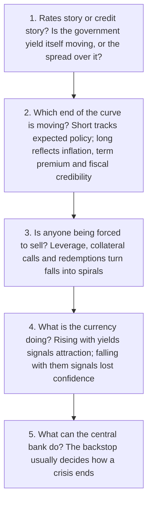

# Lesson 8: Reading the Market Yourself

*A translation table for the jargon, five questions that decode almost any bond story, and a reading list with a routine for using it.*

---

## Decoding bond headlines

Financial journalism uses a compressed vocabulary that assumes you already know the mechanism. You now do. Here is the translation.

| The headline says | It means |
| --- | --- |
| **"Yields jumped 15 basis points"** | Bond prices fell, and borrowing just got more expensive across the economy |
| **"The curve steepened"** | Long-term yields rose relative to short-term ones, often on inflation or government-debt worries |
| **"The curve flattened"** | The gap narrowed, usually as short rates rose toward long ones during tightening |
| **"The curve inverted"** | Short-term yields are above long-term ones, because markets expect rate cuts in a slowdown |
| **"Spreads widened"** | Investors want more to lend to companies, a sign of rising default fears |
| **"Flight to safety"** | Frightened investors are buying government bonds, pushing their yields down |
| **"The auction tailed"** | The government had to pay a higher yield than expected: soft demand for its debt |
| **"Bond vigilantes"** | Investors selling a government's debt to punish policies they see as reckless |
| **"Term premium is rising"** | Investors want more compensation for uncertainty, independent of expected policy rates |
| **"Breakevens widened"** | The market's expected inflation rate went up |
| **"Duration was extended"** | A fund deliberately increased its sensitivity to yields, usually betting they will fall |

---

## Five questions for any bond story

These five, drawn from the episodes in Lesson 6, will decode the overwhelming majority of bond news. Run them in order.

### 1. Is it a rates story or a credit story?

Check whether the government yield *itself* is moving, or the spread over it. The 2011 downgrade, the 2013 taper tantrum and the Austrian bond were rates stories. Lehman and Franklin Templeton were credit and liquidity stories. The distinction tells you which part of Lesson 2's yield stack is in play, and therefore who is affected.

### 2. Which end of the curve is moving?

The **short end** tracks expected central bank rates. If two-year yields are moving, the market is repricing policy: the taper tantrum is the pure case.

The **long end** reflects inflation expectations, the term premium and fiscal credibility. If thirty-year yields are moving while short rates are still, something has changed about long-run confidence rather than about the next policy meeting. The UK in 2022 is the pure case.

### 3. Is anyone being forced to sell?

This is the question that separates a repricing from a crisis, and it is the one most often missed.

Leverage, collateral calls and fund redemptions turn price falls into spirals, because the seller is not choosing to sell. LDI schemes in 2022, the basis trade in 2020 and 2025, and Franklin's funds in 2020 were all forced sellers. When you read that a move was "larger than fundamentals justify," forced selling is usually the answer.

### 4. What is the currency doing?

A currency **rising** alongside yields signals attraction: capital is coming in for the higher return.

A currency **falling** alongside yields signals lost confidence: capital is leaving, and demanding more to stay. This was the UK in 2022 and the US in April 2025, and it is the single most reliable distress signal in the list.

### 5. What can the central bank do?

From Draghi's unused promise, to the Fed in 2008 and 2020, to the Bank of England in 2022: the backstop often decides how a crisis ends. Ask whether the central bank has the tools, the mandate and the credibility to intervene. A central bank that is simultaneously fighting inflation faces a genuine conflict, which is why the Bank of England's 2022 intervention was so uncomfortable: it had to buy gilts while trying to tighten policy.

### Try it on a live one

Run this week's headline through the five: *the US 10-year yield has climbed to 5.29%, its highest since 2002, following the Fed's first rate hike since 2023.*

Rates story, not credit. Both ends of the curve moving, but the long end leading on inflation from the energy shock. No obvious forced sellers so far. The dollar's direction is the thing to check next. And the Fed is tightening, so the backstop is not coming.

---

## The ideas worth keeping

If you retain nothing else from this guide, retain these.

> 1. **A bond is a tradable loan.**
> 2. **Its price and yield move in opposite directions, and long bonds move most.**
> 3. **Government yields are the base price of money** beneath mortgages, company loans and share valuations.
> 4. **Central banks steer the short end of the curve**, while inflation, government borrowing and investor confidence drive the long end.
> 5. **The market is global.** A sell-off in New York can raise borrowing costs in London and Mumbai within days.

With those in place, you can read almost any bond headline and work out what it means.

---

## Where to read next

Use three layers of sources. **Commentators** explain why bond moves matter: the strategic narrative. **Daily news** tells you what happened. **Primary documents** are where the market-moving news actually starts. Paid sources are marked; everything else is free.

### Layer 1: strategic narratives

| Source | Who | Why it is worth your time | Cost |
| --- | --- | --- | --- |
| **FT Alphaville** | Toby Nangle | Especially strong on gilts, the Bank of England and UK pensions. Nangle joined full-time after 25 years in asset management, latterly as global head of asset allocation at Columbia Threadneedle. His focus is how bond markets limit what governments and central banks can do | Paid (FT) |
| **FT Unhedged** | Robert Armstrong | Weekday markets newsletter from a former hedge fund analyst who once edited the FT's Lex column | Paid (premium FT), 30-day trial. **Podcast is free**, Tuesdays and Thursdays with Katie Martin |
| **Points of Return** | John Authers | Daily newsletter from a writer with 29 years at the FT. Excellent at placing bond moves in historical context | Paid (Bloomberg) |
| **Odd Lots** | Weisenthal and Alloway | One of the best free ways to understand market plumbing: repo, auctions, the basis trade. Usually with a practitioner as guest | **Free** |
| **Apollo's Daily Spark** | Torsten Slok | Chart-driven and data-first, often on rates, credit and the Fed. Subscribe at apollo.com/daily-spark. Note Apollo is a major private credit firm, which colours the framing | **Free** |
| **Follow the Money** | Brad Setser | Senior fellow at the Council on Foreign Relations, former US Treasury official. The place to understand *who is buying government debt and why*, the question behind every "Sell America" headline | **Free** |
| **Buttonwood** | The Economist | Weekly finance column explaining market themes in plain English | Paid |
| **Asset manager research** | PIMCO, BlackRock, J.P. Morgan AM | PIMCO's cyclical and secular outlooks; BlackRock Investment Institute's weekly commentary; J.P. Morgan's quarterly *Guide to the Markets* chartbook. Excellent for seeing how professionals frame things, written partly to win clients | **Free** |
| **BIS Quarterly Review** | Bank for International Settlements | March, September and December. Market developments plus analytical articles | **Free** |
| **IMF Global Financial Stability Report** | IMF | April and October. Maps where the system's vulnerabilities sit | **Free** |

The BIS and IMF publications are the most rigorous narratives available anywhere, written by central bankers for central bankers, and they are free. They are also the least read of anything on this list.

### Layer 2: the daily news flow

- **Reuters**: the markets desk covers US, UK and Indian bonds every day, free. Bloomberg, the FT and the Wall Street Journal go deeper if you subscribe.
- **Trading Economics**: its 10-year yield page for each country pairs a chart with a short daily note explaining the move. The India page recently attributed a rise to 7.14% to the US Treasury sell-off, high crude prices and heavy government borrowing.
- **India's financial press**: Business Standard, Mint, The Economic Times and NDTV Profit cover RBI decisions, auctions and foreign flows closely.

### Layer 3: primary sources, where bond news starts

**United States**

- **Federal Reserve**: FOMC statements, minutes, and the quarterly "dot plot" of rate projections.
- **US Treasury quarterly refunding**: announced in February, May, August and November. It sets how much the government will borrow and at which maturities, which makes it a major driver of long-term yields.
- **New York Fed's Liberty Street Economics** and the **St Louis Fed's FRED**: the blog explains market mechanics accessibly; FRED is a free data site that lets you chart any yield yourself.

**United Kingdom**

- **Bank of England**: the Monetary Policy Summary and minutes, the Monetary Policy Report, the Financial Stability Report, and the Bank Underground staff blog.
- **Debt Management Office** (dmo.gov.uk): the gilt auction calendar, auction results, and the annual financing remit showing how many gilts will be sold at each maturity.
- **Office for Budget Responsibility** and the **Institute for Fiscal Studies**: their verdicts on fiscal plans shape how gilt investors judge credibility, which was the core lesson of 2022.

**India**

- **Reserve Bank of India** (rbi.org.in): policy statements, MPC minutes, auction press releases, the monthly Bulletin's *State of the Economy* article, and the Financial Stability Report.
- **CCIL research** (ccilindia.com): a daily market report, a weekly update, and the monthly flagship newsletter *Rakshitra*. The most underused free resource on Indian bonds.
- **NSDL's FPI Monitor**: daily data on foreign portfolio investment in Indian debt, including under the Fully Accessible Route. This is how you track index-related flows.
- **The government's borrowing calendar**: a half-yearly auction schedule announced in March and September, setting the supply the market must absorb.

### Five things to read first

1. **BIS Quarterly Review, September 2025**: includes boxes on why markets recovered so quickly after the April 2025 tariff shock and on the safe-haven properties of US Treasuries. A natural sequel to Lesson 6's final episode.
2. **MUFG Americas, "Drifting, Loudly" (August 2026)**: a bank research report arguing the bond vigilantes are back and that long-dated Treasury yields are stepping up over several years. A live strategic narrative you can test against events.
3. **Bank of England September 2026 minutes**: the committee's reasoning on a multi-year QT plan, including the case for fully unwinding its remaining QE gilt holdings.
4. **CCIL, "An Analysis of Government Borrowing Calendars"**: how India funds itself. It notes that the share of G-secs maturing beyond 15 years rose from 29% in FY07 to 40% in FY25, showing how much India relies on long-term domestic buyers such as insurers.
5. **Capital Group's 2026 bond outlook**: read this as a lesson in how narratives break. Written in December 2025, it described a bond market entering 2026 with tailwinds including Fed rate cuts, and market pricing then implied a policy rate easing to about 3.1% by December 2026. Instead the Fed *raised* to 3.75%–4.00% in September.

### A routine

| Cadence | What to do |
| --- | --- |
| **Daily, 10 minutes** | Check the US, UK and Indian 10-year yields. Read one newsletter, Unhedged, Points of Return or the Daily Spark |
| **Weekly** | One Odd Lots or Unhedged episode, Alphaville's latest gilt pieces, and skim CCIL's weekly update |
| **Around big events** | Read the Fed, Bank of England or RBI statement *yourself*, before anyone's interpretation. Next on the calendar: the RBI's 5–7 October meeting and the Bank of England's 5 November decision |
| **Quarterly** | The BIS Quarterly Review, the IMF stability report, and one or two asset manager outlooks |

---

## One habit that matters more than any source

When you read a strategic narrative, ask two questions: **what evidence would prove it wrong**, and **who benefits if you believe it?**

Banks, asset managers and private credit firms all publish genuinely excellent analysis. Each also has something to sell. A firm with a large book of long-duration assets has a reason to expect falling yields; a private credit firm has a reason to emphasise the shortcomings of public bond markets. None of this makes the analysis dishonest, and dismissing it would cost you a great deal of insight. It simply means the framing is never neutral.

The best practice is to find two views that disagree, and check both against the primary data. That is what Layer 3 is for.

---

Lesson 9 restates the whole guide as a sequence of figures, one per idea.
