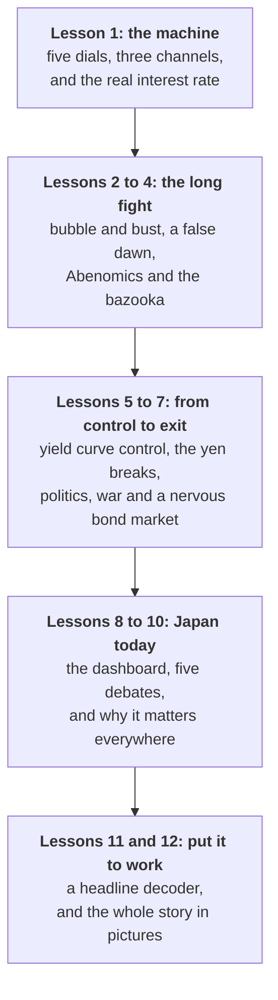

# The Land of the Rising Rates

*An intuitive guide to Japan's economy: how a generation of falling prices turned it into the world's macroeconomic laboratory, and why its exit from that era now moves markets everywhere.*

---

## Why Japan, and why now

On 18 September 2026 the Bank of Japan raised its policy interest rate to **1.25%**, the highest since 1995. In most countries that would barely make the evening news. In Japan it marks the end of an era. From 1995 until December 2025 the Bank of Japan's policy rate never rose above 0.5%, and for most of that time it sat at zero or below.

Those three decades turned Japan into the world's macroeconomic laboratory. Zero interest rates, quantitative easing, negative interest rates and direct control of long-term bond yields were all tried in Japan first, or pushed further there than anywhere else. When America, Britain and the eurozone reached for the same tools after 2008, they were walking a path Tokyo had already mapped, dead ends included.

And Japan is a financial superpower hiding in plain sight. Its households, banks, insurers and pension funds own trillions of dollars of foreign assets. Japan is the largest foreign holder of US government debt. For years cheap yen loans funded speculative bets across the world. When Japanese interest rates move, money moves everywhere: on 5 August 2024, days after a small Bank of Japan rate rise, Tokyo's Nikkei index fell 12.4% in a single session, and the shock rippled from New York to London.

### Five puzzles

The best way into the story is through five things that should not be true.

| # | The puzzle | Where it is solved |
| --- | --- | --- |
| 1 | Japan's government owes about twice the size of its whole economy, yet for most of the past 25 years it borrowed more cheaply than almost any government on earth. | [Lessons 1](?slug=japan-economy&lesson=lesson-01-the-machine) and [9](?slug=japan-economy&lesson=lesson-09-the-big-debates) |
| 2 | Its stock market peaked in December 1989 and did not regain that level until February 2024, a wait of 34 years. | [Lessons 2](?slug=japan-economy&lesson=lesson-02-bubble-bust-and-deflation) and [6](?slug=japan-economy&lesson=lesson-06-the-yen-breaks) |
| 3 | The yen is famous as a safe haven that rises when the world panics, yet in 2024 and again in 2026 it sank to its weakest against the dollar in about forty years. | [Lessons 3](?slug=japan-economy&lesson=lesson-03-false-dawn-and-the-super-yen), [6](?slug=japan-economy&lesson=lesson-06-the-yen-breaks) and [9](?slug=japan-economy&lesson=lesson-09-the-big-debates) |
| 4 | Japan's "lost decades" brought stagnant prices and wages, but never mass unemployment, which peaked at about 5.5%. | [Lessons 1](?slug=japan-economy&lesson=lesson-01-the-machine), [2](?slug=japan-economy&lesson=lesson-02-bubble-bust-and-deflation) and [5](?slug=japan-economy&lesson=lesson-05-yield-curve-control) |
| 5 | When the Bank of Japan raised rates in September 2026, the yen fell instead of rising. | [Lesson 7](?slug=japan-economy&lesson=lesson-07-politics-war-and-a-nervous-bond-market) |

Each puzzle has an explanation, and together the explanations form a single story: a country that spent a generation fighting falling prices, used ever more radical tools to do it, and is now discovering that winning brings problems of its own. A weak currency, squeezed real wages and a bond market that has started to worry about government debt.

> **Three ideas unlock almost everything.**
>
> 1. **In Japan, the nominal number is the story.** For twenty years the economy, wages and tax receipts barely grew in yen, because modest real growth was cancelled out by gently falling prices. Escaping that trap, and the new problems that escaping it creates, is what every era in this guide is about.
> 2. **The real interest rate, not the headline rate, decides whether money is tight or loose.** A 0% rate with prices falling 1% a year is tight money. A 1.25% rate with inflation near 2% is still loose.
> 3. **The yen is driven above all by the gap between American and Japanese interest rates.** Learn to ask "what does this do to the gap?" and most Japanese market headlines decode themselves.

### What you will be able to do at the end

- Explain the five dials of Japan's economy (growth, inflation, interest rates, the yen and the bond market) and trace how turning one moves the others.
- Tell the story of Japan from the 1985 Plaza Accord to the 2026 rate hikes, and say what problem each policy was trying to solve.
- Work out a real interest rate, the effect of the yen on an exporter's profits, the arithmetic of a carry trade and the arithmetic of government debt.
- Judge the five big debates about Japan today: whether deflation is dead, whether the state can afford normal rates, why the yen is so weak, whether households are winning, and whether a shrinking country can keep growing.
- Explain why Japanese decisions move bond yields, currencies and stock markets in America, Europe and Asia.
- Decode a Japanese economic headline and know which data release to check next.

### Who it is for

Anyone who reads the business pages and wants Japan to stop being a puzzle, and anyone who works in or near financial markets and keeps hearing that "the BOJ" or "the yen carry trade" moved something they care about. No economics is assumed. There is no code, and the only arithmetic is arithmetic you can do on a calculator.

---

## How the guide is built

**A model first, then the story.** Lesson 1 builds a simple machine of five dials and three channels. Lessons 2 to 7 then tell the story in six eras, and each era opens with **what was pressing**: the problem policymakers were wrestling with at the time, because Japan's choices only make sense in their context. Lessons 8 to 11 bring you to today: the current numbers, the big debates, the global spillovers and a decoder for the headlines.

**Every figure is drawn from data.** The charts are computed from official series published by the Bank of Japan, the Ministry of Finance, the Statistics Bureau of Japan, the Cabinet Office, the IMF, the BIS, the US Treasury and the Federal Reserve, and each one names its source.

Each lesson ends with a few **Check yourself** questions. The answers stay hidden until you open them, and most involve a number you can work out before you look.

---

## The lessons

### 1. [The Machine: Five Dials and How They Connect](lesson-01-the-machine.md)

Growth, inflation, interest rates, the yen and the bond market. Why nominal GDP is the heart of the story, why falling prices are a trap, what a central bank does when rates hit zero, why the yen must be read backwards, and why a debt mountain did not cause a crisis.

### 2. [1985 to 2005: The Bubble, the Bust and the Birth of Deflation](lesson-02-bubble-bust-and-deflation.md)

The Plaza Accord, cheap money and a land bubble in which the Imperial Palace grounds were said to be worth more than California. Then the bust, zombie banks, a premature tax rise, the world's first zero rates and the world's first quantitative easing.

### 3. [2006 to 2012: False Dawn, Financial Crisis and the Super-Strong Yen](lesson-03-false-dawn-and-the-super-yen.md)

A recovery nobody felt, the carry trade and "Mrs Watanabe", a crisis that hit Japan harder than the countries that caused it, a yen at 75 to the dollar, and the earthquake that ended Japan's era of dependable trade surpluses.

### 4. [2012 to 2016: Abenomics and the Bazooka](lesson-04-abenomics-and-the-bazooka.md)

Three arrows, a 2% target and "2 in 2": the biggest monetary experiment ever run by a major central bank. Why markets moved before the policies did, how a tax rise stalled the recovery, and why negative rates backfired.

### 5. [2016 to 2021: Yield Curve Control and the Long Grind](lesson-05-yield-curve-control.md)

From buying a quantity to fixing a price: how the BOJ pinned the 10-year yield near zero, why a tight labour market still did not lift prices, and how the central bank came to own half the bond market.

### 6. [2022 to 2024: The World Inflates and the Yen Breaks](lesson-06-the-yen-breaks.md)

The rate gap explodes, the yen falls to 160, yield curve control comes under siege, wages finally break out, negative rates end, the Nikkei beats its 1989 record, and the carry trade snaps in a single day.

### 7. [2025 to 2026: Politics, War and a Nervous Bond Market](lesson-07-politics-war-and-a-nervous-bond-market.md)

Rice, tariffs and a bond tantrum; Japan's first female prime minister and a two-thirds majority; a food tax cut; war in the Gulf; the BOJ at 1.25%; the 10-year yield at 3%; and the first joint US-Japanese yen intervention in a generation.

### 8. [Japan Today: The Dashboard](lesson-08-the-dashboard.md)

Every key reading in one place, what each one tells you, and the two most important prices in Japanese finance in twenty-year context.

### 9. [The Big Debates](lesson-09-the-big-debates.md)

Is deflation really dead? Can Japan afford normal interest rates? Why is the yen still so weak? Are households winning or losing? Can a shrinking country keep growing?

### 10. [Why It Matters Beyond Japan](lesson-10-beyond-japan.md)

The savings tide, the carry trade, competition and capital, and Japan as a preview of everyone's future.

### 11. [Reading the Headlines](lesson-11-reading-the-headlines.md)

Two questions that decode most Japanese economic news, the releases that matter and when they come out, a translation table for common headlines, and a weekly routine.

### 12. [Japan in Pictures](lesson-12-japan-in-pictures.md)

The whole story retold as a sequence of figures, each captioned with what to notice and linked to the lesson that teaches it, ending with the five puzzles solved.

### [Timeline](timeline.md)

Forty years of turning points, newest first.

### [Glossary](glossary.md)

Every term the guide uses, in a sentence, linked to the lesson that explains it.

---

## A note on the numbers

Every worked example has been checked and the arithmetic is shown, so you can check it too. Figures quoted as current reflect **early October 2026**. Markets move daily, so treat them as a snapshot of a particular month; the mechanisms do not change when the numbers do, which is why the guide teaches the mechanism first and the number second.

Two conventions are worth knowing. Exchange rates in the charts are the Federal Reserve's noon rates in New York, so intraday extremes reported in the news (such as "almost 152" in October 2022) can be a yen or two beyond them. Japanese government bond yields are the Ministry of Finance's end-of-day constant-maturity series, which can differ by a few hundredths of a percentage point from the yields on individual benchmark bonds quoted by news agencies.

This guide pairs well with two others on the site. The [bond guide](?slug=global-bond-markets&lesson=lesson-01-anatomy-and-the-seesaw) explains yields, the yield curve and duration from first principles, and the [commodity guide](?slug=commodity-markets&lesson=lesson-11-the-new-fault-lines) tells the story of the 2026 Hormuz crisis that has shaped Japan's year.
