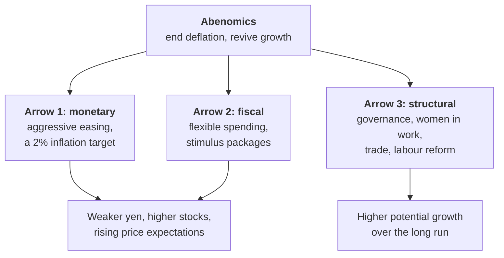

# Lesson 4: 2012 to 2016, Abenomics and the Bazooka

*A new government that decided deflation was a monetary problem, a central bank governor who promised to fix it in two years, and the biggest monetary experiment a major central bank had ever run.*

---

## What was pressing

Two decades of deflation, a crippling yen and a widespread fear that Japan was in irreversible decline. The new government's diagnosis was blunt: deflation was, at heart, a monetary problem, and the central bank had not tried hard enough.

---

## Three arrows

Shinzo Abe's programme, quickly dubbed **Abenomics**, had three "arrows". The name comes from a Japanese parable in which a feudal lord shows his sons that a single arrow snaps easily but three bound together cannot be broken.

Markets moved before a single policy took effect.

<svg viewBox="0 0 680 340" width="100%" role="img" aria-label="Line chart, indexed to 14 November 2012 = 100, of the Nikkei 225 and of the number of yen per dollar, daily to the end of 2015. The day an election was called, the dollar bought about 80 yen. By May 2013, before most of the new policies had taken effect, the Nikkei index stood at about 180, up about 80%, and the dollar bought about 29% more yen. By late 2015 the Nikkei had roughly doubled and the dollar bought about 50% more yen." fill="none" xmlns="http://www.w3.org/2000/svg">
<text x="20" y="28" font-size="14" fill="currentColor" font-weight="600">Markets moved before the policies did</text>
<text x="20" y="45.5" font-size="11.5" fill="currentColor" opacity="0.72">Daily, 14 November 2012 (election called) = 100</text>
<line x1="70" y1="290" x2="590" y2="290" stroke="currentColor" stroke-width="1" stroke-opacity="0.12"/>
<text x="62" y="294" font-size="11" fill="currentColor" text-anchor="end" opacity="0.72" style="font-variant-numeric:tabular-nums">80</text>
<line x1="70" y1="262.5" x2="590" y2="262.5" stroke="currentColor" stroke-width="1" stroke-opacity="0.45"/>
<text x="62" y="266.5" font-size="11" fill="currentColor" text-anchor="end" opacity="0.72" style="font-variant-numeric:tabular-nums">100</text>
<line x1="70" y1="235" x2="590" y2="235" stroke="currentColor" stroke-width="1" stroke-opacity="0.12"/>
<text x="62" y="239" font-size="11" fill="currentColor" text-anchor="end" opacity="0.72" style="font-variant-numeric:tabular-nums">120</text>
<line x1="70" y1="207.5" x2="590" y2="207.5" stroke="currentColor" stroke-width="1" stroke-opacity="0.12"/>
<text x="62" y="211.5" font-size="11" fill="currentColor" text-anchor="end" opacity="0.72" style="font-variant-numeric:tabular-nums">140</text>
<line x1="70" y1="180" x2="590" y2="180" stroke="currentColor" stroke-width="1" stroke-opacity="0.12"/>
<text x="62" y="184" font-size="11" fill="currentColor" text-anchor="end" opacity="0.72" style="font-variant-numeric:tabular-nums">160</text>
<line x1="70" y1="152.5" x2="590" y2="152.5" stroke="currentColor" stroke-width="1" stroke-opacity="0.12"/>
<text x="62" y="156.5" font-size="11" fill="currentColor" text-anchor="end" opacity="0.72" style="font-variant-numeric:tabular-nums">180</text>
<line x1="70" y1="125" x2="590" y2="125" stroke="currentColor" stroke-width="1" stroke-opacity="0.12"/>
<text x="62" y="129" font-size="11" fill="currentColor" text-anchor="end" opacity="0.72" style="font-variant-numeric:tabular-nums">200</text>
<line x1="70" y1="97.5" x2="590" y2="97.5" stroke="currentColor" stroke-width="1" stroke-opacity="0.12"/>
<text x="62" y="101.5" font-size="11" fill="currentColor" text-anchor="end" opacity="0.72" style="font-variant-numeric:tabular-nums">220</text>
<line x1="70" y1="70" x2="590" y2="70" stroke="currentColor" stroke-width="1" stroke-opacity="0.12"/>
<text x="62" y="74" font-size="11" fill="currentColor" text-anchor="end" opacity="0.72" style="font-variant-numeric:tabular-nums">240</text>
<text x="94.3" y="308" font-size="10.5" fill="currentColor" text-anchor="middle" opacity="0.72">2013</text>
<text x="256.2" y="308" font-size="10.5" fill="currentColor" text-anchor="middle" opacity="0.72">2014</text>
<text x="418.1" y="308" font-size="10.5" fill="currentColor" text-anchor="middle" opacity="0.72">2015</text>
<text x="580" y="308" font-size="10.5" fill="currentColor" text-anchor="middle" opacity="0.72">2016</text>
<polyline points="73.1,262.5 73.5,260.9 74,260.6 75.3,260.8 75.7,259.9 76.2,258.8 77.1,258.8 78.4,259.2 78.8,259 79.3,259.7 79.7,259.3 80.2,258.5 81.7,259 82.1,259.7 82.6,258.7 83,258.9 83.5,258.8 84.8,258.8 85.2,258.7 85.7,257.5 86.1,256.8 86.6,256.8 87.9,256.5 88.3,256 88.8,255.4 89.2,255.4 89.7,255.8 91,254.6 91.9,253.2 92.3,252.5 92.8,252.4 94.1,251.5 94.7,250.7 95.2,251 95.6,248.9 96.9,249.7 97.4,250.3 97.8,249.3 98.3,248.9 98.7,247 100.1,246.8 100.5,248 100.9,248 101.4,246.7 101.8,245.9 103.6,248.1 104,248.4 104.5,245.6 104.9,243.9 106.3,244.4 106.7,244.6 107.1,243.9 107.6,243.5 107.8,241.3 109.1,241.3 109.6,240 110,239.6 110.4,240.1 110.9,241 112.2,239.8 112.7,240.3 113.1,239.9 113.5,240.4 114,239.5 115.8,239.6 116.2,239.6 116.6,240.6 117.1,240 118.4,240 118.9,243.3 119.3,242.5 119.8,241.7 121.3,239.9 122.6,240 123,239.9 123.5,239.5 123.9,237.1 124.4,235.4 125.7,235.2 126.1,235.5 126.6,235.4 127,235.1 127.5,236.7 128.8,237.3 129.3,237.4 129.7,236.3 130.1,237 130.6,238 131.9,238.3 132.4,238.5 132.8,238.2 133.2,238.8 133.7,238.6 134.8,240 135.2,239.8 135.6,240.6 136.1,235.2 136.5,233.9 137.9,230.4 138.3,230.2 138.8,229.2 139.2,229.5 139.6,230.3 141,232 141.4,232.2 141.9,232.4 142.3,231.6 142.7,229.8 144.1,229.8 144.5,229.5 145,229.6 145.4,229.5 145.9,232.3 147.2,231.8 147.6,232.8 148.3,233.2 148.7,232.1 149.1,230.1 150.5,229.7 150.9,230.3 151.4,230.4 151.8,229.8 152.2,225.6 153.6,225.4 154,224.8 154.5,224.4 154.9,224.7 155.4,223.4 156.7,224.2 157.1,224.5 157.6,222.5 158,225.7 158.5,226.9 160.2,225 160.7,227 161.1,226.7 161.6,227.1 162.6,230 163.1,228.3 163.5,230 164,232.4 164.4,233.4 165.7,230.5 166.2,234 166.6,236.5 167.1,238.3 167.5,238.3 168.8,237.3 169.3,236.8 169.7,236.7 170.2,231.7 170.6,232.9 171.9,232.5 172.4,232.2 172.8,233 173.3,231.3 173.7,229.9 175.2,229.2 175.7,227.8 176.1,228.9 177,226.9 178.3,226.7 178.8,226.7 179.2,228.4 179.7,230.6 180.1,229.6 181.4,228.5 181.9,229.6 182.3,229.1 182.8,227.5 183.2,228 184.6,229.2 185,229 185.4,228.2 185.9,229.3 186.3,231.6 187.7,232.3 188.1,231.9 188.5,231.4 188.7,229.8 189.2,230.2 190.5,231.1 190.9,232.2 191.4,234.2 191.8,235.4 192.3,235 193.6,234.7 194.1,231.9 194.5,231.7 194.9,232.3 195.4,232.7 196.7,232.1 197.2,233.5 197.6,232.6 198,231.1 198.5,231 199.8,230.9 200.3,233.2 200.7,232.6 201.2,231.2 201.6,231.6 203.1,229.5 203.6,229.2 204,228.4 204.4,230.2 205.8,229.3 206.2,228.2 206.7,228.4 207.1,229.9 207.5,229.6 208.9,230.3 209.3,230 209.8,230.2 210.2,229.7 210.7,229.6 212,230.7 212.4,230.7 212.9,230.9 213.3,230.4 213.8,231.5 215.1,231.5 215.7,231.9 216.2,233.1 216.6,233.6 217,233.4 218.4,233.7 218.8,233.8 219.3,233.3 219.7,231.8 220.2,231.3 221.9,231 222.4,230.4 222.8,232.2 223.3,232.4 224.6,231.7 225,231.7 225.5,233.2 225.9,233.1 226.4,232.9 227.7,232.5 228.1,231.8 228.6,231.7 229,231.8 229.2,230.6 230.5,230.9 231,231 231.4,231 231.9,231 232.3,230.2 234.1,229.2 234.5,229.7 235,228.7 235.4,228.3 236.7,228.5 237.2,228.3 237.6,228.5 238.1,226.9 238.5,226.3 239.9,225.6 240.3,226.2 240.7,224.8 241.6,224.4 243.1,223.3 243.6,224.5 244,224.3 244.5,225.4 244.9,223.6 246.2,223 246.7,223.8 247.1,224.5 247.6,223.2 248,222.9 249.4,223.6 249.8,224 250.2,223.1 250.7,221.4 251.1,221.6 252.5,221.6 252.9,221.2 253.8,220.5 254.2,219.9 255.6,220 256,219.6 256.6,220.3 257.1,220.9 258.4,221 258.9,220.8 259.3,220.2 259.7,220.4 260.2,221.6 261.5,222.9 262,222 262.4,221 262.8,221.1 263.3,221.1 265.1,221.5 265.5,221.1 265.9,222.3 266.4,224.4 267.7,224.7 268.2,223.8 268.6,224.8 269.1,223.7 269.5,224.6 270.6,226.7 271,225.8 271.5,226.2 271.9,225.4 272.3,224.6 273.7,224.9 274.1,224 274.6,224.3 275,224.8 275.4,225.4 277.2,224.6 277.7,224.6 278.1,224.6 278.6,223.9 279.9,224.4 280.3,224.8 280.8,224.5 281.2,224.9 281.7,225 284.1,226.2 284.5,224.8 284.9,224.6 285.4,223.4 285.8,222.8 287.2,223 287.6,223.1 288.1,223.9 288.5,224.9 288.9,226.1 290.3,225.8 290.7,226.2 291.2,225.9 291.6,224.5 292,224.5 293.4,224.8 293.8,224.6 294.3,224.6 294.7,225 295.2,223.5 296.5,223.4 296.7,222.5 297.1,222 297.6,221.8 298,222.7 299.3,223.3 299.8,224.9 300.2,225.4 300.7,226.1 301.1,225.9 302.4,225.5 302.9,225.8 303.3,224.6 303.8,224.7 304.2,224.4 305.5,224.2 306,224.1 306.4,224.7 306.9,224.5 307.3,224.9 308.6,224.3 309.1,224.1 309.5,224.9 310.2,224.6 310.6,224.5 311.9,225 312.4,225.9 312.8,225.6 313.3,225.7 313.7,225.6 315,225 315.5,224.8 315.9,225.6 316.4,226.1 316.8,226 318.1,226.4 318.6,226.4 319,226.1 319.5,225.5 319.9,225.3 321.7,224.9 322.1,225.5 322.6,225.8 323,225.5 324.1,224.6 324.5,224.4 325,223.9 325.4,224.4 325.9,224.3 327.2,224.2 327.6,224.5 328.1,225.2 328.5,225.4 329,225 330.3,225.4 330.7,224.8 331.2,224.9 331.6,225.4 332.1,224.9 333.4,225.3 333.9,224.9 334.3,225.6 334.7,225.7 335.2,226.2 336.5,226.4 337.1,226 337.6,225.5 338,224.8 339.8,225.4 340.2,225.9 340.7,225.6 341.1,226.4 341.6,226.3 342.9,225.8 343.4,225.8 343.8,225.7 344.2,226.3 344.7,226.2 346,226.3 346.5,225.9 346.9,226 347.3,225.4 347.8,225.5 349.1,225.4 349.6,224.9 350,223.6 350.5,223.8 350.6,224.4 352,224.3 352.4,223.8 352.9,224.5 353.3,225 353.7,225.3 355.1,224.9 355.5,224.7 356,224.3 356.4,224.4 356.8,224.8 358.2,224.2 358.6,223.7 359.1,222.8 359.5,222.1 359.9,221.7 361.3,221.8 361.7,221.5 362.2,221.7 362.6,222.1 363.1,221.7 364.6,219.8 365,220.2 365.5,219.6 365.9,220.1 367.2,218.9 367.7,217.7 368.1,217 368.6,216.8 369,216.1 370.3,216.2 370.8,216.7 371.2,215.6 371.7,213.7 372.1,213.2 373.4,213.3 373.9,213.4 374.3,213.3 374.8,213.6 375.2,212.6 376.5,212.5 377,212 377.6,212.6 378.1,214.7 378.5,211.9 379.8,213 380.3,214.3 380.7,214.1 381.2,214.8 381.6,215.1 383.4,216.3 383.8,218.2 384.3,218.3 384.7,217 386,216.8 386.5,217.1 386.9,216 387.4,214.6 387.8,214.7 389.2,215.3 389.6,214.8 390,214.7 390.5,213.2 390.9,207.8 392,204.7 392.4,205.5 392.9,203.5 393.3,203.1 393.8,203.3 395.1,203.2 396,202.1 396.4,201.8 396.9,200.2 398.2,200.4 398.7,199.8 399.1,198.2 399.5,197.5 400,198.1 401.3,197 401.8,197.7 402.2,198.4 403.1,196.5 404.6,197.5 405,195.8 405.5,194.6 405.9,194.8 406.4,191.9 407.7,192.7 408.2,196.2 408.6,196.8 409,195.3 409.5,197.3 410.8,198.1 411.3,198.9 411.7,198.3 412.1,196.3 412.6,195 413.9,194.5 414.4,193.1 414.8,193.5 417,193.3 417.5,195.4 417.9,194.5 418.5,193.9 419.9,194.9 420.3,197.2 420.8,195.1 421.2,195.1 421.6,196.6 423,197.1 423.4,197.4 423.9,199.8 424.3,199.5 424.7,198.6 426.5,196.9 427,197.9 427.4,197.8 427.9,198 429.2,197 429.6,198.3 430.1,198.1 430.5,197.2 431,198.7 432,198.8 432.5,198.6 432.9,198.4 433.4,198.7 433.8,195.7 435.1,196.5 435.6,195.4 436,193.6 436.5,196.5 436.9,196.5 438.7,196 439.1,195.7 439.6,196.3 440,196.5 441.3,196.2 441.8,195.8 442.2,196.2 442.7,195.4 443.1,194.7 445.5,194.2 446,195.2 446.4,194.7 446.9,193.9 447.3,192.7 448.6,192.3 449.1,192.2 449.5,191.7 450,192.1 450.4,192.3 451.7,192 452.2,192.1 452.6,192.7 453.1,192.7 453.5,193.8 454.8,194.7 455.3,194.4 455.7,195.3 456.2,196 456.6,195.7 457.9,194.1 458.4,194.3 458.6,194.9 459,194.7 459.5,196 460.8,195.9 461.2,193.6 461.7,194.3 462.1,193.7 462.6,193.8 463.9,193.7 464.3,195.5 464.8,195.6 465.2,195.7 465.7,195.9 467,195.5 467.4,195.2 467.9,194.4 468.3,194.8 468.8,196 470.1,195.8 470.5,196.3 471,196.3 471.4,194.5 472.1,193.9 473.4,193.8 473.8,194.5 474.3,195.3 474.7,194.7 475.2,194.6 476.5,194.2 476.9,194.6 477.4,195.8 477.8,195.6 478.3,195.4 479.6,194.6 480,193.3 480.5,192.1 480.9,192.4 481.4,191.8 483.2,189 483.6,187.8 484,187.1 484.5,187.4 485.6,186.3 486,187.1 486.4,187.3 486.9,186.4 487.3,184.7 488.7,185.6 489.1,187.1 489.5,189.6 490,188.1 490.4,188.7 491.8,188.5 492.2,188.5 492.7,187 493.1,189.3 493.5,189.6 494.9,188.6 495.3,187.9 495.8,187 496.2,188 496.6,187.5 498,190 498.4,190.7 499,189.1 499.5,188.9 501.3,189.9 501.7,190.6 502.2,193.3 502.6,192.2 503,189.5 504.4,188.5 504.8,188.5 505.3,187.6 505.7,187.3 506.1,187.4 507.5,187 507.9,187.5 508.4,187.3 508.8,187.6 509.2,187.9 510.6,188.7 511,188.2 511.5,187.6 511.9,186.8 512.4,187.5 513.4,187.4 513.9,187.4 514.3,186 514.8,186.4 515.2,186.9 516.5,186.5 517,185.9 517.4,187.6 517.9,186.9 518.3,186.9 519.6,186.8 520.1,186.7 520.5,187.2 521,188.2 521.4,190.6 522.7,196.7 523.2,194.4 523.6,195.9 524.1,192.7 524.5,192 525.8,192.1 526,194.4 526.5,194.3 526.9,193.9 527.4,195.9 529.1,194.7 529.6,192.7 530,193 530.5,193.1 531.8,194.4 532.2,193.8 532.7,193.2 533.1,192.7 533.6,194.5 534.9,193.5 535.3,194.2 535.8,194.1 536.2,195.1 536.7,193 538,194.6 538.5,194.7 538.9,194.6 539.5,195 540,195.3 541.3,193.6 541.7,194 542.2,194.4 542.6,194.4 543.1,193.8 544.8,194.6 545.3,195.6 545.7,197.2 546.2,195 547.5,195.1 548,194.6 548.4,194.4 548.8,193.4 549.3,192.2 550.6,192.8 551.1,193.8 551.5,193.3 551.9,192.3 552.4,193.1 553.5,193.1 553.9,192.2 554.3,191.7 554.8,191.3 555.2,188.8 556.6,189.1 557,188.7 557.9,189.4 558.3,189.2 559.7,188.9 560.1,188.3 560.6,188.2 561,189.6 561.4,189.5 562.8,189.1 563.2,190 563.7,189.6 564.5,189.4 565.9,188.7 566.5,189.3 567,188.2 567.4,189 567.8,188.9 569.2,188.6 569.6,189.1 570.1,191.1 570.5,191.8 570.9,192.7 572.3,193.3 572.7,191.4 573.2,191 573.6,189.5 574,192.2 575.4,192.6 575.8,192.7 576.3,192.7 576.7,193.7 578.5,193.8 578.9,193.5 579.4,193.2 579.8,193.8" class="vs7" stroke="#4a3aa7" stroke-width="1.8" stroke-linejoin="round" stroke-linecap="round" fill="none"/>
<polyline points="73.1,262.5 73.5,259.9 74,256.8 75.3,254.7 75.7,254.9 76.2,253.6 76.6,251.4 78.4,251 78.8,250.5 79.3,252.3 79.7,250.8 80.2,250.1 81.7,249.9 82.1,250.3 82.6,249.7 83,248.5 83.5,248.8 84.8,248.7 85.2,248.8 85.7,248 86.1,245.4 86.6,245.5 87.9,244 88.3,242.5 88.8,238.8 89.2,240.7 89.7,242.3 91.4,240 91.9,237.7 92.3,236.2 92.8,235 95.6,230.4 96.9,231.8 97.4,233.2 97.8,232.1 98.3,231 98.7,228.6 100.5,227.4 100.9,231.8 101.4,231.6 101.8,226.8 103.2,229.4 103.6,230 104,233.6 104.5,231.5 104.9,226.6 106.3,228.2 106.7,227.6 107.1,223.6 107.6,223.2 107.8,222.4 109.1,221.3 109.6,224.7 110,218.1 110.4,219.8 110.9,223 112.7,219.6 113.1,221.5 113.5,220.6 114,222.7 115.3,219 115.8,219.5 116.2,218 116.6,220.5 117.1,219.3 118.4,214.9 118.9,219.1 119.3,221.4 119.8,216.6 121.3,215.8 122.6,215.1 123,214.6 123.5,210.6 123.9,210.1 124.4,205.1 125.7,204 126.1,204.6 126.6,205.8 127,203.5 127.5,200.7 128.8,206.1 129.3,202.1 130.1,199.5 130.6,204.2 131.9,200.9 132.4,202.1 132.8,201.7 133.2,204.2 133.7,203.3 134.8,207.4 135.2,209.5 135.6,203.8 136.1,199.5 136.5,196.3 137.9,190.6 138.3,190.7 138.8,189.1 139.2,185 139.6,186 141,189.3 141.4,190.2 141.9,187.6 142.3,190.2 142.7,188.7 144.1,184.7 144.5,185.3 145,180.3 145.4,179 145.9,179.7 147.6,180 148.3,181 148.7,182.7 150.9,175 151.4,173.3 151.8,174.8 152.2,168.2 153.6,165.4 154,165.8 154.5,160.4 154.9,161.4 155.4,159.8 156.7,156.2 157.1,155.9 157.6,152 158,170.2 158.5,168.1 159.8,175.6 160.2,172.9 160.7,172.7 161.1,184.4 161.6,181.4 162.6,189.5 163.1,185.2 163.5,193.5 164,195.2 164.4,195.6 165.7,185.5 166.2,188.7 166.6,189.1 167.1,202.5 167.5,198.7 168.8,193.2 169.3,193.6 169.7,189.8 170.2,193.5 170.6,190.1 171.9,192.7 172.4,194.2 172.8,196.3 173.3,190.3 173.7,183 175.2,180.2 175.7,176.3 176.1,177 176.6,177.5 177,172.9 178.3,176.1 178.8,170.3 179.2,171.2 179.7,170.3 180.1,169.8 181.9,168.3 182.3,168.1 182.8,165 183.2,168.5 184.6,167.4 185,165.5 185.4,166.2 185.9,168.9 186.3,175.8 187.7,183.2 188.1,179.9 188.5,183.1 188.7,177.7 189.2,170.4 190.5,173.7 190.9,171.5 191.4,180.6 191.8,184.1 192.3,183.9 193.6,185.5 194.1,179.9 194.5,177 194.9,181.8 195.4,183.4 196.7,181.7 197.2,187.4 197.6,187 198,187.9 198.5,183.2 199.8,183.6 200.3,185.1 200.7,188.3 201.2,186.4 201.6,187.5 202.7,184.6 203.1,178.2 203.6,177 204,176.8 204.4,180 205.8,174.6 206.2,171.1 206.7,171.1 207.1,171.7 207.5,171.4 209.3,172.9 209.8,169.8 210.2,165.7 210.7,166.1 212.4,166.2 212.9,168 213.3,165.2 213.8,165.8 215.1,170.6 215.7,170.1 216.2,175.1 216.6,175.3 217,177.4 218.4,180.2 218.8,179.5 219.3,177.2 219.7,174.7 220.2,171.4 221.9,170.8 222.4,170.4 222.8,168.5 223.3,168.9 224.6,166.8 225,166.5 225.5,171.1 225.9,170.1 226.4,176.4 227.7,171.6 228.1,172.7 228.6,169.9 229,172.6 229.2,174.6 231,174.3 231.4,172.5 231.9,174.2 232.3,176.5 233.6,173.6 234.1,168.5 234.5,168.8 235,163.9 235.4,159.3 236.7,159.4 237.2,160 237.6,160.8 238.1,156.2 238.5,155.9 239.9,152.1 240.3,153.8 240.7,154.8 241.2,150.4 241.6,151.5 243.1,151.6 243.6,150.1 244,155.5 244.5,159.1 244.9,157.2 246.2,151.6 246.7,152.3 247.1,153.8 247.6,156.5 248,155.6 249.4,159.5 249.8,157.5 250.2,152.6 250.7,148.3 251.1,148.2 252.9,147.9 253.3,145.9 253.8,143.3 254.2,143.3 255.6,141.5 258.4,147.5 258.9,149 259.3,144.2 259.7,148 260.2,147.5 262,155.3 262.4,149.1 262.8,150.1 263.3,150.3 264.6,151.8 265.1,149.3 265.5,148.9 265.9,150.9 266.4,155.8 267.7,161.9 268.2,162.3 268.6,155.9 269.1,161.9 269.5,163.3 270.6,168 271,177.7 271.5,175 271.9,175.4 272.3,170.5 273.7,166.4 274.6,165.1 275,169.3 275.4,172.9 276.8,171.6 277.2,164.5 277.7,165.7 278.1,170.7 278.6,164.1 279.9,164.5 280.3,161.1 280.8,162.4 281.2,163.2 281.7,164.5 284.1,167.5 284.5,166.4 284.9,163.6 285.4,159.8 285.8,157.6 287.2,160.1 287.6,158.4 288.1,164.7 288.5,164.9 288.9,172.6 290.3,173.4 290.7,171.3 291.2,170.5 291.6,174.3 293.4,170.3 293.8,171.1 294.3,170.3 294.7,168 295.2,166.8 296.5,164.7 296.7,165.3 297.1,162.8 297.6,160.8 298,161 299.3,165 299.8,168.2 300.2,173.1 300.7,173.1 301.1,178.5 302.4,179.3 302.9,177.9 303.3,171.2 303.8,171.2 304.2,169.6 305.5,169.7 306,171.7 306.4,169.2 306.9,171.4 307.3,171 308.6,173.3 309.5,173 310.2,170.1 310.6,170.6 312.8,177.3 313.3,175.2 313.7,174.7 315,175.5 315.5,171.1 315.9,171.4 316.4,173.1 316.8,176.3 318.1,177.7 318.6,176.6 319,177.2 319.5,172.5 319.9,170.5 321.2,168.3 321.7,167.7 322.1,167.2 322.6,167 323,167.8 324.1,163 324.5,161.4 325,160.9 325.4,160.7 325.9,160.7 327.2,160 327.6,162 328.1,160.9 328.5,162.4 329,160.4 330.3,163 330.7,162.3 331.2,160.1 331.6,156.2 332.1,156.4 333.4,156.1 333.9,156 334.3,157.7 334.7,157.1 335.2,160.5 336.5,159.4 337.1,156.8 337.6,156.1 338,156.4 338.5,155 339.8,155.9 340.2,157 340.7,157.2 341.1,158.5 341.6,159.4 342.9,157.3 343.4,155.7 343.8,155.9 344.2,156.1 344.7,158.5 346.5,156.5 346.9,156.8 347.3,157.5 347.8,154.7 349.1,153.6 349.6,152.2 350,151.7 350.5,152.1 350.6,153.7 352,154.4 352.4,156.9 352.9,159.4 353.3,158.3 353.7,165.5 355.1,159.9 355.5,159.4 356,158.6 356.4,157 356.8,156.9 358.2,156.8 358.6,154.8 359.1,154.8 359.5,152.7 359.9,153.4 361.3,152.2 361.7,153.7 362.2,153.5 362.6,154.7 363.1,155.2 364.1,154.4 364.6,151.4 365,150.4 365.5,151.2 365.9,151.4 367.2,150.8 367.7,150.1 368.1,149.4 368.6,147.5 369,146.9 370.8,147.5 371.2,147.9 371.7,145 372.1,141 373.4,142.8 374.3,143.4 374.8,140.2 375.2,142.4 376.5,141.2 377,143.3 377.6,144.8 378.1,151.5 378.5,150.7 379.8,147.8 380.3,149.5 380.7,152.5 381.2,154.4 381.6,157.2 383.4,163 383.8,160.8 384.3,166.1 384.7,169.4 386,160.2 386.5,165.1 386.9,158.9 387.4,159.8 387.8,157.3 389.2,155.8 389.6,156.7 390,153.2 390.5,151.5 390.9,139.5 392.4,132.4 392.9,131.2 393.3,133.5 393.8,132.1 395.1,133.7 395.5,128.3 396,127.1 396.4,124 396.9,122.4 398.2,130.6 398.7,124.8 399.1,125.6 399.5,125.5 400,124.6 401.8,123.8 402.2,124.1 402.6,126.3 403.1,122.9 404.6,120.9 405,119.7 405.5,118.8 405.9,116.1 406.4,115.6 407.7,115.4 408.2,117.3 408.6,123.7 409,126.1 409.5,124.3 410.8,128.7 411.3,134.1 411.7,133.1 412.1,126.9 412.6,120.4 413.9,120.1 414.8,116.7 415.2,117.4 415.7,117.2 417,118.6 417.5,123.1 419.9,123.7 420.3,132.1 420.8,132 421.2,127.6 421.6,127.1 423.4,128.8 423.9,133.5 424.3,128.5 424.7,132.4 426.1,130 426.5,124.4 427,125.8 427.4,125 427.9,122.1 429.2,122.8 429.6,118 430.1,117.6 430.5,120.6 431,119.5 432,121.4 432.5,124.9 432.9,119.5 433.4,122.2 433.8,119.9 435.1,118.9 435.6,119.9 436.5,114.7 436.9,115.7 438.2,114.3 438.7,114.6 439.1,111.2 439.6,110.2 440,109.1 441.3,106.9 441.8,104.8 442.2,105.1 442.7,101.9 443.1,101.7 445.5,101.2 446,101.4 446.4,103.2 446.9,102.4 447.3,99 448.6,101.8 449.1,103.8 449.5,102.9 450,98.6 450.4,94.5 451.7,94.6 452.2,91.6 452.6,89.9 453.1,90.9 453.5,89.6 454.8,86.5 455.3,87.2 455.7,86.6 456.2,91 456.6,94 457.9,92 458.4,95.2 458.6,97.9 459,93.5 459.5,91.6 460.8,92.2 461.2,88.3 461.7,86 462.1,83.6 462.6,84.1 463.9,84.1 464.3,84.1 464.8,84.7 465.2,84.4 465.7,88.1 467,88.4 467.4,84.1 467.9,80.5 468.3,79.6 468.8,82.3 470.1,82.9 470.5,81.7 471.4,90.2 472.1,90.1 474.7,93.9 475.2,92.5 476.5,88.6 476.9,88.6 477.4,86.4 477.8,89.4 478.3,86.9 479.6,84.4 480,82.2 480.5,79.5 480.9,79.4 481.4,78.4 482.7,76.1 483.2,75.7 483.6,75.1 484,73.9 484.5,73.7 485.6,73.6 486,74 486.4,75.1 486.9,74.9 487.3,75.3 488.7,75.4 489.1,81.1 489.5,81.9 490,76.5 490.4,76.2 491.8,76.5 492.2,78.5 492.7,79.1 493.1,82.8 493.5,79.9 494.9,75.8 495.3,69.8 495.8,68.8 496.2,70.4 496.6,71.4 498,80.9 498.4,78.9 499,77.4 499.5,74.3 499.9,74.1 501.3,80.8 501.7,76.6 502.2,86.8 502.6,84.9 503,86.1 504.4,81.2 504.8,76.5 505.3,75.3 505.7,73.1 506.1,72.3 507.9,69.3 508.4,73.2 508.8,71.8 509.2,74 510.6,77.1 511,77.4 511.5,77.8 511.9,74.3 512.4,73.3 513.4,73.9 513.9,74.4 514.3,72.9 514.8,72.1 515.2,71.1 516.5,69.8 517,71.2 517.4,76.4 517.9,73.2 518.3,74.4 519.6,72.8 520.1,73.8 520.5,79.1 521,82.1 521.4,91.6 522.7,105.8 523.2,117.4 523.6,108.4 524.1,105.2 524.5,96.3 525.8,100.2 526,111.7 526.5,112.8 526.9,111.5 527.4,117.7 528.7,116.6 529.1,123.5 529.6,102.1 530,109.6 530.5,110.2 531.8,114.9 532.2,113.9 532.7,111.6 533.1,107.5 533.6,113.2 536.2,121.2 536.7,116.3 538,120 538.5,131.3 538.9,124.1 539.5,118.8 540,118.7 541.3,114.3 541.7,111.4 542.2,109.2 542.6,112.1 543.1,107.4 544.8,110.6 545.3,116.1 545.7,112.8 546.2,109.7 547.5,112.3 548,111.1 548.4,105.6 548.8,107.4 549.3,101.3 550.6,99.3 551.1,102 551.5,100 551.9,99.5 552.4,97.2 553.5,103.5 554.3,99.7 554.8,96.6 555.2,94.3 556.6,88.3 557,87.8 557.5,87.5 557.9,87.4 558.3,89 559.7,92.2 560.1,88.5 560.6,88.2 561,84.8 561.4,84.5 563.2,83.8 563.7,85 564.1,83.5 564.5,84.5 565.9,86.6 566.5,82.4 567,83.6 567.4,83.6 567.8,90.5 569.2,87.4 569.6,90.7 570.1,93.7 570.5,97.8 570.9,94.8 572.3,100.3 572.7,105.4 573.2,97.7 573.6,92.9 574,98.7 575.4,99.8 575.8,100.3 576.7,101.8 577.2,102.2 578.5,100.5 578.9,98.8 579.4,98" class="vs4" stroke="#eda100" stroke-width="1.8" stroke-linejoin="round" stroke-linecap="round" fill="none"/>
<line x1="87.4" y1="70" x2="87.4" y2="290" stroke="currentColor" stroke-width="1" stroke-opacity="0.3" stroke-dasharray="3 3"/>
<text x="91.4" y="84" font-size="10.5" fill="currentColor" opacity="0.8">Abe wins</text>
<line x1="136.1" y1="70" x2="136.1" y2="290" stroke="currentColor" stroke-width="1" stroke-opacity="0.3" stroke-dasharray="3 3"/>
<text x="140.1" y="100" font-size="10.5" fill="currentColor" opacity="0.8">QQE</text>
<line x1="390.9" y1="70" x2="390.9" y2="290" stroke="currentColor" stroke-width="1" stroke-opacity="0.3" stroke-dasharray="3 3"/>
<text x="394.9" y="84" font-size="10.5" fill="currentColor" opacity="0.8">Halloween</text>
<text x="585.4" y="102" font-size="11" fill="currentColor" font-weight="600">Nikkei</text>
<text x="585.4" y="197.2" font-size="11" fill="currentColor" font-weight="600">yen per $</text>
<text x="20" y="332" font-size="10.5" fill="currentColor" opacity="0.6">Sources: Nikkei Inc. and Federal Reserve H.10 via FRED. Higher yen per dollar = weaker yen.</text>
</svg>

Between 14 November 2012, when an election was called, and May 2013, the yen weakened from about 80 per dollar to above 100, so a dollar bought almost 30% more yen, and the Nikkei rose by around 80%. This is the expectations channel in its purest form. Investors did not wait for the bond buying; they traded on the *promise* of it.

---

## The bazooka

In January 2013 the government and the BOJ jointly adopted a **2% inflation target**. In March, **Haruhiko Kuroda**, a former finance ministry official and president of the Asian Development Bank, became governor. Within two weeks, on 4 April, he unveiled **quantitative and qualitative monetary easing (QQE)**.

The pledge was designed to shock. The BOJ would reach 2% inflation in about two years by doubling the monetary base (cash plus banks' reserves at the central bank) and doubling its holdings of government bonds over two years, while buying longer-dated bonds, stock-market funds and property funds. Kuroda presented it with charts that repeated the number two again and again: "2 in 2".

The point was not just the money. It was to jolt **expectations**. If people and firms believed prices would rise, they would spend and invest sooner and raise prices and wages, and the belief would become self-fulfilling. After fifteen years in which the BOJ had been seen as reluctant, Kuroda's aim was to convince the public that this time the central bank would do whatever it took.

<svg viewBox="0 0 680 350" width="100%" role="img" aria-label="Line chart of the Bank of Japan's total assets in trillions of yen, monthly, 1998 to 2026. Assets were about 158 trillion yen at the end of 2012. Quantitative and qualitative easing from April 2013, expanded in October 2014, multiplied them; Covid-era lending and the defence of the yield cap took them to a peak of about 765 trillion yen in August 2024, roughly 119% of a year's GDP. By August 2026 they had eased to about 645 trillion as bond buying was cut back." fill="none" xmlns="http://www.w3.org/2000/svg">
<text x="20" y="28" font-size="14" fill="currentColor" font-weight="600">The bazooka in one line</text>
<text x="20" y="45.5" font-size="11.5" fill="currentColor" opacity="0.72">Bank of Japan total assets, trillions of yen</text>
<line x1="70" y1="290" x2="610" y2="290" stroke="currentColor" stroke-width="1" stroke-opacity="0.45"/>
<text x="62" y="294" font-size="11" fill="currentColor" text-anchor="end" opacity="0.72" style="font-variant-numeric:tabular-nums">¥0</text>
<line x1="70" y1="235" x2="610" y2="235" stroke="currentColor" stroke-width="1" stroke-opacity="0.12"/>
<text x="62" y="239" font-size="11" fill="currentColor" text-anchor="end" opacity="0.72" style="font-variant-numeric:tabular-nums">¥200</text>
<line x1="70" y1="180" x2="610" y2="180" stroke="currentColor" stroke-width="1" stroke-opacity="0.12"/>
<text x="62" y="184" font-size="11" fill="currentColor" text-anchor="end" opacity="0.72" style="font-variant-numeric:tabular-nums">¥400</text>
<line x1="70" y1="125" x2="610" y2="125" stroke="currentColor" stroke-width="1" stroke-opacity="0.12"/>
<text x="62" y="129" font-size="11" fill="currentColor" text-anchor="end" opacity="0.72" style="font-variant-numeric:tabular-nums">¥600</text>
<line x1="70" y1="70" x2="610" y2="70" stroke="currentColor" stroke-width="1" stroke-opacity="0.12"/>
<text x="62" y="74" font-size="11" fill="currentColor" text-anchor="end" opacity="0.72" style="font-variant-numeric:tabular-nums">¥800</text>
<text x="106.6" y="308" font-size="10.5" fill="currentColor" text-anchor="middle" opacity="0.72">2000</text>
<text x="197.9" y="308" font-size="10.5" fill="currentColor" text-anchor="middle" opacity="0.72">2005</text>
<text x="289.3" y="308" font-size="10.5" fill="currentColor" text-anchor="middle" opacity="0.72">2010</text>
<text x="380.7" y="308" font-size="10.5" fill="currentColor" text-anchor="middle" opacity="0.72">2015</text>
<text x="472.1" y="308" font-size="10.5" fill="currentColor" text-anchor="middle" opacity="0.72">2020</text>
<text x="563.4" y="308" font-size="10.5" fill="currentColor" text-anchor="middle" opacity="0.72">2025</text>
<rect x="128.5" y="70" width="91.4" height="220" fill="currentColor" fill-opacity="0.05"/>
<text x="174.2" y="84" font-size="10" fill="currentColor" text-anchor="middle" opacity="0.75">first QE</text>
<polygon points="75.3,290 75.3,268 76.9,268.8 78.4,269.3 79.9,270.1 81.4,269 82.9,268.4 84.5,268.7 86,265.7 87.5,264.9 89,268.1 90.6,269.2 92.1,268.1 93.6,268.2 95.1,269.5 96.7,269.8 98.2,271.1 99.7,271.3 101.2,271.1 102.7,271.3 104.3,266.9 105.8,259.4 107.3,265.1 108.8,264.1 110.4,260.8 111.9,268.1 113.4,266.9 114.9,267 116.5,267.8 118,265.7 119.5,266.5 121,264.7 122.5,261 124.1,260.6 125.6,260.3 127.1,259.7 128.6,258.3 130.2,259.1 131.7,258.7 133.2,257.8 134.7,258 136.2,258.8 137.8,258.2 139.3,259.6 140.8,258.8 142.3,257.7 143.9,256.3 145.4,253.9 146.9,251.9 148.4,253.5 150,254.8 151.5,255.9 153,255.2 154.5,254.7 156,255.8 157.6,255.7 159.1,255.6 160.6,255.6 162.1,255.8 163.7,253.6 165.2,251.2 166.7,254.7 168.2,254.1 169.8,255.6 171.3,255.2 172.8,254.7 174.3,253.2 175.8,253.6 177.4,252.9 178.9,253.9 180.4,252.8 181.9,251.3 183.5,248.9 185,252 186.5,251.8 188,252.9 189.6,253.8 191.1,252 192.6,251.6 194.1,251.9 195.6,249.3 197.2,250.2 198.7,249.5 200.2,248.4 201.7,248.6 203.3,249.5 204.8,249.4 206.3,250.3 207.8,249.4 209.4,248.4 210.9,249.3 212.4,249.4 213.9,248.2 215.4,247.2 217,248 218.5,248.1 220,250.2 221.5,254.3 223.1,256.2 224.6,258.7 226.1,258.1 227.6,258.9 229.2,257.7 230.7,258.3 232.2,257.4 233.7,258.2 235.2,258.5 236.8,257.6 238.3,259 239.8,260.8 241.3,260.4 242.9,262.5 244.4,260.4 245.9,259.5 247.4,259.5 249,260.5 250.5,259.3 252,259.4 253.5,258.9 255,258.6 256.6,258.8 258.1,260.5 259.6,259.7 261.1,262.1 262.7,260.2 264.2,259.8 265.7,259.1 267.2,257.9 268.8,256.6 270.3,256.2 271.8,257.1 273.3,256.4 274.8,255.9 276.4,258.4 277.9,257.3 279.4,259.8 280.9,258.4 282.5,257.8 284,258 285.5,259.4 287,257.7 288.5,256.3 290.1,256.3 291.6,255.1 293.1,256.5 294.6,258.6 296.2,256.7 297.7,258.9 299.2,257.7 300.7,256.2 302.3,256.9 303.8,256.6 305.3,255.1 306.8,254.6 308.3,254.8 309.9,254.2 311.4,250.9 312.9,253 314.4,252.8 316,254.4 317.5,253 319,251.1 320.5,252.1 322.1,253.4 323.6,250.6 325.1,250.7 326.6,252.4 328.1,250.3 329.7,251.6 331.2,251.2 332.7,250.7 334.2,250.5 335.8,250 337.3,248.8 338.8,248.8 340.3,247.7 341.9,247 343.4,246.5 344.9,246.1 346.4,245 347.9,244.7 349.5,242 351,239.3 352.5,238.6 354,235.9 355.6,233.4 357.1,232.6 358.6,230.7 360.1,228.4 361.7,228.3 363.2,226.2 364.7,223.9 366.2,223.6 367.7,222.3 369.3,220.2 370.8,219.1 372.3,216 373.8,214.1 375.4,213.8 376.9,211.1 378.4,208.2 379.9,207.4 381.5,204.4 383,201.9 384.5,201 386,198.5 387.5,195.6 389.1,195 390.6,192.6 392.1,190.6 393.6,189.3 395.2,187.3 396.7,185.2 398.2,184.6 399.7,181 401.2,179 402.8,178.4 404.3,176 405.8,172.9 407.3,171 408.9,168.2 410.4,165.4 411.9,164.4 413.4,162.6 415,160.4 416.5,159 418,157.5 419.5,155.8 421,155.2 422.6,153.1 424.1,152.3 425.6,151.9 427.1,151 428.7,149.3 430.2,148.8 431.7,147.5 433.2,146.5 434.8,146.6 436.3,145.2 437.8,143.4 439.3,144.7 440.8,142.9 442.4,141.3 443.9,142.3 445.4,139.8 446.9,138.5 448.5,139.9 450,138.3 451.5,137.2 453,138.2 454.6,136.8 456.1,135.5 457.6,136.8 459.1,135.4 460.6,134 462.2,134.7 463.7,133.7 465.2,132.5 466.7,133.3 468.3,131.7 469.8,130.9 471.3,132.4 472.8,131 474.4,129.1 475.9,123.8 477.4,119.8 478.9,114.4 480.4,111.5 482,106.9 483.5,102.2 485,100.2 486.5,98 488.1,96 489.6,96.8 491.1,94.9 492.6,94 494.2,93.5 495.7,91.9 497.2,90.7 498.7,92.9 500.2,91.2 501.8,90.2 503.3,90.9 504.8,90.6 506.3,89.7 507.9,91 509.4,90.6 510.9,89.1 512.4,87.5 514,86.9 515.5,87.5 517,88.5 518.5,90.5 520,95 521.6,101.4 523.1,98.6 524.6,97.5 526.1,96.4 527.7,88.2 529.2,86.6 530.7,87.8 532.2,86.5 533.8,85 535.3,88.5 536.8,86.1 538.3,84.2 539.8,86.1 541.4,83.6 542.9,82.2 544.4,83.8 545.9,82 547.5,80.9 549,82 550.5,81.5 552,80.7 553.5,82.7 555.1,80.5 556.6,79.7 558.1,82.8 559.6,81.9 561.2,81 562.7,84.3 564.2,85.3 565.7,84.6 567.3,89.3 568.8,88.9 570.3,88.3 571.8,92.7 573.3,91.6 574.9,90.9 576.4,98.7 577.9,98.5 579.4,98.1 581,103.6 582.5,102.2 584,102 585.5,107.7 587.1,107.6 588.6,107.3 590.1,114.1 591.6,112.8 593.1,112.7 593.1,290" class="vf8" fill="#e34948" fill-opacity="0.1"/>
<polyline points="75.3,268 76.9,268.8 78.4,269.3 79.9,270.1 81.4,269 82.9,268.4 84.5,268.7 86,265.7 87.5,264.9 89,268.1 90.6,269.2 92.1,268.1 93.6,268.2 95.1,269.5 96.7,269.8 98.2,271.1 99.7,271.3 101.2,271.1 102.7,271.3 104.3,266.9 105.8,259.4 107.3,265.1 108.8,264.1 110.4,260.8 111.9,268.1 113.4,266.9 114.9,267 116.5,267.8 118,265.7 119.5,266.5 121,264.7 122.5,261 124.1,260.6 125.6,260.3 127.1,259.7 128.6,258.3 130.2,259.1 131.7,258.7 133.2,257.8 134.7,258 136.2,258.8 137.8,258.2 139.3,259.6 140.8,258.8 142.3,257.7 143.9,256.3 145.4,253.9 146.9,251.9 148.4,253.5 150,254.8 151.5,255.9 153,255.2 154.5,254.7 156,255.8 157.6,255.7 159.1,255.6 160.6,255.6 162.1,255.8 163.7,253.6 165.2,251.2 166.7,254.7 168.2,254.1 169.8,255.6 171.3,255.2 172.8,254.7 174.3,253.2 175.8,253.6 177.4,252.9 178.9,253.9 180.4,252.8 181.9,251.3 183.5,248.9 185,252 186.5,251.8 188,252.9 189.6,253.8 191.1,252 192.6,251.6 194.1,251.9 195.6,249.3 197.2,250.2 198.7,249.5 200.2,248.4 201.7,248.6 203.3,249.5 204.8,249.4 206.3,250.3 207.8,249.4 209.4,248.4 210.9,249.3 212.4,249.4 213.9,248.2 215.4,247.2 217,248 218.5,248.1 220,250.2 221.5,254.3 223.1,256.2 224.6,258.7 226.1,258.1 227.6,258.9 229.2,257.7 230.7,258.3 232.2,257.4 233.7,258.2 235.2,258.5 236.8,257.6 238.3,259 239.8,260.8 241.3,260.4 242.9,262.5 244.4,260.4 245.9,259.5 247.4,259.5 249,260.5 250.5,259.3 252,259.4 253.5,258.9 255,258.6 256.6,258.8 258.1,260.5 259.6,259.7 261.1,262.1 262.7,260.2 264.2,259.8 265.7,259.1 267.2,257.9 268.8,256.6 270.3,256.2 271.8,257.1 273.3,256.4 274.8,255.9 276.4,258.4 277.9,257.3 279.4,259.8 280.9,258.4 282.5,257.8 284,258 285.5,259.4 287,257.7 288.5,256.3 290.1,256.3 291.6,255.1 293.1,256.5 294.6,258.6 296.2,256.7 297.7,258.9 299.2,257.7 300.7,256.2 302.3,256.9 303.8,256.6 305.3,255.1 306.8,254.6 308.3,254.8 309.9,254.2 311.4,250.9 312.9,253 314.4,252.8 316,254.4 317.5,253 319,251.1 320.5,252.1 322.1,253.4 323.6,250.6 325.1,250.7 326.6,252.4 328.1,250.3 329.7,251.6 331.2,251.2 332.7,250.7 334.2,250.5 335.8,250 337.3,248.8 338.8,248.8 340.3,247.7 341.9,247 343.4,246.5 344.9,246.1 346.4,245 347.9,244.7 349.5,242 351,239.3 352.5,238.6 354,235.9 355.6,233.4 357.1,232.6 358.6,230.7 360.1,228.4 361.7,228.3 363.2,226.2 364.7,223.9 366.2,223.6 367.7,222.3 369.3,220.2 370.8,219.1 372.3,216 373.8,214.1 375.4,213.8 376.9,211.1 378.4,208.2 379.9,207.4 381.5,204.4 383,201.9 384.5,201 386,198.5 387.5,195.6 389.1,195 390.6,192.6 392.1,190.6 393.6,189.3 395.2,187.3 396.7,185.2 398.2,184.6 399.7,181 401.2,179 402.8,178.4 404.3,176 405.8,172.9 407.3,171 408.9,168.2 410.4,165.4 411.9,164.4 413.4,162.6 415,160.4 416.5,159 418,157.5 419.5,155.8 421,155.2 422.6,153.1 424.1,152.3 425.6,151.9 427.1,151 428.7,149.3 430.2,148.8 431.7,147.5 433.2,146.5 434.8,146.6 436.3,145.2 437.8,143.4 439.3,144.7 440.8,142.9 442.4,141.3 443.9,142.3 445.4,139.8 446.9,138.5 448.5,139.9 450,138.3 451.5,137.2 453,138.2 454.6,136.8 456.1,135.5 457.6,136.8 459.1,135.4 460.6,134 462.2,134.7 463.7,133.7 465.2,132.5 466.7,133.3 468.3,131.7 469.8,130.9 471.3,132.4 472.8,131 474.4,129.1 475.9,123.8 477.4,119.8 478.9,114.4 480.4,111.5 482,106.9 483.5,102.2 485,100.2 486.5,98 488.1,96 489.6,96.8 491.1,94.9 492.6,94 494.2,93.5 495.7,91.9 497.2,90.7 498.7,92.9 500.2,91.2 501.8,90.2 503.3,90.9 504.8,90.6 506.3,89.7 507.9,91 509.4,90.6 510.9,89.1 512.4,87.5 514,86.9 515.5,87.5 517,88.5 518.5,90.5 520,95 521.6,101.4 523.1,98.6 524.6,97.5 526.1,96.4 527.7,88.2 529.2,86.6 530.7,87.8 532.2,86.5 533.8,85 535.3,88.5 536.8,86.1 538.3,84.2 539.8,86.1 541.4,83.6 542.9,82.2 544.4,83.8 545.9,82 547.5,80.9 549,82 550.5,81.5 552,80.7 553.5,82.7 555.1,80.5 556.6,79.7 558.1,82.8 559.6,81.9 561.2,81 562.7,84.3 564.2,85.3 565.7,84.6 567.3,89.3 568.8,88.9 570.3,88.3 571.8,92.7 573.3,91.6 574.9,90.9 576.4,98.7 577.9,98.5 579.4,98.1 581,103.6 582.5,102.2 584,102 585.5,107.7 587.1,107.6 588.6,107.3 590.1,114.1 591.6,112.8 593.1,112.7" class="vs8" stroke="#e34948" stroke-width="2" stroke-linejoin="round" stroke-linecap="round" fill="none"/>
<line x1="349.5" y1="242" x2="343.5" y2="206" stroke="currentColor" stroke-width="1" stroke-opacity="0.35"/>
<text x="343.5" y="202" font-size="10.5" fill="currentColor" text-anchor="end" opacity="0.85">QQE, Apr 2013</text>
<line x1="376.9" y1="211.1" x2="370.9" y2="151.1" stroke="currentColor" stroke-width="1" stroke-opacity="0.35"/>
<text x="370.9" y="147.1" font-size="10.5" fill="currentColor" text-anchor="end" opacity="0.85">&quot;Halloween&quot; expansion</text>
<line x1="411.9" y1="164.4" x2="405.9" y2="82.4" stroke="currentColor" stroke-width="1" stroke-opacity="0.35"/>
<text x="405.9" y="78.4" font-size="10.5" fill="currentColor" text-anchor="end" opacity="0.85">Yield curve control</text>
<line x1="556.6" y1="79.7" x2="516.6" y2="115.7" stroke="currentColor" stroke-width="1" stroke-opacity="0.35"/>
<circle cx="556.6" cy="79.7" r="4" class="vf8 vring" fill="#e34948" stroke="#ffffff" stroke-width="2"/>
<text x="516.6" y="119.7" font-size="10.5" fill="currentColor" text-anchor="end" font-weight="600">¥765tn</text>
<text x="516.6" y="133.3" font-size="10.5" fill="currentColor" text-anchor="end" opacity="0.85">Aug 2024</text>
<text x="599.1" y="130.7" font-size="11.5" fill="currentColor" font-weight="600">¥645tn</text>
<text x="20" y="342" font-size="10.5" fill="currentColor" opacity="0.6">Source: Bank of Japan via FRED (JPNASSETS).</text>
</svg>

The BOJ's balance sheet tells the story in one line. Its assets were about ¥158 trillion at the end of 2012. QQE and its later extensions multiplied them more than fourfold, to a peak of about ¥765 trillion in 2024, roughly 120% of a year's GDP. No other major central bank came close: at their peaks, the Federal Reserve's and the European Central Bank's balance sheets were around 35% and 70% of their economies' GDP.

### The early results

The early results were dramatic. The Nikkei rose 57% in 2013, its best year since 1972. By mid-2015 the yen had lost more than a third of its value against the dollar, reaching about 125. Corporate profits hit records, unemployment fell, and core inflation, excluding the effect of tax changes, climbed to about 1.5% by the spring of 2014, its highest in years.

---

## The own goal

On 1 April 2014 the first stage of the tax rise agreed in 2012 took effect, lifting the consumption tax from 5% to 8%.

<svg viewBox="0 0 680 330" width="100%" role="img" aria-label="Step chart of Japan's consumption tax rate, 1988 to 2030. It was introduced at 3% in April 1989, raised to 5% in April 1997, to 8% in April 2014 and to 10% in October 2019, when a reduced rate of 8% was kept for food. Under the plan approved in 2026, the rate on food is to fall to 1% for two years from April 2027, returning to 8% in April 2029. Each rise was followed by a fall in spending." fill="none" xmlns="http://www.w3.org/2000/svg">
<text x="20" y="28" font-size="14" fill="currentColor" font-weight="600">The tax that kept tripping the recovery</text>
<text x="20" y="45.5" font-size="11.5" fill="currentColor" opacity="0.72">Consumption tax rate, %</text>
<line x1="70" y1="280" x2="620" y2="280" stroke="currentColor" stroke-width="1" stroke-opacity="0.45"/>
<text x="62" y="284" font-size="11" fill="currentColor" text-anchor="end" opacity="0.72" style="font-variant-numeric:tabular-nums">0%</text>
<line x1="70" y1="227.5" x2="620" y2="227.5" stroke="currentColor" stroke-width="1" stroke-opacity="0.12"/>
<text x="62" y="231.5" font-size="11" fill="currentColor" text-anchor="end" opacity="0.72" style="font-variant-numeric:tabular-nums">3%</text>
<line x1="70" y1="192.5" x2="620" y2="192.5" stroke="currentColor" stroke-width="1" stroke-opacity="0.12"/>
<text x="62" y="196.5" font-size="11" fill="currentColor" text-anchor="end" opacity="0.72" style="font-variant-numeric:tabular-nums">5%</text>
<line x1="70" y1="140" x2="620" y2="140" stroke="currentColor" stroke-width="1" stroke-opacity="0.12"/>
<text x="62" y="144" font-size="11" fill="currentColor" text-anchor="end" opacity="0.72" style="font-variant-numeric:tabular-nums">8%</text>
<line x1="70" y1="105" x2="620" y2="105" stroke="currentColor" stroke-width="1" stroke-opacity="0.12"/>
<text x="62" y="109" font-size="11" fill="currentColor" text-anchor="end" opacity="0.72" style="font-variant-numeric:tabular-nums">10%</text>
<text x="95.4" y="298" font-size="10.5" fill="currentColor" text-anchor="middle" opacity="0.72">1990</text>
<text x="158.9" y="298" font-size="10.5" fill="currentColor" text-anchor="middle" opacity="0.72">1995</text>
<text x="222.5" y="298" font-size="10.5" fill="currentColor" text-anchor="middle" opacity="0.72">2000</text>
<text x="286" y="298" font-size="10.5" fill="currentColor" text-anchor="middle" opacity="0.72">2005</text>
<text x="349.5" y="298" font-size="10.5" fill="currentColor" text-anchor="middle" opacity="0.72">2010</text>
<text x="413.1" y="298" font-size="10.5" fill="currentColor" text-anchor="middle" opacity="0.72">2015</text>
<text x="476.6" y="298" font-size="10.5" fill="currentColor" text-anchor="middle" opacity="0.72">2020</text>
<text x="540.1" y="298" font-size="10.5" fill="currentColor" text-anchor="middle" opacity="0.72">2025</text>
<text x="603.6" y="298" font-size="10.5" fill="currentColor" text-anchor="middle" opacity="0.72">2030</text>
<polyline points="70.5,280 86.4,280 86.4,227.5 188.1,227.5 188.1,192.5 404.1,192.5 404.1,140 473.9,140 473.9,105 562.9,105" class="vs8" stroke="#e34948" stroke-width="2.4" stroke-linejoin="round" stroke-linecap="round" fill="none"/>
<polyline points="562.9,105 610,105" class="vs8" stroke="#e34948" stroke-width="2.4" stroke-linejoin="round" stroke-linecap="round" fill="none" stroke-dasharray="5 4"/>
<polyline points="473.4,140 562.9,140" class="vs2" stroke="#eb6834" stroke-width="2.2" stroke-linejoin="round" stroke-linecap="round" fill="none"/>
<polyline points="562.9,140 569.2,140 569.2,262.5 594.6,262.5 594.6,140 610,140" class="vs2" stroke="#eb6834" stroke-width="2.2" stroke-linejoin="round" stroke-linecap="round" fill="none" stroke-dasharray="5 4"/>
<text x="489.3" y="156" font-size="10.5" fill="currentColor" text-anchor="middle" opacity="0.85">food 8%</text>
<circle cx="85.9" cy="227.5" r="4.5" class="vf8 vring" fill="#e34948" stroke="#ffffff" stroke-width="2"><title>1989-04: standard rate 3%</title></circle>
<text x="93.9" y="217.5" font-size="11" fill="currentColor" font-weight="600">3% (1989)</text>
<circle cx="187.5" cy="192.5" r="4.5" class="vf8 vring" fill="#e34948" stroke="#ffffff" stroke-width="2"><title>1997-04: standard rate 5%</title></circle>
<text x="181.5" y="182.5" font-size="11" fill="currentColor" text-anchor="end" font-weight="600">5% (1997)</text>
<circle cx="403.5" cy="140" r="4.5" class="vf8 vring" fill="#e34948" stroke="#ffffff" stroke-width="2"><title>2014-04: standard rate 8%</title></circle>
<text x="397.5" y="130" font-size="11" fill="currentColor" text-anchor="end" font-weight="600">8% (2014)</text>
<circle cx="473.4" cy="105" r="4.5" class="vf8 vring" fill="#e34948" stroke="#ffffff" stroke-width="2"><title>2019-10: standard rate 10%</title></circle>
<text x="467.4" y="95" font-size="11" fill="currentColor" text-anchor="end" font-weight="600">10% (2019)</text>
<text x="573.2" y="254.5" font-size="11" fill="currentColor" font-weight="600">1% on food</text>
<text x="573.2" y="276.5" font-size="10" fill="currentColor" opacity="0.75">Apr 2027 to Mar 2029</text>
<line x1="562.9" y1="70" x2="562.9" y2="280" stroke="currentColor" stroke-width="1" stroke-opacity="0.3" stroke-dasharray="2 3"/>
<text x="558.9" y="82" font-size="10" fill="currentColor" text-anchor="end" opacity="0.7">today</text>
<line x1="70" y1="318" x2="88" y2="318" class="vs8" stroke="#e34948" stroke-width="2.5" stroke-linecap="round"/>
<text x="94" y="322" font-size="11.5" fill="currentColor" opacity="0.85">Standard rate</text>
<line x1="187.8" y1="318" x2="205.8" y2="318" class="vs2" stroke="#eb6834" stroke-width="2.5" stroke-linecap="round"/>
<text x="211.8" y="322" font-size="11.5" fill="currentColor" opacity="0.85">Reduced rate on food</text>
<text x="660" y="322" font-size="10.5" fill="currentColor" text-anchor="end" opacity="0.6">Dashed: planned</text>
</svg>

Households rushed to buy cars, fridges and televisions before the deadline and then stopped spending. GDP fell sharply in the following quarter, and early figures showed a further fall in the next, prompting talk of recession. Measured inflation jumped because of the tax, but real incomes fell and the momentum in underlying prices faded. It was a lesson in policy coordination: the central bank was pressing the accelerator while the finance ministry pressed the brake. Abe postponed the second step twice, and it did not happen until October 2019.

---

## Doubling down, and the oil crash

With oil prices starting to slide, the BOJ surprised markets on 31 October 2014 by expanding QQE, raising its annual bond buying to about **¥80 trillion** and tripling its purchases of stock-market funds to about ¥3 trillion a year. On the same day the **Government Pension Investment Fund (GPIF)**, the world's largest pension fund, announced that it would cut Japanese bonds from 60% to 35% of its portfolio and shift into Japanese and foreign shares. The double announcement, the **"Halloween bazooka"**, sent the yen lower and stocks higher.

But the oil price fell from over $100 a barrel in mid-2014 to under $30 by early 2016, and dragged inflation back towards zero.

<svg viewBox="0 0 680 320" width="100%" role="img" aria-label="Line chart of Japan's consumer price inflation, all items, year on year, monthly, 2012 to 2019, against the 2% target adopted in January 2013. Inflation rose from below zero in 2012 to about 1.5% in spring 2014 on its own, then jumped above 3% for a year only because the consumption tax rose to 8% in April 2014. As oil prices collapsed it fell back to around zero in 2016 and stayed below 2% for the rest of the decade, so the two-year deadline was missed." fill="none" xmlns="http://www.w3.org/2000/svg">
<text x="20" y="28" font-size="14" fill="currentColor" font-weight="600">&quot;2% in two years&quot; meets the oil crash</text>
<text x="20" y="45.5" font-size="11.5" fill="currentColor" opacity="0.72">Consumer prices, all items, % change on a year earlier</text>
<line x1="70" y1="270" x2="610" y2="270" stroke="currentColor" stroke-width="1" stroke-opacity="0.12"/>
<text x="62" y="274" font-size="11" fill="currentColor" text-anchor="end" opacity="0.72" style="font-variant-numeric:tabular-nums">−1%</text>
<line x1="70" y1="233.6" x2="610" y2="233.6" stroke="currentColor" stroke-width="1" stroke-opacity="0.45"/>
<text x="62" y="237.6" font-size="11" fill="currentColor" text-anchor="end" opacity="0.72" style="font-variant-numeric:tabular-nums">0%</text>
<line x1="70" y1="197.3" x2="610" y2="197.3" stroke="currentColor" stroke-width="1" stroke-opacity="0.12"/>
<text x="62" y="201.2" font-size="11" fill="currentColor" text-anchor="end" opacity="0.72" style="font-variant-numeric:tabular-nums">1%</text>
<line x1="70" y1="160.9" x2="610" y2="160.9" stroke="currentColor" stroke-width="1" stroke-opacity="0.12"/>
<text x="62" y="164.9" font-size="11" fill="currentColor" text-anchor="end" opacity="0.72" style="font-variant-numeric:tabular-nums">2%</text>
<line x1="70" y1="124.5" x2="610" y2="124.5" stroke="currentColor" stroke-width="1" stroke-opacity="0.12"/>
<text x="62" y="128.5" font-size="11" fill="currentColor" text-anchor="end" opacity="0.72" style="font-variant-numeric:tabular-nums">3%</text>
<line x1="70" y1="88.2" x2="610" y2="88.2" stroke="currentColor" stroke-width="1" stroke-opacity="0.12"/>
<text x="62" y="92.1" font-size="11" fill="currentColor" text-anchor="end" opacity="0.72" style="font-variant-numeric:tabular-nums">4%</text>
<line x1="70" y1="160.9" x2="610" y2="160.9" class="vs8" stroke="#e34948" stroke-width="1.5" stroke-dasharray="6 4"/>
<text x="608" y="154.9" font-size="10.5" fill="currentColor" text-anchor="end" font-weight="600">2% target</text>
<rect x="219.1" y="70" width="66.2" height="200" fill="currentColor" fill-opacity="0.07"/>
<text x="252.2" y="84" font-size="10" fill="currentColor" text-anchor="middle" opacity="0.75">tax effect</text>
<text x="70" y="288" font-size="10.5" fill="currentColor" text-anchor="middle" opacity="0.72">2012</text>
<text x="136.2" y="288" font-size="10.5" fill="currentColor" text-anchor="middle" opacity="0.72">2013</text>
<text x="202.5" y="288" font-size="10.5" fill="currentColor" text-anchor="middle" opacity="0.72">2014</text>
<text x="268.8" y="288" font-size="10.5" fill="currentColor" text-anchor="middle" opacity="0.72">2015</text>
<text x="335" y="288" font-size="10.5" fill="currentColor" text-anchor="middle" opacity="0.72">2016</text>
<text x="401.2" y="288" font-size="10.5" fill="currentColor" text-anchor="middle" opacity="0.72">2017</text>
<text x="467.5" y="288" font-size="10.5" fill="currentColor" text-anchor="middle" opacity="0.72">2018</text>
<text x="533.8" y="288" font-size="10.5" fill="currentColor" text-anchor="middle" opacity="0.72">2019</text>
<text x="600" y="288" font-size="10.5" fill="currentColor" text-anchor="middle" opacity="0.72">2020</text>
<polyline points="72.8,230 78.3,222.7 83.8,215.5 89.3,219.1 94.8,226.4 100.4,240.9 105.9,248.2 111.4,248.2 116.9,244.5 122.4,248.2 128,240.9 133.5,237.3 139,244.5 144.5,259.1 150.1,266.4 155.6,259.1 161.1,244.5 166.6,226.4 172.1,208.2 177.7,200.9 183.2,193.6 188.7,193.6 194.2,179.1 199.7,175.5 205.3,182.7 210.8,179.1 216.3,175.5 221.8,110 227.3,99.1 232.9,102.7 238.4,110 243.9,113.6 249.4,117.3 254.9,128.2 260.5,146.4 266,146.4 271.5,146.4 277,153.6 282.6,150 288.1,211.8 293.6,215.5 299.1,219.1 304.6,226.4 310.2,226.4 315.7,233.6 321.2,222.7 326.7,222.7 332.2,226.4 337.8,236.5 343.3,225.9 348.8,234.7 354.3,245.2 359.8,250.7 365.4,246.7 370.9,248.6 376.4,252 381.9,250.6 387.4,228.9 393,216.2 398.5,222.2 404,217.6 409.5,224.5 415.1,225.9 420.6,219.9 426.1,218.3 431.6,219.7 437.1,217.7 442.7,209.4 448.2,206.9 453.7,226.1 459.2,212.5 464.7,195.6 470.3,183.4 475.8,179.1 481.3,193.2 486.8,210.5 492.3,209.6 497.9,208.3 503.4,199.4 508.9,187.9 514.4,191.6 519.9,181.5 525.5,203.8 531,224.3 536.5,227 542,227.4 547.6,215 553.1,202.4 558.6,207.2 564.1,208.9 569.6,214.4 575.2,224.4 580.7,225.7 586.2,225.9 591.7,214.7 597.2,204.2" class="vs2" stroke="#eb6834" stroke-width="2" stroke-linejoin="round" stroke-linecap="round" fill="none"/>
<line x1="152.8" y1="70" x2="152.8" y2="270" stroke="currentColor" stroke-width="1" stroke-opacity="0.3" stroke-dasharray="3 3"/>
<text x="148.8" y="84" font-size="10.5" fill="currentColor" text-anchor="end" opacity="0.8">QQE</text>
<text x="341.6" y="117.3" font-size="10.5" fill="currentColor" opacity="0.8">Then oil falls from over $100 to under $30</text>
<text x="20" y="312" font-size="10.5" fill="currentColor" opacity="0.6">Sources: OECD via FRED to 2015; Ministry of Internal Affairs and Communications (MIC) from 2016.</text>
</svg>

The two-year deadline came and went. The target date was pushed back again and again, six times in all, until it was dropped altogether in 2018. The chart shows the problem: strip out the year in which the tax rise flattered the numbers, and inflation never got near 2% before the oil collapse took it back to zero.

---

## The third arrow

Structural reform was slower and less visible, but not trivial.

- **Corporate governance.** Japan introduced a Stewardship Code for investors in 2014 and a Corporate Governance Code in 2015, beginning a long push to make companies use their capital better and listen to shareholders. It would bear fruit a decade later (Lesson 6).
- **Women in work.** Childcare expansion and the "womenomics" push drew women into the workforce.
- **Trade and labour.** Japan joined the Trans-Pacific Partnership talks in 2013 and in 2019 opened new visa routes for foreign workers.

<svg viewBox="0 0 680 300" width="100%" role="img" aria-label="Line chart of the employment rate of women aged 15 to 64 in Japan, 2000 to 2025. It was about 57% in 2000 and 60.7% in 2012, then rose quickly under the childcare expansion and &quot;womenomics&quot; push to 71.1% in 2019 and 75.4% in 2025." fill="none" xmlns="http://www.w3.org/2000/svg">
<text x="20" y="28" font-size="14" fill="currentColor" font-weight="600">Womenomics: the quiet supply-side success</text>
<text x="20" y="45.5" font-size="11.5" fill="currentColor" opacity="0.72">Employment rate, women aged 15 to 64, %</text>
<line x1="70" y1="250" x2="600" y2="250" stroke="currentColor" stroke-width="1" stroke-opacity="0.12"/>
<text x="62" y="254" font-size="11" fill="currentColor" text-anchor="end" opacity="0.72" style="font-variant-numeric:tabular-nums">50%</text>
<line x1="70" y1="190" x2="600" y2="190" stroke="currentColor" stroke-width="1" stroke-opacity="0.12"/>
<text x="62" y="194" font-size="11" fill="currentColor" text-anchor="end" opacity="0.72" style="font-variant-numeric:tabular-nums">60%</text>
<line x1="70" y1="130" x2="600" y2="130" stroke="currentColor" stroke-width="1" stroke-opacity="0.12"/>
<text x="62" y="134" font-size="11" fill="currentColor" text-anchor="end" opacity="0.72" style="font-variant-numeric:tabular-nums">70%</text>
<line x1="70" y1="70" x2="600" y2="70" stroke="currentColor" stroke-width="1" stroke-opacity="0.12"/>
<text x="62" y="74" font-size="11" fill="currentColor" text-anchor="end" opacity="0.72" style="font-variant-numeric:tabular-nums">80%</text>
<text x="70" y="268" font-size="10.5" fill="currentColor" text-anchor="middle" opacity="0.72">2000</text>
<text x="170" y="268" font-size="10.5" fill="currentColor" text-anchor="middle" opacity="0.72">2005</text>
<text x="270" y="268" font-size="10.5" fill="currentColor" text-anchor="middle" opacity="0.72">2010</text>
<text x="370" y="268" font-size="10.5" fill="currentColor" text-anchor="middle" opacity="0.72">2015</text>
<text x="470" y="268" font-size="10.5" fill="currentColor" text-anchor="middle" opacity="0.72">2020</text>
<text x="570" y="268" font-size="10.5" fill="currentColor" text-anchor="middle" opacity="0.72">2025</text>
<rect x="328" y="70" width="156" height="180" fill="currentColor" fill-opacity="0.06"/>
<text x="406" y="84" font-size="10" fill="currentColor" text-anchor="middle" opacity="0.75">Abe years</text>
<polyline points="80,209 100,207.6 120,210.4 140,208.7 160,205.3 180,201.1 200,196.7 220,192.6 240,190.7 260,190.7 280,188.7 300,184.9 320,185.7 340,174.9 360,167.7 380,161.9 400,153.1 420,144.7 440,131.7 460,123.2 480,125.2 500,121 520,115.2 540,110 560,104.9 580,97.6" class="vs6" stroke="#008300" stroke-width="2.2" stroke-linejoin="round" stroke-linecap="round" fill="none"/>
<circle cx="320" cy="185.7" r="4.5" class="vf6 vring" fill="#008300" stroke="#ffffff" stroke-width="2"><title>2012: 60.7%</title></circle>
<text x="320" y="205.7" font-size="11.5" fill="currentColor" text-anchor="middle" font-weight="600">60.7%</text>
<circle cx="460" cy="123.2" r="4.5" class="vf6 vring" fill="#008300" stroke="#ffffff" stroke-width="2"><title>2019: 71.1%</title></circle>
<text x="460" y="143.2" font-size="11.5" fill="currentColor" text-anchor="middle" font-weight="600">71.1%</text>
<circle cx="580" cy="97.6" r="4.5" class="vf6 vring" fill="#008300" stroke="#ffffff" stroke-width="2"><title>2025: 75.4%</title></circle>
<text x="580" y="117.6" font-size="11.5" fill="currentColor" text-anchor="middle" font-weight="600">75.4%</text>
<text x="20" y="292" font-size="10.5" fill="currentColor" opacity="0.6">Source: OECD via FRED (LREM64FEJPA156S).</text>
</svg>

The employment rate of women aged 15 to 64 rose from about 61% in 2012 to 71% by 2019, and total employment grew by several million despite a shrinking population. That is a real supply-side achievement. Critics argued that the hardest reforms, to labour markets, agriculture and healthcare, were barely attempted.

---

## Negative rates, January 2016

As markets wobbled in early 2016 over China's slowdown and the oil collapse, the yen strengthened again and inflation stalled. On 29 January the BOJ voted 5 to 4 to charge banks **0.1%** on a slice of their reserves, only days after Kuroda had told parliament he was not considering such a step.

The surprise backfired in the court of public opinion. Bank shares tumbled, savers feared their deposits would be next, retailers reported a rush to buy home safes, and within weeks the yen was *stronger* than before the decision. By July 2016 the 10-year JGB yield had sunk to about −0.3%, and even the 20-year yield fell to within a whisker of zero. That crushed the returns that life insurers and pension funds needed to meet promises made to policyholders decades earlier.

The BOJ had designed the scheme carefully, applying the negative rate only to a small slice of each bank's reserves. But it had learned an important lesson: beyond a certain point, deeper cuts hurt the very banks that are supposed to pass them on.

---

## What it left behind

Abenomics changed the mood. The yen fell, stocks doubled, unemployment dropped and persistently falling prices came to an end. But the 2% target remained out of reach, real wages were flat or falling, and the BOJ had become the dominant owner of government debt and a major owner of Japanese shares. Negative rates had revealed the limits of the experiment. A new approach was needed.

---

## Check yourself

**1. In April 2013 the BOJ aimed to lift the monetary base from about ¥138 trillion at the end of 2012 to about ¥270 trillion by the end of 2014. How much new money a year did that imply?**

Show the answer

(270 − 138) ÷ 2 = **¥66 trillion a year**, which is why the BOJ described the pace as ¥60 to ¥70 trillion a year. At the time that was more than 10% of Japan's annual GDP, created as central bank money each year.

**2. A fridge costs ¥100,000 before tax. How much more does it cost after the April 2014 tax rise, in yen and in per cent? Why does this cause a slump after the rise?**

Show the answer

Before: ¥105,000. After: ¥108,000. That is ¥3,000 more, a rise of 3,000 ÷ 105,000 ≈ **2.9%**. Knowing the date in advance, households bring forward big purchases to beat the deadline, so spending spikes before the rise and slumps after it. Because the tax also cuts real incomes permanently, the slump does not fully reverse.

**3. Under the negative rate, a bank has ¥2 trillion of reserves in the slice charged −0.1%. What does it pay a year? Why might it not pass the charge on to ordinary depositors?**

Show the answer

2 trillion × 0.001 = **¥2 billion a year**. Charging retail depositors risks them withdrawing cash and moving to rivals, and the backlash in 2016 showed how politically toxic it was. So banks absorbed the cost, which squeezed their profits, which is exactly why negative rates can weaken the lending they are meant to encourage.

**4. The yen strengthened after the BOJ introduced negative rates. Which of the four forces from Lesson 1 explains that?**

Show the answer

**Risk appetite.** Early 2016 was a global risk-off episode, driven by China and the oil collapse, and in a panic money flows back into yen whatever the BOJ does. The cut was small relative to that force, and doubts about whether negative rates helped or hurt the economy reinforced it.

---

## What to carry into Lesson 5

- Abenomics had **three arrows**: monetary, fiscal and structural. The first was by far the biggest.
- **QQE** set out to change expectations with sheer scale: "2 in 2". Markets moved on the promise alone.
- The **2014 tax rise** and the **2014 to 2016 oil crash** kept inflation far from 2%.
- Real reforms happened, especially **governance** and **women in work**.
- **Negative rates** in 2016 backfired with the public and hurt banks and insurers, showing the limits of going lower.

Lesson 5 shows how the BOJ changed tack from buying a quantity to fixing a price.

---

## Sources

- [Bank of Japan: introduction of quantitative and qualitative monetary easing (4 April 2013)](https://www.boj.or.jp/en/mopo/mpmdeci/mpr_2013/k130404a.pdf)
- [Bank of Japan: expansion of QQE (31 October 2014)](https://www.boj.or.jp/en/mopo/mpmdeci/mpr_2014/k141031a.pdf)
- [Bank of Japan: QQE with a negative interest rate (29 January 2016)](https://www.boj.or.jp/en/mopo/mpmdeci/mpr_2016/k160129a.pdf)
- [Bank of Japan via FRED: total assets (JPNASSETS)](https://fred.stlouisfed.org/series/JPNASSETS)
- [OECD via FRED: employment rate, women aged 15 to 64](https://fred.stlouisfed.org/series/LREM64FEJPA156S)
- [Government Pension Investment Fund: adoption of new policy asset mix (31 October 2014)](https://www.gpif.go.jp/en/performance/pdf/adoption_of_new_policy_asset_mix.pdf)
