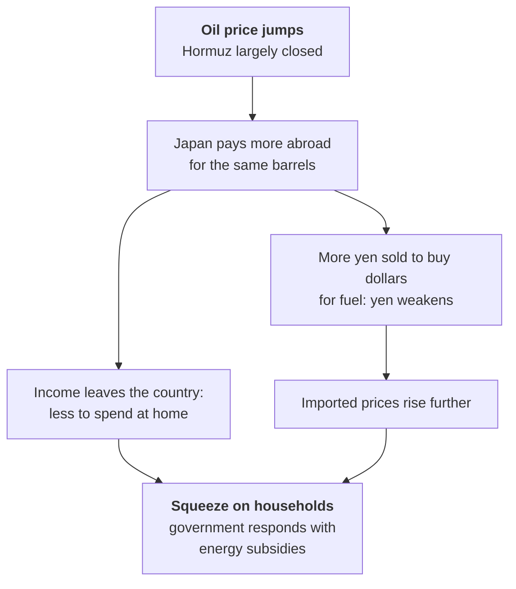

# Lesson 7: 2025 to 2026, Politics, War and a Nervous Bond Market

*How fast to raise rates when inflation is real but households are hurting; how to protect an export economy from American tariffs; and whether a government determined to spend can keep the confidence of bond investors. Then, from February 2026, a war in the Gulf on top.*

---

## What was pressing

How fast to raise rates when inflation is real but households are hurting. How to protect an export economy from American tariffs. And, increasingly, whether a government determined to spend could keep the confidence of bond investors. From February 2026 a war in the Gulf added an energy shock on top.

<svg viewBox="0 0 680 340" width="100%" role="img" aria-label="Step chart of policy rates from early 2024 to October 2026. The Bank of Japan raised its rate six times: from minus 0.1% to a range of 0 to 0.1% in March 2024, then to 0.25% in July 2024, 0.5% in January 2025, 0.75% in December 2025, 1% in June 2026 and 1.25% in September 2026. The US Federal Reserve cut its upper bound from 5.5% to 3.75% between September 2024 and late 2025, then raised it to 4% in September 2026, leaving a gap of 2.75 percentage points." fill="none" xmlns="http://www.w3.org/2000/svg">
<text x="20" y="28" font-size="14" fill="currentColor" font-weight="600">Six hikes, and the gap is still wide</text>
<text x="20" y="45.5" font-size="11.5" fill="currentColor" opacity="0.72">Policy rates, %</text>
<line x1="70" y1="273.1" x2="570" y2="273.1" stroke="currentColor" stroke-width="1" stroke-opacity="0.45"/>
<text x="62" y="277" font-size="11" fill="currentColor" text-anchor="end" opacity="0.72" style="font-variant-numeric:tabular-nums">0%</text>
<line x1="70" y1="239.2" x2="570" y2="239.2" stroke="currentColor" stroke-width="1" stroke-opacity="0.12"/>
<text x="62" y="243.2" font-size="11" fill="currentColor" text-anchor="end" opacity="0.72" style="font-variant-numeric:tabular-nums">1%</text>
<line x1="70" y1="205.4" x2="570" y2="205.4" stroke="currentColor" stroke-width="1" stroke-opacity="0.12"/>
<text x="62" y="209.3" font-size="11" fill="currentColor" text-anchor="end" opacity="0.72" style="font-variant-numeric:tabular-nums">2%</text>
<line x1="70" y1="171.5" x2="570" y2="171.5" stroke="currentColor" stroke-width="1" stroke-opacity="0.12"/>
<text x="62" y="175.5" font-size="11" fill="currentColor" text-anchor="end" opacity="0.72" style="font-variant-numeric:tabular-nums">3%</text>
<line x1="70" y1="137.7" x2="570" y2="137.7" stroke="currentColor" stroke-width="1" stroke-opacity="0.12"/>
<text x="62" y="141.7" font-size="11" fill="currentColor" text-anchor="end" opacity="0.72" style="font-variant-numeric:tabular-nums">4%</text>
<line x1="70" y1="103.8" x2="570" y2="103.8" stroke="currentColor" stroke-width="1" stroke-opacity="0.12"/>
<text x="62" y="107.8" font-size="11" fill="currentColor" text-anchor="end" opacity="0.72" style="font-variant-numeric:tabular-nums">5%</text>
<line x1="70" y1="70" x2="570" y2="70" stroke="currentColor" stroke-width="1" stroke-opacity="0.12"/>
<text x="62" y="74" font-size="11" fill="currentColor" text-anchor="end" opacity="0.72" style="font-variant-numeric:tabular-nums">6%</text>
<text x="86.8" y="308" font-size="10.5" fill="currentColor" text-anchor="middle" opacity="0.72">2024</text>
<text x="255.2" y="308" font-size="10.5" fill="currentColor" text-anchor="middle" opacity="0.72">2025</text>
<text x="423.5" y="308" font-size="10.5" fill="currentColor" text-anchor="middle" opacity="0.72">2026</text>
<polyline points="70,86.9 207.4,86.9 207.4,103.8 230.3,103.8 230.3,112.3 249.4,112.3 249.4,120.8 375.2,120.8 375.2,129.2 394.8,129.2 394.8,137.7 414.1,137.7 414.1,146.2 543.1,146.2 543.1,137.7 551.6,137.7" class="vs1" stroke="#2a78d6" stroke-width="2.2" stroke-linejoin="round" stroke-linecap="round" fill="none"/>
<polyline points="70,276.5 123.2,276.5 123.2,271.4 184.8,271.4 184.8,264.6 265.8,264.6 265.8,256.2 417.8,256.2 417.8,247.7 500.5,247.7 500.5,239.2 543.6,239.2 543.6,230.8 551.6,230.8" class="vs8" stroke="#e34948" stroke-width="2.2" stroke-linejoin="round" stroke-linecap="round" fill="none"/>
<circle cx="123.2" cy="271.4" r="4" class="vf8 vring" fill="#e34948" stroke="#ffffff" stroke-width="2"><title>BOJ 2024-03-19: 0.05%</title></circle>
<text x="121.2" y="262.4" font-size="10" fill="currentColor" text-anchor="end" font-weight="600">0–0.1%</text>
<circle cx="184.8" cy="264.6" r="4" class="vf8 vring" fill="#e34948" stroke="#ffffff" stroke-width="2"><title>BOJ 2024-07-31: 0.25%</title></circle>
<text x="182.8" y="255.6" font-size="10" fill="currentColor" text-anchor="end" font-weight="600">0.25%</text>
<circle cx="265.8" cy="256.2" r="4" class="vf8 vring" fill="#e34948" stroke="#ffffff" stroke-width="2"><title>BOJ 2025-01-24: 0.5%</title></circle>
<text x="263.8" y="247.2" font-size="10" fill="currentColor" text-anchor="end" font-weight="600">0.5%</text>
<circle cx="417.8" cy="247.7" r="4" class="vf8 vring" fill="#e34948" stroke="#ffffff" stroke-width="2"><title>BOJ 2025-12-19: 0.75%</title></circle>
<text x="415.8" y="238.7" font-size="10" fill="currentColor" text-anchor="end" font-weight="600">0.75%</text>
<circle cx="500.5" cy="239.2" r="4" class="vf8 vring" fill="#e34948" stroke="#ffffff" stroke-width="2"><title>BOJ 2026-06-16: 1.0%</title></circle>
<text x="498.5" y="230.2" font-size="10" fill="currentColor" text-anchor="end" font-weight="600">1%</text>
<circle cx="543.6" cy="230.8" r="4" class="vf8 vring" fill="#e34948" stroke="#ffffff" stroke-width="2"><title>BOJ 2026-09-18: 1.25%</title></circle>
<text x="541.6" y="221.8" font-size="10" fill="currentColor" text-anchor="end" font-weight="600">1.25%</text>
<text x="557.6" y="141.7" font-size="11.5" fill="currentColor" font-weight="600">Fed 4%</text>
<text x="557.6" y="234.8" font-size="11.5" fill="currentColor" font-weight="600">BOJ 1.25%</text>
<line x1="553.6" y1="147.7" x2="553.6" y2="220.8" stroke="currentColor" stroke-width="1" stroke-opacity="0.45"/>
<text x="543.6" y="188.4" font-size="10.5" fill="currentColor" text-anchor="end" opacity="0.85">gap 2.75 pts</text>
<text x="20" y="332" font-size="10.5" fill="currentColor" opacity="0.6">Sources: Bank of Japan; Federal Reserve via FRED (DFEDTARU). Fed shown at the top of its target range.</text>
</svg>

The staircase above is the BOJ's whole normalisation in one picture: six steps in two and a half years, from −0.1% to 1.25%. Keep your eye on the blue line too. It explains the last of this guide's five puzzles.

---

## 2025: rice, tariffs and a bond tantrum

### Rice

The BOJ raised its rate to **0.5%** in January 2025, the highest since 2008. Then the price of rice, the most politically sensitive item in the Japanese shopping basket, roughly doubled.

<svg viewBox="0 0 680 300" width="100%" role="img" aria-label="Line chart of the consumer price index for rice in Japan, 2020 = 100, monthly, 2020 to August 2026. Rice prices drifted lower until mid-2024, then surged. Year-on-year rice inflation peaked at about 102% in May 2025, and the index peaked at 223 in November 2025. It had eased to 174 by August 2026 after emergency stockpile releases and a bigger harvest." fill="none" xmlns="http://www.w3.org/2000/svg">
<text x="20" y="28" font-size="14" fill="currentColor" font-weight="600">The rice shock</text>
<text x="20" y="45.5" font-size="11.5" fill="currentColor" opacity="0.72">Consumer price index, rice, 2020 = 100</text>
<line x1="70" y1="250" x2="610" y2="250" stroke="currentColor" stroke-width="1" stroke-opacity="0.12"/>
<text x="62" y="254" font-size="11" fill="currentColor" text-anchor="end" opacity="0.72" style="font-variant-numeric:tabular-nums">60</text>
<line x1="70" y1="205" x2="610" y2="205" stroke="currentColor" stroke-width="1" stroke-opacity="0.45"/>
<text x="62" y="209" font-size="11" fill="currentColor" text-anchor="end" opacity="0.72" style="font-variant-numeric:tabular-nums">100</text>
<line x1="70" y1="160" x2="610" y2="160" stroke="currentColor" stroke-width="1" stroke-opacity="0.12"/>
<text x="62" y="164" font-size="11" fill="currentColor" text-anchor="end" opacity="0.72" style="font-variant-numeric:tabular-nums">140</text>
<line x1="70" y1="115" x2="610" y2="115" stroke="currentColor" stroke-width="1" stroke-opacity="0.12"/>
<text x="62" y="119" font-size="11" fill="currentColor" text-anchor="end" opacity="0.72" style="font-variant-numeric:tabular-nums">180</text>
<line x1="70" y1="70" x2="610" y2="70" stroke="currentColor" stroke-width="1" stroke-opacity="0.12"/>
<text x="62" y="74" font-size="11" fill="currentColor" text-anchor="end" opacity="0.72" style="font-variant-numeric:tabular-nums">220</text>
<text x="70" y="268" font-size="10.5" fill="currentColor" text-anchor="middle" opacity="0.72">2020</text>
<text x="147.9" y="268" font-size="10.5" fill="currentColor" text-anchor="middle" opacity="0.72">2021</text>
<text x="225.9" y="268" font-size="10.5" fill="currentColor" text-anchor="middle" opacity="0.72">2022</text>
<text x="303.8" y="268" font-size="10.5" fill="currentColor" text-anchor="middle" opacity="0.72">2023</text>
<text x="381.8" y="268" font-size="10.5" fill="currentColor" text-anchor="middle" opacity="0.72">2024</text>
<text x="459.7" y="268" font-size="10.5" fill="currentColor" text-anchor="middle" opacity="0.72">2025</text>
<text x="537.6" y="268" font-size="10.5" fill="currentColor" text-anchor="middle" opacity="0.72">2026</text>
<polyline points="73.2,204.3 79.7,204.1 86.2,204.4 92.7,204.9 99.2,204.6 105.7,204.7 112.2,204.8 118.7,204.8 125.2,205.4 131.7,205.4 138.2,206.3 144.7,206.2 151.2,207 157.7,206.9 164.2,207.1 170.7,207.7 177.2,207.8 183.7,207.7 190.2,207.8 196.7,208.5 203.1,209 209.6,210.3 216.1,211.6 222.6,212.4 229.1,212.6 235.6,212.6 242.1,213.5 248.6,213.8 255.1,214.2 261.6,215 268.1,214.5 274.6,214.7 281.1,213.9 287.6,212.2 294.1,211.7 300.6,211 307.1,211.3 313.6,211.2 320.1,210.8 326.6,210.9 333.1,210.7 339.5,210.6 346,210.6 352.5,210.4 359,209 365.5,206.8 372,205.4 378.5,204.6 385,204.7 391.5,204 398,203.1 404.5,202.5 411,200.6 417.5,197.5 424,192.3 430.5,180.1 437,160.5 443.5,141.6 450,134.2 456.5,131.8 463,124.8 469.4,112.1 475.9,97.8 482.4,89.3 488.9,81.6 495.4,77.3 501.9,78.8 508.4,84.3 514.9,83.3 521.4,71 527.9,66.2 534.4,67.9 540.9,71 547.4,77 553.9,82.9 560.4,87.9 566.9,93.1 573.4,98.1 579.9,106.9 586.4,121.3" class="vs2" stroke="#eb6834" stroke-width="2.2" stroke-linejoin="round" stroke-linecap="round" fill="none"/>
<circle cx="527.9" cy="66.2" r="4.5" class="vf2 vring" fill="#eb6834" stroke="#ffffff" stroke-width="2"><title>2025-11: 223.4</title></circle>
<text x="519.9" y="68.2" font-size="11.5" fill="currentColor" text-anchor="end" font-weight="600">223</text>
<line x1="488.9" y1="81.6" x2="418.9" y2="45.6" stroke="currentColor" stroke-width="1" stroke-opacity="0.35"/>
<text x="418.9" y="41.6" font-size="10.5" fill="currentColor" text-anchor="end" font-weight="600">May 2025: minister resigns</text>
<text x="418.9" y="55.2" font-size="10.5" fill="currentColor" text-anchor="end" opacity="0.85">prices up 102% on a year</text>
<text x="592.4" y="125.3" font-size="11.5" fill="currentColor" font-weight="600">174</text>
<text x="20" y="292" font-size="10.5" fill="currentColor" opacity="0.6">Source: Ministry of Internal Affairs and Communications, CPI (2020 base).</text>
</svg>

A poor 2023 harvest, rising demand from tourists and restaurants, and a distribution system that left stocks with wholesalers combined to send retail rice prices up by about 100% on a year earlier by May 2025. The agriculture minister, Taku Eto, resigned that month after joking that he had never had to buy rice because supporters gave it to him, and the government released emergency stockpiles. Rice inflation only reversed in 2026, after a bigger harvest. For a central bank trying to decide whether inflation was "good" or "bad", rice was the worst kind of noise: a food shock that hurt households and moved the headline numbers without saying anything about wages.

### Tariffs

In April 2025 American "reciprocal" tariffs hit Japan. In July Tokyo agreed a deal that set a **15% tariff** on most Japanese goods, including cars, in return for a pledge to channel **$550 billion** of investment into the United States. Painful, but it capped the threat for exporters.

### The first bond tantrum

In May 2025 the bond market delivered its first warning. After weak auctions, yields on 30-year and 40-year JGBs jumped to record highs. The natural buyers of very long bonds, the life insurers, were stepping back just as the BOJ was buying less. The Ministry of Finance responded by trimming its issuance of super-long debt.

<svg viewBox="0 0 680 340" width="100%" role="img" aria-label="Line chart of Japanese government bond yields at 2, 10 and 30 years, daily, 2023 to October 2026. All three rose steadily. The 10-year yield was below 1% for most of 2023, passed 2% in December 2025 and first closed above 3% on 2 September 2026 by the Ministry of Finance's measure, the highest since 1996; on 2 October it was 3.10%. The 30-year yield rose from about 1.6% to about 4.1%, and the 2-year from near zero to about 1.9%." fill="none" xmlns="http://www.w3.org/2000/svg">
<text x="20" y="28" font-size="14" fill="currentColor" font-weight="600">The bond market wakes up</text>
<text x="20" y="45.5" font-size="11.5" fill="currentColor" opacity="0.72">JGB yields, daily, %</text>
<line x1="70" y1="278.4" x2="590" y2="278.4" stroke="currentColor" stroke-width="1" stroke-opacity="0.45"/>
<text x="62" y="282.4" font-size="11" fill="currentColor" text-anchor="end" opacity="0.72" style="font-variant-numeric:tabular-nums">0%</text>
<line x1="70" y1="232.1" x2="590" y2="232.1" stroke="currentColor" stroke-width="1" stroke-opacity="0.12"/>
<text x="62" y="236.1" font-size="11" fill="currentColor" text-anchor="end" opacity="0.72" style="font-variant-numeric:tabular-nums">1%</text>
<line x1="70" y1="185.8" x2="590" y2="185.8" stroke="currentColor" stroke-width="1" stroke-opacity="0.12"/>
<text x="62" y="189.7" font-size="11" fill="currentColor" text-anchor="end" opacity="0.72" style="font-variant-numeric:tabular-nums">2%</text>
<line x1="70" y1="139.5" x2="590" y2="139.5" stroke="currentColor" stroke-width="1" stroke-opacity="0.12"/>
<text x="62" y="143.4" font-size="11" fill="currentColor" text-anchor="end" opacity="0.72" style="font-variant-numeric:tabular-nums">3%</text>
<line x1="70" y1="93.2" x2="590" y2="93.2" stroke="currentColor" stroke-width="1" stroke-opacity="0.12"/>
<text x="62" y="97.1" font-size="11" fill="currentColor" text-anchor="end" opacity="0.72" style="font-variant-numeric:tabular-nums">4%</text>
<text x="70" y="308" font-size="10.5" fill="currentColor" text-anchor="middle" opacity="0.72">2023</text>
<text x="202.5" y="308" font-size="10.5" fill="currentColor" text-anchor="middle" opacity="0.72">2024</text>
<text x="334.9" y="308" font-size="10.5" fill="currentColor" text-anchor="middle" opacity="0.72">2025</text>
<text x="467.4" y="308" font-size="10.5" fill="currentColor" text-anchor="middle" opacity="0.72">2026</text>
<polyline points="71.1,277.3 71.5,277.7 71.8,277.9 73.3,277.2 73.6,277.2 74,276.5 74.4,276.9 75.4,276.9 75.8,276.5 76.2,278.1 76.5,278.5 76.9,278.6 78,279.1 78.3,278.7 78.7,278.9 79.1,278.8 79.4,278.4 80.5,278.6 80.9,278.9 81,279.3 81.4,279.3 81.8,279.8 82.9,279.6 83.2,279.8 83.6,279.8 83.9,280 84.3,280.5 85.4,281 85.8,281 86.1,280.8 86.5,280.6 86.8,280.6 87.9,280.4 88.3,279.8 88.7,279.8 89.4,279.8 90.5,279.7 90.8,279.6 92.1,280 92.4,280 92.8,280.3 93.9,280.2 94.3,280.2 94.6,280.3 95,279.3 95.3,279.8 96.4,279.6 96.8,280.3 97.2,280.8 97.5,281.7 97.9,281.9 99,282 99.7,281 100.1,281.3 100.4,281.5 101.5,281.5 101.9,281.2 102.2,281.7 102.6,281.2 103,281.2 103.8,280.3 104.2,279.6 104.6,279.8 104.9,280.5 105.3,281.2 106.4,280.5 106.7,280.6 107.1,280.5 107.5,280.7 107.8,280.3 108.9,280 109.3,280.3 109.6,280.3 110,280.3 110.4,280 111.5,280.2 111.8,280 112.2,280.3 112.6,280.3 112.9,280.5 114.2,280.5 114.5,280 116.7,280 117.1,279.8 117.4,280.3 117.8,280.5 118.1,281 119.2,280.7 119.6,280.9 120,281.5 120.3,281.2 120.7,281.2 121.8,281.5 122.1,281.2 122.5,281.5 122.9,281.5 123.2,281.5 124.3,281.2 124.7,281 125,281.2 125.2,281.4 125.6,281.9 126.6,281.4 127,281.4 127.4,281.2 127.7,281.2 128.1,281.4 129.2,281.7 129.5,281.9 129.9,281.7 130.3,281.4 130.6,281.4 131.7,281.5 132.1,281.5 132.5,281.6 132.8,281.7 133.2,281.8 134.3,282 134.6,281.8 135,281.4 135.4,281.7 135.7,281.9 137,281.4 137.3,281.7 137.7,281.7 138,281.2 138.4,280.2 139.5,279.8 139.9,280.2 140.2,280 140.6,280 141,280.2 142.4,279.9 142.8,280.1 143.1,280.1 143.5,279.6 144.6,280.1 144.9,280.2 145.3,280.2 145.7,280.3 146,279.1 147.1,278.4 147.3,278.4 147.6,278 148,277.5 148.4,277.4 149.5,277.6 149.8,277.9 150.2,278.1 150.5,277.9 152,277.6 152.4,277.7 152.7,277.6 153.1,277.1 153.4,277.4 154.5,277.1 154.9,277.3 155.3,277.3 155.6,278 156,278 157.1,277.9 157.4,277.5 157.8,277.1 158.2,277.3 158.3,277.5 159.4,277.7 159.8,277.7 160.1,277.6 160.5,277.9 160.9,278.1 161.9,276.4 162.3,276.9 162.7,277.1 163,277.1 163.4,277 164.8,276.8 165.2,277.2 165.6,276.8 165.9,276.8 167,276.9 167.4,276.8 167.7,276.8 168.1,276.4 168.5,276.4 169.7,275.9 170.1,276.1 170.4,275.6 170.8,275.6 171.2,275.6 172.6,275.7 173,275.7 173.3,276.2 173.7,276.4 174.8,276.4 175.2,275.7 175.5,275.2 175.9,274.7 176.2,274.9 177.3,274.4 177.7,274.6 178.1,274.9 178.4,274.1 178.8,274.1 179.9,272.9 180.2,271.5 180.4,271.2 180.8,272.2 182.2,272.5 182.6,272.5 182.9,273 183.3,273.5 183.7,273.4 184.7,273.7 185.1,274.1 185.5,275.2 185.8,275.8 186.2,276.3 187.3,276.3 187.6,276.8 188,276 188.7,275.3 189.8,275.3 190.2,275.4 190.6,276.2 190.9,276.2 191.4,276.6 192.5,277 192.9,276.8 193.2,276.8 193.6,274.4 194,274.2 195.1,274.3 195.4,275.3 195.8,276.2 196.1,275.8 196.5,274.4 197.6,274.8 198,275.3 198.3,276.9 198.7,276.7 199,276.3 200.1,276.7 200.5,275.4 200.9,276.1 201.2,276.7 201.6,276.2 203.6,276.1 203.9,276.8 205.4,277.3 205.7,277.3 206.1,277.7 206.5,278.2 207.5,278.5 207.9,277.5 208.3,277.3 208.6,276.8 209,277 210.1,277.3 210.5,277.3 210.8,275.2 211.2,275.3 211.5,276 212.6,275.5 213,275 213.4,274.1 213.5,274.5 213.9,273.8 215,273.3 215.3,273.5 215.7,273.7 216,273.7 216.4,273 217.9,272.5 218.2,271.8 218.6,272.1 219,271.8 220,271.5 220.4,271.4 220.8,271.2 221.1,271.1 222.6,271.1 222.9,270.4 223.3,270.7 223.7,269.6 224.5,270.1 225.6,270.3 226,270.3 226.4,269.8 226.7,269.6 227.1,269.1 228.2,269.1 228.5,269.3 228.9,269.3 229.3,269.3 229.6,269.5 230.7,269.7 231.1,270.2 231.8,268.9 232.2,268.9 233.3,268.9 233.6,268.8 234,269 234.3,269.3 234.7,269.7 235.6,269.4 235.9,269.2 236.3,269.6 236.7,269.3 237,268.6 238.1,267.9 238.5,268.1 238.9,267.6 239.2,265.9 239.6,265.4 240.7,265.7 241,265.4 241.4,265.1 241.8,265.5 242.1,266.2 243.2,265 243.6,264.7 243.9,264.6 244.3,264.6 244.7,264.6 246.1,265.7 246.6,265 247,265 248.8,265.4 249.2,265.1 249.5,263.9 249.9,263.6 251,262.9 251.3,262.4 251.7,262.6 252.1,263.3 252.4,262.8 253.5,262.3 253.9,262.3 254.2,261.9 254.6,262.4 255,262.4 256.1,261.9 256.4,261.9 256.8,260.5 257.1,259.9 257.5,259.9 258.4,259.8 258.8,260.5 259.1,261.9 259.5,262.9 259.8,262.2 260.9,260.7 261.3,261.2 261.7,262.5 262,263 262.4,264.4 263.5,264.9 263.8,265.1 264.2,265.2 264.6,264.9 264.9,263.9 266,264.1 266.4,264.2 266.7,264 267.1,261.2 267.5,262.1 268.7,261.7 269.1,261.5 269.4,262.2 269.8,262.7 270.2,262.4 271.2,261.7 271.6,262.1 272,262.5 272.3,262.5 272.7,263 274.1,263.6 274.5,263.1 274.9,262.3 275.2,262.1 276.3,262.3 276.7,261.7 277,260.9 277.4,259.8 277.8,259.5 278.9,260.2 279.2,261.1 279.6,257.6 279.7,257.1 280.1,259.4 281.2,266.1 281.6,265 281.9,265.9 282.3,266 282.6,264.5 284.1,264.5 284.5,264.7 284.8,263.6 285.2,261.9 286.3,261.1 286.6,261.6 287,262.1 287.4,261.6 287.7,261.2 288.8,261.6 289.2,261.4 289.5,260.8 289.9,261.4 290.3,261.6 291.1,261.3 291.5,260.4 291.9,261.1 292.2,261.1 292.6,260.8 293.7,260.1 294,260.1 294.4,260.8 294.8,260.3 295.1,260.3 296.6,260.5 296.9,260.8 297.3,260.4 297.7,260.1 299.1,262.2 299.5,262 299.9,262.3 300.2,263.5 301.3,260.2 301.8,260.4 302.2,261.5 302.5,261.5 302.9,261.3 304,259.6 304.4,259.8 304.7,259.8 305.1,259.3 305.4,259.3 306.9,258.8 307.3,258.8 307.6,258.3 308,258.1 309.1,258.4 309.4,257.4 309.8,257.6 310.2,257.6 310.5,257.6 311.6,257.1 312,257.4 312.3,257.9 312.7,258.3 312.9,256.9 314.3,257.3 314.7,256.2 315,255.2 315.4,255.2 316.5,255.2 316.8,255.2 317.2,254 317.6,253.8 317.9,252.9 319,252.8 319.4,252.8 319.8,252.8 320.1,251.6 320.5,251.1 321.6,251.1 321.9,251 322.3,250.8 322.7,251.5 323,250.7 324.3,249.7 324.6,250.2 325,251.3 325.3,250.6 325.7,251.1 326.8,251.8 327.2,251.3 327.5,251 327.9,251.6 328.3,252.3 329.3,251.3 329.7,250.9 330.1,251.1 330.4,250.4 330.8,251.7 331.9,251.2 332.2,251.2 332.6,251.2 333,250.5 333.3,250.5 334.4,250.7 336.7,249.4 337.1,249.1 337.5,248.4 337.8,248.6 338.2,248.4 339.7,246.6 340,245.7 340.4,246.1 340.7,246.3 341.8,246.8 342.2,247.1 342.6,246.1 342.9,245.8 343.3,245.2 344.4,245.8 344.7,246.2 345.1,245.8 345.5,245.2 345.8,244.7 346.7,245.1 347.1,244.1 347.4,243.4 347.8,243.1 348.2,241.5 349.2,241.5 350,241.4 350.3,241.6 350.7,241.6 351.8,241 352.1,240.1 352.5,240.4 352.9,240.4 353.2,240.5 354.7,241.2 355,241.3 355.4,240.2 355.8,241.1 357.7,240.2 358.1,239.9 358.5,239.9 358.8,239 359.2,239.1 360.3,237.9 360.6,239.8 361,239.1 361.4,238.5 361.7,239.5 362.8,240.9 363.2,240.7 363.5,239.4 364.3,238.9 365.4,238.1 365.7,237.3 366.1,237.1 366.4,237.1 366.8,237.8 367.9,238.9 368.1,238.8 368.4,239.8 368.8,243.5 369.1,250.1 370.2,251.3 370.6,248.5 371,250.1 371.3,247.1 371.7,250.1 372.8,251.1 373.1,248.5 373.5,249.9 373.9,248.3 374.2,249 375.3,248.4 375.7,247.4 376,246.7 376.4,247 376.8,246.5 377.9,246.6 378.6,247.1 379.1,249.3 379.5,250.2 381.3,250.2 381.6,249.8 382,249.1 383.1,247.9 383.4,245.2 383.8,245.7 384.2,245.2 384.5,245.7 385.6,245.2 386,244.7 386.3,245.1 386.7,244.3 387.1,244.6 388.2,244.7 388.5,244.2 388.9,243.5 389.3,243.3 389.6,243.7 390.5,243.5 390.9,243.5 391.2,243 391.6,243.5 391.9,243.2 393,242.5 393.4,242.7 393.8,243.4 394.1,243.4 394.5,244.3 395.6,243.3 395.9,242.8 396.3,243.5 396.7,244.7 397,244.7 398.1,244.2 398.5,244.2 398.8,244.9 399.2,244.4 399.6,244.1 400.7,243.9 401.2,244.4 401.5,244.1 401.9,243.9 402.3,244.3 403.3,244.5 403.7,244.5 404.1,243.5 404.4,243.2 404.8,243 405.9,242.2 406.2,241.7 406.6,241.7 407,241.9 407.3,242.7 408.8,243.2 409.2,239.6 409.5,238.9 409.9,238.5 411,239.1 411.3,239.7 411.7,240.2 412.1,240.2 412.2,240.7 413.3,243 413.7,243.5 414,242.6 414.4,242.8 414.7,242.8 416.2,242.5 416.6,242.1 416.9,240.3 417.3,240.2 418.4,239.8 418.7,239.1 419.1,238.7 419.5,238.5 419.8,238 420.9,238.2 421.3,237.9 421.6,238.2 422,238.1 422.4,238.1 423.2,237.7 423.6,238.1 424,238.1 424.3,238.8 424.7,239.5 425.8,239.9 426.2,239.4 426.5,238.7 426.9,238.5 427.2,238 428.7,237.5 429.1,237.5 429.4,237.3 429.8,235.9 430.9,235.1 431.6,235.3 432,235.1 432.3,235.3 433.4,235.3 433.8,234.1 434.3,234.2 434.6,234.2 435,234.7 436.1,236.8 436.5,236.3 436.8,235.3 437.2,235.3 437.6,235.6 439,237 439.4,236.7 439.7,235.8 440.1,236.3 441.2,234.4 441.5,234.9 441.9,235.4 442.3,235.2 442.6,235.3 443.7,234.7 444.1,234.9 444.4,234.7 444.8,235.4 445.2,235.4 446.4,234.7 446.8,235.3 447.1,234.8 447.5,234.8 448.6,234.5 449,235 449.3,234.8 449.7,235.3 450,235.3 451.1,235 451.5,235.4 451.9,235.2 452.2,233.7 452.6,234 454,233.3 454.4,232.8 454.8,233.2 455.1,232.5 456.4,231.2 456.7,231.9 457.1,231.4 457.5,231.1 457.8,229.7 458.9,229.2 459.3,228.9 459.6,228.7 460,229.6 460.4,228.9 461.4,228.8 461.8,229 462.2,228.5 462.5,228.7 462.9,227.4 464,226.1 464.3,227 464.7,227 465.1,225.3 465.4,225.6 466.5,225.2 466.9,224.4 468.9,223.1 469.2,223.5 469.6,224.2 469.9,226.1 470.3,225.1 471.8,224.5 472.1,223.5 472.5,223.3 472.8,222.6 473.9,221.5 474.3,221.9 474.7,221.2 475,221.7 475.4,220 476.5,219.3 476.8,219 477.2,220.2 477.6,219.9 477.9,220.5 478.8,219.8 479.2,218.9 479.5,219.3 479.9,219.3 480.3,219.1 481.3,217.6 481.7,218.1 482.4,218 482.8,218.7 483.9,219.4 484.2,221.3 484.6,220.9 485,219.8 485.3,220.1 486.8,220.5 487.2,221.7 487.5,220.7 487.9,220.5 489.8,222 490.2,220.5 490.6,221.2 490.9,220.2 491.3,220.7 492.4,220.9 492.7,220.2 493.1,220.4 493.5,219.9 493.8,218.7 494.9,218.8 495.3,219.1 495.7,220 496,219.3 497.5,217.7 497.8,217.7 498.2,217.4 498.6,216 498.9,213.9 500,215 500.4,214.7 500.5,215.9 500.9,214 501.2,214 502.3,213.5 502.7,214.2 503.1,214.4 503.4,213.9 503.8,213.3 504.9,213.5 505.2,214.4 505.6,214.4 506,215.2 506.3,214.9 507.4,215 507.8,215.5 508.1,215.3 508.5,215.2 508.9,215.3 510,214.7 510.3,214.1 511,213.5 511.6,214.3 513.7,214.9 514.1,214.6 515.2,213.8 515.6,213.5 515.9,213.5 516.3,213.3 516.6,213 517.7,212.1 518.1,211.2 518.5,210.6 518.8,211.1 519.2,211.6 520.3,212.7 520.6,212.6 521,213.6 521.4,215.2 521.7,213.9 522.6,213.6 523,214.5 523.3,213.5 523.7,212.8 524,213 525.1,212.7 525.5,212.7 525.9,212.4 526.2,212.3 526.6,212.8 527.7,213.2 528,212.9 528.4,213.7 528.8,213.6 529.1,213.2 530.2,212.9 530.6,212.4 530.9,212.1 531.3,212.6 531.7,213.2 532.8,213.1 533.1,214.4 533.6,213.6 534,213.8 534.4,214 535.5,213.8 535.8,213.5 536.2,212.1 536.5,211.5 536.9,212 538,211.2 538.4,212 538.7,211.9 539.1,211.7 539.4,211.9 540.9,211.7 541.3,211.3 541.6,209 542,207.5 543.1,208.3 543.4,208.8 543.8,209.5 544.2,209.1 544.5,208.6 545.4,206.1 545.8,205.8 546.1,205.8 546.5,205.9 546.9,203.8 547.9,203.5 548.7,202.2 549,202 549.4,201.7 550.5,199.9 550.8,200.1 551.2,200.6 551.6,200.5 551.9,200.5 553,200.4 553.4,200.4 553.7,199.8 554.1,199.9 554.5,198.8 555.6,197.7 555.7,195 556.1,192.6 556.4,192.7 556.8,193.7 557.9,192.6 558.3,192.8 558.6,193.5 559,194 559.3,193 560.4,193.2 560.8,192.2 561.2,192.6 561.5,191.9 561.9,192.8 564.1,189.9 564.4,188.2 565.5,186.7 565.9,186.9 566.2,188 566.8,188.6 567.1,189.5" class="vs3" stroke="#1baf7a" stroke-width="1.6" stroke-linejoin="round" stroke-linecap="round" fill="none"/>
<polyline points="71.1,255.7 71.5,254.9 71.8,254.9 73.3,254.8 73.6,254.8 74,254.8 74.4,254.9 75.4,254.8 75.8,254.7 76.2,258.5 76.5,258.9 76.9,259.1 78,260.1 78.3,258.6 78.7,257.3 79.1,256.1 79.4,255.4 80.5,255.4 80.9,254.8 81,255.3 81.4,254.6 81.8,255.1 82.9,254.8 83.2,254.8 83.6,254.8 83.9,254.8 84.3,254.6 85.4,254.2 85.8,254.2 86.1,254.1 86.5,254.1 86.8,254 87.9,253.9 88.3,253.8 88.7,253.8 89.4,253.9 90.5,253.8 90.8,254.2 92.1,254.1 92.4,254 92.8,254 93.9,253.9 94.3,254 94.6,253.9 95,253.9 95.3,258.6 96.4,262.6 96.8,263.9 97.2,261.7 97.5,263.4 97.9,263.7 99,265.4 99.7,260.9 100.1,262.7 100.4,263.6 101.5,263.1 101.9,262.8 102.2,262.9 102.6,261.7 103,260.4 103.8,258.9 104.2,256.3 104.6,256.5 104.9,256.6 105.3,257 106.4,256.7 106.7,257.2 107.1,256.7 107.5,256.9 107.8,256.9 108.9,255.8 109.3,256.2 109.6,256.2 110,256.2 110.4,256.7 111.5,256.4 111.8,255.9 112.2,256.8 112.6,256.8 112.9,259.8 114.2,259.3 114.5,258.6 116.7,258.8 117.1,258.3 117.4,258.7 117.8,259.9 118.1,260.1 119.2,258.9 119.6,259.6 120,261.1 120.3,260.1 120.7,259.2 121.8,260 122.1,259.4 122.5,258.9 122.9,258 123.2,258.4 124.3,257.4 124.7,257.7 125,257.7 125.2,258.3 125.6,258.5 126.6,257.6 127,258 127.4,258.3 127.7,257.3 128.1,257.5 129.2,257.8 129.5,258.1 129.9,257.7 130.3,257.7 130.6,258.9 131.7,259.3 132.1,259.6 132.5,260.2 132.8,260.1 133.2,260.4 134.3,260.9 134.6,260 135,259.2 135.4,259.5 135.7,258.7 137,258.4 137.3,259.9 137.7,260.6 138,259.5 138.4,258.1 139.5,256.7 139.9,257.4 140.2,256.2 140.6,256.7 141,256.2 142.4,256 142.8,256.8 143.1,256.9 143.5,256.1 144.6,257.1 144.9,256.8 145.3,257.5 145.7,257.9 146,252.9 147.1,250.4 147.3,250.8 147.6,249.2 148,248.1 148.4,248.6 149.5,249.5 149.8,250.2 150.2,251.9 150.5,251 152,249.7 152.4,249.1 152.7,249.2 153.1,248 153.4,249.1 154.5,248 154.9,247.3 155.3,246.8 155.6,248.1 156,247.7 157.1,247.4 157.4,248.3 157.8,247.8 158.2,248 158.3,249 159.4,248.2 159.8,247.6 160.1,247.8 160.5,247.5 160.9,247.9 161.9,245.3 162.3,245.3 162.7,245.3 163,245.3 163.4,245.3 164.8,244.7 165.2,244.6 165.6,243.3 165.9,243.5 167,244.2 167.4,243.6 167.7,243.8 168.1,243 168.5,242.6 169.7,242.3 170.1,243 170.4,241 170.8,241.2 171.2,241.3 172.6,242.5 173,242.5 173.3,243.4 173.7,243 174.8,243.4 175.2,242 175.5,240.9 175.9,239.3 176.2,239.5 177.3,238.4 177.7,239.2 178.1,238.8 178.4,237.5 178.8,237.9 179.9,237 180.2,234.3 180.4,234 180.8,235.8 182.2,237.8 182.6,237.6 182.9,239 183.3,239.4 183.7,238.6 184.7,237.7 185.1,238.6 185.5,241 185.8,241.5 186.2,243 187.3,243.4 187.6,245.4 188,244.1 188.7,242 189.8,242 190.2,242.9 190.6,246.2 190.9,246.4 191.4,245.1 192.5,245.4 192.9,246.6 193.2,247.5 193.6,242.7 194,241.8 195.1,241.5 195.4,243.3 195.8,245.6 196.1,246.3 196.5,244.7 197.6,246.5 198,247.7 198.3,251.5 198.7,250.2 199,248.3 200.1,248.9 200.5,248 200.9,249.5 201.2,249.9 201.6,248.5 203.6,248.4 203.9,249.1 205.4,250 205.7,249.7 206.1,250.4 206.5,251 207.5,252.3 207.9,250.8 208.3,250.1 208.6,248 209,247.3 210.1,248 210.5,248.6 210.8,245 211.2,243.7 211.5,245 212.6,244.7 213,245.4 213.4,244.3 213.5,246 213.9,247.5 215,244.8 215.3,244.8 215.7,245.4 216,245.7 216.4,244.6 217.9,244.3 218.2,243 218.6,244.3 219,244.3 220,244.2 220.4,244.1 220.8,244.5 221.1,244.7 222.6,246 222.9,245.8 223.3,245.6 223.7,244.9 224.5,244.7 225.6,244.8 226,245.4 226.4,244.8 226.7,244.1 227.1,243.9 228.2,242.4 228.5,242.2 228.9,242.6 229.3,241.7 229.6,241.3 230.7,242.6 231.1,244 231.8,243.1 232.2,243.1 233.3,243.6 233.6,243.4 234,244.2 234.3,244.6 234.7,243.7 235.6,243 235.9,242.8 236.3,242.8 236.7,242.3 237,242.7 238.1,241.7 238.5,242 238.9,241.3 239.2,238.9 239.6,238.4 240.7,238.4 241,238.1 241.4,237.2 241.8,238.1 242.1,239.7 243.2,237.4 243.6,237.4 243.9,237.2 244.3,236.9 244.7,235.6 246.1,237.7 246.6,236.8 247,236.4 248.8,237.6 249.2,237.3 249.5,236 249.9,235.9 251,234.6 251.3,233.5 251.7,233.9 252.1,235.2 252.4,234.1 253.5,232.7 253.9,232.5 254.2,231.8 254.6,231.6 255,231.4 256.1,230.7 256.4,229.9 256.8,228.2 257.1,229 257.5,228.4 258.4,228.8 258.8,230.1 259.1,231.5 259.5,233.4 259.8,232.8 260.9,230 261.3,230.5 261.7,232.1 262,232.9 262.4,234.4 263.5,234.6 263.8,233.8 264.2,234.2 264.6,233.4 264.9,232.2 266,231.6 266.4,231.2 266.7,230.1 267.1,227.8 267.5,229.2 268.7,228.3 269.1,227.3 269.4,227.5 269.8,228.1 270.2,228.8 271.2,227.8 271.6,228.4 272,227.8 272.3,228 272.7,229.6 274.1,230.6 274.5,230.2 274.9,229.9 275.2,229.7 276.3,229.2 276.7,228.7 277,228.2 277.4,228.5 277.8,229 278.9,230.2 279.2,231.5 279.6,228.9 279.7,230 280.1,233.3 281.2,242.2 281.6,236.4 281.9,236.8 282.3,238.8 282.6,237.6 284.1,238.2 284.5,239.8 284.8,238.5 285.2,236.8 286.3,236.1 286.6,236 287,236.9 287.4,236.7 287.7,235.9 288.8,236.3 289.2,236.5 289.5,235.8 289.9,235.9 290.3,235.7 291.1,235.1 291.5,234.3 291.9,235.9 292.2,236.6 292.6,237.7 293.7,235.6 294,235.5 294.4,237.4 294.8,236.9 295.1,237.8 296.6,238.5 296.9,238.6 297.3,237.2 297.7,236.8 299.1,239.1 299.5,239 299.9,238 300.2,239.1 301.3,237 301.8,237 302.2,238.6 302.5,238.3 302.9,237.4 304,235.5 304.4,235.5 304.7,235.1 305.1,234 305.4,234.4 306.9,233.2 307.3,234.1 307.6,233.6 308,233.4 309.1,233.8 309.4,232.9 309.8,232.9 310.2,233.8 310.5,234.2 311.6,233 312,233 312.3,233.9 312.7,234.6 312.9,234.3 314.3,234.7 314.7,232.4 315,231.4 315.4,231.6 316.5,231.7 316.8,231.2 317.2,229.7 317.6,228.9 317.9,228.3 319,228.3 319.4,228.5 319.8,228.5 320.1,227.2 320.5,227.8 321.6,228.2 321.9,228.7 322.3,228.3 322.7,229.1 323,229.1 324.3,227.9 324.6,227.9 325,229 325.3,228.3 325.7,229 326.8,229.6 327.2,228.5 327.5,228.3 327.9,229.1 328.3,229.6 329.3,228.2 329.7,227.8 330.1,228.4 330.4,227.6 330.8,228.9 331.9,228.4 332.2,228.1 332.6,228.1 333,227.3 333.3,226.6 334.4,227 336.7,225.4 337.1,225.3 337.5,223.7 337.8,223.9 338.2,222.7 339.7,220.7 340,220.3 340.4,222.5 340.7,222.5 341.8,222.9 342.2,223.1 342.6,222.6 342.9,222.1 343.3,221.1 344.4,221.7 344.7,222.8 345.1,222.8 345.5,221.9 345.8,220.5 346.7,220.3 347.1,219 347.4,218.7 347.8,219.6 348.2,217.9 349.2,217.4 350,216.1 350.3,215.6 350.7,215.6 351.8,214 352.1,212.1 352.5,212.1 352.9,211.7 353.2,212.3 354.7,214.2 355,214.8 355.4,213.7 355.8,214.6 357.7,213 358.1,212.3 358.5,211.4 358.8,208.2 359.2,207.9 360.3,205.5 360.6,208.4 361,207.7 361.4,206.7 361.7,207.9 362.8,208.3 363.2,208.6 363.5,208 364.3,207.7 365.4,206.7 365.7,205.3 366.1,205.1 366.4,204.9 366.8,206.6 367.9,209.1 368.1,208.4 368.4,209.8 368.8,215.2 369.1,224 370.2,226.1 370.6,219.7 371,219 371.3,214.6 371.7,215.6 372.8,215.9 373.1,214.6 373.5,218 373.9,217.3 374.2,218.1 375.3,218.1 375.7,217.1 376,216.4 376.4,216.9 376.8,216 377.9,216.9 378.6,216.8 379.1,218.6 379.5,219 381.3,217.4 381.6,216.2 382,215 383.1,213.3 383.4,210.8 383.8,210.5 384.2,209.5 384.5,210.5 385.6,209.2 386,207.6 386.3,207.6 386.7,205.6 387.1,206.2 388.2,207.9 388.5,209.9 388.9,207.5 389.3,207.5 389.6,208.1 390.5,207.9 390.9,209 391.2,208.1 391.6,209.8 391.9,210 393,209.4 393.4,209 393.8,209.9 394.1,209.9 394.5,212.2 395.6,210 395.9,209 396.3,209.9 396.7,211.8 397,212.5 398.1,211.9 398.5,211.5 398.8,212.4 399.2,211.5 399.6,210.8 400.7,210.7 401.2,212.7 401.5,212 401.9,211.4 402.3,211.5 403.3,210.7 403.7,209.3 404.1,208.6 404.4,209 404.8,208.6 405.9,205.5 406.2,204.9 406.6,205.5 407,206.1 407.3,207.7 408.8,208.5 409.2,204.5 409.5,204.1 409.9,204.1 411,205.7 411.3,206 411.7,205.9 412.1,206.2 412.2,206.2 413.3,208 413.7,209.5 414,208.5 414.4,208.9 414.7,208.9 416.2,208.2 416.6,207.6 416.9,206 417.3,205.5 418.4,205.1 418.7,204.2 419.1,203.5 419.5,203.5 419.8,203.1 420.9,203 421.3,202.9 421.6,202.6 422,203 422.4,203.7 423.2,202.8 423.6,203.6 424,202.3 424.3,203.5 424.7,204.8 425.8,205 426.2,205.2 426.5,205 426.9,204.6 427.2,203.7 428.7,203.3 429.1,203.8 429.4,203.6 429.8,201.8 430.9,201.1 431.6,201.8 432,201.6 432.3,201.1 433.4,201.7 433.8,201.4 434.3,201.4 434.6,200.8 435,201.2 436.1,200.7 436.5,200.5 436.8,199.6 437.2,199.8 437.6,199.8 439,201.1 439.4,201.4 439.7,201.4 440.1,202.6 441.2,200.8 441.5,201.2 441.9,201.4 442.3,201.2 442.6,201.2 443.7,200.5 444.1,201.8 444.4,201.4 444.8,201.5 445.2,201.1 446.4,200.4 446.8,200.8 447.1,200 447.5,200.2 448.6,199.1 449,199.5 449.3,199.7 449.7,199.5 450,199 451.1,197.6 451.5,197 451.9,196 452.2,193.9 452.6,195.4 454,194.5 454.4,193.9 454.8,194.7 455.1,194.5 456.4,191.3 456.7,192.1 457.1,190.6 457.5,188.6 457.8,188.1 458.9,187.4 459.3,187.5 459.6,187.7 460,188.9 460.4,187.8 461.4,187.6 461.8,187.8 462.2,186.7 462.5,187.1 462.9,184.8 464,182.4 464.3,184 464.7,183.8 465.1,183.8 465.4,184 466.5,183.4 466.9,182.7 468.9,180.6 469.2,180.1 469.6,180 469.9,181.9 470.3,181.3 471.8,178.2 472.1,177.4 472.5,178.2 472.8,177.4 473.9,173.5 474.3,170.5 474.7,172.8 475,174.7 475.4,174.1 476.5,174.9 476.8,172.8 477.2,174.8 477.6,174.1 477.9,174.3 478.8,174.9 479.2,173.8 479.5,174.3 479.9,175.1 480.3,174.9 481.3,172.4 481.7,174.6 482.4,174.8 482.8,175.7 483.9,175.6 484.2,179.2 484.6,178.7 485,178.5 485.3,180 486.8,180.3 487.2,178.7 487.5,178 487.9,179.7 489.8,181.8 490.2,178.9 490.6,179.6 490.9,177.7 491.3,177.5 492.4,176.3 492.7,176.6 493.1,177.5 493.5,176.5 493.8,174 494.9,172.5 495.3,172.9 495.7,175.1 496,173.1 497.5,170.9 497.8,172.7 498.2,173.4 498.6,172.5 498.9,168.2 500,168.7 500.4,168.8 500.5,171.2 500.9,167.5 501.2,167.9 502.3,165.9 502.7,166.8 503.1,168.5 503.4,167.4 503.8,165.5 504.9,164.2 505.2,166.2 505.6,166.6 506,166.8 506.3,166 507.4,167 507.8,167.6 508.1,167 508.5,165.9 508.9,165.3 510,163.7 510.3,164.1 511,161.7 511.6,162.3 513.7,163.3 514.1,163.3 515.2,161.4 515.6,160.5 515.9,158.6 516.3,156.7 516.6,153.8 517.7,152 518.1,149.5 518.5,150.1 518.8,151.1 519.2,151.1 520.3,154 520.6,152.8 521,154 521.4,153.7 521.7,155.4 522.6,154.2 523,159.1 523.3,155.9 523.7,154.7 524,154.8 525.1,152.7 525.5,154.8 525.9,154.2 526.2,154.2 526.6,156 527.7,158.5 528,155.5 528.4,157.4 528.8,156.7 529.1,155.4 530.2,154.4 530.6,154.2 530.9,154.6 531.3,156.3 531.7,157.5 532.8,156 533.1,153.8 533.6,152.9 534,149.8 534.4,150.2 535.5,147.7 535.8,147.2 536.2,146.1 536.5,145.7 536.9,150.5 538,149.4 538.4,152.8 538.7,153.5 539.1,152.5 539.4,152.7 540.9,151.9 541.3,151.3 541.6,149.8 542,148 543.1,149.8 543.4,149.5 543.8,150.7 544.2,148.7 544.5,148.7 545.4,147.6 545.8,146.5 546.1,148.1 546.5,150 546.9,148.6 547.9,148 548.7,146.1 549,145.4 549.4,145.1 550.5,143.2 550.8,142.5 551.2,144.4 551.6,146.2 551.9,144.9 553,144.7 553.4,144.2 553.7,144.5 554.1,144.2 554.5,142.7 555.6,142.1 555.7,140.1 556.1,139.2 556.4,141 556.8,143.6 557.9,142.5 558.3,144.3 558.6,144.5 559,143.2 559.3,140.1 560.4,140 560.8,138.2 561.2,139.6 561.5,139.8 561.9,140.4 564.1,136.1 564.4,136.2 565.5,135.7 565.9,135.7 566.2,136.8 566.8,135.2 567.1,135" class="vs3" stroke="#1baf7a" stroke-width="1.6" stroke-linejoin="round" stroke-linecap="round" fill="none"/>
<polyline points="71.1,203.9 71.5,205 71.8,205.6 73.3,203.5 73.6,203.9 74,202 74.4,203.9 75.4,206.2 75.8,206.8 76.2,207.4 76.5,206.4 76.9,206.2 78,206.1 78.3,207 78.7,207.3 79.1,207.7 79.4,205.5 80.5,204.5 80.9,204.3 81,205.7 81.4,207.5 81.8,207.5 82.9,207.1 83.2,206.1 83.6,206.9 83.9,206.9 84.3,206.1 85.4,208.5 85.8,208.7 86.1,209.8 86.5,209.6 86.8,208.8 87.9,208.6 88.3,208.8 88.7,210.2 89.4,210.6 90.5,211 90.8,213.9 92.1,214.1 92.4,212.8 92.8,211.6 93.9,211.8 94.3,211.4 94.6,210.1 95,210.1 95.3,212.5 96.4,216.6 96.8,222.6 97.2,217.1 97.5,217.7 97.9,216.8 99,219.3 99.7,216.4 100.1,216 100.4,215.6 101.5,214.7 101.9,218.6 102.2,220.9 102.6,220.2 103,219.4 103.8,216.6 104.2,214.5 104.6,214.6 104.9,216 105.3,217.4 106.4,216.6 106.7,216.6 107.1,216.8 107.5,218 107.8,217.6 108.9,216.2 109.3,216.2 109.6,217 110,215.8 110.4,216.2 111.5,215.4 111.8,216 112.2,217.1 112.6,216.3 112.9,220.7 114.2,219.2 114.5,218.6 116.7,219.2 117.1,218.8 117.4,219.2 117.8,221.3 118.1,220 119.2,219.3 119.6,220.2 120,221.7 120.3,220.7 120.7,220.2 121.8,221.1 122.1,220.4 122.5,219.6 122.9,218.6 123.2,219.8 124.3,219.2 124.7,219.9 125,219.5 125.2,219.3 125.6,218.9 126.6,218.8 127,219.5 127.4,219.6 127.7,218.8 128.1,219.2 129.2,219 129.5,220.1 129.9,220.1 130.3,220.2 130.6,220.4 131.7,221 132.1,221.7 132.5,221.6 132.8,221 133.2,221.2 134.3,222.5 134.6,222.2 135,221.6 135.4,221.4 135.7,220 137,220 137.3,220.3 137.7,221.6 138,221.6 138.4,219.8 139.5,217.8 139.9,218.6 140.2,217.2 140.6,216.8 141,215.2 142.4,213.8 142.8,215.4 143.1,216.4 143.5,216.4 144.6,218 144.9,217.1 145.3,218.2 145.7,218.6 146,215.6 147.1,210.9 147.3,209.4 147.6,208.8 148,207.5 148.4,206.5 149.5,207 149.8,209 150.2,210.9 150.5,209.2 152,207.5 152.4,207.2 152.7,208 153.1,205.4 153.4,205.9 154.5,205 154.9,204.4 155.3,203.9 155.6,205.1 156,204.8 157.1,204.6 157.4,205.2 157.8,204.6 158.2,204.4 158.3,205.8 159.4,205.1 159.8,205 160.1,205.5 160.5,205.2 160.9,204.6 161.9,202.9 162.3,202.6 162.7,204.1 163,204.3 163.4,204.4 164.8,203.3 165.2,203.5 165.6,204 165.9,203.8 167,203.8 167.4,203.4 167.7,203.1 168.1,202.7 168.5,202 169.7,201 170.1,200.8 170.4,199.2 170.8,197.8 171.2,197.4 172.6,198 173,198.9 173.3,200.5 173.7,199.7 174.8,198.9 175.2,197.1 175.5,196.6 175.9,195.1 176.2,194.3 177.3,191.9 177.7,192.9 178.1,193.8 178.4,193 178.8,193.6 179.9,192.8 180.2,192.1 180.4,191.3 180.8,192.7 182.2,194.4 182.6,194.6 182.9,196.3 183.3,198.5 183.7,197.7 184.7,196.3 185.1,196.8 185.5,198.9 185.8,198.3 186.2,200 187.3,200.4 187.6,203.3 188,201.1 188.7,199.7 189.8,198.9 190.2,198.8 190.6,201.7 190.9,200.5 191.4,200.5 192.5,200.2 192.9,200.5 193.2,203.1 193.6,199.3 194,197 195.1,196.8 195.4,197.9 195.8,201.1 196.1,202.4 196.5,201.9 197.6,202.7 198,204.7 198.3,207.9 198.7,206.3 199,203.4 200.1,203.7 200.5,203.1 200.9,204.9 201.2,203 201.6,201.4 203.6,201.3 203.9,202.5 205.4,203.1 205.7,203.5 206.1,203.6 206.5,203.9 207.5,205.2 207.9,204.5 208.3,203.4 208.6,199.7 209,197.6 210.1,197.8 210.5,199.1 210.8,196.2 211.2,195.3 211.5,195.9 212.6,195.1 213,196.3 213.4,195.5 213.5,197 213.9,198.6 215,196.8 215.3,197.2 215.7,197.8 216,197.8 216.4,197 217.9,196.9 218.2,196.3 218.6,196.4 219,197.4 220,197.4 220.4,198.5 220.8,199.4 221.1,199.7 222.6,201.3 222.9,200.8 223.3,199.3 223.7,198.1 224.5,198.7 225.6,197.7 226,197.9 226.4,198.3 226.7,197.9 227.1,197 228.2,195.7 228.5,195.6 228.9,196.2 229.3,195 229.6,194.5 230.7,196 231.1,196.3 231.8,195.9 232.2,195.7 233.3,195.2 233.6,195.5 234,196.8 234.3,197.4 234.7,195.6 235.6,194.8 235.9,194.1 236.3,194.5 236.7,194.6 237,194.8 238.1,194 238.5,193.4 238.9,192.4 239.2,190.1 239.6,190.7 240.7,190.7 241,190.1 241.4,189.5 241.8,190.7 242.1,191.9 243.2,190.1 243.6,189.2 243.9,189.2 244.3,189.2 244.7,188.8 246.1,189.9 246.6,188.6 247,188 248.8,188.3 249.2,188.7 249.5,188.4 249.9,187.4 251,186.3 251.3,185.3 251.7,185.3 252.1,186.1 252.4,185.3 253.5,184.2 253.9,184 254.2,181.9 254.6,181.2 255,181 256.1,180.8 256.4,180.2 256.8,178.9 257.1,179.7 257.5,178.6 258.4,178 258.8,178.9 259.1,180.6 259.5,184 259.8,183.8 260.9,180.3 261.3,180.6 261.7,181.9 262,182.9 262.4,183.8 263.5,182.6 263.8,181.7 264.2,182.5 264.6,182.6 264.9,181.8 266,180.8 266.4,180.2 266.7,178.6 267.1,177.1 267.5,178.7 268.7,178.2 269.1,177.7 269.4,177.2 269.8,177.1 270.2,176.5 271.2,176.5 271.6,176.3 272,175.6 272.3,175.6 272.7,177.6 274.1,178 274.5,177.8 274.9,178.4 275.2,178.9 276.3,177.6 276.7,177.4 277,176.7 277.4,178 277.8,178.7 278.9,179.8 279.2,179.7 279.6,177.6 279.7,178.7 280.1,181.3 281.2,187.8 281.6,180.3 281.9,177 282.3,180.8 282.6,182 284.1,182 284.5,183.4 284.8,183.4 285.2,182.6 286.3,181.5 286.6,180.3 287,181.1 287.4,181.8 287.7,181.8 288.8,181.5 289.2,182.2 289.5,182.4 289.9,181.3 290.3,180.6 291.1,180 291.5,180.4 291.9,181.6 292.2,182.5 292.6,183.7 293.7,182.3 294,181.6 294.4,182.2 294.8,182.4 295.1,183.7 296.6,184.9 296.9,184.7 297.3,182 297.7,181 299.1,181.9 299.5,183 299.9,181.1 300.2,180.1 301.3,181.5 301.8,181.4 302.2,181.8 302.5,181.2 302.9,181.2 304,179.7 304.4,180 304.7,179.2 305.1,177.9 305.4,178.7 306.9,178.6 307.3,179 307.6,179.8 308,179.4 309.1,178.6 309.4,177.1 309.8,177.1 310.2,177.3 310.5,178.4 311.6,176.7 312,177.1 312.3,176.5 312.7,177 312.9,177 314.3,176.9 314.7,176.2 315,175.3 315.4,175.7 316.5,175.5 316.8,175 317.2,174.4 317.6,173.4 317.9,173.6 319,173.4 319.4,174 319.8,174 320.1,174.2 320.5,174 321.6,174 321.9,174.2 322.3,173.2 322.7,173.7 323,174.1 324.3,173.9 324.6,173.7 325,174.3 325.3,173.9 325.7,174.9 326.8,175.2 327.2,175 327.5,175.1 327.9,175.7 328.3,175.6 329.3,174.1 329.7,173.6 330.1,174.7 330.4,174.4 330.8,175.2 331.9,174.9 332.2,175.2 332.6,175.6 333,175.1 333.3,173.8 334.4,174.1 336.7,173.1 337.1,172.9 337.5,172.2 337.8,172.6 338.2,171.8 339.7,170.5 340,169.7 340.4,171.1 340.7,172.4 341.8,173.1 342.2,173.5 342.6,173.7 342.9,173.3 343.3,173 344.4,173.3 344.7,174.2 345.1,174.4 345.5,173.1 345.8,172.4 346.7,171.8 347.1,170.8 347.4,170.8 347.8,173.3 348.2,172.4 349.2,172.2 350,171.8 350.3,171.1 350.7,171.4 351.8,171.6 352.1,170.3 352.5,170.6 352.9,170.9 353.2,170.3 354.7,171 355,171 355.4,170.1 355.8,169.6 357.7,169.4 358.1,169.1 358.5,167.8 358.8,164.4 359.2,162.8 360.3,160.6 360.6,161.2 361,161 361.4,160.5 361.7,161 362.8,160.3 363.2,160.7 363.5,160.6 364.3,160.8 365.4,160.6 365.7,160.7 366.1,160.6 366.4,161.2 366.8,163.3 367.9,163.6 368.1,162.7 368.4,165.2 368.8,168.2 369.1,171.8 370.2,172.7 370.6,163.6 371,156 371.3,157.5 371.7,155.2 372.8,150.8 373.1,151.8 373.5,155.9 373.9,157.7 374.2,155.7 375.3,154.4 375.7,154.6 376,156.8 376.4,156.4 376.8,156.2 377.9,156.2 378.6,155.9 379.1,155.5 379.5,153.7 381.3,149.2 381.6,149.7 382,148.6 383.1,147.1 383.4,149.7 383.8,148.2 384.2,146.9 384.5,146.9 385.6,146.4 386,140.9 386.3,140.6 386.7,139.5 387.1,142.9 388.2,144.1 388.5,151.4 388.9,148.9 389.3,146.3 389.6,146.6 390.5,147.8 390.9,147.6 391.2,147.2 391.6,149.3 391.9,149.7 393,148.5 393.4,148.3 393.8,148.4 394.1,148.6 394.5,149.6 395.6,148.8 395.9,147.7 396.3,147.9 396.7,148.4 397,148.8 398.1,148.4 398.5,148.2 398.8,148.9 399.2,149.1 399.6,148.7 400.7,148.6 401.2,149.2 401.5,149.4 401.9,146.7 402.3,146.3 403.3,142.6 403.7,139.1 404.1,139.3 404.4,139.1 404.8,139.8 405.9,135.6 406.2,135.4 406.6,139 407,138.1 407.3,138.8 408.8,138.5 409.2,136.6 409.5,137.9 409.9,139.2 411,140.6 411.3,139.5 411.7,138.6 412.1,138.3 412.2,137.8 413.3,137.3 413.7,138.6 414,138.8 414.4,139.2 414.7,138.8 416.2,138.1 416.6,138.3 416.9,138.4 417.3,138 418.4,137.2 418.7,136.3 419.1,135.1 419.5,134.9 419.8,133.9 420.9,134 421.3,134.4 421.6,133.3 422,133.8 422.4,135 423.2,134.7 423.6,134.3 424,131.6 424.3,132.2 424.7,133.5 425.8,131.7 426.2,132.7 426.5,133.8 426.9,134.1 427.2,134.7 428.7,133.4 429.1,134.5 429.4,135.2 429.8,136.1 430.9,135.1 431.6,136 432,137 432.3,135.6 433.4,137.2 433.8,136.4 434.3,136 434.6,135.4 435,136.1 436.1,131.4 436.5,131.3 436.8,131.9 437.2,131.1 437.6,130.8 439,129.4 439.4,131.4 439.7,133.3 440.1,133.3 441.2,133.5 441.5,133.1 441.9,133.5 442.3,134.8 442.6,135.7 443.7,135 444.1,135.6 444.4,136.1 444.8,136.6 445.2,136.3 446.4,134.6 446.8,134.8 447.1,134.6 447.5,134.1 448.6,132.9 449,131.3 449.3,130.7 449.7,130.8 450,130 451.1,128.3 451.5,126.3 451.9,125.2 452.2,124 452.6,126 454,125.5 454.4,125.9 454.8,125.7 455.1,125.6 456.4,123.6 456.7,124.1 457.1,122.5 457.5,123.6 457.8,124.9 458.9,123.8 459.3,124 459.6,123.4 460,124 460.4,125.2 461.4,124.7 461.8,125.3 462.2,125.1 462.5,124.2 462.9,122.7 464,122.2 464.3,122.3 464.7,122.3 465.1,123.3 465.4,124 466.5,122.3 466.9,123.1 468.9,121.3 469.2,120 469.6,119.7 469.9,119.3 470.3,121 471.8,118.1 472.1,117 472.5,118.4 472.8,118.1 473.9,113.4 474.3,104 474.7,109.5 475,111.5 475.4,112.4 476.5,113.2 476.8,111.7 477.2,112.7 477.6,113.3 477.9,112.7 478.8,112.5 479.2,112.6 479.5,112.7 479.9,115.2 480.3,115.7 481.3,115.4 481.7,117.8 482.4,120.3 482.8,119.9 483.9,118.1 484.2,121.8 484.6,122.3 485,123.7 485.3,124.5 486.8,125.8 487.2,121.9 487.5,122.5 487.9,123.6 489.8,125.9 490.2,123.9 490.6,123.1 490.9,122.2 491.3,121.7 492.4,119.1 492.7,120.4 493.1,120 493.5,118.6 493.8,117.3 494.9,115.6 495.3,115.7 495.7,118.1 496,116.7 497.5,115.3 497.8,115.9 498.2,117.3 498.6,116.8 498.9,110.3 500,107.1 500.4,109.8 500.5,113.4 500.9,111 501.2,111.2 502.3,108.3 502.7,108.6 503.1,111 503.4,110.8 503.8,109.9 504.9,107.1 505.2,110.2 505.6,111.4 506,110.6 506.3,110.7 507.4,112.3 507.8,112.6 508.1,111.8 508.5,110.3 508.9,108.9 510,108.2 510.3,109.5 511,106.1 511.6,106.8 513.7,106.4 514.1,106.8 515.2,105.2 515.6,103.3 515.9,103.2 516.3,100 516.6,96.8 517.7,93.2 518.1,91.2 518.5,93.2 518.8,96 519.2,96.4 520.3,98.9 520.6,99.4 521,99.8 521.4,98 521.7,99.7 522.6,99.5 523,102 523.3,101.6 523.7,100.9 524,100.5 525.1,98.9 525.5,101.4 525.9,101.9 526.2,101.4 526.6,103.9 527.7,105.9 528,104.9 528.4,106.6 528.8,105.3 529.1,103.1 530.2,102.6 530.6,102.9 530.9,102.1 531.3,103.3 531.7,104.3 532.8,103.1 533.1,99 533.6,98.6 534,96.1 534.4,95.9 535.5,94.3 535.8,95.4 536.2,93.3 536.5,92.6 536.9,96 538,96.8 538.4,103 538.7,102.3 539.1,99.5 539.4,98.1 540.9,97.6 541.3,97.7 541.6,96.4 542,94.1 543.1,94.6 543.4,94.1 543.8,95.9 544.2,94.5 544.5,94 545.4,94 545.8,93.6 546.1,94.7 546.5,96.9 546.9,96.6 547.9,95.1 548.7,93.7 549,93.1 549.4,93.1 550.5,90.8 550.8,88.7 551.2,90.7 551.6,93.4 551.9,91.2 553,91.5 553.4,91.3 553.7,91.4 554.1,91.4 554.5,89.3 555.6,88.9 555.7,87.1 556.1,87.5 556.4,90.7 556.8,94.8 557.9,92.7 558.3,95 558.6,95.2 559,93.4 559.3,92 560.4,91.3 560.8,88.2 561.2,89.7 561.5,91 561.9,91.1 564.1,87.8 564.4,88 565.5,87.5 565.9,87.3 566.2,88.6 566.8,87.5 567.1,86.3" class="vs7" stroke="#4a3aa7" stroke-width="1.6" stroke-linejoin="round" stroke-linecap="round" fill="none"/>
<text x="575.1" y="90.3" font-size="11" fill="currentColor" font-weight="600">30-year 4.15%</text>
<text x="575.1" y="138.9" font-size="11" fill="currentColor" font-weight="600">10-year 3.10%</text>
<text x="575.1" y="193.5" font-size="11" fill="currentColor" font-weight="600">2-year 1.92%</text>
<line x1="386.7" y1="139.5" x2="334.9" y2="101.8" stroke="currentColor" stroke-width="1" stroke-opacity="0.35"/>
<text x="334.9" y="97.8" font-size="10.5" fill="currentColor" text-anchor="end" font-weight="600">May 2025</text>
<text x="334.9" y="111.4" font-size="10.5" fill="currentColor" text-anchor="end" opacity="0.85">weak auctions</text>
<text x="20" y="332" font-size="10.5" fill="currentColor" opacity="0.6">Source: Ministry of Finance, constant-maturity par yields (end of day).</text>
</svg>

---

## Politics turns

After losing its majority in the upper house in July 2025, Shigeru Ishiba's government limped on until he resigned in September. In October the LDP chose **Sanae Takaichi**, a close ally of the late Shinzo Abe, as its leader, and she became **Japan's first female prime minister**. Komeito, the LDP's coalition partner of 26 years, walked out, and she struck a new alliance with the Japan Innovation Party.

Takaichi promised "responsible and proactive public finances", which markets read as Abenomics revived: more spending, tolerance of a weak yen and pressure on the BOJ to go slowly. The **"Takaichi trade"** pushed the Nikkei to a record above 52,000 by the end of October and the yen back above 155. An **¥18.3 trillion supplementary budget** followed, the largest outside the Covid years and mostly financed by new bonds. In December the BOJ raised its rate again, to **0.75%**, and by the end of 2025 the 10-year yield had reached about 2%.

### The supermajority and the food tax

In January 2026 Takaichi called a snap election and pledged to suspend the 8% consumption tax on food for two years, a giveaway worth about ¥5 trillion a year with no clear funding. Long-term yields surged, and commentators began comparing Japan with Britain's 2022 gilt crisis, when unfunded tax cuts set off a bond-market rout.

On 8 February 2026 the LDP won **316 of 465 seats**, the first single-party two-thirds majority in post-war history. Markets calmed, partly on the view that a dominant LDP would be less beholden to populist opposition demands.

The plan arrived in modified form. On 30 July Takaichi announced that the consumption tax on food would fall not to zero but to **1% for two years from April 2027**, and the cabinet approved the outline on 15 September. It will be the first cut in the consumption tax since the tax was introduced in 1989, at a cost the government puts at about ¥4 trillion to ¥5 trillion a year, with the promise that it will be funded without new deficit bonds.

---

## War in the Gulf

On 28 February 2026 the United States and Israel launched strikes on Iran, and Iran effectively closed the **Strait of Hormuz**, the route for over 90% of Japan's crude oil imports in normal times. Oil prices jumped above $100 a barrel. A ceasefire in April briefly eased the pressure, but the truce collapsed in July, and by October the waterway had been largely blocked for more than seven months. (The [commodity guide](?slug=commodity-markets&lesson=lesson-11-the-new-fault-lines) tells that story from the oil market's side.)

For an economy that imports nearly all of its energy, this was a classic **terms-of-trade shock**.

Japan pays more abroad for the same oil, and that money is lost to domestic spending. The government responded with electricity, gas and fuel subsidies, funded in part by a supplementary budget in June. The subsidies held measured inflation down, which is why core inflation sat below 2% through 2026 even as the war raged.

---

## The BOJ speeds up

Facing "war inflation" and a sliding yen, the BOJ raised its rate to **1%** in June 2026, the first time in 31 years that the policy rate had reached 1%. It also decided to stop shrinking its bond purchases from April 2027, holding them at about ¥2 trillion a month to keep the bond market stable.

On **18 September** it moved again, to **1.25%**, by a 7 to 2 vote. But two days earlier the US Federal Reserve, under its new chair **Kevin Warsh**, had raised its own rate to 3.75% to 4% to fight energy-driven inflation in America. Look back at the staircase: the BOJ's step up was matched by the Fed's, so the gap between them, 2.75 percentage points, did not narrow at all.

> **That is the answer to the fifth puzzle.** The yen fell after the BOJ's September hike because what moves the yen is the *gap* with America, and markets judged it to be as wide as ever.

---

## The yen's last line of defence

<svg viewBox="0 0 680 360" width="100%" role="img" aria-label="Line chart of the yen per dollar, daily, January 2025 to late September 2026. The yen weakened past 155 after Sanae Takaichi became prime minister in October 2025, passed 160 in 2026 and reached about 163.9 on 29 July 2026 (noon rate in New York), its weakest in about 40 years. Japan bought yen on 30 April, 4 May and 6 May, about 11.7 trillion yen in all, and again on 30 July, joined by the US Treasury on 31 July, about 15.4 trillion yen over the period to 26 August. The yen rallied to about 155 and was around 157 in late September." fill="none" xmlns="http://www.w3.org/2000/svg">
<text x="20" y="28" font-size="14" fill="currentColor" font-weight="600">The yen's last line of defence</text>
<text x="20" y="45.5" font-size="11.5" fill="currentColor" opacity="0.72">Yen per US dollar, daily (higher = weaker yen)</text>
<line x1="70" y1="275.3" x2="610" y2="275.3" stroke="currentColor" stroke-width="1" stroke-opacity="0.12"/>
<text x="62" y="279.3" font-size="11" fill="currentColor" text-anchor="end" opacity="0.72" style="font-variant-numeric:tabular-nums">140</text>
<line x1="70" y1="238.7" x2="610" y2="238.7" stroke="currentColor" stroke-width="1" stroke-opacity="0.12"/>
<text x="62" y="242.6" font-size="11" fill="currentColor" text-anchor="end" opacity="0.72" style="font-variant-numeric:tabular-nums">145</text>
<line x1="70" y1="202" x2="610" y2="202" stroke="currentColor" stroke-width="1" stroke-opacity="0.12"/>
<text x="62" y="206" font-size="11" fill="currentColor" text-anchor="end" opacity="0.72" style="font-variant-numeric:tabular-nums">150</text>
<line x1="70" y1="165.3" x2="610" y2="165.3" stroke="currentColor" stroke-width="1" stroke-opacity="0.12"/>
<text x="62" y="169.3" font-size="11" fill="currentColor" text-anchor="end" opacity="0.72" style="font-variant-numeric:tabular-nums">155</text>
<line x1="70" y1="128.7" x2="610" y2="128.7" stroke="currentColor" stroke-width="1" stroke-opacity="0.12"/>
<text x="62" y="132.6" font-size="11" fill="currentColor" text-anchor="end" opacity="0.72" style="font-variant-numeric:tabular-nums">160</text>
<line x1="70" y1="92" x2="610" y2="92" stroke="currentColor" stroke-width="1" stroke-opacity="0.12"/>
<text x="62" y="96" font-size="11" fill="currentColor" text-anchor="end" opacity="0.72" style="font-variant-numeric:tabular-nums">165</text>
<text x="70" y="308" font-size="10.5" fill="currentColor" text-anchor="middle" opacity="0.72">Jan 2025</text>
<text x="217.2" y="308" font-size="10.5" fill="currentColor" text-anchor="middle" opacity="0.72">Jul 2025</text>
<text x="364.4" y="308" font-size="10.5" fill="currentColor" text-anchor="middle" opacity="0.72">Jan 2026</text>
<text x="511.7" y="308" font-size="10.5" fill="currentColor" text-anchor="middle" opacity="0.72">Jul 2026</text>
<line x1="70" y1="128.7" x2="610" y2="128.7" stroke="currentColor" stroke-width="1" stroke-opacity="0.4" stroke-dasharray="5 4"/>
<polyline points="70.8,145.9 71.6,149.2 74,146.7 74.8,144.7 75.6,141.1 76.5,143.3 77.3,145.7 79.7,146.9 80.5,143.7 81.3,153.6 82.1,162.1 82.9,155.8 86.1,161.7 86.9,153.5 87.7,158 88.6,161.1 91,171.1 91.8,160.6 92.6,163.7 93.4,169.6 94.2,166 96.2,167.7 97,168.6 97.8,184.9 98.6,187 99.4,192.5 101.8,189.4 102.6,184.6 103.4,168.1 104.2,178.7 105,185.5 108.3,188.9 109.1,189.8 109.9,204.7 110.7,205.7 113.1,205.2 113.9,208.7 114.7,208.4 115.5,203.5 116.3,197.3 120.7,200.8 121.5,210.7 122.3,210.7 123.1,217.4 123.9,223 126.3,222.9 127.1,220.5 127.9,214.3 128.8,218.8 129.6,212.9 132,212.6 132.8,205.7 133.6,201.9 134.4,210.5 135.2,209.5 137.6,196.6 138.4,203.7 139.2,196.9 140,194.9 140.9,200.1 143.3,202.7 143.6,206.4 144.4,202.1 145.2,231 146,231.8 148.5,217 149.3,223.9 150.1,238 150.9,243.5 151.7,249.2 154.1,253.6 154.9,252.6 155.7,256.6 156.5,258.2 157.3,259.1 159.7,269.4 160.6,269 161.4,256 162.2,256 163,247.8 165.4,255.5 166.2,258.5 167,256 168.1,235.1 169,242.2 171.4,246.1 172.2,255.1 173,249.9 173.8,235.3 174.6,237.6 177,216 177.8,218.5 178.6,227.4 179.4,234.2 180.2,231.2 182.7,238.7 183.5,240.7 184.3,248.3 185.1,246.8 185.9,256.2 189.1,243.3 189.9,238.4 190.7,245.3 191.5,244.7 193.5,255.1 194.3,246.5 195.1,254 195.9,247 196.7,239.6 199.1,243.3 199.9,239.3 200.8,242.5 201.6,248.6 202.4,245.7 204.8,245 205.6,238.4 206.4,241.7 208,231.9 210.4,227.9 211.2,239.4 212,234.3 212.9,243.5 213.7,240.6 216.1,244.8 217.2,249.1 218,247.8 218.8,239 222.1,232.4 222.9,225.4 223.7,227.4 224.5,228 225.3,221.9 227.7,218.9 228.5,211.2 229.3,216.1 230.1,212.6 230.9,212.6 233.4,222 234.2,228.7 235,227.3 235.8,224.6 236.6,218.4 239,213.4 239.8,212.5 240.6,208.8 241.4,197.6 241.8,216.2 244.2,223.3 245,220.4 245.8,222.2 246.6,221.4 247.4,218.9 249.8,216.7 250.6,218.1 251.4,222.2 252.2,218.9 253.1,224 255.5,218.4 256.3,218.7 257.1,222.6 257.9,214.1 258.7,225.3 261.1,219.5 261.9,221.8 262.7,218.5 263.5,224.1 264.3,224.7 267.1,215 267.9,216.9 268.7,212 269.5,225.2 271.9,219.7 272.7,222.3 273.6,221.3 274.4,222.8 275.2,217.8 277.6,222 278.4,227.2 279.2,228.7 280,216.5 280.8,217.9 283.2,217.9 284,217.9 284.9,211.5 285.7,203.6 286.5,205.5 288.9,212.5 289.7,216.9 290.8,222.8 291.6,221.4 292.4,221.6 294.9,201.9 295.7,193.4 296.5,182.1 297.3,179.6 298.1,187.8 301.3,189 302.1,193.1 302.9,196.5 303.7,199.6 306.2,197.7 307,189.4 307.8,188.9 308.6,182.1 309.4,181.3 311.8,179.3 312.6,186.3 313.4,188 314.2,171.4 315,172.3 317,171.7 317.8,176 318.6,171.9 319.4,180.2 320.2,179.6 322.6,172.7 324.2,168 325.1,169.7 325.9,168 328.3,163.9 329.1,162.1 329.9,153.4 330.7,147.7 331.5,153.7 333.9,151.1 334.7,155.8 335.5,155.2 337.2,156.8 339.9,163.3 340.7,158.6 341.5,164.1 342.3,166.1 343.1,163.1 345.6,158.8 346.4,151.8 347.2,155.6 348,164.2 348.8,159.4 351.2,163.2 352,166.8 352.8,160.9 353.6,161.4 354.4,147.5 356.8,151.2 357.7,155.6 358.5,159.2 360.1,153.4 362.5,157.3 363.3,156.1 364.1,152.1 365.3,152.7 367.7,155.7 368.5,152.9 369.3,152.6 370.1,151.4 370.9,142.8 373.3,142.2 374.1,135.6 374.9,142.4 375.7,139.7 376.5,143.2 379.8,144.1 380.6,142.2 381.4,140.7 382.2,146.5 384.6,173.5 385.4,179.8 386.2,175.6 387,180.9 387.8,170.2 389.8,161.7 390.6,160.2 391.4,153.5 392.2,151.3 393,149.9 395.4,157.4 396.2,170.6 397,180.5 397.9,182.6 398.7,181.7 401.9,175.8 402.7,169.4 403.5,165.6 404.3,165.4 406.7,170.5 407.5,160.5 408.3,155.8 409.1,157 410,157.6 414.3,147.1 415.1,145.6 415.9,151.2 416.7,146.4 417.6,146 420,142.7 420.8,146.3 421.6,137.2 422.4,134.5 423.2,132 425.6,133.8 426.4,135.8 427.2,132.5 428,141.9 428.8,134.1 431.3,138.2 432.1,136.7 432.9,134.5 433.7,131.2 434.5,127.5 436.9,132.4 437.7,135.4 438.1,138.7 438.9,133.5 439.7,131.3 442.1,130.8 442.9,129.4 443.7,140.5 444.5,137 445.3,134.4 447.7,130.6 448.5,136.7 449.3,135.9 450.2,135.5 451,142.6 453.4,138.5 454.2,133.1 455,132.4 455.8,132.8 456.6,133.4 459,133.9 459.8,132.1 460.6,127 461.4,153.2 462.6,152.4 465,149.1 465.8,145.7 466.6,154.8 467.4,154.5 468.2,153.3 470.7,150.4 471.5,145.5 472.3,144.5 473.1,142.7 473.9,138.3 476.3,137.2 477.1,135.2 477.9,137.2 478.7,134.8 479.5,134.5 482.8,133.4 483.6,132.6 484.4,133.9 485.2,134.3 487.1,131.2 487.9,129.7 488.7,128.9 489.5,128.9 490.4,126.8 492.8,127.8 493.6,127 494.4,125.2 495.2,124.9 496,126.9 498.4,127.2 499.2,125.8 500,127.1 500.8,118.6 504.1,117.6 504.9,117.3 505.7,115.8 506.5,116.4 507.3,116.4 509.7,114.5 510.5,109.5 511.7,111 512.5,122.1 515.7,111.9 516.5,114.7 517.3,109.1 518.1,111.9 518.9,119.1 521.3,111.7 522.2,113 523,113 523.8,110.9 524.6,110.8 527,109.7 527.8,106.6 528.6,106.1 529.4,100.8 530.2,101.5 532.6,101.5 533.4,101.9 534.3,100.4 535.1,132.6 535.9,134.8 537.8,151 538.6,147.4 539.4,146 540.2,140 541,146.7 543.5,136.7 544.3,134.2 545.1,134.3 545.9,133.4 546.7,134.5 549.1,133.5 549.9,131.7 550.7,140 551.5,137.1 552.3,136.7 554.8,134.8 555.6,134.5 556.4,133.4 557.2,134.1 558,128.9 560.4,130.6 560.7,128.4 561.5,137.5 562.4,162.5 563.2,157.2 566.4,170.9 567.2,176.3 568,172.2 568.8,174.8 571.2,169.6 572,164.5 572.8,164.7 573.6,159.1 574.5,151.6 576.9,147.3 577.7,146.6 578.5,141.1 579.3,136.6 580.1,149.3" class="vs7" stroke="#4a3aa7" stroke-width="1.6" stroke-linejoin="round" stroke-linecap="round" fill="none"/>
<circle cx="461.4" cy="141.2" r="4.5" class="vf8 vring" fill="#e34948" stroke="#ffffff" stroke-width="2"><title>Intervention from 2026-04-30</title></circle>
<circle cx="465" cy="137.1" r="4.5" class="vf8 vring" fill="#e34948" stroke="#ffffff" stroke-width="2"><title>Intervention from 2026-05-04</title></circle>
<circle cx="466.6" cy="142.8" r="4.5" class="vf8 vring" fill="#e34948" stroke="#ffffff" stroke-width="2"><title>Intervention from 2026-05-06</title></circle>
<circle cx="535.1" cy="120.6" r="4.5" class="vf8 vring" fill="#e34948" stroke="#ffffff" stroke-width="2"><title>Intervention from 2026-07-30</title></circle>
<circle cx="535.9" cy="122.8" r="4.5" class="vf1 vring" fill="#2a78d6" stroke="#ffffff" stroke-width="2"><title>31 Jul 2026: US Treasury joins</title></circle>
<line x1="307" y1="70" x2="307" y2="290" stroke="currentColor" stroke-width="1" stroke-opacity="0.25" stroke-dasharray="3 3"/>
<text x="310" y="224" font-size="10" fill="currentColor" opacity="0.8">Takaichi PM</text>
<line x1="410.8" y1="70" x2="410.8" y2="290" stroke="currentColor" stroke-width="1" stroke-opacity="0.25" stroke-dasharray="3 3"/>
<text x="413.8" y="268" font-size="10" fill="currentColor" opacity="0.8">Iran war</text>
<line x1="499.2" y1="70" x2="499.2" y2="290" stroke="currentColor" stroke-width="1" stroke-opacity="0.25" stroke-dasharray="3 3"/>
<text x="502.2" y="268" font-size="10" fill="currentColor" opacity="0.8">BOJ 1%</text>
<line x1="574.5" y1="70" x2="574.5" y2="290" stroke="currentColor" stroke-width="1" stroke-opacity="0.25" stroke-dasharray="3 3"/>
<text x="577.5" y="268" font-size="10" fill="currentColor" opacity="0.8">BOJ 1.25%</text>
<line x1="534.3" y1="100.4" x2="520.3" y2="100.4" stroke="currentColor" stroke-width="1" stroke-opacity="0.35"/>
<text x="520.3" y="96.4" font-size="10.5" fill="currentColor" text-anchor="end" font-weight="600">163.9</text>
<text x="520.3" y="110" font-size="10.5" fill="currentColor" text-anchor="end" opacity="0.85">29 Jul</text>
<rect x="70" y="324.8" width="11" height="11" rx="2" class="vf8" fill="#e34948"/>
<text x="86" y="334" font-size="11.5" fill="currentColor" opacity="0.85">Japan buys yen</text>
<rect x="192.2" y="324.8" width="11" height="11" rx="2" class="vf1" fill="#2a78d6"/>
<text x="208.2" y="334" font-size="11.5" fill="currentColor" opacity="0.85">US joins (31 Jul)</text>
<text x="20" y="352" font-size="10.5" fill="currentColor" opacity="0.6">Sources: Federal Reserve H.10 via FRED; Ministry of Finance (intervention dates and totals).</text>
</svg>

The yen weakened past 160 per dollar in June 2026 and slid to nearly **164** in late July, its weakest in about 40 years. Japan intervened alone on 30 April and on 4 and 6 May, spending about ¥11.7 trillion, with only brief effect.

Then, on **30 July**, the Ministry of Finance spent an estimated $53 billion to $59 billion in a single day, probably a record. The next day the **US Treasury joined in**: the first joint US-Japanese intervention since 2011, and the first joint operation to support the yen since 1998. Over the period from 30 July to 26 August Japan's purchases came to about ¥15.4 trillion, bringing 2026's total to about **¥27 trillion**, the largest year of yen buying on record.

The motive was partly American self-interest. Japan pays for interventions by selling dollar assets, mainly US Treasuries. A collapsing yen could force much larger sales, pushing up American borrowing costs. The yen rallied to about 155 but drifted back to around 158 by late September.

<svg viewBox="0 0 680 340" width="100%" role="img" aria-label="Bar chart of Japan's currency interventions by calendar year, 1991 to 2026, in trillions of yen. Bars below the line show yen sold to stop it strengthening; bars above show yen bought to support it. Japan sold yen in most years of the 1990s and early 2000s, including a record of about 20 trillion yen in 2003 and 15 in 2004, and again in 2010 and 2011. It bought yen in 1997 and 1998, then not again until 2022 (about 9.2 trillion), 2024 (about 15.3 trillion) and 2026 (about 27.1 trillion, a record)." fill="none" xmlns="http://www.w3.org/2000/svg">
<text x="20" y="28" font-size="14" fill="currentColor" font-weight="600">From fighting a strong yen to fighting a weak one</text>
<text x="20" y="45.5" font-size="11.5" fill="currentColor" opacity="0.72">Japan's currency intervention by year, trillions of yen</text>
<line x1="70" y1="264.4" x2="640" y2="264.4" stroke="currentColor" stroke-width="1" stroke-opacity="0.12"/>
<text x="62" y="268.4" font-size="11" fill="currentColor" text-anchor="end" opacity="0.72" style="font-variant-numeric:tabular-nums">-20</text>
<line x1="70" y1="225.6" x2="640" y2="225.6" stroke="currentColor" stroke-width="1" stroke-opacity="0.12"/>
<text x="62" y="229.5" font-size="11" fill="currentColor" text-anchor="end" opacity="0.72" style="font-variant-numeric:tabular-nums">-10</text>
<line x1="70" y1="186.7" x2="640" y2="186.7" stroke="currentColor" stroke-width="1" stroke-opacity="0.45"/>
<text x="62" y="190.6" font-size="11" fill="currentColor" text-anchor="end" opacity="0.72" style="font-variant-numeric:tabular-nums">0</text>
<line x1="70" y1="147.8" x2="640" y2="147.8" stroke="currentColor" stroke-width="1" stroke-opacity="0.12"/>
<text x="62" y="151.7" font-size="11" fill="currentColor" text-anchor="end" opacity="0.72" style="font-variant-numeric:tabular-nums">+10</text>
<line x1="70" y1="108.9" x2="640" y2="108.9" stroke="currentColor" stroke-width="1" stroke-opacity="0.12"/>
<text x="62" y="112.8" font-size="11" fill="currentColor" text-anchor="end" opacity="0.72" style="font-variant-numeric:tabular-nums">+20</text>
<line x1="70" y1="70" x2="640" y2="70" stroke="currentColor" stroke-width="1" stroke-opacity="0.12"/>
<text x="62" y="74" font-size="11" fill="currentColor" text-anchor="end" opacity="0.72" style="font-variant-numeric:tabular-nums">+30</text>
<path d="M72.2,186.7 L72.2,186.7 Q72.2,186.4 72.5,186.4 L83.1,186.4 Q83.4,186.4 83.4,186.7 L83.4,186.7 Z" class="vf8" fill="#e34948"><title>1991: bought ¥0.1 trillion of yen</title></path>
<path d="M87.7,186.7 L87.7,185.4 Q87.7,183.9 89.2,183.9 L97.4,183.9 Q98.9,183.9 98.9,185.4 L98.9,186.7 Z" class="vf8" fill="#e34948"><title>1992: bought ¥0.7 trillion of yen</title></path>
<path d="M103.3,186.7 L103.3,195.1 Q103.3,196.6 104.8,196.6 L113,196.6 Q114.5,196.6 114.5,195.1 L114.5,186.7 Z" class="vf1" fill="#2a78d6"><title>1993: sold ¥2.6 trillion of yen</title></path>
<path d="M118.8,186.7 L118.8,193.2 Q118.8,194.7 120.3,194.7 L128.5,194.7 Q130,194.7 130,193.2 L130,186.7 Z" class="vf1" fill="#2a78d6"><title>1994: sold ¥2.1 trillion of yen</title></path>
<path d="M134.4,186.7 L134.4,204.5 Q134.4,206 135.9,206 L144.1,206 Q145.6,206 145.6,204.5 L145.6,186.7 Z" class="vf1" fill="#2a78d6"><title>1995: sold ¥5.0 trillion of yen</title></path>
<path d="M150,186.7 L150,191.4 Q150,192.9 151.5,192.9 L159.7,192.9 Q161.2,192.9 161.2,191.4 L161.2,186.7 Z" class="vf1" fill="#2a78d6"><title>1996: sold ¥1.6 trillion of yen</title></path>
<path d="M165.5,186.7 L165.5,183.8 Q165.5,182.3 167,182.3 L175.2,182.3 Q176.7,182.3 176.7,183.8 L176.7,186.7 Z" class="vf8" fill="#e34948"><title>1997: bought ¥1.1 trillion of yen</title></path>
<path d="M181.1,186.7 L181.1,176.3 Q181.1,174.8 182.6,174.8 L190.8,174.8 Q192.3,174.8 192.3,176.3 L192.3,186.7 Z" class="vf8" fill="#e34948"><title>1998: bought ¥3.0 trillion of yen</title></path>
<path d="M196.6,186.7 L196.6,214.9 Q196.6,216.4 198.1,216.4 L206.3,216.4 Q207.8,216.4 207.8,214.9 L207.8,186.7 Z" class="vf1" fill="#2a78d6"><title>1999: sold ¥7.6 trillion of yen</title></path>
<path d="M212.2,186.7 L212.2,197.5 Q212.2,199 213.7,199 L221.9,199 Q223.4,199 223.4,197.5 L223.4,186.7 Z" class="vf1" fill="#2a78d6"><title>2000: sold ¥3.2 trillion of yen</title></path>
<path d="M227.7,186.7 L227.7,197.7 Q227.7,199.2 229.2,199.2 L237.4,199.2 Q238.9,199.2 238.9,197.7 L238.9,186.7 Z" class="vf1" fill="#2a78d6"><title>2001: sold ¥3.2 trillion of yen</title></path>
<path d="M243.3,186.7 L243.3,200.8 Q243.3,202.3 244.8,202.3 L253,202.3 Q254.5,202.3 254.5,200.8 L254.5,186.7 Z" class="vf1" fill="#2a78d6"><title>2002: sold ¥4.0 trillion of yen</title></path>
<path d="M258.8,186.7 L258.8,264.6 Q258.8,266.1 260.3,266.1 L268.5,266.1 Q270,266.1 270,264.6 L270,186.7 Z" class="vf1" fill="#2a78d6"><title>2003: sold ¥20.4 trillion of yen</title></path>
<path d="M274.4,186.7 L274.4,242.8 Q274.4,244.3 275.9,244.3 L284.1,244.3 Q285.6,244.3 285.6,242.8 L285.6,186.7 Z" class="vf1" fill="#2a78d6"><title>2004: sold ¥14.8 trillion of yen</title></path>
<path d="M367.7,186.7 L367.7,193.4 Q367.7,194.9 369.2,194.9 L377.4,194.9 Q378.9,194.9 378.9,193.4 L378.9,186.7 Z" class="vf1" fill="#2a78d6"><title>2010: sold ¥2.1 trillion of yen</title></path>
<path d="M383.3,186.7 L383.3,240.8 Q383.3,242.3 384.8,242.3 L393,242.3 Q394.5,242.3 394.5,240.8 L394.5,186.7 Z" class="vf1" fill="#2a78d6"><title>2011: sold ¥14.3 trillion of yen</title></path>
<path d="M554.4,186.7 L554.4,152.4 Q554.4,150.9 555.9,150.9 L564.1,150.9 Q565.6,150.9 565.6,152.4 L565.6,186.7 Z" class="vf8" fill="#e34948"><title>2022: bought ¥9.2 trillion of yen</title></path>
<path d="M585.5,186.7 L585.5,128.6 Q585.5,127.1 587,127.1 L595.2,127.1 Q596.7,127.1 596.7,128.6 L596.7,186.7 Z" class="vf8" fill="#e34948"><title>2024: bought ¥15.3 trillion of yen</title></path>
<path d="M616.6,186.7 L616.6,82.6 Q616.6,81.1 618.1,81.1 L626.3,81.1 Q627.8,81.1 627.8,82.6 L627.8,186.7 Z" class="vf8" fill="#e34948"><title>2026: bought ¥27.1 trillion of yen</title></path>
<text x="77.8" y="298" font-size="10.5" fill="currentColor" text-anchor="middle" opacity="0.72">1991</text>
<text x="140" y="298" font-size="10.5" fill="currentColor" text-anchor="middle" opacity="0.72">1995</text>
<text x="217.8" y="298" font-size="10.5" fill="currentColor" text-anchor="middle" opacity="0.72">2000</text>
<text x="295.6" y="298" font-size="10.5" fill="currentColor" text-anchor="middle" opacity="0.72">2005</text>
<text x="373.3" y="298" font-size="10.5" fill="currentColor" text-anchor="middle" opacity="0.72">2010</text>
<text x="451.1" y="298" font-size="10.5" fill="currentColor" text-anchor="middle" opacity="0.72">2015</text>
<text x="528.9" y="298" font-size="10.5" fill="currentColor" text-anchor="middle" opacity="0.72">2020</text>
<text x="622.2" y="298" font-size="10.5" fill="currentColor" text-anchor="middle" opacity="0.72">2026</text>
<text x="132.2" y="93.3" font-size="11" fill="currentColor" font-weight="600">Above the line: yen bought</text>
<text x="132.2" y="107.3" font-size="10.5" fill="currentColor" opacity="0.75">(support a weak yen)</text>
<text x="412.2" y="252.8" font-size="11" fill="currentColor" font-weight="600">Below: yen sold (hold down a strong yen)</text>
<text x="622.2" y="75.1" font-size="11" fill="currentColor" text-anchor="middle" font-weight="600">+27.1</text>
<text x="264.4" y="280.1" font-size="11" fill="currentColor" text-anchor="middle" font-weight="600">−20.4</text>
<text x="20" y="332" font-size="10.5" fill="currentColor" opacity="0.6">Source: Ministry of Finance, foreign exchange intervention operations (2026 includes the 30 Jul to 26 Aug total).</text>
</svg>

Step back and the reversal is striking. For two decades Japan intervened to *weaken* the yen, selling a record ¥35 trillion in 2003 and 2004 alone. Since 2022 every intervention has been to *support* it.

---

## Bonds at 3%

On **1 September 2026** the 10-year JGB yield hit **3%** for the first time since 1996, roughly a full percentage point higher than at the end of 2025, while the 30-year yield set a record above 4.1%. Three forces drove the selling: expectations of further BOJ hikes, rising US yields, and alarm at ministries' budget requests for fiscal 2027, which came to a record **¥143 trillion**. On 17 September, the day before the BOJ's hike, Takaichi reshuffled her cabinet and pledged to keep prioritising growth.

<svg viewBox="0 0 680 330" width="100%" role="img" aria-label="Line chart of the Japanese government bond yield curve, yield against maturity from 1 to 40 years, on three dates. On 18 March 2024 yields ran from about 0% at one year to about 0.8% at 10 years and 2% at 40 years. At the end of 2025 the 10-year was about 2.1% and the 30-year about 3.4%. By October 2026 the whole curve had lifted: about 1.6% at one year, 3.1% at 10 years and 4.1% at 30 years." fill="none" xmlns="http://www.w3.org/2000/svg">
<text x="20" y="28" font-size="14" fill="currentColor" font-weight="600">The whole curve has lifted</text>
<text x="20" y="45.5" font-size="11.5" fill="currentColor" opacity="0.72">JGB yield by maturity, %</text>
<line x1="70" y1="270" x2="610" y2="270" stroke="currentColor" stroke-width="1" stroke-opacity="0.45"/>
<text x="62" y="274" font-size="11" fill="currentColor" text-anchor="end" opacity="0.72" style="font-variant-numeric:tabular-nums">0%</text>
<line x1="70" y1="225.6" x2="610" y2="225.6" stroke="currentColor" stroke-width="1" stroke-opacity="0.12"/>
<text x="62" y="229.5" font-size="11" fill="currentColor" text-anchor="end" opacity="0.72" style="font-variant-numeric:tabular-nums">1%</text>
<line x1="70" y1="181.1" x2="610" y2="181.1" stroke="currentColor" stroke-width="1" stroke-opacity="0.12"/>
<text x="62" y="185.1" font-size="11" fill="currentColor" text-anchor="end" opacity="0.72" style="font-variant-numeric:tabular-nums">2%</text>
<line x1="70" y1="136.7" x2="610" y2="136.7" stroke="currentColor" stroke-width="1" stroke-opacity="0.12"/>
<text x="62" y="140.6" font-size="11" fill="currentColor" text-anchor="end" opacity="0.72" style="font-variant-numeric:tabular-nums">3%</text>
<line x1="70" y1="92.2" x2="610" y2="92.2" stroke="currentColor" stroke-width="1" stroke-opacity="0.12"/>
<text x="62" y="96.2" font-size="11" fill="currentColor" text-anchor="end" opacity="0.72" style="font-variant-numeric:tabular-nums">4%</text>
<text x="82.9" y="288" font-size="10.5" fill="currentColor" text-anchor="middle" opacity="0.72">1y</text>
<text x="95.9" y="288" font-size="10.5" fill="currentColor" text-anchor="middle" opacity="0.72">2y</text>
<text x="134.6" y="288" font-size="10.5" fill="currentColor" text-anchor="middle" opacity="0.72">5y</text>
<text x="199.3" y="288" font-size="10.5" fill="currentColor" text-anchor="middle" opacity="0.72">10y</text>
<text x="328.5" y="288" font-size="10.5" fill="currentColor" text-anchor="middle" opacity="0.72">20y</text>
<text x="457.8" y="288" font-size="10.5" fill="currentColor" text-anchor="middle" opacity="0.72">30y</text>
<text x="587.1" y="288" font-size="10.5" fill="currentColor" text-anchor="middle" opacity="0.72">40y</text>
<polyline points="82.9,266.4 95.9,261.6 108.8,261.1 134.6,253.1 160.5,248.3 199.3,235.6 263.9,217.2 328.5,202.8 393.2,195.9 457.8,190.9 587.1,184.5" class="vs3" stroke="#1baf7a" stroke-width="2.2" stroke-linejoin="round" stroke-linecap="round" fill="none" stroke-opacity="0.45"/>
<circle cx="199.3" cy="235.6" r="3.5" class="vf3 vring" fill="#1baf7a" stroke="#ffffff" stroke-width="2"><title>Day before negative rates ended (18 Mar 2024): 10Y 0.77%</title></circle>
<circle cx="457.8" cy="190.9" r="3.5" class="vf3 vring" fill="#1baf7a" stroke="#ffffff" stroke-width="2"><title>Day before negative rates ended (18 Mar 2024): 30Y 1.78%</title></circle>
<text x="594.8" y="188.5" font-size="10.5" fill="currentColor" opacity="0.85">Mar 2024</text>
<polyline points="82.9,229.7 95.9,218.1 108.8,213 134.6,200.4 160.5,191.7 199.3,178.2 263.9,154.2 328.5,138.8 393.2,123 457.8,120.9 587.1,115.6" class="vs3" stroke="#1baf7a" stroke-width="2.2" stroke-linejoin="round" stroke-linecap="round" fill="none" stroke-opacity="0.7"/>
<circle cx="199.3" cy="178.2" r="3.5" class="vf3 vring" fill="#1baf7a" stroke="#ffffff" stroke-width="2"><title>End of 2025: 10Y 2.07%</title></circle>
<circle cx="457.8" cy="120.9" r="3.5" class="vf3 vring" fill="#1baf7a" stroke="#ffffff" stroke-width="2"><title>End of 2025: 30Y 3.35%</title></circle>
<text x="594.8" y="119.6" font-size="10.5" fill="currentColor" opacity="0.85">End of 2025</text>
<polyline points="82.9,196.7 95.9,184.7 108.8,178.2 134.6,163.5 160.5,151.9 199.3,132.4 263.9,108.8 328.5,95.6 393.2,84.6 457.8,85.6 587.1,84.8" class="vs3" stroke="#1baf7a" stroke-width="2.2" stroke-linejoin="round" stroke-linecap="round" fill="none" stroke-opacity="1"/>
<circle cx="199.3" cy="132.4" r="3.5" class="vf3 vring" fill="#1baf7a" stroke="#ffffff" stroke-width="2"><title>Latest (2 Oct 2026): 10Y 3.10%</title></circle>
<circle cx="457.8" cy="85.6" r="3.5" class="vf3 vring" fill="#1baf7a" stroke="#ffffff" stroke-width="2"><title>Latest (2 Oct 2026): 30Y 4.15%</title></circle>
<text x="594.8" y="88.8" font-size="10.5" fill="currentColor" opacity="0.85">Latest</text>
<text x="70" y="318" font-size="10.5" fill="currentColor" opacity="0.6">Darker line = more recent. Maturity axis is in years.</text>
<text x="660" y="318" font-size="10.5" fill="currentColor" text-anchor="end" opacity="0.6">Source: Ministry of Finance</text>
</svg>

The whole yield curve has lifted, not just the 10-year. In March 2024 a one-year bill yielded about zero; by October 2026 it yielded about 1.7%, and a 30-year bond about 4.1%. Every yen the government borrows now costs something, and the longer it borrows for, the more it costs.

---

## Where this leaves Japan

In under three years Japan has gone from negative rates to 1.25%, from a 10-year yield pinned at zero to one above 3%, and from a passive bond market to one that disciplines politicians. Wage growth has held above 5% for three springs in a row. Yet the yen remains near multi-decade lows, households feel poorer, and the government and central bank are pulling in different directions: one cutting taxes and subsidising energy, the other raising rates to contain inflation.

---

## Check yourself

**1. In June 2026 the BOJ was at 1% and the Fed's upper bound at 3.75%. After September, they were at 1.25% and 4%. What happened to the gap?**

Show the answer

Before: 3.75 − 1.00 = 2.75 points. After: 4.00 − 1.25 = 2.75 points. **No change.** Both central banks moved by 0.25, so the gap that drives the yen stayed exactly where it was, and the yen weakened on the news.

**2. Between 30 July and 26 August 2026 Japan spent about ¥15.4 trillion buying yen. At about 160 yen per dollar, roughly how many dollars is that?**

Show the answer

15.4 trillion ÷ 160 ≈ **$96 billion**. Japan's reserves are large, at more than a trillion dollars, but every such operation is a visible draw on them, which is why intervention can slow a slide but rarely reverses it unless the rate gap also narrows.

**3. A family spends ¥50,000 a month on groceries at the 8% food rate. How much will the same groceries cost at 1%, and what is the annual saving?**

Show the answer

At 8%: ¥54,000. At 1%: ¥50,500. The saving is **¥3,500 a month**, or **¥42,000 a year**, about 6.5% of the grocery bill. Multiply by tens of millions of households and you reach the government's estimate of a revenue loss of about ¥4 trillion to ¥5 trillion a year.

**4. Suppose Japan imports 2.5 million barrels of oil a day and the oil price rises by $40 a barrel. Roughly how much extra does Japan pay abroad in a year, in dollars and in yen at 158?**

Show the answer

2.5 million × $40 × 365 ≈ **$36.5 billion a year**, or about 36.5 billion × 158 ≈ **¥5.8 trillion**, close to 1% of GDP transferred abroad for the same quantity of oil. (The import volume here is illustrative.) That is the terms-of-trade shock in one sum.

---

## What to carry into Lesson 8

- 2025 brought a **rice shock**, a **15% US tariff** deal and the first **bond tantrum** at the long end.
- **Takaichi** revived Abenomics-style spending; the LDP won a **two-thirds majority**; the food tax will fall to **1%** from April 2027.
- The **Hormuz** closure was a terms-of-trade shock; **subsidies** held measured inflation down.
- The BOJ reached **1.25%**, but the Fed hiked too, so the **gap** and the weak yen persisted.
- The 10-year JGB passed **3%**; a **joint US-Japan intervention** defended the yen near 164.

Lesson 8 takes stock of the numbers.

---

## Sources

- [UPI: Bank of Japan raises rate to 1.25%, highest in 31 years (18 September 2026)](https://www.upi.com/Top_News/World-News/2026/09/18/japan-policy-rate-raised-central-bank-weak-yen/6681789772736/)
- [Bank of Japan: statement on monetary policy and JGB purchase plan (16 June 2026)](https://www.boj.or.jp/en/mopo/mpmdeci/mpr_2026/k260616b.pdf)
- [CNBC: Fed raises rates to 3.75% to 4% (16 September 2026)](https://www.cnbc.com/2026/09/16/fed-rate-decision-september-2026.html)
- [Ministry of Finance: foreign exchange intervention operations, monthly releases](https://www.mof.go.jp/english/policy/international_policy/reference/feio/monthly/index.html)
- [Al Jazeera: Japan and US confirm rare joint intervention to prop up yen](https://www.aljazeera.com/economy/2026/8/3/japan-and-us-confirm-rare-joint-intervention-to-prop-up-yen)
- [The Japan Times: Japan's 10-year government bond hits 3% for first time in three decades](https://www.japantimes.co.jp/business/2026/09/01/economy/japan-government-bond-3-percent/)
- [nippon.com: a landslide for Takaichi's LDP, House of Representatives election results](https://www.nippon.com/en/japan-data/h02703/)
- [The Japan Times: Takaichi announces plan to lower consumption tax rate on food to 1% (30 July 2026)](https://www.japantimes.co.jp/news/2026/07/30/japan/politics/takaichi-decision-tax-cut/)
- [Xinhua: Japan's FY2027 budget requests hit a record of about ¥143 trillion](https://english.news.cn/20260904/c04a3788be2444f98fa71d077b7e235d/c.html)
- [The Japan Times: Takaichi government submits ¥18.3 trillion supplementary budget](https://www.japantimes.co.jp/business/2025/12/08/economy/japan-extra-budget/)
- [Statistics Bureau of Japan: CPI, rice](https://www.stat.go.jp/english/data/cpi/index.html)
