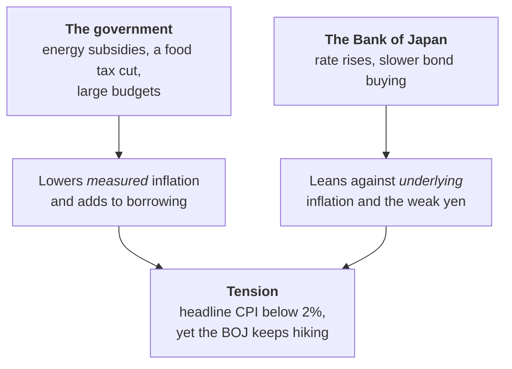

# Lesson 8: Japan Today, the Dashboard

*Every key reading in one place, what each one tells you, and the two most important prices in Japanese finance in twenty-year context.*

---

## The short version

As of early October 2026 the BOJ's policy rate is **1.25%**, the 10-year government bond yields about **3.1%** and the yen trades at around **158** per dollar. The economy is growing slowly, wages are rising by about 5% a year, and measured inflation sits just below 2%, largely because the government is subsidising energy bills.

<svg viewBox="0 0 680 420" width="100%" role="img" aria-label="Six small line charts, monthly from 2016 to 2026, one for each dial. The overnight call rate rose from about minus 0.05% to 1.04% in September 2026. The 10-year JGB yield rose from about zero to 2.99%. The yen per dollar went from about 110 to about 156. Core inflation went from around zero to over 4% in early 2023 and was 1.7% in August 2026. Unemployment stayed between about 2.2% and 3.1% and was 2.4%. The Nikkei 225 rose from below 20,000 to an average of about 65,048 in September 2026." fill="none" xmlns="http://www.w3.org/2000/svg">
<text x="20" y="28" font-size="14" fill="currentColor" font-weight="600">The dials, ten years on</text>
<text x="20" y="45.5" font-size="11.5" fill="currentColor" opacity="0.72">Monthly, 2016 to the latest reading</text>
<text x="30" y="64" font-size="11" fill="currentColor" font-weight="600" opacity="0.85">Policy rate (call rate)</text>
<text x="220" y="64" font-size="13" fill="currentColor" text-anchor="end" font-weight="600">1.04%</text>
<text x="220" y="78" font-size="10" fill="currentColor" text-anchor="end" opacity="0.7">Sep 2026 avg</text>
<text x="30" y="78" font-size="10" fill="currentColor" opacity="0.7">from 0.07%</text>
<line x1="30" y1="161.3" x2="220" y2="161.3" stroke="currentColor" stroke-width="1" stroke-opacity="0.35"/>
<polyline points="30,156.4 31.5,159.2 33,161.5 34.5,163.8 35.9,165.3 37.4,165 38.9,164.2 40.4,164.2 41.9,164.8 43.4,163.8 44.8,164.6 46.3,164.3 47.8,164.3 49.3,163.9 50.8,164.1 52.3,165 53.7,164.9 55.2,165 56.7,165 58.2,164.6 59.7,165.2 61.2,163.8 62.7,164.6 64.1,164.2 65.6,164 67.1,164.1 68.6,165.4 70.1,165.5 71.6,165.4 73,166.1 74.5,166 76,165.3 77.5,165.2 79,165.4 80.5,166 82,165.8 83.4,165.6 84.9,165 86.4,164.3 87.9,165.8 89.4,164.6 90.9,165.5 92.3,166.1 93.8,164.4 95.3,165.3 96.8,162.8 98.3,164.2 99.8,163.8 101.3,163.5 102.7,162.4 104.2,164.5 105.7,163.7 107.2,164.5 108.7,164.5 110.2,163.2 111.6,163.7 113.1,164.9 114.6,162.6 116.1,163.5 117.6,163.1 119.1,162.5 120.5,162.4 122,162.4 123.5,162.2 125,162.5 126.5,163.3 128,163.7 129.5,163.6 130.9,162.8 132.4,163.2 133.9,164 135.4,163 136.9,162.7 138.4,162.6 139.8,161.9 141.3,162.1 142.8,162.5 144.3,163.9 145.8,162.2 147.3,162.6 148.7,164.6 150.2,164.6 151.7,165.8 153.2,165.7 154.7,162.7 156.2,162.6 157.7,162.5 159.1,162.3 160.6,164.7 162.1,165.8 163.6,164.4 165.1,165.6 166.6,164.9 168,162.7 169.5,162.3 171,162.2 172.5,162.2 174,161.7 175.5,159.9 177,156.2 178.4,156.2 179.9,156.2 181.4,156.2 182.9,146.2 184.4,146.2 185.9,146.2 187.3,146.2 188.8,146.2 190.3,141.8 191.8,129.5 193.3,129.6 194.8,129.6 196.3,129.6 197.7,129.6 199.2,129.6 200.7,129.6 202.2,129.6 203.7,129.6 205.2,129.5 206.6,124.3 208.1,112.9 209.6,112.9 211.1,112.9 212.6,112.9 214.1,112.9 215.5,105.4 217,96.3 218.5,96.3 220,91.9" class="vs8" stroke="#e34948" stroke-width="1.8" stroke-linejoin="round" stroke-linecap="round" fill="none"/>
<circle cx="220" cy="91.9" r="3.5" class="vf8 vring" fill="#e34948" stroke="#ffffff" stroke-width="2"/>
<text x="30" y="186" font-size="9.5" fill="currentColor" opacity="0.6">2016</text>
<text x="220" y="186" font-size="9.5" fill="currentColor" text-anchor="end" opacity="0.6">2026</text>
<text x="245" y="64" font-size="11" fill="currentColor" font-weight="600" opacity="0.85">10-year JGB yield</text>
<text x="435" y="64" font-size="13" fill="currentColor" text-anchor="end" font-weight="600">2.99%</text>
<text x="435" y="78" font-size="10" fill="currentColor" text-anchor="end" opacity="0.7">Sep 2026 avg</text>
<text x="245" y="78" font-size="10" fill="currentColor" opacity="0.7">from 0.22%</text>
<line x1="245" y1="160.2" x2="435" y2="160.2" stroke="currentColor" stroke-width="1" stroke-opacity="0.35"/>
<polyline points="245,155.1 246.5,159.6 248,161.6 249.5,162.3 250.9,162.5 252.4,163.9 253.9,166.1 255.4,162 256.9,161.2 258.4,161.5 259.8,160.3 261.3,159 262.8,158.7 264.3,158.1 265.8,158.6 267.3,159.5 268.7,159.2 270.2,159 271.7,158.4 273.2,159.1 274.7,159.7 276.2,158.7 277.7,159.2 279.1,159.1 280.6,158.4 282.1,158.6 283.6,159.3 285.1,159.2 286.6,159.1 288,159.1 289.5,159 291,157.7 292.5,157.3 294,157 295.5,157.6 297,159 298.4,160 299.9,160.6 301.4,160.9 302.9,161.1 304.4,161.5 305.9,163 307.3,163.5 308.8,165.4 310.3,165.3 311.8,163.9 313.3,162.1 314.8,160.4 316.3,160.5 317.7,161.4 319.2,160.6 320.7,160.2 322.2,160.1 323.7,159.6 325.2,159.6 326.6,159.3 328.1,159.4 329.6,159.5 331.1,159.5 332.6,159.6 334.1,159.3 335.5,158.1 337,157.6 338.5,158 340,158.2 341.5,158.6 343,159.6 344.5,159.7 345.9,158.9 347.4,158.2 348.9,158.4 350.4,158.7 351.9,157 353.4,155.4 354.8,155.5 356.3,154.7 357.8,154.6 359.3,154.4 360.8,154.9 362.3,155.4 363.7,154 365.2,154.3 366.7,154.1 368.2,152 369.7,149.2 371.2,148.3 372.7,151 374.1,149.5 375.6,150.6 377.1,150.5 378.6,149.6 380.1,145.6 381.6,143.9 383,141.4 384.5,141.7 386,144.5 387.5,145.2 389,143.7 390.5,143 392,141 393.4,137.9 394.9,137.2 396.4,135.8 397.9,139.6 399.4,139.9 400.9,138.6 402.3,136.3 403.8,135.5 405.3,132.7 406.8,129.2 408.3,125.5 409.8,129.9 411.3,126.9 412.7,126.6 414.2,125.3 415.7,124.3 417.2,123.1 418.7,122.1 420.2,120.3 421.6,115 423.1,109.9 424.6,110 426.1,109 427.6,105 429.1,99.8 430.5,99.6 432,96.9 433.5,94.7 435,91.9" class="vs3" stroke="#1baf7a" stroke-width="1.8" stroke-linejoin="round" stroke-linecap="round" fill="none"/>
<circle cx="435" cy="91.9" r="3.5" class="vf3 vring" fill="#1baf7a" stroke="#ffffff" stroke-width="2"/>
<text x="245" y="186" font-size="9.5" fill="currentColor" opacity="0.6">2016</text>
<text x="435" y="186" font-size="9.5" fill="currentColor" text-anchor="end" opacity="0.6">2026</text>
<text x="460" y="64" font-size="11" fill="currentColor" font-weight="600" opacity="0.85">Yen per dollar</text>
<text x="650" y="64" font-size="13" fill="currentColor" text-anchor="end" font-weight="600">156</text>
<text x="650" y="78" font-size="10" fill="currentColor" text-anchor="end" opacity="0.7">Sep 2026 avg</text>
<text x="460" y="78" font-size="10" fill="currentColor" opacity="0.7">from 118</text>
<polyline points="460,145.5 461.5,149.8 463,151.9 464.5,156 465.9,156.8 467.4,161.1 468.9,162.5 470.4,166.1 471.9,165.4 473.4,162.8 474.8,157.3 476.3,148.2 477.8,149.5 479.3,151.9 480.8,151.9 482.3,155.3 483.7,152.7 485.2,154.3 486.7,152.5 488.2,155.6 489.7,154.5 491.2,151.9 492.7,152 494.1,151.9 495.6,154.4 497.1,157.9 498.6,160.2 500.1,158.3 501.6,155.8 503,155.4 504.5,153.6 506,154.2 507.5,152.9 509,152.1 510.5,151.4 512,152.8 513.4,156.7 514.9,154.9 516.4,154 517.9,153.4 519.4,155.5 520.9,157.8 522.3,157.5 523.8,160.1 525.3,158.4 526.8,157.7 528.3,156.8 529.8,156.5 531.3,156.3 532.7,155.4 534.2,158.3 535.7,158.2 537.2,158.8 538.7,158.4 540.2,159.5 541.6,160.3 543.1,160.8 544.6,161.2 546.1,162.2 547.6,163 549.1,163 550.5,161 552,157 553.5,156.6 555,156.5 556.5,155.3 558,155.2 559.5,155.6 560.9,155.2 562.4,151.6 563.9,150.6 565.4,150.8 566.9,149.6 568.4,149 569.8,145 571.3,135.6 572.8,132.6 574.3,126.4 575.8,123 577.3,124.8 578.7,115 580.2,110.5 581.7,116.1 583.2,125.2 584.7,130.6 586.2,127.5 587.7,126.7 589.1,126.9 590.6,122.6 592.1,117.4 593.6,117.9 595.1,113.2 596.6,109.5 598,107.4 599.5,107.3 601,114.2 602.5,111.4 604,107.4 605.5,107.1 607,102.2 608.4,99.8 609.9,97.4 611.4,97.8 612.9,111.4 614.4,115.4 615.9,107 617.3,102.4 618.8,102.3 620.3,99 621.8,105 623.3,108 624.8,114 626.3,113.1 627.7,113.6 629.2,110.3 630.7,110 632.2,109.5 633.7,105.2 635.2,100.7 636.6,99.7 638.1,98.8 639.6,100.7 641.1,96.4 642.6,95.8 644.1,97 645.5,93.8 647,91.9 648.5,96.2 650,99.3" class="vs7" stroke="#4a3aa7" stroke-width="1.8" stroke-linejoin="round" stroke-linecap="round" fill="none"/>
<circle cx="650" cy="99.3" r="3.5" class="vf7 vring" fill="#4a3aa7" stroke="#ffffff" stroke-width="2"/>
<text x="460" y="186" font-size="9.5" fill="currentColor" opacity="0.6">2016</text>
<text x="650" y="186" font-size="9.5" fill="currentColor" text-anchor="end" opacity="0.6">2026</text>
<text x="30" y="239" font-size="11" fill="currentColor" font-weight="600" opacity="0.85">Core inflation</text>
<text x="220" y="239" font-size="13" fill="currentColor" text-anchor="end" font-weight="600">1.7%</text>
<text x="220" y="253" font-size="10" fill="currentColor" text-anchor="end" opacity="0.7">Aug 2026</text>
<text x="30" y="253" font-size="10" fill="currentColor" opacity="0.7">from −0.1%</text>
<line x1="30" y1="326.5" x2="220" y2="326.5" stroke="currentColor" stroke-width="1" stroke-opacity="0.35"/>
<polyline points="30,327.5 31.5,327 33,330.6 34.5,331.8 36,332.4 37.5,331.8 39,333 40.5,332.9 42,332.9 43.5,331.7 45,331.8 46.5,329.9 48,324.9 49.4,323.6 50.9,323 52.4,322 53.9,320.5 55.4,321.1 56.9,319.3 58.4,317.1 59.9,316.3 61.4,314.9 62.9,313.5 64.4,314.1 65.9,314.3 67.4,312.3 68.9,314 70.4,316 71.9,316.2 73.4,315.3 74.9,315.1 76.4,313.2 77.9,312.9 79.4,311.9 80.9,313.3 82.4,316.1 83.9,315.5 85.4,315.9 86.9,314.8 88.3,313.5 89.8,315.6 91.3,318.1 92.8,318.2 94.3,319.4 95.8,321.7 97.3,320.9 98.8,318.7 100.3,315.9 101.8,315.3 103.3,318.6 104.8,320.5 106.3,329.2 107.8,329.1 109.3,326.9 110.8,326.1 112.3,332 113.8,330.9 115.3,335.9 116.8,339.7 118.3,341.1 119.8,336.4 121.3,334.1 122.8,331.4 124.3,338.6 125.7,334.5 127.2,333.6 128.7,328.6 130.2,326.8 131.7,325 133.2,324.5 134.7,319.2 136.2,319.4 137.7,323 139.2,318.2 140.7,314.6 142.2,296 143.7,297.1 145.2,295.4 146.7,292.3 148.2,287 149.7,283.3 151.2,275.8 152.7,274.3 154.2,269.5 155.7,266.9 157.2,281.7 158.7,281.9 160.2,278.4 161.7,281.4 163.1,279.8 164.6,281.8 166.1,282.7 167.6,287.2 169.1,285.8 170.6,290.6 172.1,294.2 173.6,297.3 175.1,286.6 176.6,289.8 178.1,295.3 179.6,290.4 181.1,289.1 182.6,288.2 184.1,286.3 185.6,293 187.1,294.3 188.6,288.7 190.1,283.7 191.6,280.9 193.1,284 194.6,281.5 196.1,276 197.6,274.5 199.1,278.9 200.6,282.5 202,287.8 203.5,284.5 205,283.4 206.5,284.3 208,292.7 209.5,299.3 211,304.6 212.5,301.9 214,306.6 215.5,306.4 217,304.4 218.5,301.4 220,301.8" class="vs2" stroke="#eb6834" stroke-width="1.8" stroke-linejoin="round" stroke-linecap="round" fill="none"/>
<circle cx="220" cy="301.8" r="3.5" class="vf2 vring" fill="#eb6834" stroke="#ffffff" stroke-width="2"/>
<text x="30" y="361" font-size="9.5" fill="currentColor" opacity="0.6">2016</text>
<text x="220" y="361" font-size="9.5" fill="currentColor" text-anchor="end" opacity="0.6">2026</text>
<text x="245" y="239" font-size="11" fill="currentColor" font-weight="600" opacity="0.85">Unemployment rate</text>
<text x="435" y="239" font-size="13" fill="currentColor" text-anchor="end" font-weight="600">2.4%</text>
<text x="435" y="253" font-size="10" fill="currentColor" text-anchor="end" opacity="0.7">Jul 2026</text>
<text x="245" y="253" font-size="10" fill="currentColor" opacity="0.7">from 3.2%</text>
<polyline points="245,273.7 246.5,266.9 248,273.7 249.5,273.7 251,273.7 252.5,280.4 254,287.2 255.6,280.4 257.1,287.2 258.6,287.2 260.1,287.2 261.6,287.2 263.1,287.2 264.6,293.9 266.1,300.6 267.6,300.6 269.1,287.2 270.6,300.6 272.1,300.6 273.7,300.6 275.2,300.6 276.7,307.4 278.2,307.4 279.7,307.4 281.2,327.6 282.7,320.8 284.2,320.8 285.7,320.8 287.2,341.1 288.7,327.6 290.2,320.8 291.7,320.8 293.3,334.3 294.8,327.6 296.3,320.8 297.8,320.8 299.3,320.8 300.8,327.6 302.3,320.8 303.8,327.6 305.3,334.3 306.8,334.3 308.3,334.3 309.8,334.3 311.3,327.6 312.9,327.6 314.4,334.3 315.9,341.1 317.4,327.6 318.9,327.6 320.4,320.8 321.9,314.1 323.4,300.6 324.9,300.6 326.4,293.9 327.9,287.2 329.4,287.2 331,280.4 332.5,287.2 334,280.4 335.5,287.2 337,293.9 338.5,307.4 340,293.9 341.5,293.9 343,293.9 344.5,300.6 346,300.6 347.5,307.4 349,307.4 350.6,300.6 352.1,307.4 353.6,300.6 355.1,307.4 356.6,314.1 358.1,314.1 359.6,314.1 361.1,314.1 362.6,320.8 364.1,320.8 365.6,314.1 367.1,314.1 368.7,320.8 370.2,320.8 371.7,320.8 373.2,314.1 374.7,307.4 376.2,314.1 377.7,320.8 379.2,320.8 380.7,314.1 382.2,314.1 383.7,314.1 385.2,320.8 386.7,314.1 388.3,320.8 389.8,320.8 391.3,314.1 392.8,314.1 394.3,314.1 395.8,314.1 397.3,320.8 398.8,307.4 400.3,320.8 401.8,327.6 403.3,320.8 404.8,320.8 406.3,320.8 407.9,320.8 409.4,327.6 410.9,320.8 412.4,320.8 413.9,320.8 415.4,320.8 416.9,327.6 418.4,314.1 419.9,314.1 421.4,314.1 422.9,314.1 424.4,314.1 426,307.4 427.5,314.1 429,307.4 430.5,320.8 432,320.8 433.5,320.8 435,327.6" class="vs6" stroke="#008300" stroke-width="1.8" stroke-linejoin="round" stroke-linecap="round" fill="none"/>
<circle cx="435" cy="327.6" r="3.5" class="vf6 vring" fill="#008300" stroke="#ffffff" stroke-width="2"/>
<text x="245" y="361" font-size="9.5" fill="currentColor" opacity="0.6">2016</text>
<text x="435" y="361" font-size="9.5" fill="currentColor" text-anchor="end" opacity="0.6">2026</text>
<text x="460" y="239" font-size="11" fill="currentColor" font-weight="600" opacity="0.85">Nikkei 225</text>
<text x="650" y="239" font-size="13" fill="currentColor" text-anchor="end" font-weight="600">65,048</text>
<text x="650" y="253" font-size="10" fill="currentColor" text-anchor="end" opacity="0.7">Sep 2026 avg</text>
<text x="460" y="253" font-size="10" fill="currentColor" opacity="0.7">from 17,302</text>
<polyline points="460,339.3 461.5,340.7 463,339.9 464.5,340.4 465.9,340.3 467.4,341.1 468.9,340.9 470.4,340.3 471.9,340.1 473.4,339.7 474.8,338.8 476.3,336.8 477.8,336.6 479.3,336.6 480.8,336.4 482.3,337.3 483.7,335.9 485.2,335.4 486.7,335.4 488.2,336 489.7,335.6 491.2,333.7 492.7,331.9 494.1,331.6 495.6,330.2 497.1,332.7 498.6,333.5 500.1,332.8 501.6,331.8 503,331.9 504.5,332.2 506,332 507.5,331 509,331.7 510.5,332.7 512,334 513.4,334.8 514.9,333.9 516.4,333.5 517.9,332.7 519.4,333.8 520.9,334 522.3,333.2 523.8,334.6 525.3,333.2 526.8,332.4 528.3,330.8 529.8,330.3 531.3,330.3 532.7,331 534.2,336.9 535.7,336.6 537.2,334.7 538.7,332 540.2,331.9 541.6,331.4 543.1,330.8 544.6,330.6 546.1,327.9 547.6,325.9 549.1,323.9 550.5,322.1 552,322.3 553.5,322.1 555,323.4 556.5,322.8 558,324 559.5,324.6 560.9,321.5 562.4,323.3 563.9,322.2 565.4,323.4 566.9,324.3 568.4,325.5 569.8,326.2 571.3,325.5 572.8,326.1 574.3,325.6 575.8,325.6 577.3,323.6 578.7,325 580.2,325.6 581.7,324.3 583.2,325.3 584.7,326.1 586.2,324.8 587.7,324.6 589.1,323.8 590.6,321.1 592.1,317.4 593.6,317.5 595.1,318.2 596.6,317.4 598,319.4 599.5,317.1 601,316.9 602.5,313.6 604,310.3 605.5,307.3 607,308.9 608.4,309.2 609.9,308.7 611.4,307 612.9,311.6 614.4,310.9 615.9,308.8 617.3,309 618.8,308.1 620.3,308.1 621.8,308.9 623.3,310.9 624.8,315.2 626.3,310.7 627.7,309.3 629.2,306.9 630.7,303.9 632.2,301.1 633.7,295 635.2,292.8 636.6,292.7 638.1,288.6 639.6,283.8 641.1,287.3 642.6,282.7 644.1,274.8 645.5,266.9 647,269.5 648.5,269.7 650,271.6" class="vs4" stroke="#eda100" stroke-width="1.8" stroke-linejoin="round" stroke-linecap="round" fill="none"/>
<circle cx="650" cy="271.6" r="3.5" class="vf4 vring" fill="#eda100" stroke="#ffffff" stroke-width="2"/>
<text x="460" y="361" font-size="9.5" fill="currentColor" opacity="0.6">2016</text>
<text x="650" y="361" font-size="9.5" fill="currentColor" text-anchor="end" opacity="0.6">2026</text>
<text x="20" y="412" font-size="10.5" fill="currentColor" opacity="0.6">Sources: Bank of Japan; Ministry of Finance; MIC; Statistics Bureau and Nikkei via FRED; Federal Reserve H.10.</text>
</svg>

Each small chart is one of Lesson 1's dials over the last ten years. Read them as a set and the shape of the decade is plain: everything stayed frozen until 2022, and almost everything has moved since.

---

## The readings

| Indicator | Latest reading | What it tells you |
| --- | --- | --- |
| **BOJ policy rate** | 1.25%, from 18 September 2026 | Highest since 1995; six rises since March 2024 |
| **Real GDP growth** | +0.4% on the quarter (+1.4% annualised), April to June 2026 | Steady but unspectacular; household spending is flat |
| **Nominal GDP** | About ¥689 trillion a year, April to June 2026 | Roughly 37% larger than in fiscal 2012, mostly thanks to inflation |
| **Core CPI** (excluding fresh food) | 1.7% on a year earlier, August 2026 | Below 2% every month of 2026, held down by energy subsidies and falling rice prices |
| **Core-core CPI** (also excluding energy) | 1.9%, August 2026 | The underlying trend is close to the BOJ's 2% target |
| **Spring wage settlements** (shunto) | 5.01%, 2026 | Third straight year above 5%, a run not seen since 1989 to 1991 |
| **Real wages** | Rising on a year earlier through 2026 | Turned positive in January 2026 after falling every month of 2025 |
| **Unemployment** | 2.4%, July 2026 | Still a very tight labour market |
| **2-year JGB yield** | 1.94%, 1 October 2026 | Markets expect more BOJ hikes |
| **10-year JGB yield** | 3.09%, 1 October 2026 | Highest since the mid-1990s; around 3% since September |
| **30-year JGB yield** | 4.12%, 1 October 2026 | Near record highs; the long end is where fiscal worries show first |
| **Yen per dollar** | About 158, late September 2026 | Near 40-year lows despite record intervention |
| **Gross government debt** | About 204% of GDP, 2026 (IMF estimate) | Down from about 229% in 2020 as nominal GDP has grown |
| **Net government debt** | About 134% of GDP, 2026 (IMF estimate) | The state also owns large financial assets |
| **BOJ share of JGBs** | 46.7%, June 2026 (47.9% in March) | Still the dominant holder, but slowly shrinking |
| **Foreign share of JGBs** | 7.9% (13.1% including Treasury bills), June 2026 | Small, but foreigners trade actively and set prices at the margin |
| **Interest payments in the budget** | ¥13.1 trillion, fiscal 2026 | About a tenth of central government spending, and rising |
| **Nikkei 225** | Record close of 72,366 on 25 June 2026; about 69,900 on 5 October | An AI-led rally; around 64,000 in early September |

Two numbers in the table need care. JGB yields here are the Ministry of Finance's end-of-day figures; news agencies quoting a specific benchmark bond may show a few hundredths more (for example 3.10% and 4.18% on 1 October). And "interest payments" is only part of the state's **debt service**: add the money set aside to repay maturing bonds and the total is ¥31.3 trillion, a quarter of central government spending.

---

## The two most important prices in Japanese finance

<svg viewBox="0 0 680 480" width="100%" role="img" aria-label="Two-panel chart, 2005 to 2026. Top panel: policy rates. The US Federal Reserve rate (top of its range) rose to 5.25% in 2006 and 2007, fell to near zero from 2008 to 2015, rose to 2.5% in 2018 and to 5.5% in 2023, and was 4% in October 2026. The Bank of Japan rate stayed between minus 0.1% and 0.5% for the whole period until 2025 and reached 1.25% in September 2026. Bottom panel: the yen per dollar, monthly average. The yen weakened when the gap between US and Japanese rates was wide, in 2005 to 2007 and from 2022, and strengthened when the gap collapsed after 2008. It averaged about 156 in September 2026." fill="none" xmlns="http://www.w3.org/2000/svg">
<text x="20" y="28" font-size="14" fill="currentColor" font-weight="600">Twenty years of the rate gap and the yen</text>
<text x="20" y="45.5" font-size="11.5" fill="currentColor" opacity="0.72">The two most important prices in Japanese finance</text>
<text x="70" y="62" font-size="11" fill="currentColor" font-weight="600" opacity="0.85">Policy rates, %</text>
<line x1="70" y1="208.8" x2="590" y2="208.8" stroke="currentColor" stroke-width="1" stroke-opacity="0.45"/>
<text x="62" y="212.7" font-size="11" fill="currentColor" text-anchor="end" opacity="0.72" style="font-variant-numeric:tabular-nums">0%</text>
<line x1="70" y1="163.8" x2="590" y2="163.8" stroke="currentColor" stroke-width="1" stroke-opacity="0.12"/>
<text x="62" y="167.8" font-size="11" fill="currentColor" text-anchor="end" opacity="0.72" style="font-variant-numeric:tabular-nums">2%</text>
<line x1="70" y1="118.9" x2="590" y2="118.9" stroke="currentColor" stroke-width="1" stroke-opacity="0.12"/>
<text x="62" y="122.9" font-size="11" fill="currentColor" text-anchor="end" opacity="0.72" style="font-variant-numeric:tabular-nums">4%</text>
<line x1="70" y1="74" x2="590" y2="74" stroke="currentColor" stroke-width="1" stroke-opacity="0.12"/>
<text x="62" y="78" font-size="11" fill="currentColor" text-anchor="end" opacity="0.72" style="font-variant-numeric:tabular-nums">6%</text>
<polyline points="70,158.2 72,158.2 72,152.6 75.2,152.6 75.2,147 77.9,147 77.9,141.4 81.6,141.4 81.6,135.8 84.1,135.8 84.1,130.2 86.8,130.2 86.8,124.5 89.4,124.5 89.4,118.9 92.2,118.9 92.2,113.3 95.2,113.3 95.2,107.7 98.9,107.7 98.9,102.1 101.7,102.1 101.7,96.5 104.8,96.5 104.8,90.8 133.3,90.8 133.3,102.1 136.1,102.1 136.1,107.7 138.7,107.7 138.7,113.3 141.3,113.3 141.3,130.2 141.8,130.2 141.8,141.4 145,141.4 145,158.2 147.7,158.2 147.7,163.8 157.9,163.8 157.9,175.1 159.3,175.1 159.3,186.3 162.3,186.3 162.3,203.2 325.6,203.2 325.6,197.5 348.8,197.5 348.8,191.9 354.8,191.9 354.8,186.3 360.6,186.3 360.6,180.7 372.2,180.7 372.2,175.1 378.5,175.1 378.5,169.5 383.8,169.5 383.8,163.8 390.5,163.8 390.5,158.2 395.9,158.2 395.9,152.6 410.2,152.6 410.2,158.2 413.3,158.2 413.3,163.8 416,163.8 416,169.5 424,169.5 424,180.7 424.8,180.7 424.8,203.2 471.5,203.2 471.5,197.5 474.6,197.5 474.6,186.3 477.3,186.3 477.3,169.5 480,169.5 480,152.6 483.5,152.6 483.5,135.8 486.2,135.8 486.2,118.9 488.9,118.9 488.9,107.7 491.9,107.7 491.9,102.1 495.2,102.1 495.2,96.5 497.9,96.5 497.9,90.8 503.3,90.8 503.3,85.2 530,85.2 530,96.5 533.1,96.5 533.1,102.1 535.8,102.1 535.8,107.7 553.2,107.7 553.2,113.3 555.9,113.3 555.9,118.9 558.6,118.9 558.6,124.5 576.5,124.5 576.5,118.9 577.7,118.9" class="vs1" stroke="#2a78d6" stroke-width="2" stroke-linejoin="round" stroke-linecap="round" fill="none"/>
<polyline points="70,208.8 97.7,208.8 97.7,208.8 105.8,208.8 105.8,203.2 119.9,203.2 119.9,197.5 159.4,197.5 159.4,202 162.5,202 162.5,206.5 204.4,206.5 204.4,207.6 262.7,207.6 262.7,207.6 328.4,207.6 328.4,211 518.3,211 518.3,207.6 526.8,207.6 526.8,203.2 538.1,203.2 538.1,197.5 559.1,197.5 559.1,191.9 570.6,191.9 570.6,186.3 576.6,186.3 576.6,180.7 577.7,180.7" class="vs8" stroke="#e34948" stroke-width="2.2" stroke-linejoin="round" stroke-linecap="round" fill="none"/>
<text x="583.7" y="122.9" font-size="11" fill="currentColor" font-weight="600">Fed</text>
<text x="583.7" y="184.7" font-size="11" fill="currentColor" font-weight="600">BOJ</text>
<text x="70" y="250" font-size="11" fill="currentColor" font-weight="600" opacity="0.85">Yen per US dollar, monthly average (higher = weaker yen)</text>
<line x1="70" y1="413.2" x2="590" y2="413.2" stroke="currentColor" stroke-width="1" stroke-opacity="0.12"/>
<text x="62" y="417.2" font-size="11" fill="currentColor" text-anchor="end" opacity="0.72" style="font-variant-numeric:tabular-nums">80</text>
<line x1="70" y1="379.6" x2="590" y2="379.6" stroke="currentColor" stroke-width="1" stroke-opacity="0.12"/>
<text x="62" y="383.6" font-size="11" fill="currentColor" text-anchor="end" opacity="0.72" style="font-variant-numeric:tabular-nums">100</text>
<line x1="70" y1="346" x2="590" y2="346" stroke="currentColor" stroke-width="1" stroke-opacity="0.12"/>
<text x="62" y="350" font-size="11" fill="currentColor" text-anchor="end" opacity="0.72" style="font-variant-numeric:tabular-nums">120</text>
<line x1="70" y1="312.4" x2="590" y2="312.4" stroke="currentColor" stroke-width="1" stroke-opacity="0.12"/>
<text x="62" y="316.4" font-size="11" fill="currentColor" text-anchor="end" opacity="0.72" style="font-variant-numeric:tabular-nums">140</text>
<line x1="70" y1="278.8" x2="590" y2="278.8" stroke="currentColor" stroke-width="1" stroke-opacity="0.12"/>
<text x="62" y="282.8" font-size="11" fill="currentColor" text-anchor="end" opacity="0.72" style="font-variant-numeric:tabular-nums">160</text>
<polyline points="71,374 72.9,371.3 74.9,370.8 76.8,367.5 78.7,368.5 80.7,364.9 82.6,359.5 84.6,361.8 86.5,360.7 88.5,354.6 90.4,348.6 92.4,348.6 94.3,353.6 96.2,349.6 98.2,350.6 100.1,350.9 102.1,359.9 104,355 106,353.1 107.9,352.8 109.9,350.7 111.8,348.3 113.7,350.5 115.7,350.5 117.6,345.2 119.6,345.2 121.5,350.6 123.5,347.8 125.4,344.7 127.4,341.5 129.3,343.6 131.2,351.5 133.2,354.3 135.1,352.9 137.1,361 139,358.7 141,366.5 142.9,367.8 144.8,378.3 146.8,375.1 148.7,372.3 150.7,368 152.6,368.1 154.6,363.9 156.5,368.6 158.5,379.7 160.4,384.7 162.3,394.3 164.3,396.2 166.2,391.5 168.2,383.2 170.1,381.4 172.1,385.2 174,385.3 176,389.1 177.9,388.2 179.8,394.3 181.8,395.8 183.7,397.6 185.7,396.5 187.6,394.6 189.6,396.2 191.5,395.2 193.5,390.6 195.4,393.1 197.3,395 199.3,400.6 201.2,404.2 203.2,405.9 205.1,410.3 207.1,409 209,407.6 210.9,408.8 212.9,408.9 214.8,410.4 216.8,407.9 218.7,411.3 220.7,412.5 222.6,414.5 224.6,418.3 226.5,418.6 228.4,418.8 230.4,417.3 232.3,416.9 234.3,418.3 236.2,415.8 238.2,409.1 240.1,411.1 242.1,413.8 244,414.4 245.9,415 247.9,415.4 249.8,416.3 251.8,414.9 253.7,411.5 255.7,406.8 257.6,398 259.6,391.4 261.5,388.4 263.4,383.4 265.4,378.1 267.3,384.2 269.3,380.1 271.2,383.3 273.2,380.9 275.1,383.3 277,379.5 279,373.8 280.9,373.3 282.9,376 284.8,375.7 286.8,375.5 288.7,376.6 290.7,376.1 292.6,376.7 294.5,374.7 296.5,367.1 298.4,366.1 300.4,352.2 302.3,347.1 304.3,348.9 306.2,348.1 308.2,345.3 310.1,346.8 312,344.7 314,339.8 315.9,340.4 317.9,341 319.8,345.8 321.8,345.9 323.7,341.6 325.6,343.3 327.6,349 329.5,355 331.5,357.9 333.4,363.6 335.4,364.7 337.3,370.6 339.3,372.6 341.2,377.5 343.1,376.6 345.1,373 347,365.4 349,352.7 350.9,354.6 352.9,357.9 354.8,357.9 356.8,362.6 358.7,359 360.6,361.3 362.6,358.7 364.5,363.1 366.5,361.5 368.4,357.9 370.4,358.1 372.3,357.9 374.3,361.3 376.2,366.2 378.1,369.4 380.1,366.7 382,363.3 384,362.7 385.9,360.2 387.9,361.1 389.8,359.3 391.7,358.2 393.7,357.2 395.6,359.1 397.6,364.5 399.5,362.1 401.5,360.9 403.4,360 405.4,362.8 407.3,366 409.2,365.7 411.2,369.2 413.1,366.9 415.1,365.9 417,364.7 419,364.3 420.9,364 422.9,362.8 424.8,366.7 426.7,366.6 428.7,367.5 430.6,366.9 432.6,368.4 434.5,369.5 436.5,370.2 438.4,370.8 440.4,372.2 442.3,373.2 444.2,373.2 446.2,370.6 448.1,365 450.1,364.4 452,364.3 454,362.6 455.9,362.4 457.8,363 459.8,362.5 461.7,357.6 463.7,356.1 465.6,356.4 467.6,354.7 469.5,353.9 471.5,348.4 473.4,335.3 475.3,331.1 477.3,322.5 479.2,317.9 481.2,320.3 483.1,306.9 485.1,300.6 487,308.3 489,320.9 490.9,328.4 492.8,324.1 494.8,323 496.7,323.4 498.7,317.4 500.6,310.1 502.6,310.8 504.5,304.4 506.5,299.2 508.4,296.3 510.3,296.1 512.3,305.7 514.2,301.8 516.2,296.2 518.1,295.9 520.1,289.1 522,285.7 523.9,282.4 525.9,283 527.8,301.9 529.8,307.4 531.7,295.8 533.7,289.4 535.6,289.2 537.6,284.7 539.5,293 541.4,297.2 543.4,305.5 545.3,304.2 547.3,304.9 549.2,300.3 551.2,299.8 553.1,299.2 555.1,293.3 557,287 558.9,285.7 560.9,284.4 562.8,287 564.8,281 566.7,280.3 568.7,281.9 570.6,277.5 572.6,274.9 574.5,280.7 576.4,285.1" class="vs7" stroke="#4a3aa7" stroke-width="2" stroke-linejoin="round" stroke-linecap="round" fill="none"/>
<text x="582.4" y="289.1" font-size="11" fill="currentColor" font-weight="600">156</text>
<rect x="70" y="74" width="60.7" height="356" fill="currentColor" fill-opacity="0.05"/>
<text x="100.3" y="445" font-size="10" fill="currentColor" text-anchor="middle" opacity="0.7">wide gap</text>
<rect x="156.3" y="74" width="168" height="356" fill="currentColor" fill-opacity="0.05"/>
<text x="240.3" y="445" font-size="10" fill="currentColor" text-anchor="middle" opacity="0.7">gap near zero</text>
<rect x="471.3" y="74" width="106.4" height="356" fill="currentColor" fill-opacity="0.05"/>
<text x="524.5" y="445" font-size="10" fill="currentColor" text-anchor="middle" opacity="0.7">wide gap</text>
<text x="70" y="460" font-size="10.5" fill="currentColor" text-anchor="middle" opacity="0.72">2005</text>
<text x="186.6" y="460" font-size="10.5" fill="currentColor" text-anchor="middle" opacity="0.72">2010</text>
<text x="303.3" y="460" font-size="10.5" fill="currentColor" text-anchor="middle" opacity="0.72">2015</text>
<text x="419.9" y="460" font-size="10.5" fill="currentColor" text-anchor="middle" opacity="0.72">2020</text>
<text x="536.6" y="460" font-size="10.5" fill="currentColor" text-anchor="middle" opacity="0.72">2025</text>
<text x="20" y="474" font-size="10.5" fill="currentColor" opacity="0.6">Sources: Bank of Japan; Federal Reserve via FRED (DFEDTAR, DFEDTARU, DEXJPUS). Fed at the top of its range.</text>
</svg>

Read the two panels together and the mechanism from Lesson 1 jumps out. When the gap between American and Japanese rates widened, from 2005 to 2007 and again from 2022, the yen weakened. When the gap collapsed in 2008, the yen soared. The BOJ's six hikes since March 2024 have lifted its rate by 1.35 percentage points, but the Fed's own moves leave the gap at 2.75 points, so the yen remains weak.

Rate gaps are not the only driver, as Lesson 9 explains. But they are still the most powerful one.

---

## Two institutions pulling in opposite directions

One more feature of today's dashboard deserves attention: the government and the central bank are pulling in opposite directions.

The government is subsidising energy and planning a food tax cut, which lowers *measured* inflation and adds to borrowing. The BOJ is raising rates because it judges underlying price pressures to be stronger than the headline figures suggest. It says medium- to long-term inflation expectations are still rising and that cost pressures are beginning to pass through to consumer prices.

This is a reversal of the Abenomics era, when the government and the BOJ were formally allied in trying to push prices *up*. It also explains a puzzle in the table: why would a central bank raise rates when core inflation is 1.7%, below its own target? Because it is looking through the subsidies to the 1.9% core-core rate, the 5% wage settlements and the weak yen, all of which point to more inflation ahead.

---

## Check yourself

**1. Nominal GDP was ¥504.5 trillion in fiscal 2012 and about ¥689 trillion in mid-2026. Real GDP grew roughly 12% over the same period. Roughly how much of the nominal increase came from higher prices?**

Show the answer

Nominal growth: 689 ÷ 504.5 ≈ 1.366, a rise of about 37%. Dividing by real growth of about 12%: 1.366 ÷ 1.12 ≈ 1.22, so prices (the GDP deflator) rose about **22%**. Roughly **two thirds** of the nominal increase came from prices rather than volume.

**2. The 2-year JGB yields 1.94% and the policy rate is 1.25%. What does that suggest about market expectations?**

Show the answer

A 2-year yield is roughly the average short rate expected over the next two years plus a small premium. At 1.94%, about 0.7 points above today's 1.25%, markets are pricing **further BOJ hikes**, perhaps two or three more quarter-point moves over that period.

**3. Interest payments are ¥13.1 trillion and total debt service ¥31.3 trillion, out of total spending of ¥125.4 trillion. What shares of spending are those?**

Show the answer

13.1 ÷ 125.4 ≈ **10.4%** for interest; 31.3 ÷ 125.4 ≈ **25%** for total debt service. A quarter of the central government budget goes to servicing past borrowing before a single new policy is paid for.

---

## What to carry into Lesson 9

- Policy rate **1.25%**, 10-year yield about **3.1%**, yen about **158**, core inflation **1.7%**, core-core **1.9%**, wages up about **5%**.
- Debt is about **204%** of GDP gross and **134%** net, and falling as a share of GDP.
- The BOJ still owns nearly **half** the JGB market, but its share is shrinking.
- The **rate gap** with America, 2.75 points, still explains most of the yen's weakness.
- Government and BOJ are pulling in **opposite directions**: subsidies and tax cuts against rate rises.

Lesson 9 takes on the five big arguments about what happens next.

---

## Sources

- [Ministry of Finance: JGB Investor Presentation, August 2026 (budget, debt ratios, JGB holders)](https://www.mof.go.jp/english/policy/jgbs/IR/jgb_investor_presentation_2608e.pdf)
- [Ministry of Finance: breakdown by JGB and T-bill holders (June 2026, preliminary)](https://www.mof.go.jp/english/policy/jgbs/reference/Others/holdings01.pdf)
- [Ministry of Finance: JGB interest rates](https://www.mof.go.jp/english/policy/jgbs/reference/interest_rate/index.htm)
- [Statistics Bureau of Japan: CPI, August 2026](https://www.stat.go.jp/english/data/cpi/index.html)
- [Investing.com (Reuters): Japan revises April to June GDP to annualised 1.4% growth](https://www.investing.com/news/economy-news/japan-revises-q2-gdp-up-to-annualised-14-expansion-4890749)
- [investingLive: Japan wage hikes confirmed above 5% for a third year (5.01%, 3 July 2026)](https://investinglive.com/news/japan-wage-hikes-confirmed-to-have-topped-5-for-a-third-year-running-20260703/)
- [The Japan Times: real wages advance for the first time in 13 months](https://www.japantimes.co.jp/business/2026/03/09/economy/japan-real-wages-advance/)
- [IMF World Economic Outlook, April 2026](https://www.imf.org/external/datamapper/GGXWDG_NGDP@WEO/JPN)
