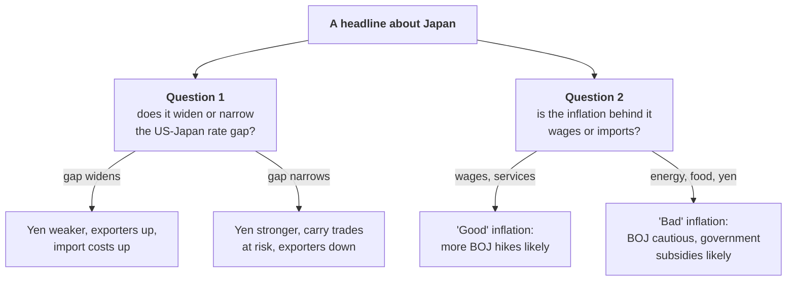

# Lesson 11: Reading the Headlines

*Two questions that decode most Japanese economic news, the releases that matter and when they come out, a translation table for common headlines, and a weekly routine for keeping up.*

---

## Two questions

Most Japanese economic news can be decoded with two questions.

1. **What does this do to the gap between Japanese and American interest rates?** That gap drives the yen, and the yen feeds through to inflation, profits, stocks and the BOJ's next move.
2. **Is the inflation behind it the "good" kind, driven by wages and domestic demand, or the "bad" kind, driven by imports and a weak yen?** The answer decides whether the BOJ will keep raising rates.

---

## The releases that matter

| Release or event | When | What to look for | Why it matters |
| --- | --- | --- | --- |
| **BOJ policy meetings** | Eight a year; the next is on 29 and 30 October 2026, with a new Outlook Report | The decision, the vote split, the governor's press conference and the inflation forecasts | Sets short-term rates and signals the pace of future hikes |
| **Spring wage talks (shunto)** | First results in mid-March; final tally in early July | Headline and small-firm settlements, especially base pay | The engine of self-sustaining "good" inflation |
| **Tokyo CPI, then national CPI** | Tokyo at the end of each month; national about three weeks later | Core-core and services inflation, adjusted for subsidies | Tokyo is an early read on the national figure |
| **BOJ Tankan survey** | Early April, July and October; mid-December | Business conditions, price expectations, investment plans and firms' exchange-rate assumptions | The BOJ's own read on how companies are behaving |
| **GDP** | About six weeks after each quarter, revised a month later | Consumption, business investment and nominal GDP | Shows whether demand can absorb higher rates |
| **JGB auctions** | Several times a month | **Bid-to-cover** ratios (how much was bid relative to the amount sold) and the **tail** (the gap between the average and lowest accepted prices), especially for 20-, 30- and 40-year bonds | Weak auctions are the first sign of fiscal stress |
| **The yen near 155 to 160** | Continuous | Escalating official language and the Ministry of Finance's month-end intervention totals | The zone where Tokyo has repeatedly intervened |
| **Budgets and fiscal plans** | Draft budget in December; extra budgets as needed; fiscal blueprint each June | Total spending, new bond issuance and how tax cuts are funded | Drives the long end of the bond market |
| **The Fed and oil** | Continuous | US rate expectations, oil prices and shipping through the Strait of Hormuz | The other half of the rate gap, and Japan's terms of trade |

### Reading the warnings before an intervention

The Ministry of Finance rarely intervenes without warning. It climbs a ladder of language first, and traders watch every rung.

<svg viewBox="0 0 680 330" width="100%" role="img" aria-label="Ladder diagram of how Japan typically escalates before intervening to support the yen. From bottom to top: officials say they are watching with a sense of urgency; they describe moves as excessive or speculative; they promise decisive action; they carry out a rate check, asking banks for quotes; and finally the Ministry of Finance intervenes, selling dollars to buy yen through the Bank of Japan. Each rung raises the odds of the next." fill="none" xmlns="http://www.w3.org/2000/svg">
<text x="20" y="28" font-size="14" fill="currentColor" font-weight="600">Reading the warnings before an intervention</text>
<text x="20" y="45.5" font-size="11.5" fill="currentColor" opacity="0.72">A typical escalation, bottom to top</text>
<rect x="190" y="236" width="300" height="38" rx="6" stroke="currentColor" stroke-width="1.2" stroke-opacity="0.4" class="vf7" fill="#4a3aa7" fill-opacity="0.06"/>
<text x="340" y="252" font-size="11.5" fill="currentColor" text-anchor="middle" font-weight="600">&quot;Watching with a sense of urgency&quot;</text>
<text x="340" y="266" font-size="10.5" fill="currentColor" text-anchor="middle" opacity="0.8">Officials signal concern; markets mostly shrug</text>
<rect x="165" y="190" width="350" height="38" rx="6" stroke="currentColor" stroke-width="1.2" stroke-opacity="0.4" class="vf7" fill="#4a3aa7" fill-opacity="0.11"/>
<text x="340" y="206" font-size="11.5" fill="currentColor" text-anchor="middle" font-weight="600">&quot;Excessive&quot; or &quot;speculative&quot; moves</text>
<text x="340" y="220" font-size="10.5" fill="currentColor" text-anchor="middle" opacity="0.8">The language Tokyo uses before acting</text>
<rect x="140" y="144" width="400" height="38" rx="6" stroke="currentColor" stroke-width="1.2" stroke-opacity="0.4" class="vf7" fill="#4a3aa7" fill-opacity="0.16"/>
<text x="340" y="160" font-size="11.5" fill="currentColor" text-anchor="middle" font-weight="600">&quot;Will take decisive action&quot;</text>
<text x="340" y="174" font-size="10.5" fill="currentColor" text-anchor="middle" opacity="0.8">Last verbal warning; traders get nervous</text>
<rect x="115" y="98" width="450" height="38" rx="6" stroke="currentColor" stroke-width="1.2" stroke-opacity="0.4" class="vf7" fill="#4a3aa7" fill-opacity="0.21000000000000002"/>
<text x="340" y="114" font-size="11.5" fill="currentColor" text-anchor="middle" font-weight="600">Rate check</text>
<text x="340" y="128" font-size="10.5" fill="currentColor" text-anchor="middle" opacity="0.8">Officials ask banks for quotes: a dress rehearsal</text>
<rect x="90" y="52" width="500" height="38" rx="6" stroke="currentColor" stroke-width="1.2" stroke-opacity="0.4" class="vf7" fill="#4a3aa7" fill-opacity="0.26"/>
<text x="340" y="68" font-size="11.5" fill="currentColor" text-anchor="middle" font-weight="600">Intervention</text>
<text x="340" y="82" font-size="10.5" fill="currentColor" text-anchor="middle" opacity="0.8">Ministry of Finance sells dollars and buys yen via the BOJ</text>
<line x1="60" y1="270" x2="60" y2="60" class="vs7" stroke="#4a3aa7" stroke-width="1.5" stroke-opacity="0.8"/>
<polygon points="60,60 62.9,66.4 57.1,66.4" class="vf7" fill="#4a3aa7" fill-opacity="0.8"/>
<text x="48" y="165" font-size="10.5" fill="currentColor" text-anchor="middle" opacity="0.75" transform="rotate(-90 48 165)">escalation</text>
<text x="20" y="322" font-size="10.5" fill="currentColor" opacity="0.6">Phrases are representative of Ministry of Finance statements, not exact quotations from any one episode.</text>
</svg>

Each step raises the odds of the next. A **rate check**, in which officials call banks to ask for exchange-rate quotes, is the last signal before real money moves. After an intervention, Japan does not confirm daily amounts at once: the month-end release gives the total for the period, and the daily breakdown follows each quarter. Until then, analysts estimate the size from the BOJ's daily figures for banks' reserve balances.

---

## Common headlines, translated

| If you read... | It usually means... | Check... |
| --- | --- | --- |
| **"BOJ raises rates, yen falls"** | Markets expected a faster path, or US rates are rising too | The vote split, the governor's tone and what the Fed did that week |
| **"JGB yields hit highest since the 1990s"** | Either healthier growth and inflation expectations, or fiscal fears | Whether short yields (BOJ expectations) or very long yields (fiscal risk) are leading, and recent auction results |
| **"Japan intervenes to support the yen"** | The Ministry of Finance sold dollars for yen; the BOJ only carries out the trades | Whether rate gaps are also narrowing, since intervention alone rarely turns the trend |
| **"Real wages fall (or rise) for the Xth month"** | Nominal pay growth compared with inflation | Whether subsidies or one-off food prices are distorting the inflation figure |
| **"Inflation below the BOJ's 2% target"** | The headline may be held down by subsidies | Core-core and services inflation, and the BOJ's own forecasts |
| **"Japan declares an end to deflation"** | A political judgement, not a data release | The government's yardsticks: CPI, the GDP deflator, unit labour costs and the output gap |
| **"Carry trade unwinds"** | The yen is rising fast as leveraged positions are closed | Global stock markets, the yen's daily move and any BOJ comment on market stability |
| **"Weak 30-year JGB auction"** | Long-term investors are demanding more to lend to the state | The tail, the bid-to-cover, and whether the Ministry of Finance trims long-bond issuance |

---

## A weekly routine

Fifteen minutes a week is enough to keep the whole machine in view.

1. **Check the gap.** Note the 2-year JGB yield and the 2-year US Treasury yield. Their difference is the market's expectation of the rate gap.
2. **Check the yen.** Where is it against 155 and 160, and what are officials saying?
3. **Check the long end.** Glance at the 30-year JGB yield and any auction results that week.
4. **Check the price data.** When Tokyo CPI is out, read core-core and services, not the headline.
5. **Check the calendar.** Is a BOJ meeting, Fed meeting, shunto result or budget coming up?

---

## Check yourself

**1. Suppose the 2-year JGB yields 1.94% and the 2-year US Treasury 3.90%, and a week later they are 2.10% and 3.70%. What happened to the expected rate gap, and what would you expect the yen to do?**

Show the answer

The gap narrowed from 1.96 to **1.60** points, as markets priced more BOJ hikes and fewer Fed hikes. Other things equal the yen should **strengthen** (the yen-per-dollar number falls), and carry traders would be nervous.

**2. A headline reads "Inflation slows to 1.5%, below the BOJ target", and the same week core-core inflation is 2.2% and services inflation 2.5%. What is the more likely policy implication?**

Show the answer

The BOJ is more likely to look through the headline, which is probably being held down by energy subsidies or falling food prices, and focus on the **underlying** measures above 2%. Further rate rises remain likely.

**3. A 30-year auction has a bid-to-cover of 2.9, against a recent average of 3.4, and a tail of 0.3 yen, against a usual 0.05. Good news or bad?**

Show the answer

**Bad.** Fewer bids per yen offered and a long tail mean buyers were scarce and the government had to accept lower prices (higher yields) to sell. Expect long-term yields to rise and fiscal worries to resurface in the headlines.

---

## What to carry into Lesson 12

- Ask of every headline: **what does it do to the rate gap**, and **is the inflation good or bad?**
- The key releases are **BOJ meetings**, the **shunto**, **CPI** (Tokyo first), the **Tankan**, **GDP** and **JGB auctions**.
- Watch the **warning ladder** before interventions; the Ministry of Finance decides, the BOJ executes.
- Read **core-core and services inflation**, not the subsidy-distorted headline.

Lesson 12 retells the whole story in pictures.

---

## Sources

- [Bank of Japan: monetary policy meeting schedule](https://www.boj.or.jp/en/mopo/mpmsche_minu/index.htm)
- [Ministry of Finance: JGB auction results](https://www.mof.go.jp/english/policy/jgbs/auction/past_auction_results/index.html)
- [Ministry of Finance: foreign exchange intervention operations](https://www.mof.go.jp/english/policy/international_policy/reference/feio/index.html)
- [Statistics Bureau of Japan: CPI release schedule](https://www.stat.go.jp/english/data/cpi/index.html)
- [Bank of Japan: Tankan survey](https://www.boj.or.jp/en/statistics/tk/index.htm)
