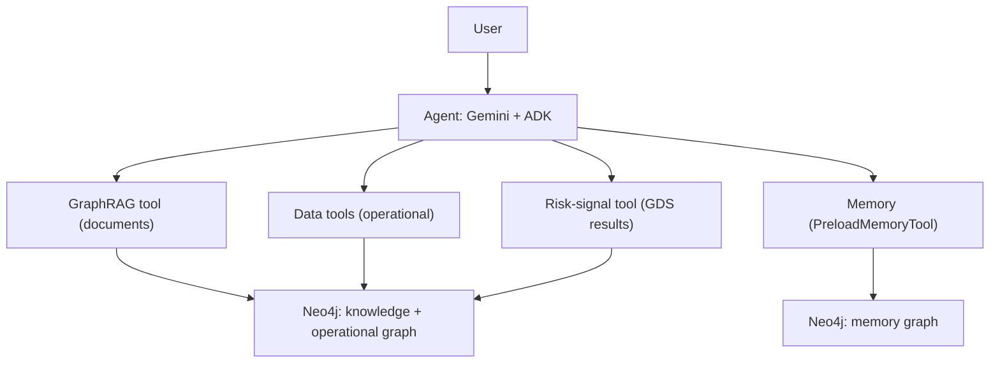
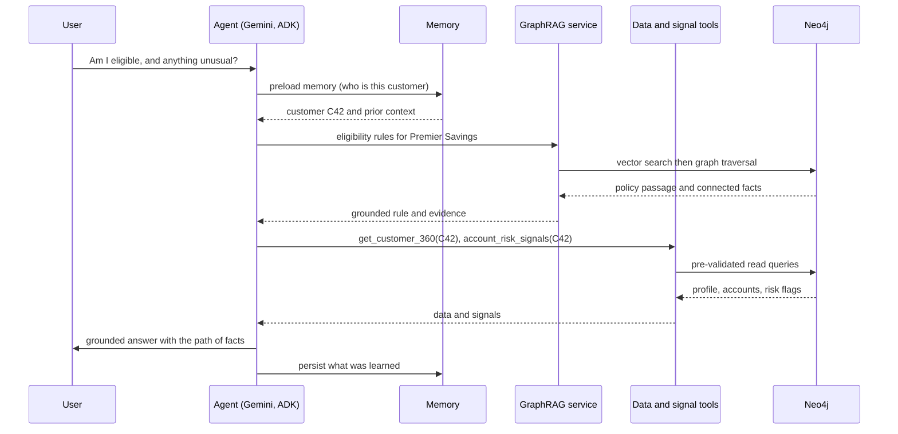

# Capstone: The Banking Context-Layer Agent

**Course:** Neo4j Mastery (see the blueprint for the full plan)
**Prerequisite:** Lessons 1 through 12
**Nature of this document:** an assembly guide and durable reference. It brings the twelve lessons together into one runnable project, and explains how the pieces fit and why. The lessons hold the detailed teaching; this document holds the whole.

---

## 0. How to use this document

This is the project that proves you learned the course. Each section either explains a part of the system conceptually or tells you which lesson to assemble from. Build it in the phases of Part 5, in order. When a phase needs detail, the referenced lesson has it. Read Parts 1 to 3 first to hold the whole picture in your head, then build.

---

## 1. What you are building

A banking context-layer agent: an assistant that answers questions for customers and staff by grounding every answer in a graph, drawing on both the institution's operational data and its document knowledge, remembering what it learns across sessions, and returning the path of facts that supports each answer.

It is small enough to run on your laptop on Neo4j 5.26 Community, and it is the same shape an enterprise runs in production. That is the point: it demonstrates the enterprise context-layer pattern at laptop scale.

The one question that captures the whole system:

> "Am I eligible for the Premier Savings Account, and is there anything unusual on my account I should know about?"

Answering that single question well requires every layer you built. The agent must recall who the customer is, retrieve the account's eligibility rules from document knowledge, query the customer's profile and accounts from operational data, check the account for fraud signals computed by graph algorithms, compose an answer grounded strictly in what it found, and return the evidence. No single lesson answers it; the assembled system does.

What done looks like:
- The agent answers document questions, operational questions, and questions that need both.
- Every answer carries its supporting evidence.
- The agent remembers a fact from one session and uses it in the next.
- The agent only reads, and only through sanctioned tools.

---

## 2. The architecture

The agent sits on top; the graph and a vector store sit below; tools are the connection. This is the three-component enterprise pattern, at laptop scale.

```
                       User (customer or staff)
                                 |
                 +-------------------------------------+
                 |     Agent (Google ADK, Gemini)      |  reasons, plans, remembers
                 +-------------------------------------+
                    |            |             |           |
                    v            v             v           v
            GraphRAG tool   Data tools   Risk-signal tool  Memory
            (documents)     (operational) (GDS results)    (PreloadMemoryTool)
                    |            |             |           |
                    +------------+------+------+-----------+
                                 v      v
                          Neo4j graph    Neo4j memory graph
                          (knowledge +   (facts learned across
                           operational)   sessions)
```



Mapped to the enterprise context-layer pattern:
- The **ontology** is the data model: customers, accounts, transactions, products, policies, and how they relate.
- The **context fabric** is retrieval and grounding: GraphRAG over documents, pre-validated queries over operational data, graph algorithms for signals, and memory.
- The **MCP wrappers** are the tools exposed to the agent.

Keep the framing precise: Neo4j is the knowledge and memory spine, paired here with a vector index for semantic search. In a full enterprise build it would also sit beside a separate document store and a general vector store.

---

## 3. How it answers a question

The runtime flow for the flagship question:



The intuition in three moves. The agent is the orchestrator: it decides which tools to call and in what order. The graph is the grounded source: every fact in the answer comes from a tool result, not from the model's memory of the world. The evidence is the trust mechanism: the answer arrives with the chain of facts that produced it, so a human can verify it. That combination, an orchestrating model over a grounded graph with visible evidence, is the whole idea.

---

## 4. Project structure

A clean layout maps directly onto the lessons and keeps the layers separate.

```
banking-context-agent/
  .env                    # NEO4J_URI, NEO4J_USERNAME, NEO4J_PASSWORD, GOOGLE_API_KEY
  requirements.txt
  data/
    generate.py           # synthetic banking data with planted fraud structure   (Lesson 5)
    documents/            # product and policy text for the knowledge graph        (Lesson 9)
  graph/
    schema.cypher         # constraints and indexes                                (Lesson 3)
    gds_signals.py        # derive TRANSFERRED_TO, run GDS, write signals back      (Lesson 7)
  layer/
    repository.py         # BankingRepository data-access layer                    (Lesson 6)
    semantic.py           # embeddings and the notes vector index                  (Lesson 8)
    kg_builder.py         # build the knowledge graph from documents               (Lesson 9)
    graphrag.py           # BankingGraphRAG retrieval service                       (Lesson 10)
  agent/
    __init__.py           # from . import agent
    agent.py              # root_agent: tools plus memory                          (Lesson 11)
    tools.yaml            # pre-validated MCP Toolbox tools (optional, enterprise)  (Lesson 11)
  eval/
    eval_set.py           # questions and expected behavior
    run_eval.py           # faithfulness, relevance, tool-selection checks
  README.md
```

Configuration lives in one `.env` file so connection details and the Gemini key are never hard-coded, the discipline from Lesson 6 and Lesson 11.

---

## 5. Build it in phases

Assemble in this order. Each phase has a clear deliverable and a checkpoint that tells you it is done.

### Phase 0: Environment (Lessons 1 to 2)
Install Neo4j 5.26 Community, add the APOC and GDS 2.13 plugins, create a Python environment, and set the Gemini API key. Confirm the server starts, the Browser connects, and `RETURN gds.version();` works.
Checkpoint: the Browser is open and GDS responds.

### Phase 1: Model and data (Lessons 3 to 5)
Apply the constraints and indexes from `schema.cypher`, then run `data/generate.py` to load the synthetic banking dataset, including the planted layering chain and mule hub. Validate with node and relationship counts.
Checkpoint: roughly a thousand customers and accounts, thousands of transactions, and the planted structure are present.

### Phase 2: Data-access layer (Lesson 6)
Build `repository.py` with the `BankingRepository` class: parameterized reads such as `customer_360` and `top_merchants`, and idempotent writes. This is the only code that talks to the graph for operational data.
Checkpoint: `customer_360("C1")` returns a profile from Python.

### Phase 3: Insight layer (Lesson 7)
Run `gds_signals.py`: derive the `TRANSFERRED_TO` relationship, project the account graph, run weakly connected components and Louvain to find rings and PageRank to rank accounts, and write `community` and `pagerank` back onto the accounts. These persisted signals are what the agent's risk tool reads.
Checkpoint: the planted hub account scores high on PageRank and its feeders share a community.

### Phase 4: Semantic and knowledge layer (Lessons 8 to 9)
Add note embeddings and a notes vector index with `semantic.py`. Then build the knowledge graph from the documents in `data/documents/` with `kg_builder.py`, using a schema of products, fees, policies, regulations, and eligibility. This creates the lexical and entity graphs and the chunk embeddings.
Checkpoint: a product, its fee and policy, and the source chunk are queryable; semantic search over notes returns sensible hits.

### Phase 5: GraphRAG retrieval service (Lesson 10)
Build `graphrag.py` with the `BankingGraphRAG` class: a VectorCypher retriever that finds relevant passages and traverses to connected facts, a grounding prompt that forbids answering beyond the context, and an `ask` method that returns the answer with its evidence.
Checkpoint: `ask("What governs the Premier Savings Account and what does it require?")` returns a grounded answer plus evidence.

### Phase 6: The agent (Lesson 11)
Build `agent/agent.py`: define the tools (Part 6 below), attach persistent memory with `MemoryClient` and `PreloadMemoryTool`, and assemble `root_agent`. Run it with `adk web` and converse.
Checkpoint: the agent answers the flagship question by calling several tools, and recalls a fact in a new session.

### Phase 7: Harden and evaluate (Lesson 12)
Add the evaluation set and runner in `eval/`, confirm every answer returns evidence, ensure all tools are read-only, and map the project onto the enterprise architecture and the read-only role you would add in production.
Checkpoint: the eval suite passes, and you can describe the production version.

---

## 6. The tools the agent gets

The agent's power and its safety both come from its tool set. Each tool is a sanctioned capability, not a console. For the capstone the simplest faithful approach is Python function tools that wrap the layers you built; in production these move behind MCP Toolbox as language-agnostic, governed tools.

| Tool | Wraps | Input | Returns | Why pre-validated |
| --- | --- | --- | --- | --- |
| `answer_product_question` | BankingGraphRAG (Lesson 10) | a question | grounded answer and evidence | runs a fixed grounded pipeline |
| `get_customer_360` | BankingRepository (Lesson 6) | customer id | profile, accounts, totals | one tested read query |
| `account_risk_signals` | GDS results (Lesson 7) | customer id | community and centrality flags | reads persisted signals only |
| memory recall | neo4j-agent-memory (Lesson 11) | session context | relevant past facts | recall, not arbitrary access |

The assembly glue, the heart of the capstone:

```python
# agent/agent.py
from google.adk.agents.llm_agent import LlmAgent
from google.adk.tools.preload_memory_tool import PreloadMemoryTool
from neo4j_agent_memory import MemoryClient, MemorySettings
from neo4j_agent_memory.config.settings import Neo4jConfig, ExtractionConfig, ExtractorType

# Instances built in earlier phases:
#   graphrag  -> BankingGraphRAG   (Lesson 10)
#   repo      -> BankingRepository (Lesson 6)

def answer_product_question(question: str) -> dict:
    """Answer a question about bank products, fees, policies, or regulations,
    grounded in the knowledge graph. Returns the answer and its supporting evidence."""
    return graphrag.ask(question)

def get_customer_360(customer_id: str) -> dict:
    """Return a customer's profile, accounts, transaction count, and total outflow."""
    return repo.customer_360(customer_id)

def account_risk_signals(customer_id: str) -> dict:
    """Return fraud and risk signals for a customer's accounts: the community each
    account belongs to and its PageRank centrality, computed by graph algorithms."""
    return repo.account_risk_signals(customer_id)   # reads community and pagerank

# Persistent memory (async; connect inside your event loop)
settings = MemorySettings(
    neo4j=Neo4jConfig(uri="bolt://localhost:7687", username="neo4j", password="your-password"),
    extraction=ExtractionConfig(extractor_type=ExtractorType.SPACY),
)
memory_client = MemoryClient(settings)   # await memory_client.connect() in your loop

root_agent = LlmAgent(
    model="gemini-2.5-flash",
    name="banking_context_agent",
    instruction=(
        "You are a banking context assistant for customers and staff. "
        "For product, fee, policy, or regulation questions, call answer_product_question. "
        "For a customer's accounts and activity, call get_customer_360. "
        "For fraud or risk concerns, call account_risk_signals. "
        "Ground every answer only in tool results, cite the evidence, and if the tools "
        "do not provide the answer, say you do not know. Never invent data."
    ),
    tools=[answer_product_question, get_customer_360, account_risk_signals, PreloadMemoryTool()],
)
```

You would add a `repo.account_risk_signals` method that reads the persisted `community` and `pagerank` for a customer's accounts and flags any account sitting in a dense, hub-centred community. That single method turns the Lesson 7 analytics into a capability the agent can use in conversation.

---

## 7. Grounding, explainability, and trust

The capstone is only valuable if its answers can be trusted, which rests on three disciplines carried from Lesson 10.

- **Ground strictly.** Temperature is zero, and the prompt instructs the agent to answer only from tool results and to say it does not know otherwise.
- **Return the evidence.** Every answer carries the facts that produced it. For a banking assistant this is not a nicety; an answer about a customer must come with its support.
- **Read only.** Every tool reads. The agent cannot change the graph, by design.

A grounded, explainable answer looks like this:

```
Question: Am I eligible for the Premier Savings Account, and is anything unusual on my account?

Answer: You appear eligible. The Premier Savings Account requires UK residency and age 18
or over, and your profile records both. One item to note: account A42 belongs to a cluster
of accounts that repeatedly transfer into a single hub account, a pattern worth review.

Evidence, the path of facts:
- Eligibility rule: requires a UK resident aged 18 or over
    source: Retail Deposits Policy, chunk 3            [knowledge graph]
- Customer C42: residency UK, age 34                   [operational graph]
- Account A42: community 7, an 18-account cluster
    transferring to hub account A7                     [GDS signal]
```

The answer is one or two sentences; the evidence is the chain of facts, each tagged with where it came from. That is the trust property an enterprise context layer must provide, shown concretely.

---

## 8. Evaluation

A capstone you can trust is one you can test. Build a small evaluation set and run it on every change.

What to measure:
- **Faithfulness:** is each claim in the answer supported by what the tools returned.
- **Answer relevance:** does the answer address the question asked.
- **Context relevance:** did the retriever and tools pull the right material.
- **Tool selection:** did the agent call the right tools for the question.

A representative evaluation set:

| Question | Should call | Should answer |
| --- | --- | --- |
| What fee does the Premier Savings Account charge? | answer_product_question | the fee, with the source passage |
| How many transactions did C1 make? | get_customer_360 | a count from the data |
| Is C42 eligible, and any risk? | all three | grounded eligibility plus a risk note |
| What is the capital of France? | none | a refusal or out-of-scope reply |

The last row matters: a context-layer agent should decline questions outside its grounded knowledge rather than answer from the model's general training. Run the set, score the answers, and treat a drop in faithfulness as a regression. Frameworks such as Ragas formalize these metrics, but even a hand-scored set run regularly is what separates a demo from a system.

---

## 9. Demonstration script

To show the capstone exercises the whole stack, run these in order:
1. A pure document question: the fee on a product. Exercises GraphRAG.
2. A pure operational question: a customer's transaction count. Exercises the data tool.
3. The flagship hybrid question: eligibility plus risk. Exercises documents, data, and signals together.
4. A fraud-signal question: is this account in a suspicious cluster. Exercises the GDS layer.
5. A memory interaction: tell the agent a preference or fact in one session, end it, start a new session, and ask something that depends on that fact. Exercises persistent memory.

Together these show the agent moving fluently between knowledge, data, analytics, and memory, grounding each answer and returning evidence.

---

## 10. From capstone to enterprise

The laptop artifact and the enterprise system are the same shape; production adds the controls from Lesson 12. The path:
- Move to Neo4j Enterprise or the managed Aura service for role-based access, online backups, and high availability.
- Give the agent a dedicated read-only role, the control you could not create on Community.
- Move the pre-validated tools behind MCP Toolbox so they are language-agnostic and governed.
- Apply fine-grained security and enforce each user's entitlements in the context fabric.
- Add observability, audit logging, transaction timeouts, and a backup-and-recovery plan.
- Stand up the operating model: ontology stewardship, context engineering, MCP and integration engineering, AI governance, and value realization.

The same architecture generalizes beyond banking. Pointed at a utility, the operational graph becomes the grid, the fraud-ring analytics become outage-impact analysis, and the policy knowledge graph becomes engineering standards and regulatory filings. The transferable asset is the pattern and the skill of modeling in graphs, not the banking domain.

---

## 11. Acceptance criteria

You have completed the capstone when:
- The banking dataset is loaded with constraints, indexes, and the planted fraud structure.
- GDS signals are computed and written back to the accounts.
- The notes vector index and the document knowledge graph are built.
- The GraphRAG service answers a document question with grounded evidence.
- The agent answers document questions, operational questions, and the flagship hybrid question by calling the right tools.
- Every answer returns its path of facts.
- The agent recalls a fact across two sessions.
- All tools are read-only.
- The evaluation set passes, including the out-of-scope refusal.
- You can describe the enterprise version and the controls it adds.

---

## 12. Extending the capstone

When the core works, deepen it:
- Add a Text2Cypher tool for open-ended operational questions, bounded by schema and examples, and route between it and the pre-validated tools.
- Split into multiple agents under a coordinator: a retrieval agent, an operational agent, and a memory agent.
- Add structural embeddings from Lesson 7 as a similarity tool, so the agent can find accounts structurally like a given one.
- Ingest more documents and widen the knowledge schema.
- Build a NeoDash dashboard over the signals for human investigators.
- Record reasoning traces in memory so the agent learns from its own past tool use.

---

## Appendix A: consolidated dependencies

```
# requirements.txt
neo4j
neo4j-graphrag[google,openai]
google-genai
google-adk
neo4j-agent-memory[google,mcp]
# plus the Neo4j 5.26 server with APOC and GDS 2.13 plugins,
# and optionally the MCP Toolbox binary and the Neo4j MCP server (uvx mcp-neo4j-cypher)
```

## Appendix B: component-to-lesson map

| Capstone component | Lesson | Key artifact |
| --- | --- | --- |
| Graph model and conventions | 1, 4 | the property graph; the evolved banking model |
| Cypher reads and writes | 2, 3 | queries; idempotent ingestion; constraints |
| Loaded dataset | 5 | synthetic data with planted structure |
| Data-access layer | 6 | BankingRepository |
| Risk signals | 7 | community and PageRank written back |
| Semantic layer | 8 | note embeddings and vector index |
| Knowledge graph | 9 | products, policies, regulations from documents |
| GraphRAG service | 10 | BankingGraphRAG with grounding |
| The agent | 11 | ADK agent, tools, memory |
| Production posture | 12 | RBAC, governance, the reference architecture |

## Appendix C: cross-cutting gotchas

- The vector index dimension must equal the embedding dimension everywhere; pick one and keep it.
- Create constraints before any MERGE-based load, or the load will not finish.
- Use GDS 2.13 with Neo4j 5.26; project a graph, run, and drop it.
- On 5.26 query vector indexes with the procedure, not the 2026 SEARCH clause.
- neo4j-agent-memory is async-only; use await inside the ADK loop.
- Keep every agent tool read-only; a dedicated read-only role needs Enterprise.
- Always set temperature zero, keep the grounding prompt, and return the evidence.
- Run the evaluation set on every change.

---

## Closing

This capstone is the whole course in one artifact: a graph model with real data, graph algorithms for insight, a semantic layer, a knowledge graph from documents, a grounded GraphRAG pipeline, and an agent that reaches all of it through tools and remembers across sessions, answering grounded, explainable, multi-hop questions. It runs on your laptop and mirrors what an enterprise runs in production. Building it end to end is the proof that you can design and build the knowledge and memory spine of an enterprise agentic context layer, which was the destination set in Lesson 1.
