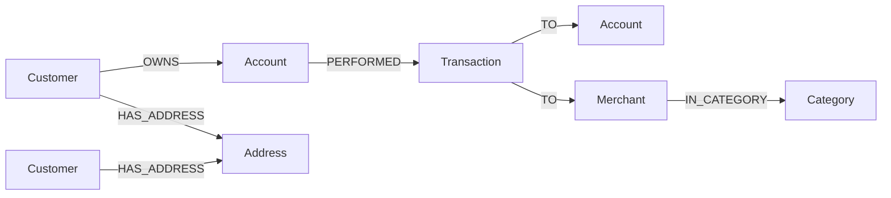

# Lesson 4: Data Modeling for Graphs

**Course:** Neo4j Mastery (see the blueprint for the full plan)
**Prerequisite:** Lessons 2 and 3 (reading, writing, constraints)
**Split:** concept-heavy, with hands-on refactoring of the banking model
**Purpose of this file:** a durable reference for turning a domain into a sound graph model, including the decision rules, the visual patterns, and how to refactor a model you already have.

---

## Objectives

By the end of this lesson you will be able to:
1. Start a model from the questions it must answer, not from existing tables.
2. Decide whether something should be a node, a property, or a relationship.
3. Recognize when to reify a relationship into a node, and do it.
4. Model time, hierarchies, and many-to-many relationships.
5. Map a relational schema to a graph with a repeatable recipe.
6. Refactor an existing model with Cypher and APOC.
7. Justify every modeling choice against the questions the graph must serve.

---

## Part 1: The first principle, model for the questions

Relational modeling starts from how data will be stored and normalized. Graph modeling starts from a different place: the questions the graph must answer. You design the model so that the traversals those questions require are natural and cheap.

For the banking thread, the questions the model must serve are clear, and they should be written down before any modeling begins:

- Which customers share a counterparty, such as paying the same merchant.
- How money moves through a chain of accounts, the layering pattern in money laundering.
- What a full customer 360 looks like, the connected view of a customer across accounts, transactions, and counterparties.
- Grounded multi-hop questions for an agent, where the answer must come with the path of facts that supports it.
- Which customers share an identity signal, such as an address, a phone, or a device, a classic fraud indicator.

Every decision below is judged against this list. A model is good not because it is elegant in the abstract, but because it makes these questions easy to ask.

---

## Part 2: Node, property, or relationship

This is the core modeling decision, and three heuristics resolve almost every case.

- Make it a **node** if it is a thing you ask questions about, connect to other things, or want to share and deduplicate. If more than one other entity should point at the same instance, it is a node.
- Make it a **property** if it is a simple attribute of a single node, has no independent identity, and you never traverse to it. Names, balances, dates, and risk scores are properties.
- Make it a **relationship** if it connects two entities and you traverse across it. Ownership, payment, and membership are relationships.

The litmus test is one question: do I need to connect to it, or query across all instances of it? If yes, it is a node. If it is just a value describing one thing, it is a property.

### Worked example: address as a property versus a node

If an address is only ever displayed, store it as a property on the customer.

```
Property form (cannot link two customers by address):
  (:Customer {name: 'Asha', address: '12 Oak St'})
  (:Customer {name: 'Ben',  address: '12 Oak St'})
```

But one of the banking questions is which customers share an address, because shared identity signals indicate fraud. A property cannot answer that without scanning and string-matching every customer. Promote the address to a shared node, and the question becomes a one-hop traversal.

```
Node form (shared identity is now a direct connection):
        (:Customer {name: 'Asha'})        (:Customer {name: 'Ben'})
                     \                         /
                   HAS_ADDRESS            HAS_ADDRESS
                       \                     /
                        (:Address {line: '12 Oak St'})
```

The query for shared addresses is then simply two customers connected to the same Address node. The model decision was driven entirely by the question.

---

## Part 3: Reifying a relationship into a node

Reification means promoting a relationship to a node. You do it when the relationship is itself an entity in the domain: when it has its own identity, carries many attributes, connects to more than two things, or must be queried directly.

### The banking case

A payment modeled as a relationship is fine for the simplest queries:

```
Edge form:
  (:Account)-[:SENT_TO {amount, date}]->(:Merchant)
```

But a real transaction is an entity. It has a timestamp, a channel, a status, a currency, possibly fees, a sender and a receiver, and sometimes an intermediary. You want to query transactions in their own right: flag every transaction over a threshold, list transactions in a time window, or find the transaction that connects two parties. That calls for a Transaction node.

```
Reified form:
  (:Account)-[:PERFORMED]->(:Transaction {amount, timestamp, channel, status})-[:TO]->(:Merchant)
```

```
Before:                          After (reified):
  Account                          Account
    |                                |
  SENT_TO {amount, date}           PERFORMED
    |                                |
    v                                v
  Merchant                         Transaction {amount, timestamp, channel, status}
                                     |
                                    TO
                                     |
                                     v
                                   Merchant
```

The trade-off is real: reification adds nodes and relationships, which costs storage and adds a hop to some traversals. The rule that keeps you honest is to reify only when the relationship is genuinely an entity in the domain. A payment is. A simple ownership link is not, so OWNS stays a relationship.

### Refactoring existing data into the reified shape

The manual Cypher approach is explicit and always correct. It reads each payment, builds the Transaction node and its two relationships, and deletes the old edge.

```cypher
MATCH (a:Account)-[s:SENT_TO]->(m:Merchant)
CREATE (a)-[:PERFORMED]->(t:Transaction {
  amount: s.amount,
  date: date(s.date),
  channel: 'card',
  status: 'settled'
})-[:TO]->(m)
DELETE s;
```

APOC provides a shortcut for exactly this operation, `apoc.refactor.extractNode`, which extracts a node out of a set of relationships and copies the relationship properties onto the new node. It is convenient at volume, but verify the direction and the type names it generates against your APOC version before running it on data you care about, since the generated relationship types depend on the arguments you pass.

---

## Part 4: Modeling time

Time appears in almost every real model, and there are three common approaches.

1. A temporal property on the event. The pragmatic default. Store a real temporal value on the Transaction node, not a string, so that ordering and range queries work.

   ```cypher
   CREATE (t:Transaction {timestamp: datetime('2026-05-02T14:30:00'), amount: 1200});
   ```

   Neo4j has first-class temporal types: `date()`, `datetime()`, `time()`, and `duration()`. Use them instead of strings, because they support comparison, ordering, and arithmetic.

2. A time tree, also called a calendar graph, when you frequently group or traverse by time, or want events to share time nodes.

   ```
   (:Year {y:2026})-[:HAS_MONTH]->(:Month {m:5})-[:HAS_DAY]->(:Day {d:2})
                                                          ^
                                                          |
                                                    OCCURRED_ON
                                                          |
                                                   (:Transaction)
   ```

   This makes a question like every transaction on a given day a direct traversal to one Day node, rather than a scan with date filtering. It is worth the extra structure only when time-based traversal is frequent.

3. A linked list of events, when sequence matters.

   ```
   (:Transaction)-[:NEXT]->(:Transaction)-[:NEXT]->(:Transaction)
   ```

   This models an ordered chain directly, useful for walking a customer's transaction history in order.

For the banking model, a `datetime` property on the Transaction node is enough for most questions, with a time tree added only if time-bucketed analytics become common.

---

## Part 5: Hierarchies and many-to-many

### Hierarchies

Model a hierarchy as relationships along a tree, then navigate it with variable-length traversal. Merchant categories are a good example.

```
(:Merchant {name:'CloudMart'})-[:IN_CATEGORY]->(:Category {name:'Retail'})-[:SUBCATEGORY_OF]->(:Category {name:'Commerce'})
```

A query can climb from a merchant to the top of the category tree with a variable-length pattern over `SUBCATEGORY_OF`, exactly as you traced transfer chains in Lesson 2. The same shape models organizational structures and account hierarchies.

### Many-to-many

Graphs model many-to-many directly, with no join table. A joint account is the natural example: two customers own one account, and a customer can own several accounts.

```
  (:Customer {name:'Asha'})           (:Customer {name:'Ben'})
            \                              /
            OWNS                         OWNS
              \                          /
               (:Account {id:'a_joint'})
```

In a relational schema this needs a customer-account link table. In a graph it is just two OWNS relationships. When the link itself has attributes, for example an ownership share or a start date, that is the signal to reify the link into a node, by the rule from Part 3.

---

## Part 6: Mapping a relational schema to a graph

When the source is an existing relational database, this recipe is reliable.

| Relational element | Graph result |
| --- | --- |
| A row in a table | A node, labelled with the table name |
| A non-foreign-key column | A property on that node |
| A foreign key | A relationship to the referenced node |
| A pure link table for many-to-many | A relationship |
| A link table that has its own columns | A reified node, by Part 3 |
| A lookup or reference table, such as status or category | A property if you only filter by it, or a small set of shared nodes if you traverse or group by it |

The judgment calls are the last two rows. A link table with attributes becomes a node, not a relationship. A reference table becomes shared nodes only when the value is something you traverse, otherwise it stays a property to avoid creating dense hubs, which Part 8 explains.

---

## Part 7: The evolved banking model

Applying everything above to the banking thread produces the model the rest of the course uses. It is customer-360-ready and fraud-ready.

Entities and connections:

```
(:Customer {id, name, risk, segment})
(:Account  {id, iban, balance, openedAt})
(:Transaction {id, amount, currency, timestamp, channel, status})
(:Merchant {name})
(:Category {name})
(:Address {line, postcode})

(:Customer)-[:OWNS]->(:Account)                 // many-to-many, supports joint accounts
(:Account)-[:PERFORMED]->(:Transaction)         // who initiated
(:Transaction)-[:TO]->(:Account)                // account-to-account transfer
(:Transaction)-[:TO]->(:Merchant)               // payment to a merchant
(:Merchant)-[:IN_CATEGORY]->(:Category)         // hierarchy
(:Customer)-[:HAS_ADDRESS]->(:Address)          // shared identity signal
```

The same model expressed as a diagram, which renders in GitHub, Obsidian, and VS Code:



How each question maps onto the model:

- Shared counterparty: two customers whose transactions both point with `TO` at the same Merchant.
- Layering: a chain of `Account -PERFORMED-> Transaction -TO-> Account` repeated, traversed as a variable-length path, which surfaces the mule chain.
- Customer 360: traverse outward from a Customer to accounts, transactions, merchants, categories, and addresses, assembling the whole connected view in one query.
- Grounded multi-hop questions: the same subgraph that answers a question is also the evidence, which is what makes the later GraphRAG answers explainable.
- Shared identity: two Customers connected to the same Address node.

The model earns its shape entirely from the question list in Part 1.

---

## Your turn

Refactor the Lesson 2 dataset toward this model, then query it.

1. Reify payments. Convert every `(:Account)-[:SENT_TO {amount, date}]->(:Merchant)` into `(:Account)-[:PERFORMED]->(:Transaction)-[:TO]->(:Merchant)`, carrying the amount and a real `date` onto the Transaction. Do the same for `TRANSFER` between accounts.
2. Add a shared identity signal. Create an `Address` node and connect two existing customers to it with `HAS_ADDRESS`.
3. Ask two questions of the new model:
   - Find Transactions with an amount over a threshold within a date window.
   - Find pairs of customers who share an address.

Report your refactor queries, the two question queries, and what they returned. A worked solution is at the bottom of this file.

---

## Success criteria

You have met the goal of this lesson when you can:
- State the question-first principle and apply it to a modeling choice.
- Decide node versus property versus relationship and defend the choice.
- Explain when to reify a relationship, and refactor an edge into a node.
- Choose a time-modeling approach and use Neo4j temporal types.
- Map a relational table, foreign key, and link table to their graph equivalents.

---

## New constructs and patterns introduced

- Modeling patterns: shared node, reification, time property, time tree, event linked list, hierarchy by relationship, native many-to-many.
- Refactoring with manual Cypher (MATCH, CREATE, DELETE) and with `apoc.refactor.extractNode`.
- Neo4j temporal types: `date()`, `datetime()`, `time()`, `duration()`.
- The relational-to-graph mapping recipe.

---

## Appendix: modeling decision aid and antipatterns

The decision in one view:

```
Is it something you connect to, share, or query across instances of?
    YES  -> NODE
    NO   -> is it a connection you traverse between two entities?
                YES -> RELATIONSHIP
                NO  -> PROPERTY
Does a relationship have its own identity, many attributes, or more than two endpoints?
    YES  -> REIFY it into a NODE
```

Antipatterns to avoid:

- Rich property blobs. Stuffing many loosely related values into one node when several of them are really separate entities you will want to connect. Split them into nodes when a question needs to traverse to them.
- Premature reification. Turning every relationship into a node adds hops and cost. Reify only genuine entities, such as a transaction, not simple links, such as ownership.
- Dense nodes, also called supernodes. A shared node that ends up with millions of relationships, for example a single `Currency` node every transaction points to, or one hub merchant. Traversing through such a node is expensive. Mitigate by keeping high-cardinality, low-traversal categoricals as properties, by using specific relationship types, and by filtering on relationship properties rather than fanning out through the hub.
- String dates and numbers. Storing temporal values as strings blocks ordering and range queries. Use the temporal types.
- Modeling from the tables instead of the questions. The most common and most expensive mistake. Always start from the questions the graph must answer.

---

## Solution to the your-turn task

Reify payments and transfers into Transaction nodes:

```cypher
// Payments to merchants
MATCH (a:Account)-[s:SENT_TO]->(m:Merchant)
CREATE (a)-[:PERFORMED]->(t:Transaction {
  amount: s.amount, date: date(s.date), channel: 'card', status: 'settled'
})-[:TO]->(m)
DELETE s;

// Account-to-account transfers
MATCH (a:Account)-[x:TRANSFER]->(b:Account)
CREATE (a)-[:PERFORMED]->(t:Transaction {
  amount: x.amount, date: date(x.date), channel: 'transfer', status: 'settled'
})-[:TO]->(b)
DELETE x;
```

Add a shared address:

```cypher
MATCH (c1:Customer {name: 'Asha'}), (c2:Customer {name: 'Ben'})
MERGE (addr:Address {line: '12 Oak St', postcode: 'AB1 2CD'})
MERGE (c1)-[:HAS_ADDRESS]->(addr)
MERGE (c2)-[:HAS_ADDRESS]->(addr);
```

Question one, large transactions in a date window:

```cypher
MATCH (a:Account)-[:PERFORMED]->(t:Transaction)-[:TO]->(target)
WHERE t.amount > 1000
  AND t.date >= date('2026-05-01') AND t.date <= date('2026-05-31')
RETURN a.id AS fromAccount, t.amount AS amount, t.date AS date, labels(target)[0] AS targetType
ORDER BY amount DESC;
```

Question two, customers sharing an address:

```cypher
MATCH (c1:Customer)-[:HAS_ADDRESS]->(addr:Address)<-[:HAS_ADDRESS]-(c2:Customer)
WHERE c1.name < c2.name
RETURN c1.name AS customerA, c2.name AS customerB, addr.line AS sharedAddress;
```

Both questions now read as direct traversals over the reified model, which is the whole point of the refactor.
