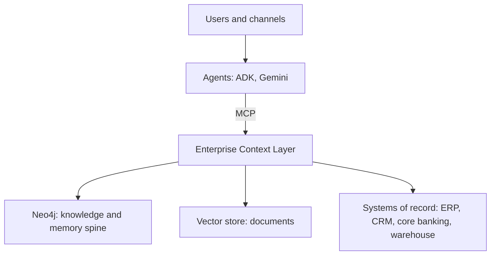

# Lesson 12: From Laptop to Enterprise

**Course:** Neo4j Mastery (see the blueprint for the full plan)
**Prerequisite:** Lessons 1 through 11 (you have built the full stack on your laptop)
**Split:** concept and architecture, with reference configuration you would apply in production
**Purpose of this file:** a durable reference for what changes when the laptop prototype becomes a governed enterprise system, and for the reference architecture of an enterprise agentic context layer.

---

## Objectives

By the end of this lesson you will be able to:
1. State what your Community edition gave you and where it stops.
2. Explain the controls a production deployment requires: security, operations, scale.
3. Design least-privilege access for agents with role-based access control.
4. Describe the enterprise agentic context-layer reference architecture.
5. Name the organizational capabilities an enterprise must build around it.
6. See how the banking patterns generalize to other relational-heavy domains.

---

## Part 1: The boundary you have been hugging

Every lesson stayed inside Neo4j Community edition, and that was the right choice for learning: it runs the full stack, from the property graph through GDS, vectors, GraphRAG, and an agent. But you have repeatedly met a boundary, in Lesson 3 with constraints, in Lesson 11 with the read-only agent user. That boundary is the line between the laptop and the enterprise. This lesson is about crossing it deliberately, knowing exactly what you gain and what it costs.

The shift is not only technical. As your own thesis on the enterprise context layer argues, the move from a prototype to a governed platform is as much about operating model and ownership as about software. This lesson covers both.

---

## Part 2: Community versus Enterprise

The capabilities that matter for production, and which edition provides them:

| Capability | Community | Enterprise | Why it matters in production |
| --- | --- | --- | --- |
| Property uniqueness constraints, indexes | Yes | Yes | Integrity and performance |
| Node key, existence, and type constraints | No | Yes | Stronger data integrity guarantees |
| Multiple databases on one server | One user database | Many | Isolation per tenant, domain, or environment |
| Role-based access control, users and roles | Single user | Full | Least privilege, separation of duties |
| Fine-grained security on labels and properties | No | Yes | Hide sensitive fields from some roles |
| Clustering and high availability | No | Yes | Uptime and read scaling |
| Online, hot backups | Offline dump only | Yes | Backup without downtime |
| Bloom visualization | No | Licensed | Business-user exploration |
| Aura, the managed cloud service | n/a | Available | No infrastructure to operate |

The pattern is clear: Community gives you the engine and the algorithms; Enterprise and the managed Aura service add the security, isolation, availability, and operability that a regulated, customer-facing system requires.

---

## Part 3: Security and least privilege

In Lesson 11 you wanted a dedicated read-only user for the agent and could not create one on Community. In Enterprise you can, and it is the control that matters most for an agentic system, because it means even a flawed or compromised tool cannot write or delete. The following is Enterprise reference configuration, shown so you know the shape; it does not run on Community.

```cypher
// Enterprise only -- reference, not runnable on Community
CREATE ROLE agent_readonly;
GRANT ACCESS ON DATABASE neo4j TO agent_readonly;
GRANT TRAVERSE ON GRAPH neo4j TO agent_readonly;
GRANT READ {*} ON GRAPH neo4j TO agent_readonly;
DENY WRITE ON GRAPH neo4j TO agent_readonly;

CREATE USER agent SET PASSWORD 'strong-secret' CHANGE NOT REQUIRED;
GRANT ROLE agent_readonly TO agent;
```

Fine-grained security goes further, hiding sensitive properties from a role even on nodes it can otherwise read:

```cypher
// Enterprise only -- the agent role cannot see these properties
DENY READ {ssn, dateOfBirth} ON GRAPH neo4j NODES Customer TO agent_readonly;
```

Two more controls apply broadly. Set a transaction timeout so a runaway or hostile query cannot consume the database, configured in `neo4j.conf`:

```
db.transaction.timeout=30s
```

And always require authentication, rotate credentials, and connect agents and applications with the least-privileged user that still does the job. The discipline from Lesson 11, expose capabilities not a console, combines with these controls to give an agent exactly the access its task requires and no more.

---

## Part 4: Operations

A production graph needs to be observable, auditable, recoverable, and bounded.

- **Observability.** Turn on query logging to find slow and failing queries, and export metrics to your monitoring system to watch memory, page cache, transaction rates, and latency. You cannot operate what you cannot see.
- **Auditability.** Enterprise provides a security event log that records authentication and administrative actions. For an agentic system this is essential: you must be able to answer who, or which agent, did what.
- **Backups and recovery.** Community supports an offline database dump with `neo4j-admin database dump`. Enterprise adds online backups that run without stopping the database. Decide a recovery point and recovery time objective, and test restores; an untested backup is not a backup.
- **Resource limits.** Configure heap and page cache to the workload, set transaction timeouts, and cap concurrency so one workload cannot starve another.

These are not graph-specific skills, but they are the difference between a demo that works on your laptop and a service that stays up under real load.

---

## Part 5: Scaling and the managed option

When one server is not enough, there are two directions.

- **Clustering**, an Enterprise feature, runs multiple servers as a cluster for high availability and to scale reads across secondary copies. It removes the single point of failure and lets read-heavy retrieval workloads, exactly what an agent generates, spread across replicas.
- **Aura**, the fully managed service, removes the operational burden entirely. You get a graph database with backups, scaling, and availability handled for you, available on the major clouds including Google Cloud, which fits the rest of your Gemini and ADK stack. For most enterprises starting an agentic context layer, the managed option is the pragmatic path: it lets the team focus on the ontology and the context fabric rather than on running a database.

The choice is the usual one: self-host for control and data residency, or use the managed service to move faster. Many enterprises begin on Aura and revisit only if a specific constraint demands self-hosting.

---

## Part 6: Data governance

Governance is where the graph stops being a database and becomes the source of meaning for the business.

- **The ontology as a governed model.** The graph schema, the entities and relationships and what they mean, is the business model expressed once and agreed across the organization. Governing it, deciding what a Customer is and how the definition changes, is a discipline distinct from traditional data-quality governance, and it is the heart of an enterprise context layer.
- **Entity resolution.** At scale the same real-world entity arrives from many systems under many keys. Resolving these into single nodes, the work you saw the GraphRAG pipeline do in miniature with `perform_entity_resolution`, is a continuous governed process in production.
- **Data quality and lineage.** Track where each fact came from and when, so an answer can be traced to its source system, and so stale or low-quality data can be found and fixed.
- **Entitlements and privacy.** The context fabric must apply the requesting user's permissions, so an agent only ever surfaces what its user is allowed to see. This is the runtime expression of the fine-grained security from Part 3, and for personal and regulated data it is mandatory.

---

## Part 7: The enterprise reference architecture

Everything you built maps onto the three-component pattern of an enterprise context layer. The agents sit above it, the unchanged systems of record sit below it, and the layer is the operating system between your data estate and your AI estate.

```
                 Users and channels (chat, apps, copilots)
                                  |
                 +-------------------------------------+
                 |     Agents (Google ADK, Gemini)     |   reason, orchestrate, remember
                 +-------------------------------------+
                                  |  Model Context Protocol
                 +-------------------------------------+
                 |      Enterprise Context Layer       |
                 |  Ontology   |  Context Fabric  | MCP Wrappers
                 |  (governed  |  (GraphRAG:       | (capabilities
                 |   graph     |   vector + graph  |  over each
                 |   model)    |   retrieval,      |  system of
                 |             |   entitlements,   |  record)
                 |             |   memory)         |
                 +-------------------------------------+
                    |               |                 |
               Neo4j           Vector store       Systems of record
               (knowledge      (documents)        (ERP, CRM, core
                and memory                          banking, warehouse,
                spine)                              mainframe)
```



How the course maps onto the architecture:
- **The ontology** is your data model from Lesson 4, governed and agreed.
- **The context fabric** is Lessons 5 through 10: the loaded graph, the algorithms, the vector layer, and the GraphRAG retrieval that grounds answers and applies entitlements, plus the agent memory.
- **The MCP wrappers** are Lesson 11: the capabilities exposed to agents over MCP.
- **This lesson** is the governance, security, operations, and scale that wrap the whole thing for production.

Keep the framing from Lesson 1 precise: Neo4j is the knowledge and memory spine of this layer, not the entire layer. A full enterprise context layer also includes a document store and a general vector store, with Neo4j providing the structured knowledge, the relationships, and the grounded, explainable, multi-hop retrieval that the other stores cannot.

---

## Part 8: The operating model

The architecture is the easy part. The harder part, and where most enterprises stumble, is the operating model. Five capabilities have to exist, and most organizations do not have them yet:

1. **Ontology stewardship.** A small senior team that owns the business ontology and resolves what entities mean across business units. This is not the data-quality team; it is a different discipline.
2. **Context engineering.** The new technical discipline that designs how agents retrieve, compose, and ground context, owning the context-fabric pipelines, the retrieval quality, and the evaluation harnesses from Lesson 10.
3. **MCP and integration engineering.** Federated ownership, where each domain team builds and runs its own MCP wrappers to a central standard, putting ownership where the business knowledge lives.
4. **AI governance and trust.** Joint accountability across security, data, and legal for evaluations, red-teaming, model risk, entitlement policy, and audit. The regulatory momentum, the EU AI Act, ISO 42001, the NIST AI Risk Management Framework, and sector guidance such as the FCA's, is one-directional, so building this capability ahead of the requirement is an advantage.
5. **Value realization and adoption.** Product managers embedded in the business who measure agent-driven outcomes, not platform metrics, which is what separates an AI program that produces demos from one that moves the P and L.

The cultural shift across these is profound: from building pipes to curating meaning.

---

## Part 9: Generalizing beyond banking

The banking thread was a vehicle; the patterns are general, and they apply most naturally to relational-heavy domains. Your utilities background is a direct fit. A utility's grid is a graph: substations, feeders, transformers, meters, and customers, connected by physical topology. The same techniques transfer cleanly:
- Customer 360 becomes an asset-and-customer 360 across the network.
- Fraud-ring detection with GDS becomes outage-impact and fault-propagation analysis: which customers are affected by a fault, through which feeders, traced as a multi-hop traversal.
- The shared-counterparty pattern becomes shared-asset or shared-circuit analysis.
- GraphRAG over banking policies becomes GraphRAG over engineering standards, safety procedures, and regulatory filings.

Any domain where the value lives in the relationships, telecoms, supply chain, healthcare, manufacturing, benefits from the same context-layer pattern. The transferable skill you built is thinking and modeling in graphs, which outlasts any single domain or tool.

---

## Part 10: Production hardening checklist

Before a context-layer agent faces real users:
- Run on Enterprise or Aura for role-based access control, backups, and availability.
- Give every agent and application a least-privileged, read-only-where-possible user.
- Prefer pre-validated tools; restrict any Cypher tool to read operations.
- Apply fine-grained security to hide sensitive properties, and enforce user entitlements in the context fabric.
- Set transaction timeouts and resource limits.
- Turn on query logging, metrics, and the security audit log.
- Define and test a backup and recovery plan.
- Keep the GraphRAG grounding prompt and return the evidence with every answer.
- Run an evaluation suite on each change, measuring faithfulness and answer relevance.
- Govern the ontology, resolve entities, and track lineage.

---

## Capstone

The course capstone is the banking context-layer agent you can now assemble end to end: a governed graph model with realistic data, node embeddings and a vector index, a GraphRAG retrieval pipeline on Gemini, and a Google ADK agent reaching the graph through MCP with pre-validated tools and persistent memory, answering grounded, multi-hop questions and returning the supporting path of facts. On your laptop it runs on Community; in production it runs the same shape on Enterprise or Aura with the controls in this lesson. That single artifact demonstrates the enterprise pattern at laptop scale, which was the goal from Lesson 1.

---

## Your turn

This final task is design, not code.
1. Draw the enterprise architecture for your banking context-layer agent, labelling the ontology, the context fabric, and the MCP wrappers, and showing where Neo4j, a vector store, and the systems of record sit.
2. List the security and operations controls you would add to move from your laptop to production, using Parts 3 through 6.
3. Map each control and component to one of the five operating-model capabilities in Part 8.
4. Pick a non-banking domain you know, ideally utilities, and describe in a few lines how the same architecture would serve it.

Report your architecture sketch, your controls list, and your domain generalization.

---

## Success criteria

You have met the goal of this lesson, and the course, when you can:
- State what Community provides and what Enterprise and Aura add.
- Design least-privilege, role-based access for an agent.
- List the operations and governance controls a production context layer requires.
- Describe the enterprise context-layer reference architecture and place Neo4j within it correctly.
- Name the five operating-model capabilities and explain why they matter.
- Generalize the patterns to another relational-heavy domain.

---

## Concepts introduced

- Community versus Enterprise capabilities; Aura, the managed service.
- Role-based access control: `CREATE ROLE`, `GRANT`, `DENY`, `CREATE USER`; fine-grained property security; transaction timeouts.
- Operations: query logging, metrics, the security audit log, online versus offline backups, resource limits.
- Clustering for high availability and read scaling.
- Data governance: ontology stewardship, entity resolution, lineage, entitlements.
- The enterprise context-layer reference architecture and the five-capability operating model.

---

## Appendix: the laptop-to-enterprise summary

- Community taught you everything; Enterprise and Aura make it safe, available, and governed.
- The single most important production control for an agent is a dedicated read-only role.
- Backups, monitoring, audit logging, and timeouts are non-negotiable in production.
- Neo4j is the knowledge and memory spine of the context layer, paired with a document store and a vector store.
- The architecture is solvable; the operating model and ontology governance are where the real work lies.
- The patterns generalize to any relational-heavy domain, including utilities.

---

## Course complete

You have gone from the property graph model to a governed, enterprise-shaped agentic context layer, with a running banking system as the through-line. The blueprint records the full arc, and these twelve lesson files are your reference. The next step is the capstone: assemble the pieces into one agent, then point the same pattern at a domain you know. For going further, see the expansion section of the blueprint: the Neo4j GraphAcademy courses and certification, the standard O'Reilly books, the community, and the advanced topics of temporal graphs, ontologies, and graph-native machine learning.
